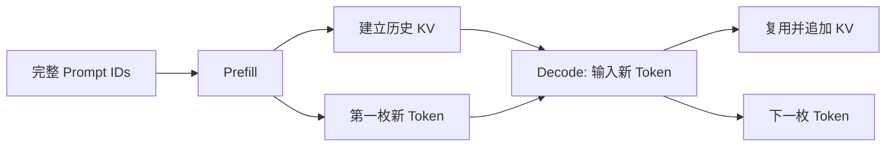

# easy_llm.cpp 第一次阅读：先只搞懂一条 Prompt 怎样生成下一个 Token

> 这不是完整源码教程，而是正式教程前的 **First Read（第一次阅读入口）**。
>
> 目标只有一个：在不提前引入 serving、CUDA、模型兼容性和大量架构术语的情况下，先建立最小但正确的 LLM inference（大语言模型推理）心智模型。
>
> 读完本篇后，再进入 [`easy_llm_guide.zh-CN.md`](./easy_llm_guide.zh-CN.md)。

---

## 1. 先只记住一句话

LLM 生成文本时，最核心的动作不是“一次生成一句话”，而是：

```text
已有 token
→ 模型计算
→ 给所有可能的下一个 token 打分
→ 选出一个 token
→ 把它接到已有内容后面
→ 再来一轮
```

例如模型最后生成：

```text
Hello, world!
```

内部更接近：

```text
已有内容
→ 预测 "Hello"
→ 再预测 ","
→ 再预测 " world"
→ 再预测 "!"
```

真实 token 不一定刚好等于一个英文单词；这里只是在说明生成方式。

**第一次阅读时，先把“每轮只决定下一个 token”记牢。** 后面的 Prefill、Decode、KV Cache、Sampling，都是围绕这个循环展开的。

---

## 2. Token 到底是什么

程序接收到的是字符串，例如：

```text
Hello
```

但模型不会直接拿字符串做矩阵计算。

Tokenizer（分词器）先把文本切成模型认识的离散单元：

```text
text
→ token strings
→ token IDs
```

概念示意：

```text
"Hello world"
→ ["Hello", " world"]
→ [9707, 1879]
```

上面的 ID 只是示意，不代表本项目实际 Qwen tokenizer 对这句话一定得到这些数字。

最重要的是：

```text
人看到文字
模型入口看到整数 ID
```

---

## 3. 为什么整数 ID 还不能直接做 Transformer 计算

Token ID 只是 vocabulary（词表）里的编号，例如：

```text
token_id = 9707
```

这个数字本身没有“大小代表意义更强”之类的含义。

Embedding（嵌入）会根据 ID 查表，取出一条向量：

```text
9707
→ [0.12, -0.07, 0.31, ...]
```

本项目默认学习模型 Qwen2.5-0.5B-Instruct 的 `hidden_size = 896`，所以真实向量宽度是 896，不是上面画出来的 3 维。

因此数据形状会经历：

```text
Token IDs: [B, S]
       ↓ Embedding
Tensor:    [B, S, 896]
```

其中：

```text
B = batch size，一次一起算几条输入
S = sequence length，一条输入当前有多少个位置
```

第一次只跑一个 Prompt 时，可以先把它想成：

```text
B = 1
```

**从 Embedding 之后，模型主要处理的是 Tensor（多维数组），而不是字符串。文本语义并没有消失，而是体现在这些向量以及后续计算中。**

---

## 4. Transformer 做完以后输出的也不是文字

经过多个 Transformer Block 后，每个位置仍然有一条 hidden vector。

本项目最后把 hidden vector 映射到整个 vocabulary，得到 Logits（未归一化预测分数）：

```text
hidden vector
→ vocabulary projection
→ logits
```

假设 vocabulary 里只有 4 个 token：

```text
A  B  C  D
```

模型某一步可能给出：

```text
A:  2.1
B: -0.3
C:  1.2
D:  0.1
```

这些还不是概率。

Softmax 把它们变成类似：

```text
A: 0.62
B: 0.06
C: 0.25
D: 0.07
```

然后 Sampler（采样器）选择下一枚 token。

如果使用：

```bash
--greedy
```

就直接选概率最大的 `A`。

所以一轮最核心的数据流是：

```text
Token IDs
→ Embedding
→ Transformer
→ Logits
→ Softmax
→ 选择一个 next token ID
```

---

## 5. 为什么模型不是一次把整句话都算出来

假设 Prompt 已经变成：

```text
[t0, t1, t2, t3]
```

模型先根据这些历史 token 预测：

```text
t4
```

下一轮历史就变成：

```text
[t0, t1, t2, t3, t4]
```

再预测：

```text
t5
```

于是最朴素的生成可以写成：

```text
while not finished:
    根据当前全部历史计算下一个 token
    把新 token 追加到历史
```

这已经足以解释“自回归生成（autoregressive generation）”的核心。

问题是：如果每轮都把 `t0...t3`、然后 `t0...t4`、然后 `t0...t5` 全部重新计算，会有大量重复工作。

这就引出了 KV Cache。

---

## 6. KV Cache 先不要学公式，只把它当“历史计算结果缓存”

Self-Attention 在处理历史 token 时，会计算 Key / Value，也就是常写的 K / V。

第一次阅读不必马上推导 Attention 公式。先只记：

> **历史 token 的一部分 Attention 中间结果可以保存下来，后面生成新 token 时直接复用。这个保存下来的历史状态就是 KV Cache。**

于是生成从：

```text
每轮重新计算全部历史
```

变成：

```text
第一次：处理完整 Prompt，并建立历史 KV
后续：只处理新 token，并把新的 K/V 追加到历史 KV
```

例如：

```text
Prompt: [t0, t1, t2, t3]
```

第一次：

```text
输入:  t0 t1 t2 t3
缓存:  KV(t0...t3)
输出:  t4
```

第二次：

```text
输入:  t4
复用:  KV(t0...t3)
追加:  KV(t4)
输出:  t5
```

第三次：

```text
输入:  t5
复用:  KV(t0...t4)
追加:  KV(t5)
输出:  t6
```

---

## 7. 现在再理解 Prefill 和 Decode

有了上一节，这两个词就很简单。

### Prefill

第一次处理完整 Prompt：

```text
[t0, t1, t2, t3]
```

主要完成两件事：

```text
1. 建立这些历史 token 的 KV Cache
2. 预测第一枚新 token t4
```

### Decode

后面每一轮只输入刚生成的新 token：

```text
[t4]
→ 预测 t5

[t5]
→ 预测 t6
```

同时持续复用并追加 KV Cache。

因此：

```text
Prefill = 第一次处理完整 Prompt
Decode  = 后续逐 token 生成
```

它们不是两套不同的 Transformer，只是**同一个模型处在生成过程的不同阶段**。



**这张图最需要记住什么：**

Prefill 负责把“已有历史”第一次算进去；Decode 以后每轮只处理新增的一枚 token。KV Cache 把已经算过的历史保存下来。

---

## 8. 把这个心智模型映射回 easy_llm.cpp

第一次只看 5 个位置就够了。

```text
src/main.cpp
→ src/gpt_engine.cpp
→ src/data_manager.cpp
→ src/tokenizer.cpp
→ src/models/gpt_model.cpp
```

它们分别回答：

```text
main.cpp
  程序从哪里启动？对象怎样组装？

GptEngine
  一次普通请求的主调用链是什么？

DataManager
  文本怎样变成模型输入 batch？生成 token 保存在哪里？

Tokenizer
  字符串怎样变成 token / token ID？

GptModel
  Prefill、Decode、Softmax、Sampling 怎样串起来？
```

第一次阅读源码时，可以暂时**不要**进入：

```text
src/models/self_attn.cpp
src/cuda/
src/continuous_batch_server.cpp
src/models/loader.cpp
```

不是因为它们不重要，而是因为它们分别会同时引入 Attention 数学、GPU、动态 batching、模型文件格式等额外复杂度。

---

## 9. 第一次读正式教程时，哪些内容可以先跳过

正式教程为了保持事实完整，会讲一些很重要、但不适合第一遍同时学习的内容。

第一次可以先跳过或快速扫过：

```text
BOS / Hugging Face tokenizer parity
Safetensors / mmap
LayerKeyPrefix
GQA 的具体 head 数和 cache layout
Continuous Batching
CUDA fallback
retry / idempotency / production serving
```

第一遍优先建立这条主线：

```text
text
→ token IDs
→ embedding vectors
→ Transformer
→ logits
→ probability
→ next token
→ KV Cache
→ Decode 下一轮
```

等这条线已经能自己讲出来，再回正式教程深入架构和实现细节。

---

## 10. 读完本篇，检查自己是否真的理解

不看前文，试着回答：

1. 为什么模型不能直接对字符串做 Transformer 计算？
2. Token ID 和 Embedding vector 有什么区别？
3. Logits 为什么还不是最终 token？
4. 为什么 LLM 生成一句话需要很多轮模型计算？
5. KV Cache 解决了什么重复计算问题？
6. Prefill 和 Decode 的输入长度为什么不同？
7. 最终字符串是在什么时候重新出现的？

如果能用自己的话回答，再进入完整教程：

[`easy_llm_guide.zh-CN.md`](./easy_llm_guide.zh-CN.md)

完整教程会继续深入：

```text
Chat Template / Tokenizer 真实实现
→ Left Padding / position
→ Config / Safetensors / model weights
→ Transformer Block
→ Q/K/V / RoPE / masks
→ KV Cache state ownership
→ Sampling
→ Continuous Batching
→ CPU / CUDA
→ Tests / reliability / deployment boundary
```
