# easy_llm.cpp 教学式源码教程：看见一条 Prompt 如何变成下一个 Token

> **生成与核验要求（精简版）**
>
> 本文按“读者需要依次理解什么”而不是按仓库目录组织：先建立项目心智模型和真实 Golden Path，再沿同一条请求观察每一步输入/输出，之后才深入 Tokenizer、Transformer、Attention、KV Cache、Sampling、Continuous Batching、CPU/CUDA、可靠性与扩展边界。背景知识按 Just-in-time 原则出现；代码片段只保留当前理解所需的最小部分。事实优先级为 executable code → configuration → tests → repository documentation；发生冲突时明确指出 documentation drift。Mermaid 图必须与当前代码一致，并在图后说明“这张图最需要记住什么”。
>
> **核验日期：2026-08-26**  
> **核验代码快照：`release@8cdf0c51363f5a39bbadc9de996c1504761aad52`**
>
> 本文还有一个明确目标：**借这个项目理解 LLM inference（大语言模型推理）到底在做什么。** 因此会反复追问每一步的输入是什么、输出是什么、shape 怎么变化、状态保存在哪里，以及下一步为什么需要这些数据。

---

# 第一部分：先把整个系统看懂

## 0. 这个项目真正适合拿来学什么

`easy_llm.cpp` 是一个用于学习和验证 LLM inference 完整链路的微型 C++ 实现。仓库默认示例面向 **Qwen2 family**，README 推荐 **Qwen2.5-0.5B-Instruct**。

它最有学习价值的地方不是“能回答问题”，而是把大型框架通常隐藏起来的关键步骤直接摊开：

```text
用户文本
→ Chat Template
→ Tokenizer / BPE
→ Token IDs
→ Left Padding
→ Embedding
→ Transformer Blocks
→ Logits
→ Softmax
→ Sampling
→ Next Token
→ Decode loop
```

另外还有一条更接近推理服务的路径：

```text
多个请求不断到达
→ admission
→ Prefill
→ 每轮重新组成 active batch
→ Decode
→ 每个请求复用自己的 KV Cache
→ 完成后回收 slot
```

先把边界说清楚：

- 它不是 `llama.cpp`、vLLM、TensorRT-LLM 的替代品；
- 当前重点是**可读、可验证、可修改**，不是极致吞吐；
- `--serve` 是 stdin/stdout 长驻进程，不是 HTTP server；
- 没有数据库、durable queue、网络认证、retry、idempotency key 或外部 token streaming API；
- CPU 路径是最容易追踪的 correctness baseline，CUDA 是可选 operator backend。

如果只记一句话：

> **这个项目把“文本如何逐 token 经过一个 Decoder-only Transformer，并借助 KV Cache 持续生成”缩小到一套可以顺着源码读完的 C++ 代码。**

---

## 1. 先只记住 7 个角色

第一次进入仓库，不要从文件树开始背。先建立下面的心智模型。

| 角色 | 做什么 | 为什么单独存在 | 最主要输入 → 输出 | 主要状态 | 第一处源码 |
|---|---|---|---|---|---|
| `main` | 解析 CLI、加载对象、选择运行模式 | CLI/组装不应污染模型数学 | CLI/stdin → 已组装流程 | `CliOptions`, `Config` | `src/main.cpp` |
| `GptEngine` | 编排一次性 batch 推理 | orchestration 与模型计算分离 | prompts → `GptModel::forward()` | 几乎不保存生成状态 | `src/gpt_engine.cpp` |
| `DataManager` | tokenize、left padding、保存单次模式输出 | 输入整理不属于 Transformer | text ↔ batched IDs / generated IDs | `inputs_`, `outputs_`, `seq_len`, `pad_len` | `src/data_manager.cpp` |
| `Tokenizer` / `Bpe` | 文本 ↔ token ↔ ID | 文本协议与模型数学分离 | UTF-8 text ↔ IDs | vocab、merges、special tokens | `src/tokenizer.cpp`, `src/bpe.cpp` |
| `GptModel` | Prefill/Decode 编排 + 模型图 | 生成状态机与具体层组合在这里 | token batch → sampled token IDs | `GenerationContext`, RNG/Sampler | `src/models/gpt_model.cpp` |
| `Block` / `SelfAttn` / `MLP` | Transformer 数学 | Attention、MLP、cache 生命周期彼此独立 | hidden states → hidden states | 每层 `SelfAttn` 的 KV Cache | `src/models/*.cpp` |
| `ContinuousBatchServer` | 管 pending/active request、slot、round | 动态请求生命周期不应塞进模型内部 | stdin requests → completed text | queues、active requests、free slots | `src/continuous_batch_server.cpp` |

后面遇到任何变量，先问：**它属于请求生命周期、模型当前计算，还是历史 Attention 状态？** 很多设计就会自然变清楚。

---

## 2. 整体 Architecture Diagram

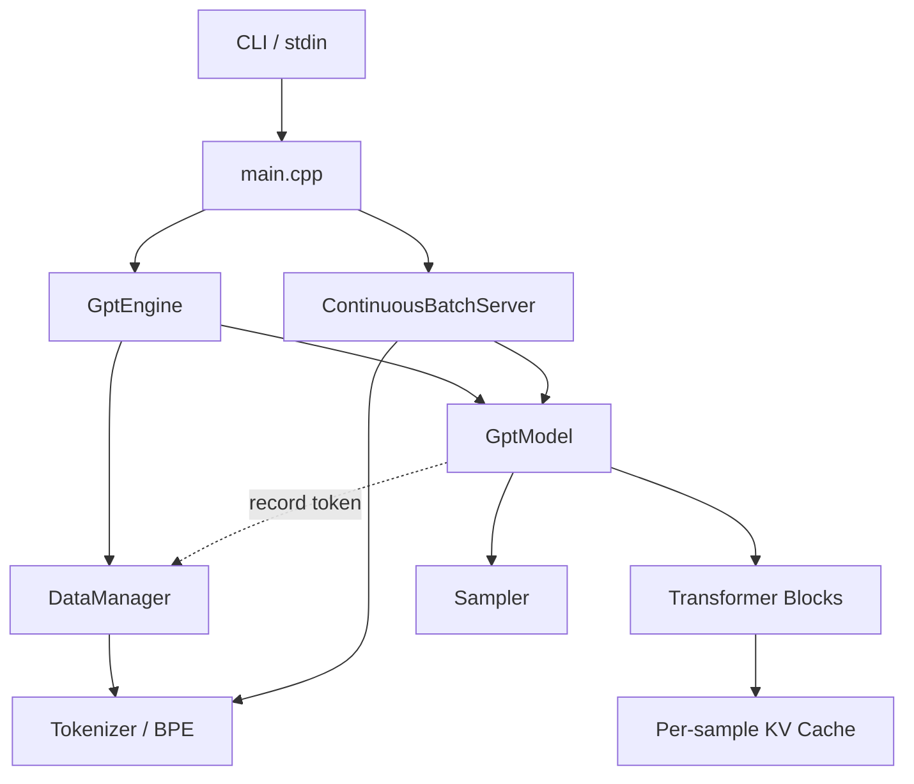

**这张图最需要记住什么：**

系统没有一个“万能状态中心”。单次输入/输出主要在 `DataManager`，服务请求生命周期在 `ContinuousBatchServer`，每层历史 K/V 在 `SelfAttn`，某次 `forward()` 的生成状态在 `GenerationContext`。

---

## 3. 第一条 Golden Path：`./build/easy_llm --greedy "Hello"`

先只跟一条最普通的单次请求。

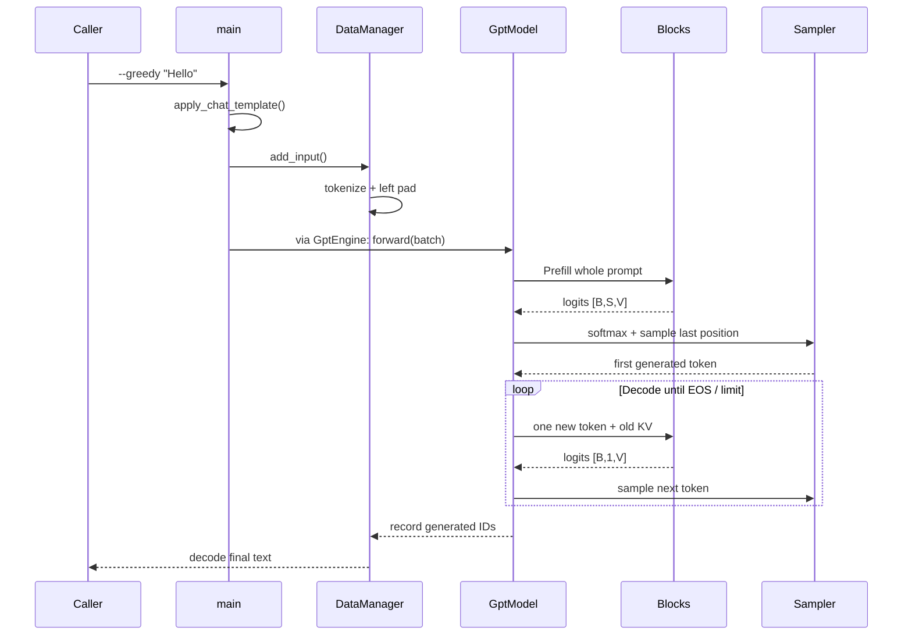

**这张图最需要记住什么：**

模型不是一次直接输出一句字符串。它第一次处理完整 Prompt 得到**第一枚新 token**，以后每轮只输入上一轮生成的 token，再预测下一枚；字符串只是所有 generated token IDs 最后 decode 出来的结果。

---

## 4. 一条 Prompt 的“显微镜视图”：每一步输入输出到底长什么样

这一节先不钻公式。目标是建立一个可观察的端到端画面。

### 4.1 Step 0：用户输入不是模型真正看到的输入

用户输入：

```text
Hello
```

`src/cli_options.cpp::apply_chat_template()` 会把它变成：

```text
<|im_start|>system
You are Qwen, created by Alibaba Cloud. You are a helpful assistant.<|im_end|>
<|im_start|>user
Hello<|im_end|>
<|im_start|>assistant
```

所以第一层输入输出是：

```text
输入: "Hello"
输出: 一段带 system/user/assistant 控制 token 的完整 Prompt
```

这一步还没有任何神经网络计算。

### 4.2 Step 1：Tokenizer 把字符串变成离散 ID

概念上：

```text
完整 Prompt
→ token strings
→ token IDs
```

例如 special token 在官方 Qwen2.5 tokenizer 中有明确 ID：

```text
<|im_start|> → 151644
<|im_end|>   → 151645
<|endoftext|>→ 151643
```

普通文本具体会切成哪些 token，取决于 `tokenizer.json` 的 vocab/merges。模型文件没有提交到本 repo，因此本文**不伪造 `Hello` 的实际 token ID**。

可以先用一个缩小后的示意理解数据形状：

```text
tokens:
["<|im_start|>", "system", ..., "Hello", "<|im_end|>", ...]

IDs:
[151644, id(system), ..., id(Hello), 151645, ...]
```

`Tokenizer::tokens_to_ids()` 当前还有一个非常重要的实现行为：只要模型 `config.json` 中 `bos_token_id >= 0`，它就会额外在最前面插入该 ID。

对于官方 Qwen2.5-0.5B-Instruct：

```text
config.json:          bos_token_id = 151643
tokenizer_config.json:add_bos_token = false
```

而当前项目并不读取 `add_bos_token` 语义，因此可能得到：

```text
[151643, 151644, ...]
```

这就是一个很具体的“能读取 Hugging Face 文件 ≠ 完整复刻 Hugging Face runtime”的例子。

### 4.3 Step 2：两个不同长度请求怎样变成一个矩阵

假设 tokenize 后有两条请求。下面 ID **仅为教学示意**：

```text
A: [11, 12]
B: [21, 22, 23, 24]
```

`DataManager` 使用 left padding：

```text
A: [PAD, PAD, 11, 12]
B: [ 21,  22, 23, 24]
```

同时保存：

| sample | 原始 seq_len | pad_len | 模型看到的 row width |
|---|---:|---:|---:|
| A | 2 | 2 | 4 |
| B | 4 | 0 | 4 |

因此送进 `GptModel::forward()` 的 C++ 类型是：

```cpp
std::vector<std::vector<int>>
```

形状可以理解为：

```text
[B, S] = [2, 4]
```

这里的 `B` 是 batch size，`S` 是 padding 后统一 sequence width。

### 4.4 Step 3：Embedding 把“整数”变成“向量”

官方 Qwen2.5-0.5B-Instruct 的 `hidden_size = 896`。

所以一个 token ID 不再是一个整数，而是从 embedding weight 中查出一行 896 维向量：

```text
Token IDs: [2, 4]
       ↓ Embedding lookup
Tensor:    [2, 4, 896]
```

为了能画出来，把 896 维缩成 3 维做示意：

```text
ID 11 → [ 0.12, -0.07,  0.31, ...]
ID 12 → [-0.22,  0.18,  0.04, ...]
```

这些数字只是视觉示意，不是 Qwen 实际权重。

最需要理解的是：

> **从这一刻开始，模型不再处理字符串，也几乎不再处理 token 的“文字含义”；它处理的是多维 Tensor。**

### 4.5 Step 4：Tensor 穿过 24 个 Transformer Block

官方 Qwen2.5-0.5B-Instruct 有 24 层。shape 的主干保持：

```text
[B, S, 896]
→ Block 0
→ [B, S, 896]
→ Block 1
→ [B, S, 896]
→ ...
→ Block 23
→ [B, S, 896]
```

每个 Block 内部会做：

```text
RMSNorm
→ Self-Attention
→ Residual Add
→ RMSNorm
→ Gated MLP
→ Residual Add
```

“shape 没变”不等于“数据没变”。每一层都在重新计算每个位置的 hidden representation。

### 4.6 Step 5：最后把 hidden vector 映射回整个 vocabulary

最终 RMSNorm 后，项目复用 embedding weight 做 vocabulary projection：

```text
[B, S, 896]
→ tied embedding projection
→ logits [B, S, V]
```

官方 Qwen2.5-0.5B-Instruct：

```text
V = vocab_size = 151936
```

如果当前只有 1 条请求、Prompt padding 后长度为 42：

```text
logits shape = [1, 42, 151936]
```

含义是：**42 个位置，每个位置都对 151936 个 vocabulary token 给出一个分数。**

生成 next token 时，Prefill 只取最后一个位置：

```text
[1, 42, 151936]
        ↓ 只取 S-1
[1, 1, 151936]
```

### 4.7 Step 6：Logits → Probability → 一个 token ID

`GptModel` 对 logits 调 `ops::softmax()`：

```text
logits [1,1,V]
→ probabilities [1,1,V]
→ Sampler
→ next_token_id
```

如果是 `--greedy`：

```text
直接选择 probability 最大的 ID
```

如果是普通 sampling，则还会经过 temperature、Top-K、Top-P，后文单独深入。

### 4.8 Step 7：Prefill 结束时，除了“生成一个 token”，还留下了 KV Cache

这是理解 LLM 生成最关键的一步。

Prefill 输入完整 Prompt：

```text
[t0, t1, t2, ..., t41]
```

输出第一枚新 token：

```text
t42
```

同时**每个 Transformer layer 的 Self-Attention 都保存了 Prompt 历史的 K/V**：

```text
Layer 0: K/V for t0...t41
Layer 1: K/V for t0...t41
...
Layer 23: K/V for t0...t41
```

### 4.9 Step 8：Decode 不再重新输入整个 Prompt

下一轮只输入：

```text
[t42]
```

模型计算这一枚 token 的新 Q/K/V，把 K/V append 到历史 cache：

```text
before: cache = t0...t41
input:          t42
append: cache = t0...t42
```

再得到：

```text
t43
```

之后重复：

```text
round 0 Prefill: input t0...t41 → sample t42 → cache len 42
round 1 Decode : input t42     → sample t43 → cache len 43
round 2 Decode : input t43     → sample t44 → cache len 44
...
```

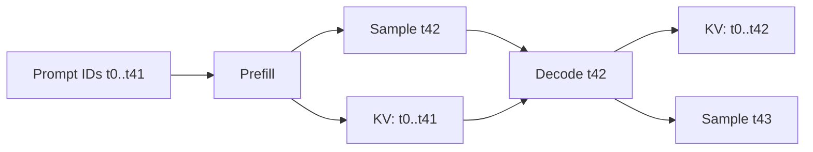

**这张图最需要记住什么：**

`Prefill` 和 `Decode` 使用的是同一个 Transformer；不同的是输入长度和历史状态。Prefill 一次处理完整历史并建立 KV，Decode 每次只处理新 token，并复用历史 KV。

---

## 5. 读到这里，应该能回答这 6 个问题

1. 用户文本不会直接进入神经网络，先经过 chat template 和 tokenizer；
2. 模型真正吃的是整数 ID，再经 embedding 变成 Tensor；
3. Transformer 输出的是 vocabulary 上的 logits，不是字符串；
4. Sampler 每轮只选择一枚 next token；
5. Prefill 建立历史 KV Cache；Decode 只输入新 token 并追加 cache；
6. 最终文本是 generated token IDs 累积完成后再 decode 得到的。

如果这六点清楚，下面进入源码时就不会把“文本层、模型层、请求状态层”混在一起。

---

# 第二部分：文本怎样进入模型

## 6. `main.cpp`：Composition Root，而不是模型算法

`src/main.cpp` 的职责是把对象组装起来：

```text
parse CLI
→ Config::load_config()
→ CLI sampling 参数覆盖 Config
→ ModelParam::load(model.safetensors)
→ Tokenizer::create()
→ DataManager
→ GptModel::create()
→ apply_chat_template()
→ GptEngine 或 ContinuousBatchServer
```

为什么不让 `GptModel` 自己加载 CLI、Tokenizer、文件？

因为这些属于不同变化原因：

- CLI 参数可能改，但 Attention 数学不应跟着改；
- tokenizer 规则可能改，但 KV Cache ownership 不应跟着改；
- serving transport 以后可能从 stdin 换 HTTP，但 Transformer 不应知道 HTTP。

这就是模块边界最实际的价值。

### 6.1 CLI 默认 sampling 参数真正来自哪里

`Config` 有自己的初始值，但 `main.cpp` 随后用 `CliOptions` 覆盖：

```cpp
config->temperature = options.temperature;
config->top_p = options.top_p;
config->top_k = options.top_k;
config->seed = options.seed;
```

CLI 默认值在 `include/cli_options.hpp` / `src/cli_options.cpp`：

```text
temperature = 0.8
top_p      = 0.95
top_k      = 20
seed       = 42
```

所以判断“实际启动参数”，不能只看 `Config` struct 的默认值。

---

## 7. Chat Template：为什么它属于输入协议，而不属于模型数学

当前 `apply_chat_template()` 是硬编码模板，不动态执行 `tokenizer_config.json` 里的 Jinja chat template。

这意味着：

```text
换 model.safetensors
≠
自动支持另一个 Chat Model
```

因为一个 Chat Model 的输入协议至少还包括：

```text
system/user/assistant 格式
special tokens
BOS/EOS/PAD 规则
```

官方 Qwen2.5 tokenizer config 中的简单 system/user/assistant 格式与当前硬编码模板接近，但官方 template 还包含 tools 等分支；当前项目没有实现这些完整语义。

---

## 8. Tokenizer / BPE：这里不是“把一个词变一个 ID”

`Tokenizer` 的主职责：

```text
Tokenizer
├─ special token scanning
├─ token ↔ ID mapping
├─ BOS/PAD rules
└─ BPE
   └─ ordinary text → byte mapping → merges
```

### 8.1 Special Token 为什么先单独识别

例如：

```text
<|im_start|>
```

必须作为一个整体控制 token，不能先被普通 BPE 拆掉。

`EncodingSession` 会寻找最近的 special token，普通区间交给 `Bpe::encode_into()`，special token 直接放进 token list。

### 8.2 当前 BPE 做了什么

`src/bpe.cpp`：

```text
plain text segment
→ std::istringstream 按 whitespace 取 word
→ byte encoder
→ 找 merge rank 最小的相邻 pair
→ 反复 merge
→ token strings
```

`bpe_cache_` 会缓存已经处理过的 word。

### 8.3 一个必须记住的兼容性边界

Hugging Face Qwen2 tokenizer 的完整 pre-tokenization 行为比这里复杂。当前实现使用 `std::istringstream` 的 whitespace 逻辑，因此不能声称与 Transformers 对任意中文、标点、连续空格、换行、emoji 都逐 token parity。

如果要比较模型 logits，正确排查顺序应该先是：

```text
exact input text
→ exact token strings
→ exact token IDs
→ 再比较 logits
```

否则输入都不同，后面数学完全一致也不会输出一致结果。

---

## 9. `DataManager`：Left Padding 为什么会一路影响到 Attention

`DataManager::get_inputs()`：

```text
tokenize_inputs()
→ compute_batch_padding()
→ apply_padding()
```

它保存：

```text
seq_len = 真实 token 数
pad_len = 左侧 PAD 数
```

这两个值后面会进入 generation position 和 Attention mask。

假设：

```text
A: PAD PAD 11 12
B: 21  22  23 24
```

A 的真实第一个 token `11` 位于数组 index 2，但语义 position 应该是 0。

因此 Prefill 使用：

```text
position offset = -pad_len
```

A：

```text
array index : 0   1   2   3
offset      : -2 -2  -2  -2
RoPE pos    : -2 -1   0   1
                         ↑
                    real tokens start at 0
```

PAD 自己随后被 Attention mask 掉。

这就是为什么 `pad_len` 不是一个“为了打印好看”的临时变量，而是后续正确性的状态。

---

# 第三部分：模型怎样从文件变成 C++ 对象

## 10. `Config`：结构参数决定整个 Tensor 世界

`src/config.cpp` 从 `data/model/config.json` 读取：

```text
num_hidden_layers
num_attention_heads
num_key_value_heads
hidden_size
vocab_size
max_position_embeddings
bos_token_id
eos_token_id
rope_theta
architectures
model_type
```

以官方 Qwen2.5-0.5B-Instruct 为例：

| 参数 | 值 | 对代码意味着什么 |
|---|---:|---|
| `num_hidden_layers` | 24 | 创建 24 个 `Block` |
| `hidden_size` | 896 | hidden vector 宽度 896 |
| `num_attention_heads` | 14 | Query heads = 14 |
| `num_key_value_heads` | 2 | KV heads = 2，属于 GQA |
| `head_dim` | 64 | `896 / 14` |
| `vocab_size` | 151936 | 每个位置输出 151936 个 logits |
| `rope_theta` | 1000000 | RoPE 参数 |

当前 `Config` 并没有把 `intermediate_size`、`rms_norm_eps` 等所有字段都保存下来；有些维度从 checkpoint weight shape 得到，有些值目前写死在实现中。

### 10.1 Config 读取失败的行为

`Config::load_config()` 读不到 JSON 时：

```text
log error
→ return
```

不会立即 throw。之后模型初始化通常会因为结构字段仍为 0 而失败。

所以排障要看**最早的错误日志**，不要只看最后一次 exception。

---

## 11. Safetensors Loader：`mmap` 只是加载方式，不是运行期零拷贝

`src/models/loader.cpp` 的主流程可以理解为：

```text
open file
→ fstat
→ mmap
→ 读取 8-byte header length
→ parse JSON metadata
→ 校验 dtype / shape / offset
→ copy/convert into Tensor
→ munmap
```

源权重支持读取 BF16/F16/F32；当前标准 CMake target 走 `USE_BF16`。

关键点：

> `mmap` 让 loader 方便访问文件，并不代表模型 forward 时还直接引用磁盘映射区。权重最终进入 owning `Tensor`。

---

## 12. `ModelParam` 与 `LayerKeyPrefix`：为什么加载阶段也要有边界

`ModelParam` 可以理解为启动阶段的：

```text
weight key → Tensor
```

组件通过 `take_param(key)` 把 Tensor move 到自己手里，并从暂存 map 删除。

这样能做到：

```text
checkpoint file
→ ModelParam temporary ownership
→ Embedding / Linear / Norm final ownership
```

`LayerKeyPrefix` 则负责把逻辑组件名映射到 checkpoint key，例如：

```text
model.layers.0.self_attn.q_proj.weight
model.layers.0.mlp.up_proj.weight
model.norm.weight
```

当前 architecture dispatch 只明确支持 Qwen2 family。它是扩展缝隙，但不是“加一个字符串就支持所有模型”的 plugin system。

支持新模型还必须确认：

```text
Attention math
MLP
Norm
RoPE
Tokenizer
Chat Template
BOS/EOS/PAD
```

---

## 13. 参数校验为什么应在真正推理前完成

`validate_model_params_before_load()` 会在模型构造阶段检查 required keys 和 shape。

例如 Qwen2.5-0.5B：

```text
Q projection width = 14 × 64 = 896
K projection width =  2 × 64 = 128
V projection width =  2 × 64 = 128
```

如果 checkpoint/config 不匹配，最好在加载阶段直接指出哪个 key/shape 不对，而不是让错误拖到某个 matmul 甚至 silently wrong 的输出。

---

# 第四部分：`GptModel`——真正的生成状态机

## 14. `forward_logits()`：一次模型计算从 ID 到 Logits

`src/models/gpt_model.cpp`：

```text
Token IDs
→ Embedding
→ Block × N
→ Final RMSNorm
→ Embedding weight projection
→ Logits
```

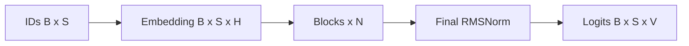

**这张图最需要记住什么：**

`forward_logits()` 到 logits 就结束，Softmax 和 Sampling 在调用者后面做；当前 LM head 复用 embedding weight，也就是 **weight tying（输入 embedding 与输出投影共享权重）**。

`GptModel` 头文件里即使有看似相关的成员，也必须以 executable call path 为准，不能根据名字猜真实架构。

---

## 15. Prefill：输入和输出到底是什么

`GptModel::prefill()` 输入：

```text
input_tokens: [B, S]
pos_offsets : [B]
sample_ids  : [B]
```

进入模型后：

```text
Embedding    [B,S,H]
Blocks       [B,S,H]
Logits       [B,S,V]
Probabilities[B,S,V]
```

但 next token 只取最后位置：

```text
probabilities[:, S-1, :]
→ [B,1,V]
→ sample B 个 token IDs
```

同时所有层的 K/V cache 增加 `S` 个位置。

Prefill 之后：

```cpp
ctx.step = ctx.input_seq_len;
```

注意 `input_seq_len` 是 padding 后 batch width。

---

## 16. Decode：为什么输入 shape 突然变成 `[B,1]`

上一轮已经为每个 active sample 得到：

```text
next_generated_tokens = [tA, tB, ...]
```

`build_decode_step_tokens()` 把它变成：

```text
[[tA], [tB], ...]
```

即：

```text
input IDs [B,1]
→ hidden [B,1,H]
→ logits [B,1,V]
→ sample [B]
```

历史 token 不再作为 input IDs 重放，因为历史 K/V 已经保留。

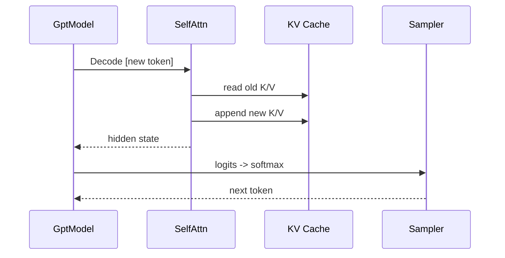

**这张图最需要记住什么：**

Decode 的性能优势来自“避免重新计算旧 token 的 K/V”，不是因为模型变成了另一套网络。

---

## 17. `GenerationContext`：一次固定 batch 生成的临时状态

它保存：

```text
batch_size
input_seq_len
max_steps
step
sample_ids
next_generated_tokens
pad_lens
pos_lens_by_sample
```

其中最容易混淆的是三组状态。

### 17.1 `sample_ids`：稳定身份，不是当前 batch row

初始：

```text
sample_ids = [0, 1, 2]
```

sample 1 遇到 EOS 后：

```text
sample_ids = [0, 2]
```

现在 batch row 1 对应 original sample 2。

因此：

```text
current row index ≠ stable sample identity
```

### 17.2 `next_generated_tokens`

每个 active sample 下一轮要喂回模型的 token。

### 17.3 `pos_lens_by_sample`

每个 sample 自己当前的真实 position 长度。Decode 时 RoPE offset 按这个 stable sample ID 查询。

---

## 18. EOS 不只是停止循环，还会改变 active set 和资源

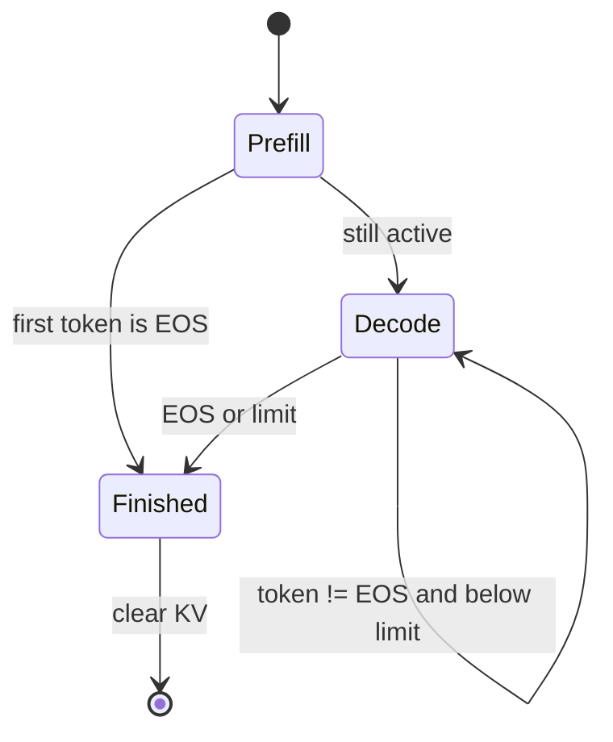

**这张图最需要记住什么：**

batch 里某一个 sample 完成后，会从 active set 中移除，并清理自己的 KV Cache；其他 sample 可以继续运行。所以 EOS filtering 同时是生成状态管理和资源生命周期管理。

---

## 19. `--max-steps` 不是常见 API 的 `max_new_tokens`

CLI help 写的是：

```text
Maximum generation steps per request
```

但 executable semantics 更接近**总 step/position ceiling**。

Prefill 已经生成第一枚 token，然后：

```cpp
ctx.step = ctx.input_seq_len;
```

Decode：

```cpp
while (ctx.step < ctx.max_steps) {
    ...
    ctx.step += 1;
}
```

所以单条请求近似最多生成：

```text
max_steps - input_seq_len + 1
```

Continuous 模式甚至直接计算：

```cpp
max_generate_tokens = std::max(1, config_.max_steps - seq_len + 1);
```

两个后果：

1. chat template 会占用 token 长度；
2. 普通多 Prompt batch 的 `input_seq_len` 是 padding 后最大宽度，短 Prompt 也会受到最长 Prompt 的影响。

这是当前 README/help 与实际语义之间需要明确知道的 documentation drift。

---

# 第五部分：进入一个 Transformer Block

## 20. Block 的真实执行顺序

`src/models/block.cpp` 表面只有几行：

```cpp
auto output_attn = self_attn_.forward(input, sample_ids, pos_offsets);
ops::add_inplace(output_attn, input);
auto output = mlp_.forward(output_attn);
ops::add_inplace(output, output_attn);
```

但 RMSNorm 分别封装在 `SelfAttn` 和 `MLP` 内，所以完整结构是：

```text
x
→ RMSNorm
→ Self-Attention
→ + x
→ RMSNorm
→ Gated MLP
→ + residual
```

输入输出 shape 都保持：

```text
[B,S,H] → [B,S,H]
```

---

## 21. Self-Attention：先追 shape，再看公式

设：

```text
B   = batch
S   = current input sequence length
Hq  = query heads
Hkv = key/value heads
D   = head_dim
M   = hidden_size = Hq × D
```

Qwen2.5-0.5B 的真实结构参数：

```text
M   = 896
Hq  = 14
Hkv = 2
D   = 64
```

输入：

```text
X: [B,S,896]
```

projection 后：

```text
Q: [B,S,896] = [B,S,14×64]
K: [B,S,128] = [B,S, 2×64]
V: [B,S,128] = [B,S, 2×64]
```

split head + transpose：

```text
Q: [B,14,S,64]
K: [B, 2,S,64]
V: [B, 2,S,64]
```

当前 CPU 路径随后：

```cpp
k.repeat(num_heads_ / num_heads_kv_, 1);
v.repeat(num_heads_ / num_heads_kv_, 1);
```

所以 K/V 被物理 repeat 成：

```text
K: [B,14,S,64]
V: [B,14,S,64]
```

这是项目当前 GQA（Grouped Query Attention，分组查询注意力）的直接实现。

重要设计事实：理论上的 GQA 可以减少 KV heads，但**当前 CPU cache 保存的是 repeat 后的 K/V**，所以不能把理论 KV 内存节省比例直接套到当前 CPU 实现。

---

## 22. Attention 的输入输出，用一个缩小矩阵看清楚

实际 head_dim=64、heads=14，不适合手画。下面用 1 个 head、3 个 token 做缩小示意。

假设某个 head 的 Q/K 计算得到 score matrix：

```text
           key0  key1  key2
query0      1.2   0.7  -0.2
query1      0.5   1.4   0.8
query2     -0.1   0.9   1.7
```

自回归模型不能“看未来”，加 causal mask：

```text
           key0  key1  key2
query0      1.2  -inf  -inf
query1      0.5   1.4  -inf
query2     -0.1   0.9   1.7
```

再：

```text
scale by 1/sqrt(D)
→ softmax each row
→ attention weights
→ weights × V
```

最后回到：

```text
[B,heads,S,D]
→ transpose/reshape
→ [B,S,896]
→ o_proj
→ [B,S,896]
```

这些 score 数字只是数学示意；真实值由模型权重和 hidden states 决定。

---

## 23. Attention 里其实有三种不同的 Mask

不要把它们全部叫“padding mask”。

### 23.1 Causal Mask

Prefill 时当前位置不能看未来 token。

### 23.2 Padding Mask

Prompt 左侧 PAD 不能成为有效历史信息。

### 23.3 Valid-length Mask

不同 active sample 的 KV Cache 长度可能不同。为了临时拼成规则 Tensor，短 cache 尾部补 0，但这些补出来的位置不能参与 Attention。

例如：

```text
sample 0 cache len = 3
sample 2 cache len = 5
```

临时 batch：

```text
sample 0: [K0 K1 K2  0  0]  valid_len=3
sample 2: [K0 K1 K2 K3 K4]  valid_len=5
```

`apply_valid_length_mask()` 会把 sample 0 后两个 score 设为 `-inf`。

---

## 24. RoPE：position 为什么不能直接等于数组下标

RoPE（Rotary Position Embedding，旋转位置编码）把 position 信息作用到 Q/K。

Prefill 时：

```text
offset = -pad_len
```

Decode 时：

```text
offset = pos_lens_by_sample[sample_id]
```

这两条规则由 `generation_invariants.cpp` 显式实现，并有测试保护。

设计重点不是“负 position 有什么语义”，而是：真实 token 从 position 0 开始，PAD 会被 mask；每个 sample 在 Decode 时又有自己的独立 position。

---

## 25. KV Cache：真正的历史状态保存在每一层 `SelfAttn`

每层都有：

```text
cache_k_by_sample_
cache_v_by_sample_
cache_len_by_sample_
pad_lens_by_sample_
```

N 层模型不是“只有一份 KV Cache”，而是 N 组 layer-specific history。

### 25.1 Append 的真实方向

Prefill：

```text
K/V new: [1,heads,S,D]
cache empty
→ cache = S positions
```

Decode：

```text
K/V new: [1,heads,1,D]
old cache: [1,heads,L,D]
→ concat on sequence dimension
→ [1,heads,L+1,D]
```

`append_kv_cache()` 是按 stable `sample_id` 做这个 concat。

### 25.2 为什么 cache 不能按当前 row 保存

假设：

```text
round 0 active rows: [sample 0, sample 1, sample 2]
```

sample 1 结束：

```text
round 1 active rows: [sample 0, sample 2]
```

此时 row 1 已从 sample 1 变成 sample 2。

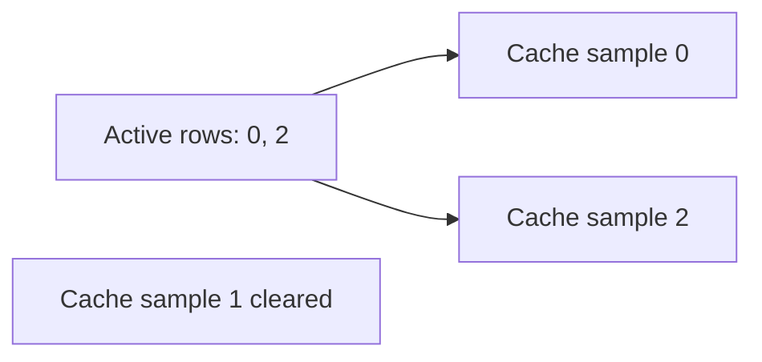

**这张图最需要记住什么：**

`sample_id` / `slot_id` 是稳定 cache identity；batch row 只是当前这一轮的位置。动态 batch 能正确缩小、重排，全靠这两个概念分开。

---

## 26. `RMSNorm` 与 Gated MLP

`RMSNorm::forward()`：

```text
mean(x²)
→ sqrt(mean + epsilon)
→ x / rms
→ × learned weight
```

当前代码把：

```text
epsilon = 1e-6
```

写死在 `src/models/norm.cpp`，没有从 `Config` 读取 `rms_norm_eps`。官方 Qwen2.5-0.5B 恰好也是 `1e-6`，所以默认模型匹配，但支持新模型时这是适配点。

`MLP::forward_cpu()`：

```text
x
→ RMSNorm
├→ up_proj ───────────┐
└→ gate_proj → SiLU ─┤ multiply
                     ↓
                  down_proj
```

它不是简单的 `Linear → ReLU → Linear`，而是 gated MLP。

---

# 第六部分：Sampling——模型如何从 15 万多个候选中选一个

## 27. Logits、Softmax、Sampling 是三个不同阶段

模型输出：

```text
logits [B,S,V]
```

`forward_logits()` **不会**做 softmax。

Prefill / Decode 调用者随后：

```text
logits
→ ops::softmax()
→ probabilities
→ Sampler::sample_from_probs()
→ token ID
```

这是读代码时非常重要的边界。

---

## 28. 用一个 3-token mini vocabulary 看清 Sampling

假设 vocabulary 只有：

```text
A, B, C
```

某一步 logits：

```text
A: 2.0
B: 1.0
C: 0.0
```

Softmax 约为：

```text
A: 0.665
B: 0.245
C: 0.090
```

### 28.1 Greedy

```text
max probability = A
→ 直接返回 A
```

### 28.2 Temperature：当前代码作用在 probability 上

`TopKTopPSampler` 当前计算：

```text
adjusted_weight = p^(1 / temperature)
```

例如 `T = 0.5`：

```text
A: 0.665² ≈ 0.442
B: 0.245² ≈ 0.060
C: 0.090² ≈ 0.008
```

重新归一化后大约：

```text
A: 0.867
B: 0.118
C: 0.016
```

这和常见的：

```text
logits / T → softmax
```

在数学上等价于同一种 temperature reweighting（差一个统一归一化常数）。

### 28.3 当前真实执行顺序

代码不是“Top-P 后再 Temperature”，而是：

```text
softmax probabilities
→ p^(1/T)
→ sort
→ Top-K
→ recompute total
→ Top-P cumulative cutoff
→ random sample
```

```mermaid
flowchart LR
    L[Logits]
    S[Softmax]
    T[p to p^(1/T)]
    K[Top-K]
    P[Top-P]
    R[Random sample]

    L --> S --> T --> K --> P --> R
```

**这张图最需要记住什么：**

Temperature 在候选截断之前生效。对正 probability 来说 `p^(1/T)` 不改变大小排序，所以通常不改变 Top-K 的 token 身份；但它会改变累计权重，因此**可能改变 Top-P 的截断边界**。

例如上面的分布，若 `top_k=0, top_p=0.8`：

```text
T=1.0: A=0.665，不到 0.8 → 还需要 B → 候选 {A,B}
T=0.5: A≈0.867，已超过 0.8 → 候选只剩 {A}
```

这正是当前 executable code 的语义。

---

## 29. RNG state 归谁

`GptModel` 持有：

```text
std::mt19937 rng_
Sampler
```

seed 来自 CLI/config。

所以当前 RNG state 是**模型级**的，而不是 per-request RNG state。

这在固定 batch 里很简单；如果未来 Continuous Batching 要求“每个 request 指定自己的 seed，且不受其他请求到达顺序影响”，就必须重新设计 sampling state ownership。

---

## 30. 单次模式的最终输出为什么在 `DataManager`

`GptEngine`：

```cpp
auto output = model_->forward(batch);
(void)output;
data_manager_->log_outputs(output_path);
```

说明 `GptModel::forward()` 的 string return 当前不是结果主渠道。

真正路径：

```text
sample token ID
→ DataManager::add_output_token()
→ outputs_[sample_id].token_ids
→ Tokenizer::decode()
→ final text
```

所以：

```text
GptModel = 产生 token
DataManager = 单次模式下保存生成 token + 最终 decode
```

如果未来把 `GptModel` 做成更通用 library，这个 side-effect based 输出边界很值得重构。

---

# 第七部分：Continuous Batching——多个请求如何共用一个模型

## 31. `--serve` 不是 HTTP Server

启动：

```bash
./build/easy_llm --serve
```

当前协议：

```text
stdin : one prompt per line
stdout: [accepted id]
stdout: [request id] final decoded text
```

输入 thread 负责读 stdin；server 主循环负责模型执行。

没有：

```text
HTTP / REST / SSE / WebSocket / gRPC
network auth
durable request store
```

---

## 32. Continuous Batching Golden Path

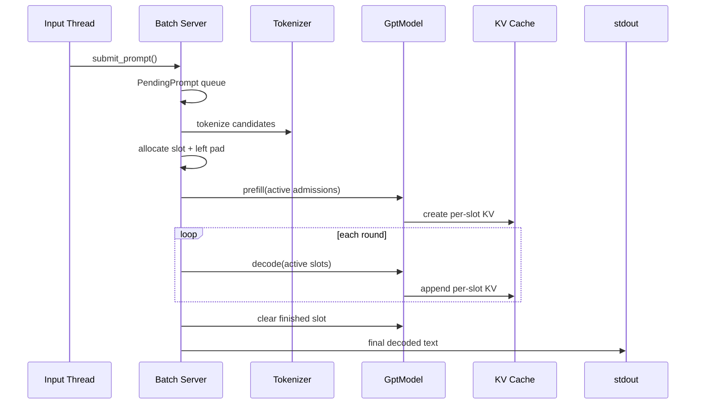

**这张图最需要记住什么：**

Continuous Batching 不是“每个请求一个模型线程”。它是**一个 scheduler/model loop，每轮重新组合当前 active requests；stable slot 保证 KV history 不跟 batch row 一起漂移。**

---

## 33. Request 有三种主要状态

### `PendingPrompt`

```text
request_id
prompt_text
submit_time
```

还没有占用 KV slot。

### `PreparedAdmission`

```text
request_id
slot_id
seq_len
pad_len
pos_len
max_generate_tokens
token_ids
```

已经 tokenize，拿到 slot，准备做 Prefill。

### `ActiveRequest`

```text
request_id
slot_id
pos_len
max_generate_tokens
next_token
generated_token_ids
decode_steps
```

正在参与 Decode。

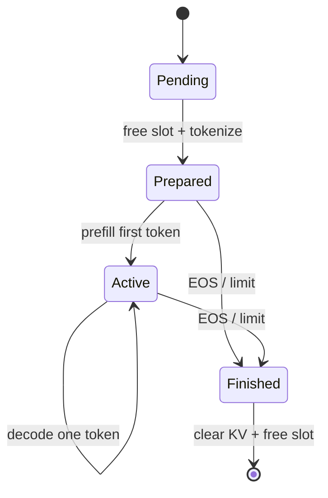

**这张图最需要记住什么：**

`request_id` 是业务请求身份；`slot_id` 是 cache resource identity。请求完成后 slot 会给另一个 request 复用，两者绝不能混为一谈。

---

## 34. 用时间线看 Dynamic Batch 为什么叫 Continuous

假设：

```text
max_active=3
prefill_batch_size=2
```

请求 A/B 已到达，C 晚一轮到达。

| Round | Admission | Prefill batch | Decode batch | round 后 active |
|---|---|---|---|---|
| 0 | A, B | `[A,B]` | `[A,B]` 各走 1 token | A, B |
| 1 | C | `[C]` | `[A,B,C]` 各走 1 token | A, B, C |
| 2 | 无 | - | `[A,B,C]` | 假设 B 完成 |
| 3 | 无 | - | `[A,C]` | A, C |

这就是“continuous”的核心：

```text
请求不必等整个旧 batch 全部结束，新的请求可以在有 free slot 时进入下一次 Prefill round。
```

### 34.1 每一轮输入输出也很具体

Prefill round：

```text
输入:
  sample_ids  = [slotA, slotB]
  input_tokens= 两条 left-padded Prompt
  pos_offsets = [-padA, -padB]
输出:
  sampled     = [firstTokenA, firstTokenB]
  KV          = 每个 slot 建立 Prompt history
```

Decode round：

```text
输入:
  sample_ids  = [slotA, slotB, slotC]
  input_tokens= [[nextA],[nextB],[nextC]]
  pos_offsets = [posA,posB,posC]
输出:
  sampled     = [newA,newB,newC]
  KV          = 每个 active slot 各 append 1 position
```

---

## 35. Free Slot 是 Continuous 模式的资源管理中心

服务启动时：

```text
free_slots = 0..N-1
```

Admission：

```text
free slot
→ PreparedAdmission.slot_id
→ model KV identity
```

Finish：

```text
clear_continuous_sample(slot)
→ pad_len reset
→ slot returned to free_slots
```

所以 slot 不是“request number”，而是**有限模型状态资源**。

---

## 36. Continuous 模式为什么不使用 `DataManager::outputs_`

单次模式是固定 batch，`DataManager` 可以一开始就创建平行的 input/output arrays。

服务模式请求会动态进出，所以生成状态保存在：

```text
ActiveRequest::generated_token_ids
```

finish 时：

```cpp
std::string text = tokenizer_.decode(request.generated_token_ids);
```

两种模式的 state ownership：

| 状态 | 单次模式 | Continuous 模式 |
|---|---|---|
| 输入 request | `DataManager::inputs_` | pending/prepared request |
| Generated IDs | `DataManager::outputs_` | `ActiveRequest` |
| Request lifecycle | 固定 batch | Pending → Active → Finished |
| KV history | 每层 `SelfAttn` | 每层 `SelfAttn`，按 slot |

---

## 37. Sync / Async 边界：哪里真的有线程

普通 CLI：

```text
main → GptEngine → GptModel → complete
```

基本同步。

`--serve`：

```text
stdin producer thread
        ↓
mutex-protected pending_prompts_
        ↓
server/model loop thread
```

`pending_prompts_` 和 `input_closed_` 用 `pending_mu_` 保护。

而：

```text
active_requests_
free_slots_
model forward
```

由 server 主循环单线程推进。

OpenMP/CUDA 属于 operator 内部并行，不等于“每个 request 一个线程”。

---

# 第八部分：State Ownership 与系统边界

## 38. 谁是每类状态的 owner

项目没有数据库，因此也没有 durable system of record。当前运行时状态：

| 状态 | Owner | 生命周期 |
|---|---|---|
| model config | `Config` | process/model |
| startup weight map | `ModelParam` | startup |
| model weights | Embedding/Linear/Norm | model |
| 单次 input/output | `DataManager` | one CLI batch |
| 单次生成临时状态 | `GenerationContext` | one `forward()` |
| service pending queue | `ContinuousBatchServer` | service process |
| service active request | `ContinuousBatchServer` | request |
| CPU KV | each `SelfAttn` | sample/slot |
| CUDA KV | each `SelfAttnCudaState` | sample/slot |
| RNG | `GptModel` | model process |

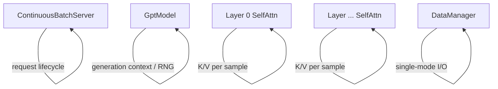

**这张图最需要记住什么：**

“状态存在”不是问题，“状态归谁”才是架构问题。请求状态、生成状态、KV 历史和输出状态有不同生命周期，所以不应该塞进一个全局对象。

---

## 39. 当前 Protocol / Integration Boundary 很薄

当前对外 protocol：

```text
CLI args
stdin lines
stdout lines
```

不存在：

```text
HTTP route
JSON request schema
callback
event bus
SSE
network authentication
```

如果以后增加 HTTP/gRPC，合理结构是：

```text
HTTP/gRPC Adapter
→ request lifecycle API
→ ContinuousBatchServer-like scheduler
→ GptModel
```

而不是：

```text
HTTP handler
→ 直接改 SelfAttn KV cache
```

transport 层应该知道请求，不应该知道每层 K/V 的内部 layout。

---

# 第九部分：CPU 与 CUDA——同一个模型的两个执行后端

## 40. 为什么学习时先读 CPU

`Tensor` 的核心可以理解为：

```text
std::vector<data_type> data
std::vector<int> shape
```

CPU 代码把很多操作直接写出来：

```text
matmul
RoPE
mask
softmax
concat
MLP
```

`reshape()` 主要改 shape metadata，但 `transpose()` / `repeat()` 会真正重排/复制数据。

因此 CPU baseline 最适合追踪“数据究竟怎么流”。

---

## 41. Precision：源码支持概念与标准 build 路径要分开

代码有：

```text
USE_FP32
USE_FP16
USE_BF16
```

但当前 `CMakeLists.txt` 对核心 target 采用 BF16 路径。

Loader 可以读取 F16/F32/BF16 源权重，不代表三种 target precision 都是当前同等验证的正式 build path。

---

## 42. CUDA 是 operator backend，不是第二套 `GptModel`

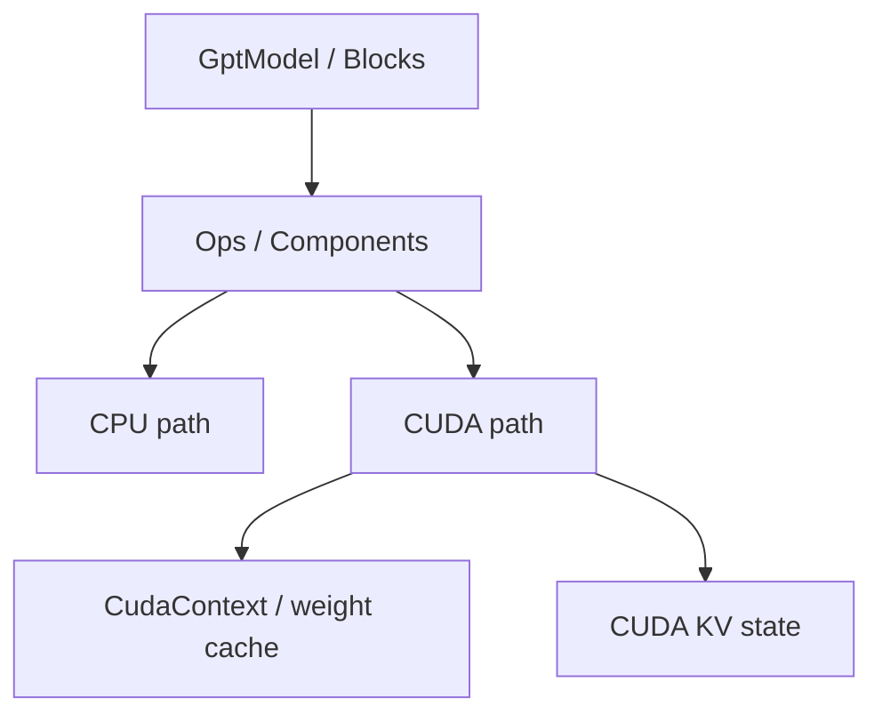

**这张图最需要记住什么：**

Prefill/Decode、request state、Block 结构还是同一套 C++ orchestration；CUDA 主要替换底层计算，并在 Self-Attention 路径维护 device-side KV state。

---

## 43. 为什么普通 CUDA fallback 和 Self-Attention fallback 不一样

MLP/matmul CUDA 失败时，host input 仍然完整，通常可以 catch 后走 CPU。

Self-Attention 有历史状态。

如果旧 K/V 只存在 CUDA cache：

```text
CUDA Attention fails
→ 直接 CPU fallback
→ CPU 没有历史 K/V
→ 结果会悄悄错误
```

所以当前 `SelfAttn::forward()` 会检查：

```text
无 active CUDA KV history
→ 可以 disable CUDA self-attn 并 fallback CPU

已有 active CUDA KV history
→ fallback unsafe
→ throw
```

这是一个很重要的可靠性原则：

> **存在 fallback 代码，不等于任何时刻 fallback 都保持语义正确。状态连续性比“尽量继续跑”更重要。**

Continuous 模式还可以通过：

```text
EASY_LLM_DISABLE_CONTINUOUS_CUDA_SELF_ATTN
```

提前禁用 Self-Attention CUDA path 做隔离测试。

---

# 第十部分：可靠性、错误处理和当前没有实现的能力

## 44. 这个项目的可靠性重点是“尽早发现 silently wrong”

代码在很多边界做校验：

```text
CLI range
Safetensors header/dtype/offset/shape
missing model key
model tensor shape
sample_id range
Tensor shape
KV cache shape
valid length
```

对于 inference engine，很多错误不会 crash，而可能只是让生成结果变差。因此 shape、position、sample identity 之类的 invariant 特别重要。

---

## 45. 当前没有 Retry / Idempotency / Recovery / Persistence

### Retry

模型/请求失败不会自动重跑。

### Idempotency

`request_id` 只是进程内递增编号。相同 Prompt 提交两次就是两个请求。

### Recovery

pending queue、active requests、generated IDs、KV Cache 都在内存。进程重启无法继续。

### Persistence

没有数据库或 durable queue。

这不是“教程漏讲”，而是当前 repo 明确没有这些能力。

---

## 46. 当前没有 Authentication / Authorization

因为当前没有网络 service boundary，也没有 user/tenant identity。

如果未来增加 HTTP/gRPC，authn/authz 更适合放在 transport/service 层，而不是 `GptModel` 或 `SelfAttn`。

---

## 47. 内部逐 token Decode ≠ 对外 Token Streaming

内部：

```text
each decode round → one token
```

对外：

```text
request finishes
→ tokenizer.decode(all generated IDs)
→ stdout one final line
```

所以当前没有 SSE、token callback、stream handle。

---

# 第十一部分：Tests 是可执行的架构说明

## 48. 为什么这些测试比“回答看起来正常”更重要

自然语言输出有随机性，也很难精确判断内部是否正确。

项目把关键 correctness 写成 invariants。

### `data_manager_invariants_test.cpp`

保护：

```text
真实 seq_len
left padding
pad_len
输出 token 记录规则
PAD 不进入生成结果
```

### `generation_invariants_test.cpp`

保护：

```text
Prefill offset = -pad_len
Decode offset = each sample's pos_len
只增加 active sample position
EOS filter 后 sample_id/token 配对不乱
```

### `cache_batching*_test.cpp`

保护：

```text
variable-length KV cache 能正确拼 batch
valid_lens 正确
padded tail 被 mask
非法 heads/head_dim/sample_id 正确失败
```

### CUDA tests

覆盖 MatMul、MLP、Self-Attention、variable-length Attention 等 CUDA 路径。

---

## 49. Regression Gate

```bash
cmake --build build --target easy_llm_regression_gates -j8
ctest --test-dir build --output-on-failure -L "^invariant_gate$"
```

辅助脚本：

```bash
bash scripts/run_regression_gates.sh
```

CUDA：

```bash
bash scripts/run_regression_gates.sh --with-cuda
```

最值得记住的是：

> 对推理引擎来说，padding、position、stable sample identity、EOS shrink、cache valid length 等 invariant，比“最终生成一句话看起来差不多”更适合作为回归门。

---

# 第十二部分：Build、运行与 Deployment Boundary

## 50. 推荐先用 CPU 跑通

```bash
cmake -S . -B build \
  -DCMAKE_BUILD_TYPE=RelWithDebInfo \
  -DEASY_LLM_ENABLE_CUDA=OFF \
  -DCMAKE_CXX_COMPILER=g++

cmake --build build --target easy_llm -j8
```

模型文件：

```text
data/model/
├── config.json
├── model.safetensors
├── tokenizer.json
└── tokenizer_config.json
```

运行：

```bash
./build/easy_llm --greedy "Hello"
```

第一次学习建议用 `--greedy`，先去掉随机 sampling 这一变量。

---

## 51. CUDA Build

```bash
cmake -S . -B build \
  -DCMAKE_BUILD_TYPE=RelWithDebInfo \
  -DEASY_LLM_ENABLE_CUDA=ON \
  -DCMAKE_CUDA_ARCHITECTURES=<your_arch> \
  -DCMAKE_CXX_COMPILER=g++

cmake --build build --target easy_llm -j8
```

当前 `build.sh` 带机器相关参数，例如 CUDA architecture，因此通用环境优先使用显式 CMake command。

CPU-only 的本地实操记录另见：

```text
my/docs/build-test-run.zh-CN.md
```

---

## 52. Local executable 距离 production serving 还差什么

当前 repo 的合理核心边界是：

```text
model loading
+ tokenizer
+ generation
+ in-process continuous batching
```

完整 production service 通常还需要外层承担：

```text
network transport
request validation
authn/authz
backpressure
cancellation / timeout
streaming protocol
metrics / tracing
possibly persistence / retry
```

这些不应该为了“功能齐全”全部塞进 `GptModel`。

---

# 第十三部分：怎样扩展而不破坏边界

## 53. 支持新模型 family

逐项检查：

```text
1. config schema
2. checkpoint key naming
3. Attention math
4. head / KV-head layout
5. MLP / activation
6. Norm / epsilon
7. RoPE / position rules
8. Tokenizer
9. Chat Template
10. BOS/EOS/PAD
```

只有“权重 key 不同”时，扩展 `LayerKeyPrefix` 才够。

如果数学结构不同，应增加真正的 model component，而不是在 `SelfAttn` 里到处写模型名分支。

---

## 54. 增加 Sampling 策略

当前抽象：

```text
Sampler
├─ GreedySampler
└─ TopKTopPSampler
```

新的 sampling policy 最自然放在 `Sampler` 层。

不要把 repetition penalty、beam search 等逻辑塞进 Attention。

如果未来需要 per-request seed，需要同步设计 per-request RNG state，而不只是新增 CLI 参数。

---

## 55. 增加 HTTP API 最自然接在哪里

更合理：

```text
HTTP Adapter
→ submit/cancel/stream request API
→ scheduler
→ GptModel
```

真正要先设计的接口：

```text
submit_prompt() 如何返回 handle/future
如何 cancellation 并释放 slot/KV
如何逐 token 上送
request ID / idempotency key 谁定义
timeout/retry 谁负责
```

这些问题都来自现有 state ownership，而不是来自 HTTP 框架本身。

---

# 第十四部分：Troubleshooting——按数据流定位，不要随机猜

## 56. 和 Hugging Face 输出不同：按这 5 层比较

不要一上来怀疑 CUDA 或矩阵乘。

```text
1. exact templated text
2. exact token IDs / BOS / special tokens
3. greedy mode
4. single-step logits
5. multi-step KV / position
```

当前 repo 与完整 HF runtime 已知可能存在：

```text
Tokenizer pre-tokenization 差异
BOS policy 差异
Chat template 能力差异
Generation config 差异
```

只有前一层一致，才值得比较下一层。

---

## 57. 输出异常短

优先打印/确认：

```text
Prompt after chat template
token count
--max-steps
```

因为：

```text
max_steps ≠ max_new_tokens
```

多 Prompt 固定 batch 还要注意 padded max width。

---

## 58. 短 Prompt 放入 batch 后结果不对

沿这条链排查：

```text
DataManager::pad_len
→ build_prefill_pos_offsets()
→ SelfAttn::pad_lens_by_sample_
→ KV valid_lens
→ causal / padding / valid-length masks
```

优先跑 invariant tests，再看自然语言输出。

---

## 59. Missing weight / shape mismatch

先查：

```text
config.json
src/models/layer_key_prefix.cpp
src/models/model_param_validation.cpp
```

常见原因：

```text
checkpoint/config 不属于同一模型
model family 不支持
weight key naming 不同
hidden/head/KV-head dimensions 不匹配
```

不要先钻进 CUDA kernel。

---

## 60. CUDA 报错后为什么不总是自动切 CPU

先区分：

```text
stateless-ish operator failure
vs
stateful Self-Attention failure
```

如果 device KV history 已存在，CPU fallback 会失去历史状态，所以 fail fast 是正确保护。

---

# 第十五部分：推荐源码阅读顺序

## 61. 第一遍：只追一条 Prompt

```text
src/main.cpp
→ src/cli_options.cpp
→ src/gpt_engine.cpp
→ src/data_manager.cpp
→ src/tokenizer.cpp
→ src/models/gpt_model.cpp
```

目标：能画出：

```text
text → IDs → tensor → logits → token ID → text
```

## 62. 第二遍：只追一个 Block 和 KV

```text
src/models/block.cpp
→ src/models/self_attn.cpp
→ src/models/cache_batching.cpp
→ src/models/mlp.cpp
→ src/models/generation_invariants.cpp
```

目标：能解释：

```text
Q/K/V shapes
RoPE offsets
3 kinds of mask
KV append
stable sample identity
```

## 63. 第三遍：看模型怎样被装起来

```text
src/config.cpp
→ src/models/loader.cpp
→ src/models/layer_key_prefix.cpp
→ src/models/model_param_validation.cpp
→ src/tensor.cpp
→ src/ops.cpp
```

目标：知道 checkpoint 到 C++ Tensor 的 ownership 和 shape validation。

## 64. 第四遍：最后看 Serving / CUDA

```text
src/continuous_batch_server.cpp
→ src/cuda/runtime.cu
→ src/cuda/ops/mlp.cu
→ src/cuda/ops/self_attn.cu
→ src/cuda/ops/self_attn_detail.cuh
```

不要从 `self_attn_detail.cuh` 开始。否则会同时面对 Attention、CUDA、KV layout、batching、kernel optimization 五层复杂度。

---

# Appendix A：关键调用链速查

## A.1 单次 CLI

```text
main
└─ GptEngine::run
   ├─ DataManager::add_input
   ├─ DataManager::get_inputs
   │  ├─ Tokenizer::tokenize
   │  │  └─ Bpe::encode_into
   │  └─ left padding
   ├─ GptModel::forward
   │  ├─ init_kv_cache
   │  ├─ prefill
   │  │  ├─ forward_logits
   │  │  │  └─ Embedding → Blocks → Norm → tied projection
   │  │  ├─ softmax
   │  │  └─ sample
   │  ├─ decode loop
   │  ├─ EOS filter
   │  └─ reset_kv_cache
   └─ DataManager::log_outputs
      └─ Tokenizer::decode
```

## A.2 一个 `SelfAttn::forward_cpu`

```text
input [B,S,H]
→ RMSNorm
→ q/k/v projection
→ split heads
→ RoPE
→ repeat KV heads for GQA
→ append per-sample KV cache
→ build padded active cache
→ Q × K^T
→ causal + valid-length + padding masks
→ scale
→ softmax
→ Attention × V
→ reshape
→ o_proj
→ output [B,S,H]
```

## A.3 Continuous Batching

```text
input thread
└─ submit_prompt
   └─ pending_prompts_

server loop
├─ admit_prefill_round
│  ├─ pop pending
│  ├─ tokenize
│  ├─ allocate slot
│  ├─ left pad + position offsets
│  └─ GptModel::sample_prefill_continuous
├─ decode_round
│  └─ GptModel::sample_decode_continuous
└─ finish_request
   ├─ clear slot KV
   ├─ return free slot
   └─ decode generated IDs → stdout
```

---

# Appendix B：Documentation Drift / 容易误解的实现边界

| 表面上容易得到的结论 | 当前 executable code 的真实行为 |
|---|---|
| `--max-steps` = 生成 N 个新 token | 更接近总 step/position ceiling；Prefill 已生成第一枚 token |
| `--serve` = 网络 server | stdin/stdout long-lived batching loop |
| `tokenizer_config.json` 决定 chat template | special token/PAD 会读取；chat template 当前硬编码 |
| 读取 HF tokenizer files = HF runtime parity | 当前普通 pre-tokenization 与 BOS policy 更简化，需要 parity test |
| Qwen 官方 `add_bos_token=false` 会自动被尊重 | 当前只看 `config.bos_token_id >= 0`，会主动 prepend BOS |
| Loader 使用 `mmap` = runtime zero-copy weights | 权重最终 copy/convert 到 owning `Tensor` |
| GQA 一定按理论比例节省 CPU KV cache | CPU path 先 repeat K/V heads，再 append cache |
| `rms_norm_eps` 自动来自 config | 当前 `RMSNorm` 直接使用 `1e-6` |
| Temperature 只影响最终随机抽样 | 当前先算 `p^(1/T)`，再 Top-K/Top-P；Top-P cutoff 可能因此改变 |
| 支持多个 precision macro = 三种都是同等正式路径 | 当前标准 CMake 主要是 BF16 path |
| CUDA failure 总能 CPU fallback | SelfAttn 已有 device KV history 后 fallback 不安全，会 throw |
| Continuous Batching = 多模型线程并发 | 一个 scheduler/model loop 动态重组 active batch |
| 内部每轮生成 token = 对外 streaming API | 当前只在 request 完成后 stdout 整段文本 |

---

# Appendix C：术语表

| 术语 | 本项目里的含义 |
|---|---|
| LLM inference | 用训练好的权重，根据已有 token 自回归预测后续 token |
| Token | 模型处理文本的离散单位 |
| Token ID | token 在 vocabulary 中的整数编号 |
| BPE | Byte Pair Encoding，按 merge rank 合并 byte/token 片段 |
| Embedding | token ID → hidden vector |
| Hidden State | Transformer 内部的向量表示 |
| Logits | vocabulary 上未归一化的预测分数 |
| Softmax | logits → probability distribution |
| Prefill | 第一次处理完整 Prompt，并建立历史 KV |
| Decode | 后续每轮处理新 token，并复用历史 KV |
| KV Cache | Attention 历史 Key/Value 状态 |
| RoPE | Rotary Position Embedding，把 position 作用到 Q/K |
| GQA | Grouped Query Attention，多个 Query heads 共享较少 KV heads |
| RMSNorm | Root Mean Square Normalization |
| Residual | 子层输出与原输入相加 |
| Top-K | 只保留最高权重的 K 个候选 |
| Top-P | 保留累计权重达到 P 的最小高权重集合 |
| Continuous Batching | 请求持续到达时动态组合 active requests 共同 forward |
| `request_id` | 服务层请求身份 |
| `sample_id` / `slot_id` | 稳定定位 per-request KV state 的身份 |
| Invariant | 执行过程中始终必须成立的正确性约束 |
| Backend | 同一逻辑操作的 CPU/CUDA 具体实现 |

---

# Appendix D：外部原始资料

项目事实以当前 repo executable code/config/tests 为准。下面只用于核对模型与格式背景：

- Qwen2.5-0.5B-Instruct model card：<https://huggingface.co/Qwen/Qwen2.5-0.5B-Instruct>
- Qwen2.5 model config：<https://huggingface.co/Qwen/Qwen2.5-0.5B-Instruct/blob/main/config.json>
- Qwen2.5 tokenizer config / chat template：<https://huggingface.co/Qwen/Qwen2.5-0.5B-Instruct/blob/main/tokenizer_config.json>
- Qwen2.5 generation config：<https://huggingface.co/Qwen/Qwen2.5-0.5B-Instruct/blob/main/generation_config.json>
- Hugging Face Qwen2 tokenizer upstream：<https://github.com/huggingface/transformers/blob/main/src/transformers/models/qwen2/tokenization_qwen2.py>
- Safetensors upstream：<https://github.com/huggingface/safetensors>
- Safetensors documentation：<https://huggingface.co/docs/safetensors/>
- CMake documentation：<https://cmake.org/documentation/>
- NVIDIA CUDA documentation：<https://docs.nvidia.com/cuda/>

---

## 最后重新用一条数据流描述项目

```text
"Hello"
→ Chat Template
→ Token strings
→ Token IDs [B,S]
→ Embedding [B,S,H]
→ 24 × Transformer Block
→ Logits [B,S,V]
→ Softmax
→ Temperature / Top-K / Top-P
→ Next Token ID
→ KV Cache append
→ Decode next round [B,1]
→ ...
→ Generated IDs
→ Decoded text
```

如果继续研究 serving，再在这条模型链外面加一层：

```text
Pending request
→ stable slot
→ Prefill admission
→ dynamic active batch
→ Decode rounds
→ EOS / limit
→ clear KV + return slot
```

真正值得带走的四条关系是：

```text
text protocol ≠ model tensor computation
request lifecycle state ≠ model execution state
current batch row ≠ stable cache identity
available fallback ≠ semantically correct fallback
```

读懂这四条关系后，这个项目里的大多数“为什么要多一层”都会变得合理。