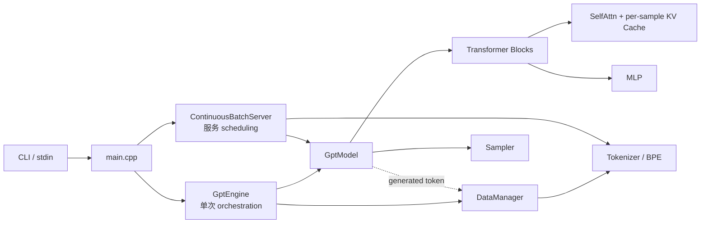
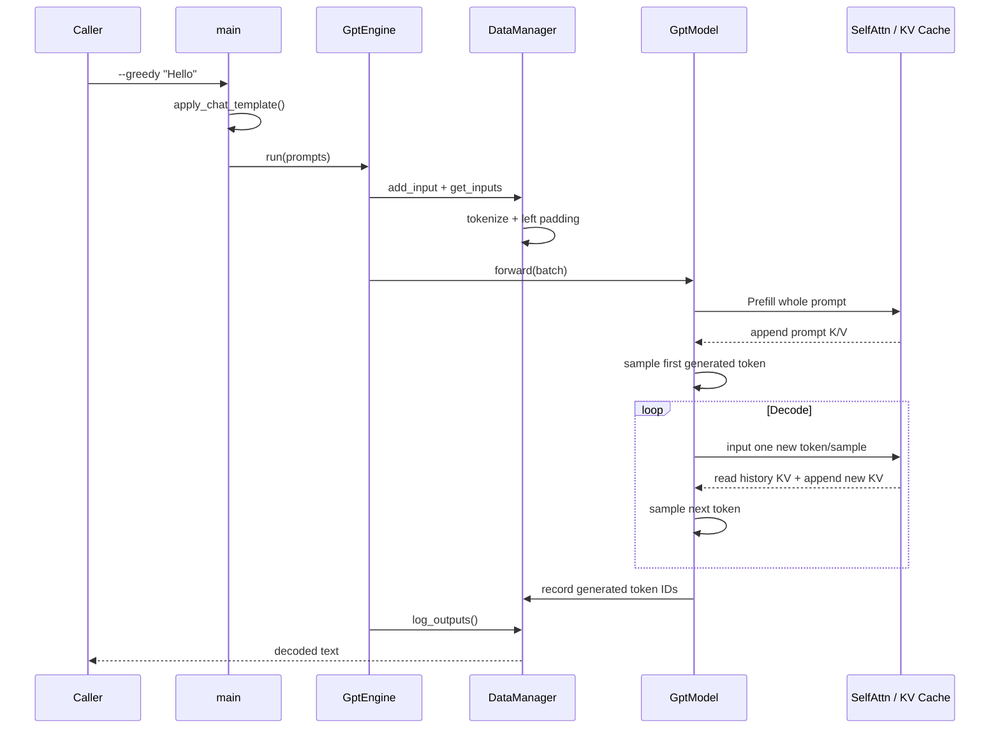

# easy_llm.cpp 教学式源码教程 v3：从一次 Prompt 到可持续 Decode

> 核验日期：2026-09-03；代码基线：`release@da4a655d7385d17705d4ab4a6959bf3ecb6dd036`。
>
> 第一次接触 LLM inference 时，先读 [`easy_llm_first_read.zh-CN.md`](./easy_llm_first_read.zh-CN.md)。本文不重复完整入门理论，而是把 Prefill、Decode、KV Cache、Continuous Batching 等概念映射回真实 C++ 实现。

---

## 1. 这个 repo 应该怎样学，而不是怎样“介绍”

`easy_llm.cpp` 是一个教学型 LLM inference engine。它不是业务后端，也不是生产级通用 serving 平台。真正值得学的是：大型推理框架隐藏起来的 token-by-token 推理、Attention state、dynamic batching 和 backend state，在这里都能顺着源码看到。

项目有两条执行路径：

```text
单次模式:
CLI prompt
→ DataManager
→ GptModel Prefill
→ Decode loop
→ decoded text
```

```text
服务模式:
stdin requests
→ pending queue
→ stable slot
→ Prefill admission
→ changing active batch
→ Decode rounds
→ finish + recycle slot
```

全文只重点钉牢 6 个难点：

1. Prefill / Decode 为什么分开；
2. KV Cache 保存什么、由谁拥有；
3. batch row 为什么不能当稳定 identity；
4. left padding 为什么会牵涉 position / valid length；
5. Continuous Batching 为什么必须有 stable slot；
6. CPU/CUDA 为什么可以换计算后端，却不能随便换状态来源。

这些概念有明显依赖：

```text
Prefill / Decode
      ↓
   KV Cache
      ↓
sample identity
      ↓
padding / position
      ↓
continuous batching
      ↓
CPU / CUDA state boundary
```

因此本文不会先从 `src/cuda/` 或全部 Attention 公式开始。

---

## 2. 先画一张“状态属于谁”的地图

| 状态 | owner | 典型内容 | 生命周期 |
|---|---|---|---|
| 单次输入 / 输出 | `DataManager` | `inputs_`, `outputs_`, `seq_len`, `pad_len` | 一次 `GptEngine` 运行 |
| 单次生成控制状态 | `GptModel::GenerationContext` | `sample_ids`, `next_generated_tokens`, `pos_lens_by_sample`, `step` | 一次 `GptModel::forward()` |
| Attention 历史 | 每层 `SelfAttn` | per-sample K/V cache + cache length | sample 生成期间 |
| 服务请求生命周期 | `ContinuousBatchServer` | pending queue、`ActiveRequest`、`free_slots_` | server 运行期间 |
| Sampling 随机状态 | `GptModel` | RNG + `Sampler` | model 生命周期 |

后面遇到一个 vector 或 ID 时，先问三个问题：

```text
它描述“请求是谁”？
还是描述“这一轮 batch 的第几行”？
还是描述“Attention 已经保存了多少历史”？
```

很多最容易出错的地方，本质上都是把这三种状态混了。

---

## 3. Architecture：只保留理解主线需要的边界



**这张图最需要记住什么：**

- `GptEngine` 和 `ContinuousBatchServer` 都在模型外面做 orchestration；
- 两条路径最终都使用同一个 `GptModel`；
- KV Cache 不是 server queue，也不是 `GenerationContext`，而是每层 `SelfAttn` 的历史状态；
- `DataManager` 主要服务单次模式的数据准备和输出记录。

```yaml
# diagram-facts
nodes: [main, GptEngine, ContinuousBatchServer, DataManager, Tokenizer, GptModel, SelfAttn, KV Cache, Sampler]
edges:
  - main -> GptEngine: single-run orchestration
  - main -> ContinuousBatchServer: serving orchestration
  - GptEngine -> DataManager: tokenize/pad/output
  - GptEngine -> GptModel: forward batch
  - ContinuousBatchServer -> GptModel: prefill/decode rounds
  - SelfAttn -> KV Cache: append/read per-sample history
  - GptModel -> Sampler: choose next token
```

---

# 第一层：跟一条 `Hello` 请求走完

## 4. Running Example

固定第一条输入：

```bash
./build/easy_llm --greedy "Hello"
```

`--greedy` 只是为了先去掉随机采样干扰。

本文不会伪造 `Hello` 的真实 token ID，因为真实 vocab/merges 来自未提交到 repo 的 `data/model/tokenizer.json`。出现 `[11,12]` 一类数字时，只是教学数据。

---

## 5. `main` 负责组装，不负责推理算法

`src/main.cpp::main()` 的主线可以压缩成下面这段**基于真实实现的 simplified code**：

```cpp
// 教学简化版
CliOptions options = parse_cli();

Config config;
config.load_config();
apply_sampling_options(config, options);

ModelParam weights = ModelParam::load(config.model_path);
auto tokenizer = Tokenizer::create(config);
auto data = std::make_unique<DataManager>(std::move(tokenizer));
auto model = GptModel::create(config, *data, weights);

std::string prompt = apply_chat_template("Hello");
GptEngine engine(std::move(model), std::move(config), std::move(data));
engine.run({prompt}, "");
```

省略了 prompt file、`--serve`、stdin thread、输出路径等，因为这些不是第一条推理主线的前置知识。

**Source anchors**：

- `src/main.cpp::main`
- `src/cli_options.cpp::apply_chat_template`
- `src/models/loader.cpp::ModelParam::load`

`GptEngine::run()` 则非常短：

```cpp
void GptEngine::run(const vector<string>& prompts, const string& output_path) {
    for (const string& prompt : prompts) {
        data_manager_->add_input(InputSample{prompt});
    }
    auto batch = data_manager_->get_inputs();
    model_->forward(batch);
    data_manager_->log_outputs(output_path);
}
```

所以边界很清楚：

```text
GptEngine = 组织一次推理
DataManager = 准备 / 记录数据
GptModel = 真正生成 token
```

---

## 6. Golden Path：模型不是一次吐出整句话



**这张图最需要记住什么：**

1. Prefill 一次处理 prompt；
2. Decode 每轮每个 active sample 只输入一枚新 token；
3. 历史并没有丢，它被转化成每层 Attention 的 K/V state；
4. generated token IDs 最后由 `DataManager` decode 成文本。

```yaml
# diagram-facts
edges:
  - DataManager -> GptModel: padded token IDs
  - GptModel -> SelfAttn: prefill whole sequence
  - SelfAttn -> KV Cache: append historical K/V
  - GptModel -> SelfAttn: decode one new token per active sample
  - GptModel -> DataManager: record sampled token IDs
```

### 到这里应该能回答

- 为什么 `GptEngine` 不需要知道 Attention 公式？它只编排。
- 为什么 Decode 能只输入 1 token？历史 K/V 在 cache 中。

### Hands-on checkpoint 1：真的观察 Prefill 和 Decode

下面命令来自 repo 的 README / CMake 路径；**本文当前没有在执行环境里实际运行模型，因此不伪造具体生成文本**。

```bash
cmake -S . -B build -DCMAKE_BUILD_TYPE=RelWithDebInfo -DCMAKE_CXX_COMPILER=g++
cmake --build build --target easy_llm -j8
./build/easy_llm --greedy --max-steps 16 "Hello"
```

如果模型文件已经放在 `data/model/`，重点观察日志中的：

```text
Starting Prefill ...
----------Step ... remaining batch size ...
Sampled token ...
Output text ...
```

你不是为了看“回答质量”，而是验证：

```text
一次 Prefill
→ 多轮 Decode
→ 每轮 sample token
→ 最后 decode text
```

这正是前面 sequence diagram 的可观察版本。

---

# 第二层：text 怎样变成可以计算的数据

## 7. Tokenizer：先区分通用概念和 repo 实现

`DataManager::get_inputs()` 的主线：

```text
text
→ tokenize
→ token IDs
→ left padding
```

真实核心代码：

```cpp
void DataManager::tokenize_inputs(vector<vector<int>>& batch) {
    for (InputSample& input : inputs_) {
        input.tokens = tokenizer_->tokenize(input.text);
        input.token_ids = tokenizer_->tokens_to_ids(input.tokens);
        batch.emplace_back(input.token_ids);
    }
}
```

**通用概念**：Tokenizer 把字符串映射到模型词表中的 token IDs。

**本项目实现**：`Tokenizer::tokenize()` 用 `EncodingSession` 先识别 special token，再把普通文本段交给 `Bpe`。

还有一个 repo-specific 行为：

```cpp
if (bos_token_id_ >= 0) {
    token_ids.push_back(bos_token_id_);
}
```

也就是 `Tokenizer::tokens_to_ids()` 会在配置存在 BOS 时主动插入 BOS。

不要把这条实现细节推广成“所有 tokenizer runtime 都这样做”。

---

## 8. Left Padding：矩阵位置不等于逻辑位置

假设两条 token IDs：

```text
A: [11, 12]
B: [21, 22, 23, 24]
```

`DataManager` left pad：

```text
A: [PAD, PAD, 11, 12]
B: [ 21,  22, 23, 24]
```

同时保存：

```text
A.seq_len = 2, A.pad_len = 2
B.seq_len = 4, B.pad_len = 0
```

`GenerationContext::build_prefill_pos_offsets()` 最终调用：

```cpp
offsets.push_back(-pad_lens[sample_id]);
```

于是 A 的 offset 为 `-2`。

```text
矩阵 index: 0   1   2   3
A:          PAD PAD 11  12
逻辑 pos:           0   1
```

这里第一次出现一个后面会重复使用的原则：

> **为了 batch 计算可以补齐矩阵，但每个 sample 的真实有效长度和逻辑 position 必须独立保存。**

---

## 9. Data Shape Ledger

用符号：

```text
B   batch size
S   input sequence length
H   hidden size
V   vocab size
Nh  query heads
Nkv KV heads
Dh  head dimension
```

核心 shape：

| 阶段 | shape |
|---|---|
| token IDs | `[B, S]` |
| Embedding | `[B, S, H]` |
| Q | `[B, Nh, S, Dh]` |
| K/V 初始 | `[B, Nkv, S, Dh]` |
| K/V expand 后 | `[B, Nh, S, Dh]` |
| Attention scores | `[B, Nh, S, total_cache_len]` |
| Transformer output | `[B, S, H]` |
| logits | `[B, S, V]` |
| Decode input | `[B_active, 1]` |

这不是为了背维度，而是为了读 `reshape / transpose / repeat / matmul` 时知道当前代码在维护什么数学语义。

---

# 第三层：Prefill / Decode / KV Cache 是同一件事的三面

## 10. `GptModel::forward()` 是一个生成状态机

下面是**基于真实实现的 simplified code**：

```cpp
string GptModel::forward(batch) {
    GenerationContext ctx;
    ctx.sample_ids = [0, 1, ..., B-1];
    ctx.pad_lens = data_manager_.get_pad_lens();
    ctx.pos_lens_by_sample = data_manager_.get_seq_lens();

    init_kv_cache(B);

    prefill(ctx, batch);
    filter_eos_samples(ctx);

    if (!ctx.sample_ids.empty()) {
        decode(ctx);
    }

    reset_kv_cache();
}
```

**Source anchors**：

- `src/models/gpt_model.cpp::GptModel::forward`
- `GptModel::prefill`
- `GptModel::decode`
- `GptModel::filter_eos_samples`

这里暂时省略了日志、参数校验、sampling 参数刷新等，但没有改变 cache lifecycle 或 identity mapping。

---

## 11. Prefill：一次把 prompt 的历史 K/V 建起来

`prefill()`：

```cpp
Tensor logits = forward_logits(ctx, input, &pos_offsets, ...);
auto output_info = ops::softmax(logits);
ctx.next_generated_tokens =
    sample_and_record_last_token(ctx, output_info, ctx.input_seq_len - 1);
```

Prefill 得到 `[B,S,V]`，但当前要生成的新 token 只来自最后位置。

它同时完成两件事：

```text
1. 整段 prompt 经过每层 Attention，K/V 被写入 cache
2. 最后一个位置的 logits 用来选第一枚 generated token
```

---

## 12. Decode：输入只有一枚 token，不等于“只有一枚历史”

真实循环可压缩为：

```cpp
while (ctx.step < ctx.max_steps && !ctx.sample_ids.empty()) {
    auto input = build_decode_step_tokens(ctx.next_generated_tokens);
    auto pos = ctx.build_decode_pos_offsets();

    Tensor logits = forward_logits(ctx, input, &pos, None);
    auto probs = softmax(logits);

    ctx.next_generated_tokens = sample_next(probs);
    increment_positions();
    remove_eos_samples();
}
```

这里再次强化：

> Decode 的**新输入**只有一个 token；Attention 的**可见历史**仍然包含全部缓存 K/V。

如果没有 KV Cache，就需要反复重算历史 prompt；这个 repo 用 cache 把历史 Attention state 保存下来。

---

## 13. KV Cache 真正落在每层 `SelfAttn`

CPU 路径主干可以整理成：

```cpp
// 基于 SelfAttn::forward_cpu 的教学简化版
q = q_proj(norm(input));
k = k_proj(norm(input));
v = v_proj(norm(input));

apply_rope(q, k, position_offsets);
expand_kv_heads(k, v);

append_kv_cache(k, v, sample_ids);
K_history = build_active_cache(sample_ids);
V_history = build_active_cache(sample_ids);

scores = Q @ transpose(K_history);
apply_masks(scores);
attention = softmax(scores / sqrt(head_dim));
output = attention @ V_history;
return o_proj(output);
```

**Source anchors**：

- `src/models/self_attn.cpp::SelfAttn::forward_cpu`
- `SelfAttn::append_kv_cache`
- `src/models/cache_batching.cpp::build_padded_active_cache`

每个 sample 的 cache 约定是：

```text
[1, heads, seq, dim]
```

`append_kv_cache()` 沿 sequence 维追加：

```cpp
cache_k_by_sample_[sample_id] =
    ops::concat({cache_k_by_sample_[sample_id], k_slice}, 2);
```

所以：

```text
Prefill 后 cache_len = prompt length
Decode 1 后       = prompt length + 1
Decode 2 后       = prompt length + 2
```

KV Cache 不是“最终输出缓存”，而是每层 Attention 的历史 Key / Value。

---

## 14. sample identity：active batch 缩了，身份不能跟着重编号

初始：

```text
sample_ids = [0,1,2]
```

如果 sample 1 遇到 EOS：

```text
下一轮 row 0 -> sample 0
下一轮 row 1 -> sample 2
```

新的 active `sample_ids`：

```text
[0,2]
```

sample 2 不会因为现在位于 batch row 1 就“改名”为 sample 1。

这是本项目最核心的不变量之一：

> **batch row 是临时计算位置；sample_id 是稳定状态 identity。**

因此 cache、`pad_lens`、`pos_lens_by_sample` 都要按 sample identity 查。

### Failure Path 1：把 row 当 sample_id 会发生什么

如果压缩后的 row 1 被错误当作 sample 1：

```text
sample 2 的 token
→ 读取 sample 1 的旧 KV
→ 把新 K/V 也追加给 sample 1
→ 请求历史串线
```

这类 bug 很可能不会 crash，而是静默生成错误结果。

项目因此把身份/位置逻辑拆到 `generation_invariants.cpp`：

```cpp
build_prefill_pos_offsets(...)
build_decode_pos_offsets(...)
increment_pos_lens(...)
filter_eos_samples(...)
```

### Hands-on checkpoint 2：直接运行 identity / cache invariant tests

repo 的 CMake 把关键不变量测试标成 `invariant_gate`。

```bash
cmake --build build --target easy_llm_regression_gates -j8
```

也可以单独跑：

```bash
ctest --test-dir build --output-on-failure -R easy_llm_generation_invariants_test
ctest --test-dir build --output-on-failure -R easy_llm_cache_batching_invariants_test
```

这里的观察点不是生成文本，而是：

- EOS filter 后 sample identity 仍正确；
- variable-length cache 组 batch 后 valid length 仍正确。

这两组 test 正好对应上面两个最容易“看起来只是 vector 操作”的设计不变量。

---

# 第四层：Sampling 只负责“下一枚选谁”

## 15. 从 hidden state 到 token ID

`forward_logits()` 的主线：

```text
token IDs
→ Embedding
→ Blocks
→ RMSNorm
→ vocabulary projection
→ logits
```

真实代码最后：

```cpp
output = norm_.forward(block_output);
output = embedding_->forward(output);
```

`Embedding::forward(const Tensor&)` 实际调用 `matmul_3d(input, weights_)`，所以同一份 embedding weight 又用于输出 vocabulary projection。

随后：

```text
logits
→ ops::softmax
→ Sampler
→ next token ID
```

### Greedy

`GreedySampler` 直接 `argmax`。

### Top-K / Top-P

`TopKTopPSampler` 当前实现：

```text
probabilities
→ temperature power transform
→ sort
→ Top-K
→ Top-P
→ random sample
```

需要再次区分：

- temperature / Top-K / Top-P 是通用 generation concept；
- 本 repo 把 temperature adjustment 放在 softmax 后的 probability 上，是具体实现选择。

---

# 第五层：Continuous Batching = stable state + changing batch

## 16. 主循环只有两件事

`ContinuousBatchServer::run()`：

```cpp
while (true) {
    admit_prefill_round();
    decode_round();
    if (is_done()) break;
}
```

这说明 continuous batching 不是：

```text
收满一批 -> 全部跑完 -> 再收下一批
```

而是：

```text
每一轮
→ 有空 slot：新请求 Prefill
→ active 请求：一起 Decode 一步
→ 完成请求：释放 slot
→ 下一轮重组 active batch
```

---

## 17. Running Example 扩展：A、B 两个请求

假设：

```text
A: "Hello"
B: "Explain KV cache briefly"
```

server 内可能得到：

```text
A -> request_id 10 -> slot_id 0
B -> request_id 11 -> slot_id 1
```

两种 ID 用途不同：

```text
request_id = 外部请求身份 / 日志输出
slot_id    = 模型内部稳定状态槽位
```

如果 B 先结束：

```text
clear slot 1 KV
→ slot 1 放回 free_slots_
→ 新请求 C 以后可复用 slot 1
```

这里 `slot_id` 就是 continuous 模式下传给 `GptModel` 的稳定 sample identity。

---

## 18. Admission：为什么先分 slot，再 Prefill

`prepare_admissions()`：

```text
pending prompt
→ tokenize
→ 计算本轮 max_len
→ left pad
→ 分配 slot_id
→ 记录 seq_len / pad_len / pos_len
```

随后：

```cpp
sample_ids.push_back(req.slot_id);
pos_offsets.push_back(-req.pad_len);

sampled = model_.sample_prefill_continuous(
    sample_ids,
    padded_inputs,
    pos_offsets);
```

这里参数名是 `sample_ids`，server 传入 `slot_id`，因为 slot 才是模型长期 state 的 stable identity。

**Source anchors**：

- `src/continuous_batch_server.cpp::prepare_admissions`
- `ContinuousBatchServer::admit_prefill_round`
- `GptModel::sample_prefill_continuous`

---

## 19. Decode Round：batch row 每轮都可能变

教学简化版：

```cpp
for (req : active_requests_) {
    sample_ids.push_back(req.slot_id);
    pos_offsets.push_back(req.pos_len);
    input_tokens.push_back({req.next_token});
}

sampled = model_.sample_decode_continuous(
    sample_ids, input_tokens, pos_offsets);
```

某轮：

```text
active = [A(slot0), B(slot1), C(slot4)]
```

B 结束后：

```text
active = [A(slot0), C(slot4)]
sample_ids = [0,4]
```

第三次回到同一个概念：

> **Continuous Batching 最难的不是 batch 会变，而是 batch 变化时长期状态必须仍能通过 stable slot 找回来。**

---

## 20. Variable-length cache：为什么还要 `valid_lens`

不同请求的 KV history 长度可能是：

```text
slot0 = 12
slot4 = 27
```

为了做 batch matmul，`build_padded_active_cache()` 构造：

```text
[batch, heads, max_seq_len, dim]
```

同时返回：

```text
valid_lens = [12,27]
```

`apply_valid_length_mask()` 把超出真实历史长度的位置设为 `-inf`。

这其实和前面的 left padding 是同一类问题：

```text
计算容器可以补齐；
语义上的有效范围必须单独保存。
```

前面是 `pad_len`，这里是 `valid_len`。

---

## 21. Failure Path 2：slot 复用前不清 KV

`finish_request()` 的重要顺序：

```cpp
model_.clear_continuous_sample(request.slot_id);
free_slots_.push_back(request.slot_id);
```

如果漏 clear：

```text
B 使用 slot1 结束
→ C 复用 slot1
→ C 看见 B 的旧 Attention 历史
→ 结果静默污染
```

所以 cache clear 是 correctness boundary，不只是资源优化。

### Hands-on checkpoint 3：观察请求不断进入、slot 不断复用

```bash
./build/easy_llm --serve \
  --serve-max-active 2 \
  --serve-prefill-batch 2 \
  --serve-stats-ms 0
```

然后逐行输入两条 prompt，再输入 `/quit`。

重点观察：

```text
[accepted <request_id>]
[request <request_id>] <decoded_text>
```

如果把日志级别打开得更细，还可以对应 `prefill` / `decode` round。

这里不是要从 stdout 直接看到 `slot_id`，而是把外部 `request_id` 和前文源码中的内部 `slot_id` 区分开：**外部请求 ID 稳定并不意味着 batch row 稳定。**

---

# 第六层：CPU / CUDA 的计算可以切，历史 state 不能凭空切

## 22. `SelfAttn::forward()` 的 fallback 为什么有限制

逻辑上：

```cpp
#ifdef USE_CUDA
if (cuda_enabled_ && cuda::available()) {
    try {
        return forward_cuda(...);
    } catch (...) {
        // 只有安全时才能 fallback
    }
}
#endif
return forward_cpu(...);
```

真实代码还有关键保护：

```text
如果 CUDA KV Cache 已经有历史
而 CUDA forward 失败
→ fallback CPU 不安全
→ throw
```

原因：此时历史 KV 的 source of truth 在 CUDA state，CPU cache 并没有同一份完整历史。

### Failure Path 3：为什么“自动降级”可能比失败更危险

如果生成到第 N 步时历史都在 GPU，突然用空 CPU cache 继续：

```text
程序可能继续算
但 Attention 历史已经断掉
```

所以这里选择 fail-fast。

可以把设计原则抽象为：

> **只有在 backend-local state 可迁移，或尚未产生 backend-local state 时，fallback 才安全。**

这是通用工程原则；“CUDA cache 当前怎样同步”则是这个 repo 的具体实现。

**Source anchor**：`src/models/self_attn.cpp::SelfAttn::forward`。

---

# 第七层：模型加载为什么宁可早失败

## 23. 参数 key / shape validation 是推理正确性的一部分

`GptModel::create()`：

```cpp
auto model = make_unique<GptModel>(config, data_manager);
model->init_from_config();
model->load_param(model_param);
```

`load_param()` 前后有：

```cpp
validate_model_params_before_load(...);
// components take their weights
validate_no_remaining_model_params(model_param);
```

这使：

```text
missing key
wrong shape
unexpected remaining weight
```

尽量在真正 matmul 前暴露。

`LayerKeyPrefix` 则把模型架构和实际权重 key 命名的差异隔离出来。

先记边界，不必第一遍就钻 safetensors parser：

```text
loader            file -> parameter tensors
LayerKeyPrefix    architecture -> expected keys
validation        keys/shapes -> invariants
model components  consume their weights
```

---

# 第八层：Tests 是设计不变量的可执行说明

## 24. 最值得反过来读的 tests

| Test | 最值得看的设计 |
|---|---|
| `generation_invariants_test.cpp` | sample identity / position / EOS filter |
| `cache_batching_invariants_test.cpp` | variable-length KV + valid length |
| `data_manager_invariants_test.cpp` | padding / output recording |
| `model_param_validation_test.cpp` | key / shape validation |
| `self_attn_cuda_varlen_test.cpp` | CUDA varlen Attention behavior |

对这类机制，tests 往往比 README 更接近 executable specification。

---

# 第九层：现在开始读源码

## 25. 推荐阅读路线

### 第 1 站：入口和单次 orchestration

1. `src/main.cpp::main`
2. `src/gpt_engine.cpp::GptEngine::run`
3. `src/data_manager.cpp::DataManager::get_inputs`

先回答：text 怎样进 model，generated IDs 最后在哪里 decode。

### 第 2 站：生成状态机

4. `src/models/gpt_model.cpp::GptModel::forward`
5. `GptModel::prefill`
6. `GptModel::decode`
7. `GptModel::forward_logits`

先把 token-by-token loop 看懂。

### 第 3 站：Attention 和 KV Cache

8. `src/models/self_attn.cpp::SelfAttn::forward_cpu`
9. `SelfAttn::append_kv_cache`
10. `src/models/cache_batching.cpp::build_padded_active_cache`

目标：真正解释“为什么 Decode 只输入一个新 token”。

### 第 4 站：动态身份

11. `src/models/generation_invariants.cpp`
12. `src/continuous_batch_server.cpp::admit_prefill_round`
13. `ContinuousBatchServer::decode_round`
14. `ContinuousBatchServer::finish_request`

目标：把 row / sample_id / slot_id / request_id 分开。

### 第 5 站：再读数学和 sampling

15. `src/models/block.cpp`
16. `src/models/mlp.cpp`
17. `src/ops.cpp`
18. `src/sampler.cpp`

此时你已经知道这些算子为什么出现，再看公式更容易。

### 第 6 站：最后看 loader 和 CUDA

19. `src/models/loader.cpp`
20. `src/models/model_param_validation.cpp`
21. `src/cuda/...`

这些很重要，但不是建立第一条 inference 心智模型的前置条件。

---

## 26. 最后再把 6 个难点收束一次

### Prefill / Decode

Prefill 整段处理 prompt 并建立历史 K/V；Decode 每轮只处理 active sample 的一个新 token。

### KV Cache

它保存的是每层 Attention 的历史 Key / Value，不是最终文本缓存。

### stable identity

batch row 会因为 EOS、admission、finish 而变化；长期 state 通过 `sample_id / slot_id` 查找。

### padding / position / valid length

矩阵可以补齐，语义上的真实长度和逻辑 position 不能丢。

### Continuous Batching

它不是更大的静态 batch，而是“新请求 Prefill + active 请求 Decode + slot 回收”的循环。

### CPU / CUDA state boundary

计算 backend 可以替换；backend-local historical state 只有在能够安全迁移时才可以切换。

---

## 27. 最终心智模型

```text
                         single: DataManager
                        /                  \
text -> tokenizer -> token IDs          output IDs -> text
                        \
                         serve: request -> stable slot
                                      |
                                      v
                                  [B, S]
                                      |
                                  Embedding
                                      |
                              Transformer Blocks
                                      |
                     each SelfAttn owns per-sample KV
                                      |
                                   logits
                                      |
                             softmax + sampler
                                      |
                              next token IDs
                                      |
                  ┌───────────────────┴───────────────────┐
                  |                                       |
               Prefill                                  Decode
             whole prompt                          one token / sample
                  |                                       |
                  └──────────── append/read KV ───────────┘
                                      |
                              EOS / generation limit
                                      |
                            clear cache / recycle slot
```

以后读任何推理代码，都可以先问四个问题：

1. 这一轮真正的新输入 token 是哪些？
2. 历史 state 保存在哪里？
3. 当前 batch row 怎样映射回稳定 sample / request identity？
4. padding、position、valid length 是否仍和同一个 sample 对齐？

这四件事不混，`easy_llm.cpp` 最容易绕晕的部分就已经抓住了。
