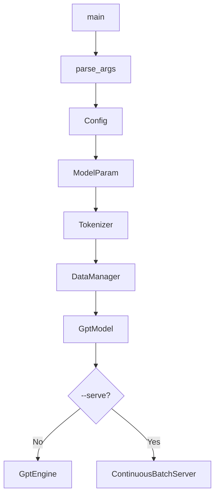
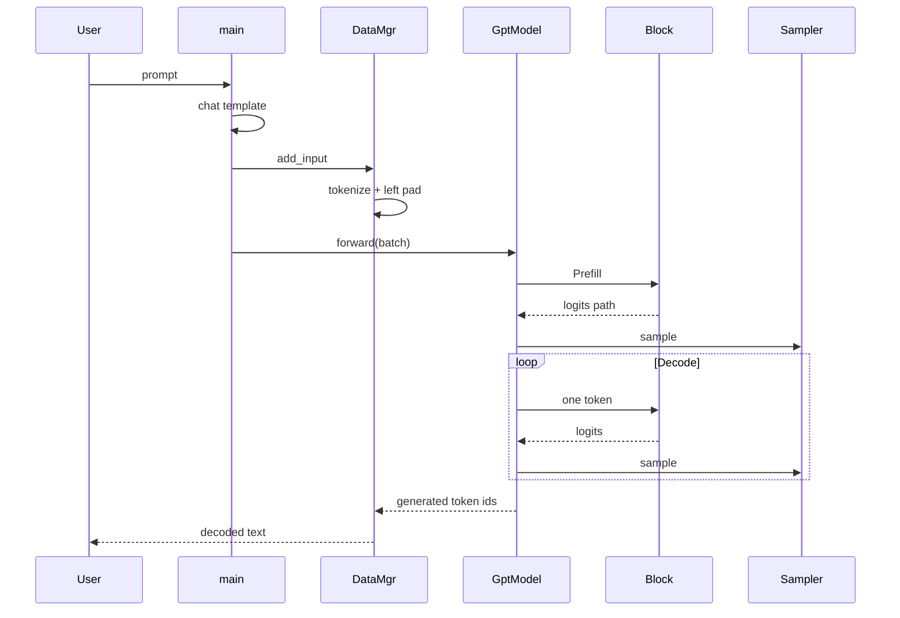
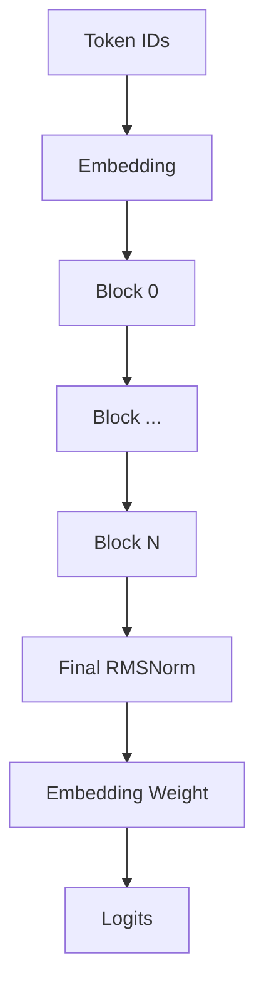

# easy_llm.cpp ��导读：�一� Prompt 到下一个 Token

> **本文生��求（整�版）**
>
> 通读 `eagle-dai/easy_llm.cpp` 仓库的代��README��建脚本和测试，在 `my/docs/` 下编写一份简体中文教程。教程需��读者视角组织知识，先建立最少必�背景，�沿真�代�路径�层深入；解释�个主�模�“�什么�为什么需��代�如何���容易误解什么�。术语�留英文，并在文末�供�汇表。对�无法�仓库确认的行为，优先核对官方文档或规范；��能确认时�确说�，�把�测写�事�。适�时使用 Mermaid，尤其是 sequence diagram，并�制图的宽度。内容必须�当�仓库代�一致。生��应�新检查结��事��代�路径和图表。
>
> �考写作链�由用户�供：`https://mp.weixin.qq.com/s/1hyhKlbni06xi2q1xIarZQ`。生��境未能��读�该页�，因此本文没有虚�或转述其中的具体内容，��循上�的�确写作�求。

---

## 0. 先说结论：这个项目到底是什么

`easy_llm.cpp` 是一个**自己��关键���程的微� C++ 大模���框�（LLM inference framework）**。

它当�默认�� **Qwen2.5-0.5B-Instruct**，核心目标�是追求 vLLM�TensorRT-LLM�llama.cpp 那样的�熟性能和模�覆盖，而是把一�大模���链路拆�能顺���读下�的模�：

```text
Prompt
  ↓
Chat Template
  ↓
Tokenizer / BPE
  ↓
Token IDs + Left Padding
  ↓
Embedding
  ↓
Transformer Blocks × N
  ├─ RMSNorm
  ├─ Self-Attention
  │  ├─ Q/K/V Projection
  │  ├─ RoPE
  │  ├─ GQA
  │  ├─ Causal / Padding Mask
  │  └─ KV Cache
  ├─ Residual
  ├─ RMSNorm
  ├─ Gated MLP
  └─ Residual
  ↓
Final RMSNorm
  ↓
Embedding Weight Tying → Logits
  ↓
Softmax
  ↓
Greedy / Top-K / Top-P Sampling
  ↓
Next Token
  ↓
继续 Decode，直到 EOS 或达到步数�制
```

第一次看到图里的缩写�需��下�查完所有定义。先有一个最��度的认识��：

- **BPE（Byte Pair Encoding）**：把文本切�模��表里的 token；
- **RMSNorm（Root Mean Square Layer Normalization）**：Transformer 中使用的归一化；
- **RoPE（Rotary Position Embedding）**：把�置信�作用到 Q/K；
- **GQA（Grouped Query Attention）**：Query heads 多�共享的 Key/Value heads；
- **KV Cache（Key-Value Cache）**：�存�� token 已计算好的 K/V，供 Decode �用；
- **EOS（End of Sequence）**：�列结� token。

这些概念��都会�到真�代��个展开。�在�需�知�它们��整�链路的什么�置。

项目还有第二��行路径：

```text
多个�续到�的请求
  ↓
Pending Queue
  ↓
Prefill Admission
  ↓
Active Requests
  ↓
�轮把�活跃的请求一起 Decode
  ↓
请求结� → 释放 KV Cache Slot
```

这就是 **Continuous Batching**。

如��记一件事，�以记：

> `easy_llm.cpp` 的价值在�：它把“LLM ��到底�生了什么�直�摊在 C++ 代�里，而�是把核心逻辑�在大�框�里。

---

## 1. ��阅读顺�

��� `src/cuda/ops/self_attn.cu` 开始。

那是整个仓库最��的区域之一，而且在�解 CPU baseline 之�读 CUDA kernel，容易�时被 Transformer�Tensor shape�memory layout 和 CUDA execution model 四件事淹没。

建议按下�顺�：

1. **先�行 CPU 版本**
2. 看 `src/main.cpp`
3. 看 `src/gpt_engine.cpp`
4. 看 `src/data_manager.cpp`
5. 看 `src/tokenizer.cpp` + `src/bpe.cpp`
6. 看 `src/models/gpt_model.cpp`
7. 看 `src/models/block.cpp`
8. 看 `src/models/self_attn.cpp`
9. 看 `src/models/mlp.cpp`
10. 看 `src/tensor.cpp` + `src/ops.cpp`
11. 看 `src/models/loader.cpp`
12. 看 Continuous Batching
13. 最�看 CUDA

这样�次��加一个新的概念。

### 1.1 �需�一次把 4000 行全部读完

这份文档既是教程，也是�续查��时的�考手册。第一次阅读时，�建议�头到尾�字读完。

�以分三�：

| 阅读阶段 | 建议�点 | 读完应该能�答什么 | �以暂时跳过 |
|---|---|---|---|
| 第一�：建立主线 | 第 2�6 节�第 14�17 节�第 29�32 节�第 45�50 节 | 一� Prompt �样�过 Tokenizer�模��Sampling ��新 Token？Prefill 和 Decode 为什么分开？ | Safetensors 细节�CUDA�严格 parity |
| 第二�：看懂模�内部 | 第 8�13 节�第 18�28 节�第 33�56 节 | Tensor shape �样�化？Attention�RoPE�GQA�KV Cache�MLP 分别�了什么？ | Continuous Batching�CUDA kernel |
| 第三�：�解工程化 | 第 57 节以� | 多请求�样调度？CPU/CUDA �样切�？测试在�护哪些 invariant？�样扩展项目？ | 无需强求一次记�所有��细节 |

第一���抓�下� 6 个问题：

1. 文本在哪里�� token IDs？
2. token IDs 在哪里�� hidden states？
3. 一个 Transformer Block 对 hidden states �了什么？
4. Prefill 为什么输入整段 Prompt，而 Decode �次�输入 1 个 token？
5. �� token 为什么�需��轮�新计算 K/V？
6. logits 最��样��一个 next token？

如�这 6 个问题还没有答案，��急�进入 CUDA。

---

## 2. 第一次�行：先�跑 CPU

### 2.1 �境�求

仓库当�的通用 CPU �建�求：

- C++17 compiler
- CMake >= 3.10
- OpenMP �选，默认�试开�
- 模�文件放在 `data/model/`

���建：

```bash
cmake -S . -B build \
  -DCMAKE_BUILD_TYPE=RelWithDebInfo \
  -DCMAKE_CXX_COMPILER=g++

cmake --build build --target easy_llm -j8
```

为什么建议先用 CPU？

因为代�以 CPU 路径作为 baseline：

- Tensor 行为容易追踪；
- `SelfAttn::forward_cpu()` 基本把 Attention 的步骤直�写出�；
- CUDA 是�件编译的�选�端；
- CUDA 失败时，部分算�还会�退 CPU。

### 2.2 模�文件

默认路径�自 `include/config.hpp`：

```text
data/model/
├── config.json
├── model.safetensors
├── tokenizer.json
└── tokenizer_config.json
```

默认适�的是：

```text
Qwen/Qwen2.5-0.5B-Instruct
```

这四个文件承担���责：

| 文件 | 作用 |
|---|---|
| `config.json` | 模�结��数，如 layer 数�head 数�hidden size�RoPE �数 |
| `model.safetensors` | 真正的模��� |
| `tokenizer.json` | vocab�BPE merges 等 tokenizer 数� |
| `tokenizer_config.json` | tokenizer 的附加é…u置；**当å‰� C++ 主è¦�读å�– special token / pad token，chat template 并没有ä»�这里动æ€�加载** |

### 2.3 最��行

```bash
./build/easy_llm --greedy "Hello"
```

也�以：

```bash
./build/easy_llm \
  --max-steps 128 \
  --temperature 0.7 \
  --top-p 0.9 \
  --top-k 40 \
  "Hello"
```

先看帮助：

```bash
./build/easy_llm --help
```

### 2.4 多� Prompt

Prompt 文件一行一�：

```text
Hello
Explain KV cache.
What is grouped query attention?
```

�行：

```bash
./build/easy_llm -f test/data/test_batch.txt
```

如�输入文件是：

```text
test/data/test_batch.txt
```

程�会生�：

```text
test/data/test_batch_output.txt
```

这件事是在 `src/main.cpp` 中通过 `stem + "_output" + ext` ��的。

---

## 3. 先建立最少必�背景

这一章�讲��读代�必须知�的东西。

### 3.1 LLM inference 本质上在�什么

对一个 Causal Language Model �说，一次生��以抽象�：

```text
已有 token
    ↓
Model Forward
    ↓
得到 vocabulary 中�个 token 的 logits
    ↓
Softmax
    ↓
得到 probability distribution
    ↓
Sampling
    ↓
选出一个 next token
    ↓
把 next token ��输入
    ↓
��
```

例如：

```text
输入 token: [A, B, C]
模�预测:   D

下一步：
输入��:   [A, B, C, D]
模�预测:   E
```

真正的优化点在�：

> 第二步生� `E` 时，没有必��新计算 A/B/C 对 Attention 的全部 Key 和 Value。

所以�有 **KV Cache**。

---

### 3.2 Prefill 和 Decode

这是�解仓库最��的一组术语。

#### Prefill

第一次把整段 Prompt 喂给模�：

```text
[A, B, C, D, E]
```

模�会一次计算这整段�列，并建立 KV Cache。

这�：

```text
Prefill
```

#### Decode

之��一步�输入刚生�的 1 个 token：

```text
[F]
```

然�：

```text
[G]
```

然�：

```text
[H]
```

��上下文通过 KV Cache �供，�需��次�新输入整个 Prompt。

这�：

```text
Decode
```

因此代�中�常看到：

```text
Prefill: [batch, seq_len, ...]
Decode:  [batch, 1, ...]
```

---

### 3.3 Logits�Softmax�Sampling

模�最��会直�说“下一个 token 是 123�。

它输出：

```text
logits = [
  token 0 的分数,
  token 1 的分数,
  ...
  token V-1 的分数
]
```

`V` 是 vocabulary size。

�过 Softmax �得到概�：

```text
probs = softmax(logits)
```

然�由 Sampler 决定选哪个 token。

仓库支�：

- Greedy
- Temperature
- Top-K
- Top-P

��会具体看代�。

---

### 3.4 Tensor shape 是读��的第一语言

LLM ��里，很多问题其��是数学问题，而是 shape 问题。

本文统一用：

```text
B = batch size
S = sequence length
H = hidden size
Nh = number of query attention heads
Nkv = number of key/value heads
D = head dimension
V = vocabulary size
I = MLP intermediate size
L = KV cache length
```

Qwen2.5-0.5B-Instruct 官方 `config.json` 的核心�数是：

```text
H   = 896
Nh  = 14
Nkv = 2
D   = 896 / 14 = 64
I   = 4864
V   = 151936
Layers = 24
```

因此 Q/K/V projection 刚完� split heads 时：

```text
Q: [B, 14, S, 64]
K: [B,  2, S, 64]
V: [B,  2, S, 64]
```

这里已�能看出 **GQA（Grouped Query Attention）**：Query 有 14 个 head，而 Key/Value �有 2 个 head。

在**本项目 CPU Attention ��**里，��会用 `repeat()` 把 K/V 临时扩展到� 14 个 Query heads 对应的形���矩阵计算。这个 `repeat()` 是当���选择，��把它误认为 GQA 定义本身�求“物��制 K/V�。

第一次读 shape 时，�以先记�这一�主链：

```text
token ids          [B, S]
    ↓ Embedding
hidden states      [B, S, H]
    ↓ Q/K/V projection + split heads
Q                  [B, Nh,  S, D]
K,V                [B, Nkv, S, D]
    ↓ Attention（结��� KV Cache）
attention output   [B, S, H]
    ↓ Blocks + final RMSNorm
final hidden       [B, S, H]
    ↓ output projection / weight tying
logits             [B, S, V]
```

��看到任何函数时，先问一�：**它把 shape �什么��什么？** 这通常比先钻进循�细节更容易找到主线。

---

## 4. 仓库地图：�个目录负责什么

```text
easy_llm.cpp/
├── CMakeLists.txt
├── README.md
├── README.zh-CN.md
├── build.sh
├── include/
│   ├── tensor.hpp
│   ├── ops.hpp
│   ├── tokenizer.hpp
│   ├── bpe.hpp
│   ├── data_manager.hpp
│   ├── sampler.hpp
│   ├── continuous_batch_server.hpp
│   ├── models/
│   └── cuda/
├── src/
│   ├── main.cpp
│   ├── tensor.cpp
│   ├── ops.cpp
│   ├── tokenizer.cpp
│   ├── bpe.cpp
│   ├── data_manager.cpp
│   ├── sampler.cpp
│   ├── gpt_engine.cpp
│   ├── continuous_batch_server.cpp
│   ├── models/
│   └── cuda/
├── test/
└── scripts/
```

�责�以先粗略记�：

| 模� | 负责什么 |
|---|---|
| `main.cpp` | 整个程�的入�和模�选择 |
| `cli_options.*` | CLI �数�Prompt 文件�Qwen chat template |
| `config.*` | � `config.json` 读模�结� |
| `tokenizer.*` | 文本 ↔ token |
| `bpe.*` | Byte-level BPE |
| `data_manager.*` | batch�tokenization�left padding�输出整� |
| `loader.*` | 读� Safetensors �� |
| `tensor.*` | 最� Tensor 容器 |
| `ops.*` | matmul�softmax�RoPE�concat 等 |
| `embedding.*` | token id → hidden vector；�时�用为 output projection |
| `linear.*` | Linear projection |
| `norm.*` | RMSNorm |
| `self_attn.*` | Self-Attention + RoPE + GQA + KV Cache |
| `mlp.*` | gated MLP |
| `block.*` | Attention + MLP + residual |
| `gpt_model.*` | Prefill / Decode 的核心编� |
| `sampler.*` | 选择 next token |
| `continuous_batch_server.*` | 多请求 Continuous Batching |
| `src/cuda/` | �选 CUDA backend |
| `test/` | �元测试和 invariant tests |

---

# 第一部分：先沿�一次请求走完整�链路

## 5. `main.cpp`：程�真正�哪里开始

`src/main.cpp` 是最适�进入仓库的文件。

它�的事情按顺�是：

```text
1. Parse CLI
2. 读 Prompt
3. Load Config
4. Load Model Weights
5. Create Tokenizer
6. Create DataManager
7. Create GptModel
8. Apply Chat Template
9. 选择：
   ├─ 普通 CLI inference
   └─ Continuous Batching service
```

### 5.1 主�程图



图中最值得注�的是：

> `GptModel` 在进入普通模�或�务模�之�已�建立。

也就是说，两�模�共享�一套模�计算逻辑，�是调度方���。

---

## 6. 一次普通 CLI 请求的 sequence



这里故�没有把 Self-Attention 内部全部展开。

先建立外层心智模�：

```text
main
  → DataManager
  → GptModel
  → Block
  → Sampler
  → DataManager decode
```

���进入 Block。

---

## 7. Chat Template：用户输入�是直��给模�

`src/cli_options.cpp` 中：

```cpp
std::string apply_chat_template(const std::string& user_query)
```

会把：

```text
你好
```

��类似：

```text
<|im_start|>system
You are Qwen, created by Alibaba Cloud. You are a helpful assistant.<|im_end|>
<|im_start|>user
你好<|im_end|>
<|im_start|>assistant
```

这�是装饰。

Instruction-tuned model 在训练时就是按��对�格�看到数�的。

如��行时格��一致，�使��完全正确，输出质�也�能�显下�。

### 7.1 当���的边界

这里的 chat template 是**代�中硬编�的 Qwen template**，并没有动�读� `tokenizer_config.json` 里的 `chat_template`。

因此当�模�适��际上�时�赖：

```text
模���兼容
+
�数 key 兼容
+
Tokenizer 兼容
+
Chat Template 兼容
```

��一个 `model.safetensors` 并��味�就自动支��一个模�系列。

---

# 第二部分：文本如何�� Token

## 8. `Tokenizer` 和 `Bpe` 的分工

这两个模���混在一起�解。

### `Tokenizer`

负责：

```text
完整 tokenizer 生命周期
```

包括：

- 加载 vocab；
- 加载 merges；
- 注册 special tokens；
- 找 pad token；
- text → tokens；
- tokens → ids；
- ids → tokens；
- ids → decoded text。

### `Bpe`

�负责：

```text
普通文本片段的 Byte-level BPE encode/decode
```

因此关系是：

```text
Tokenizer
  ├─ special-token handling
  ├─ vocab / id mapping
  └─ Bpe
       ├─ byte mapping
       ├─ merge ranks
       └─ BPE merge
```

---

## 9. 为什么需� Byte-level BPE

模��能直��� UTF-8 字符串。

它需�整数 ID：

```text
"hello"
   ↓
["hello"]
   ↓
[14990]
```

真�情况会更��：

```text
一个字符串
  ↓
UTF-8 bytes
  ↓
Byte-to-Unicode mapping
  ↓
BPE merge
  ↓
token strings
  ↓
vocab lookup
  ↓
token ids
```

Byte-level 的一个��价值是：

> 输入最终�以退到 byte 表示，��求�表��包�所有�能 Unicode 文本的完整“��。

---

## 10. `Bpe::apply_bpe()` 到底在�什么

`src/bpe.cpp` 的核心�路是：

1. 把输入拆�当� token �元；
2. 检查所有相邻 pair；
3. 找 merge rank 最优的 pair；
4. �并；
5. ��；
6. 直到没有��并 pair。

伪代�：

```text
chars = split(word)

while true:
    找到 rank 最�的相邻 pair
    if 没找到:
        break
    merge(pair)
```

`merge_ranks_` 的�义就是：

```text
哪个 pair 应该优先�并
```

而：

```cpp
bpe_cache_
```

用�缓存已� BPE 过的 word，����工作。

---

## 11. Special Token 为什么�能直�扔给普通 BPE

例如：

```text
<|im_start|>
```

对 Qwen �说这是一个有特殊语义的 token。

如�先按照普通文本拆�：

```text
<
|
im
_
start
|
>
```

就已�错了。

因此 `Tokenizer` 中的 `EncodingSession` 会：

1. 先扫� special token；
2. 普通片段交给 BPE；
3. special token �样�留；
4. �统一映射到 token ID。

---

## 12. 一个需�特别知�的 Tokenizer 兼容性边界

这里�能�看“结�大多数时候�是对的�。

官方 Transformers 当�的 `Qwen2Tokenizer` 使用专门的 pre-tokenization regex，�� ByteLevel pre-tokenizer。

仓库里的 `Bpe::encode_into()` 当�采用更简化的方法：

```cpp
std::istringstream iss(text);
while (iss >> word) {
    ...
}
```

这�味�它主�按 whitespace 拆普通文本。

两者**�是严格等价��**。

官方 Qwen2 pre-tokenization 会区分：

- 字�；
- æ•°å­—ï¼›
- 标点；
- �行；
- contractionsï¼›
- whitespace pattern。

这里尤其�注� `std::istringstream >> word` 的语义：普通文本片段中的�续 whitespace 会被当�分隔符，�行本身�会作为独立 tokenization pattern 被�留。Qwen chat template ��好大�使用�行，所以如�目标是严格��官方 token IDs，这�是一个�以忽略的�差异。

因此：

> 如�目标是学习��链路，这个��更容易读；如�目标是和 Hugging Face tokenizer � token-by-token 严格一致，需�专门建立 tokenizer parity tests。

这是当�代�最值得关注的兼容性点之一。

官方���核对：

```text
https://github.com/huggingface/transformers/blob/main/src/transformers/models/qwen2/tokenization_qwen2.py
```

---

## 13. BOS 行为也��独验�

`Tokenizer::tokens_to_ids()` 中当�逻辑是：

```cpp
if (bos_token_id_ >= 0) {
    token_ids.push_back(bos_token_id_);
}
```

而 `bos_token_id_` �自模� `config.json`。

Qwen2.5-0.5B-Instruct 的模� config 中：

```text
bos_token_id = 151643
```

但官方 `tokenizer_config.json` �时写�：

```text
add_bos_token = false
```

所以两边的行为并�天然等价。

这里最�适的�解是：

> `easy_llm.cpp` 当���选择了“�� config 里有有效 BOS，就自动�� BOS�的规则；它�是完整�制 Hugging Face tokenizer 的 `add_bos_token` 语义。

如��数值 parity，对输入 token IDs 的第一项��点检查。

---

# 第三部分：Batch � Left Padding

## 14. `DataManager` 为什么存在

`DataManager` 并�是��网络的一层。

它解决的是：

```text
应用输入数�
     ↓
�样整��模�需�的 batch
```

�责包括：

- �存输入；
- tokenizeï¼›
- �存 `seq_len`；
- 计算 `pad_len`；
- left paddingï¼›
- �存生� token；
- 最� decode 输出。

---

## 15. 为什么 batch 需� padding

�设两个 Prompt token 长度��：

```text
A: [11, 12, 13, 14]
B: [21, 22]
```

�放进�一个矩形 Tensor：

```text
[B, S]
```

就必须补�。

仓库使用 **left padding**：

```text
A: [11, 12, 13, 14]
B: [ P,  P, 21, 22]
```

其中 `P` 是 pad token。

此时：

```text
A.seq_len = 4
A.pad_len = 0

B.seq_len = 2
B.pad_len = 2
```

---

## 16. Left Padding 最容易��的问题：position

如��是 left pad：

```text
[P, P, 21, 22]
```

然�直�把数组 index 当 position：

```text
P  -> 0
P  -> 1
21 -> 2
22 -> 3
```

那么 token `21` 的真��列 position 被错误地当�了 2。

仓库的处�方法是：

```cpp
prefill_offset = -pad_len
```

所以对� B：

```text
pad_len = 2
offset = -2
```

RoPE 使用：

```text
position = j + offset
```

�是：

```text
j=2 → position=0
j=3 → position=1
```

真� token 的 position 被还�了。

这是：

```cpp
generation::build_prefill_pos_offsets()
```

存在的���因。

---

## 17. Padding 还需� Mask

�置修正还�够。

Attention 也�能看到左边的 pad token。

因此 `SelfAttn` �时应用：

- causal maskï¼›
- valid length maskï¼›
- padding mask。

Padding mask 会把 pad 对应的 attention score 设�：

```text
-inf
```

Softmax ��近：

```text
0
```

所以 pad ���有效 Attention。

---

# 第四部分：模����么� Safetensors 进入 C++

## 18. `ModelParam` �什么

模���文件�能有数百 MB。

`src/models/loader.cpp` 负责：

```text
model.safetensors
       ↓
读� header
       ↓
找到�个 tensor 的 dtype / shape / byte range
       ↓
加载为 Tensor
       ↓
放入 ModelParam
```

---

## 19. Safetensors 文件格��需�先知�三件事

官方 Safetensors 格�的开头是：

```text
8 bytes
  ↓
header length N
  ↓
N bytes JSON header
  ↓
tensor data bytes
```

JSON 中�个 tensor 大致类似：

```json
{
  "model.layers.0.self_attn.q_proj.weight": {
    "dtype": "BF16",
    "shape": [896, 896],
    "data_offsets": [BEGIN, END]
  }
}
```

仓库的 parser 正是按这个结�读�。

官方格�说�：

```text
https://github.com/huggingface/safetensors
```

---

## 20. 为什么这里用 `mmap`

代��是先：

```text
ifstream → 整个文件�制进一个巨大 buffer
```

而是 POSIX：

```cpp
open(...)
fstat(...)
mmap(...)
```

这样进程得到一个映射到文件内容的虚拟地�区域。

然�根� Safetensors header 的 offsets �读�个 tensor。

这里�注�：

> 当� loader 使用 `sys/mman.h`�`unistd.h` 等 POSIX API，因此���是�生 Windows portability 设计。

在 Windows 上如��是 WSL / Linux environment，就需��外适�文件映射层。

---

## 21. 当� loader 支�哪些 dtype

代��确支� source dtype：

```text
BF16
F16
F32
```

编译时默认：

```text
USE_BF16
```

�自 `CMakeLists.txt`：

```cmake
target_compile_definitions(easy_llm_core PUBLIC ... USE_BF16)
```

如� source dtype 和 target dtype 一致，就�以直��制 tensor bytes。

�则会�元素 decode，�转��项目的 `data_type`。

---

## 22. 为什么模�加载�还需�“�数契约�

�� Safetensors 文件能解�，�代表模�能正确�行。

例如：

```text
Q projection 本�应该 [896, 896]
结��际是 [512, 896]
```

文件�然完全�法。

所以项目在真正把�数�入层之�执行：

```cpp
validate_model_params_before_load(...)
```

它会检查：

- 必需 key 是�存在；
- rank 是�正确；
- Q/K/V/O shapeï¼›
- Norm shapeï¼›
- MLP 上下投影的 shape 关系；
- hidden size 是�能整除 num heads。

这样“模�文件�法��“模���匹��被分开验�。

这是很��的工程设计。

---

## 23. `LayerKeyPrefix` 为什么存在

��模�的 checkpoint �数命��能��。

Qwen2 使用：

```text
model.layers.0.self_attn.q_proj.weight
model.layers.0.self_attn.k_proj.weight
...
```

如�把这些字符串散�到�个 Layer 类里，以��模�会很难维护。

�是项目抽出：

```cpp
LayerKeyPrefix
```

当���会根�：

```text
architecture
model_type
```

判断是��� Qwen2 family。

如��是，直�抛出 unsupported error。

所以目�：

> 这�是一个“任何 Hugging Face model.safetensors 都能直�加载�的通用 loader。

Safetensors loader 本身比较通用，但**模��数语义和结� dispatch 当����了 Qwen2 family**。

---

## 24. `take_param()` 为什么加载�把 key 删除

`ModelParam::take_param()` �：

```text
找到 Tensor
  ↓
move 出�
  ↓
� params_ erase
```

这个设计有两个作用：

### 作用 1：所有�更清晰

��被模�层拿走�：

```text
ModelParam ���留第二份逻辑所有�
```

### 作用 2：�以知�有哪些�数没有被消费

所有 Layer 都加载完�：

```cpp
validate_no_remaining_model_params(model_param);
```

会检查剩余 key。

当�代�的行为需�说准确：

- **缺失 required key** → error / throw
- **shape �匹�** → error / throw
- **加载�还有�外未消费��** → `warn`，�会阻止�行

所以 leftover check 是诊断信�，�是 hard gate。

---

# 第五部分：Tensor � Ops

## 25. `Tensor` 是什么

`Tensor` 的内部结��常直�：

```cpp
std::vector<data_type> data_;
std::vector<int> shape_;
```

也就是：

```text
一段�续元素
+
shape metadata
```

例如：

```text
shape = [2, 3]
data  = [a,b,c,d,e,f]
```

逻辑上代表：

```text
[a b c
 d e f]
```

项目没有��大�框�那套�� Tensor runtime。

这使��更容易追，但也�味�一些�作会真的�制数�。

---

## 26. `reshape()` � `transpose()` 的差别

### `reshape()`

�改 shape：

```cpp
shape_ = new_shape;
```

并检查元素总数是�一致。

### `transpose()`

当���会：

1. �存旧 data；
2. 计算 old/new strides；
3. �元素计算新�置；
4. �� `data_`。

所以它�是 PyTorch 那�常�的“�生�一个 stride view�。

这很��，因为阅读性能时�能�设：

```text
transpose ≈ free
```

在这个��里它会产生真�的���本。

---

## 27. `ops::matmul_3d()` 的 shape 约定

�设：

```text
input  = [B, S, in_dim]
weight = [out_dim, in_dim]
```

结�：

```text
output = [B, S, out_dim]
```

这正好符� Hugging Face checkpoint 常� Linear weight layout：

```text
[out_features, in_features]
```

所以 `Linear::forward()` �需�先永久转置模���。

---

## 28. BF16 存储，�等�所有计算都用 BF16 累加

CPU `matmul_3d` 的�法大致是：

```text
BF16 input
   ↓ convert
FP32

BF16 weight
   ↓ convert
FP32

FP32 multiply + accumulate
   ↓
cast back
BF16 output
```

这比直�用 BF16 �累加稳定。

`ops::softmax()` 也会输出：

```text
std::vector<float>
```

也就是说 sampling 看到的是 FP32 probabilities。

---

# 第六部分：真正进入 Transformer

## 29. `GptModel` 的总体结�

`GptModel` 主�拥有：

```text
Embedding
Blocks × num_layers
Final RMSNorm
Sampler
LayerKeyPrefix
KV Cache indirectly in each SelfAttn
```

�以画�：



最�一步值得特别注�。

---

## 30. 为什么输出�调用 `embedding_->forward(output)`

`GptModel::forward_logits()` 最�：

```cpp
output = embedding_->forward(output);
```

第一眼很容易误解：

> 为什么已��过 Embedding，��一次 Embedding？

其� `Embedding` 有�� overloadS。
