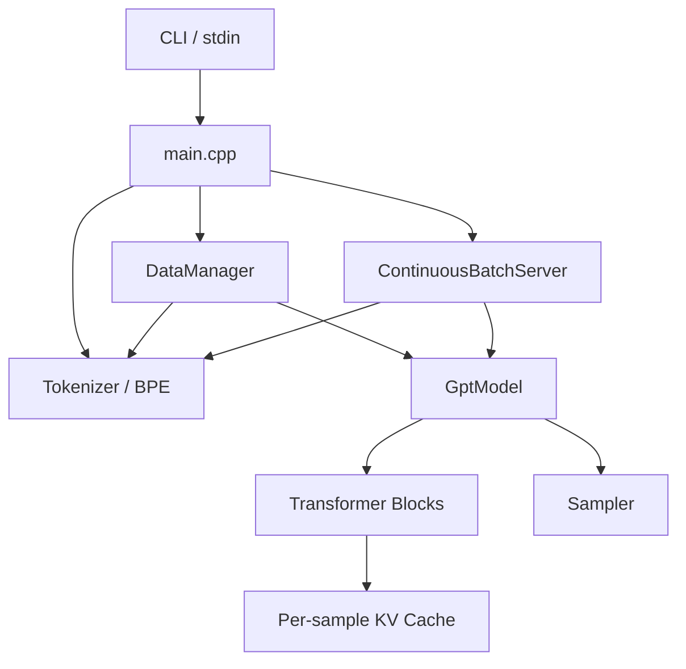
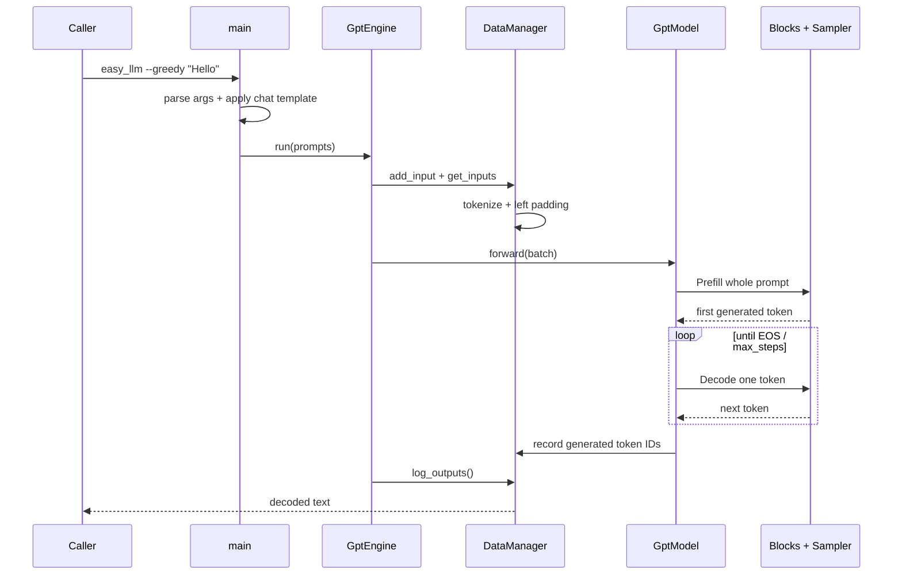
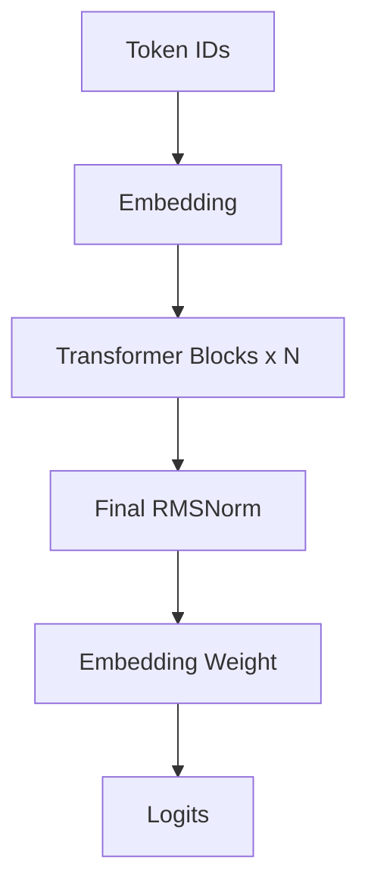
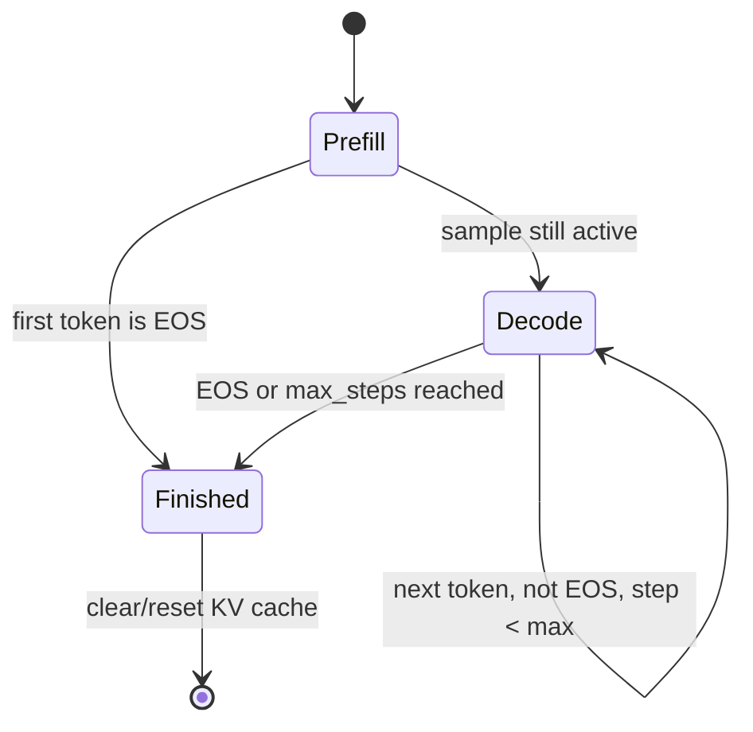
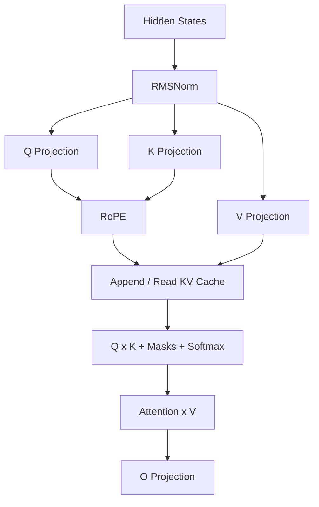
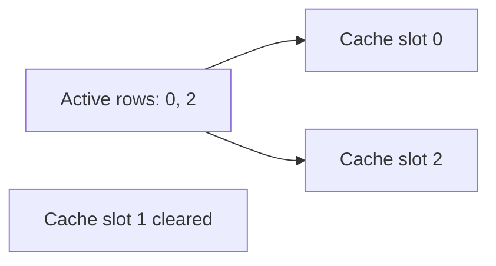
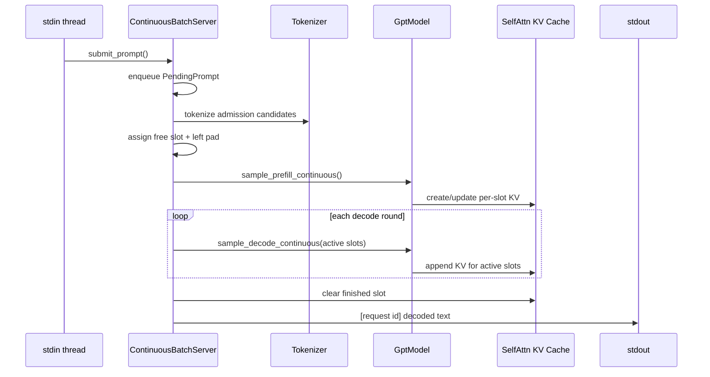
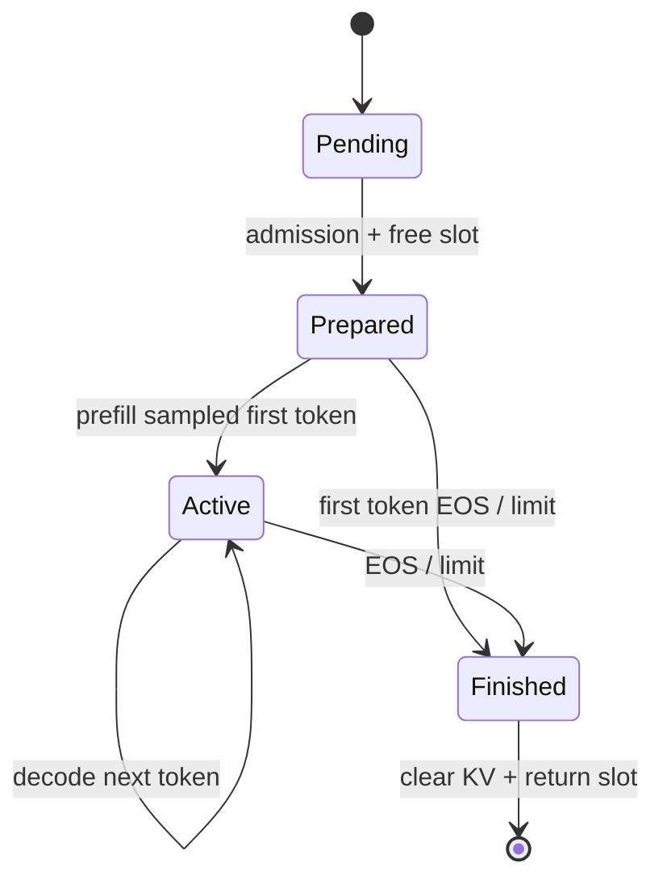
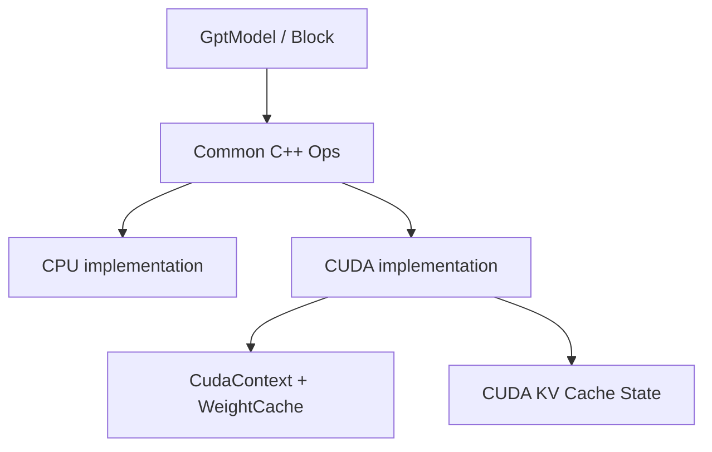

# easy_llm.cpp 教学式源码教程：从一条 Prompt 到 Continuous Batching

> **生成与核验要求（精简版）**
>
> 本文按“读者需要依次理解什么”而不是按目录组织；先建立整体心智模型和一条真实 Golden Path，再逐步深入关键源码、状态所有权、Prefill/Decode、Attention/KV Cache、Continuous Batching、CPU/CUDA 边界、错误处理和测试。事实优先级为 executable code → configuration → tests → repository documentation；发现冲突时明确指出 documentation drift。代码片段只保留理解当前问题所需的最小部分。Mermaid 图必须与当前代码一致，并在图后说明最需要记住的结论。
>
> **核验日期：2026-08-26**  
> **核验代码快照：`release@460f99efab5a31883adda373fbcc428991ca08b8`**

---

## 0. 先建立一个正确预期：这个项目到底是什么

`easy_llm.cpp` 是一个用于**学习和验证 LLM inference（大语言模型推理）完整链路**的微型 C++ 框架。

它当前默认适配 **Qwen2 family**，仓库示例使用 **Qwen2.5-0.5B-Instruct**。它自己实现了从模型文件到文本生成所需的大部分关键步骤：

```text
Prompt
→ Chat Template
→ Tokenizer / BPE
→ Token IDs
→ Embedding
→ Transformer Blocks
→ Logits
→ Softmax + Sampling
→ Next Token
→ 继续 Decode
```

同时，它还实现了一条更接近真实 serving 场景的 **Continuous Batching（连续批处理）** 路径：请求可以持续进入，已经进入 Decode 的请求和刚到达的新请求会在同一个长期运行的调度循环里推进。

但先把边界说清楚：

- 它不是 `llama.cpp`、vLLM、TensorRT-LLM 的替代品；
- 它优先考虑**代码可读性、推理正确性和架构可理解性**，不是极致吞吐；
- `--serve` 当前是一个 **stdin/stdout 长驻进程**，不是 HTTP server；
- 当前没有网络 API、authentication（认证）、authorization（授权）、请求持久化、retry、idempotency key 或 token streaming；
- CPU 是最容易读懂的 baseline，CUDA 是可选 backend。

因此，读这个项目最有价值的问题不是“它比成熟框架快多少”，而是：

> **一个 Prompt 在一个相对小、能顺着源码读完的 C++ 系统里，究竟怎样一步一步变成新的 token？多请求时，这套状态又怎样被管理？**

---

# 第一部分：先看懂整个系统

## 1. 只记住 6 个核心角色

第一次进入仓库，不需要先认识几十个 `.cpp` 文件。先只记住下面 6 个角色：

| 角色 | 最简单的职责 | 主要源码 |
|---|---|---|
| `main` | 组装系统，决定单次模式还是 `--serve` | `src/main.cpp` |
| `DataManager` | 单次模式下管理输入、padding 和生成结果 | `src/data_manager.cpp` |
| `Tokenizer` / `Bpe` | 文本 ↔ token / token id | `src/tokenizer.cpp`, `src/bpe.cpp` |
| `GptModel` | 编排 Prefill / Decode，并调用模型层 | `src/models/gpt_model.cpp` |
| `Block` / `SelfAttn` / `MLP` | 真正执行 Transformer 计算，并维护 KV cache | `src/models/*.cpp` |
| `ContinuousBatchServer` | `--serve` 模式下管理 pending/active 请求和 cache slot | `src/continuous_batch_server.cpp` |

先不要把 `Tensor`、Safetensors、RoPE、GQA、CUDA kernel 一次全展开。它们都能等到主链路走到那里时再解释。

## 2. 整体 Architecture Diagram



**这张图最需要记住什么：**

`GptModel` 是模型执行的中心，但它**不拥有所有请求生命周期状态**。单次模式的输入/输出状态主要在 `DataManager`；服务模式的 pending/active/request output 状态主要在 `ContinuousBatchServer`；真正的历史 Attention 状态——KV cache——则保存在每一层 `SelfAttn` 中。

这三个 state owner 后面会反复出现。

---

## 3. 第一条 Golden Path：`./build/easy_llm --greedy "Hello"`

先只跟一条最普通的单次请求。

### 3.1 从用户视角看，它发生了什么



**这张图最需要记住什么：**

一条请求并不是“Tokenizer → 模型 → 返回字符串”这么简单。当前单次模式里：

1. `GptEngine` 只负责 orchestration（编排）；
2. `DataManager` 负责把文本准备成 batch，并拥有输出记录；
3. `GptModel` 负责 Prefill / Decode 的生成循环；
4. `SelfAttn` 在每层保存 KV cache；
5. 最终文字是 `DataManager` 根据积累的 token IDs 再 decode 出来的。

### 3.2 对应真实源码

入口在 `src/main.cpp`：

```cpp
easy_llm::GptEngine gpt_engine{
    move(gpt_model), move(config), move(data_manager)
};
gpt_engine.run(prompts, output_path);
```

`src/gpt_engine.cpp` 的核心只有几步：

```cpp
for (const string& prompt : prompts) {
    data_manager_->add_input(InputSample{prompt});
}
auto batch = data_manager_->get_inputs();
model_->forward(batch);
data_manager_->log_outputs(output_path);
```

这段代码很值得先看，因为它暴露了一个重要设计边界：

> `GptEngine` 不做 Transformer 计算，也不做 Tokenizer 细节。它只把“输入准备 → 模型执行 → 输出整理”串起来。

这也是为什么不应该把所有逻辑都塞进 `main.cpp` 或 `GptEngine`。

---

## 4. 到这里应该已经能说清楚什么

读到全文大约前 20% 前，希望先停下来确认下面四件事：

1. 这个项目的目标是**把 LLM inference 的关键机制用可读 C++ 展开**；
2. 单次请求的主链是 `main → GptEngine → DataManager → GptModel → Blocks/Sampler → DataManager`；
3. Prefill 处理完整 Prompt，Decode 后续每轮只喂一个新 token；
4. 请求状态不是集中放在一个“万能对象”中，而是按职责分散在 `DataManager`、`ContinuousBatchServer` 和各层 `SelfAttn`。

如果这四点已经清楚，再进入下面的实现细节会容易很多。

---

# 第二部分：从输入开始逐层进入源码

## 5. `main.cpp`：它为什么只是 Composition Root

`src/main.cpp` 可以理解为 **composition root（对象组装入口）**：它负责创建对象、连接依赖、选择运行模式，而不是承担模型算法。

启动时大致做这些事情：

```text
parse CLI
→ Config::load_config()
→ CLI 参数覆盖 sampling 配置
→ ModelParam::load(model.safetensors)
→ Tokenizer::create()
→ DataManager
→ GptModel::create()
→ apply_chat_template()
→ 单次 GptEngine 或 ContinuousBatchServer
```

这种拆分的好处是：

- CLI 参数解析变化，不需要修改 Attention；
- 模型权重加载变化，不需要修改调度器；
- Continuous Batching 可以复用同一个 `GptModel`；
- CUDA backend 可以藏在算子/模型组件下面，而不污染 `main`。

### 5.1 一个容易忽略的覆盖关系

`Config` 自己有 sampling 默认值，例如 `temperature=1.0`，但正常 CLI 启动时，`main.cpp` 会无条件用 `CliOptions` 覆盖：

```cpp
config->temperature = options.temperature;
config->top_p = options.top_p;
config->top_k = options.top_k;
```

而 `CliOptions` 默认是：

```text
temperature = 0.8
top_p      = 0.95
top_k      = 20
seed       = 42
```

所以实际命令行默认行为要看 `include/cli_options.hpp`，不能只看 `include/config.hpp`。

---

## 6. Chat Template：模型看到的不是原始 `Hello`

`src/cli_options.cpp` 里的 `apply_chat_template()` 当前是硬编码的 Qwen chat template：

```text
<|im_start|>system
You are Qwen, created by Alibaba Cloud. You are a helpful assistant.<|im_end|>
<|im_start|>user
Hello<|im_end|>
<|im_start|>assistant
```

这意味着用户输入 `Hello` 后，Tokenizer 真正处理的是上面整段文本。

### 为什么单独强调它

因为它直接影响三个后续问题：

- Prompt token 数比肉眼看到的 `Hello` 多很多；
- `max_steps` 的实际可生成空间会被这段模板占用；
- 换模型不能只换 `model.safetensors`，chat template 也可能要适配。

### 当前实现边界

虽然模型目录里有 `tokenizer_config.json`，当前 C++ **没有动态读取其中的 chat template 来渲染对话**。Chat template 就写死在 `apply_chat_template()` 中。

这是一个明确的 model-adaptation boundary（模型适配边界），后面扩展其他模型家族时必须考虑。

---

## 7. Tokenizer：文本怎样变成模型能吃的整数

### 7.1 先只理解接口

`Tokenizer` 做两类转换：

```text
文本
→ tokens
→ token IDs
```

以及反方向：

```text
token IDs
→ tokens
→ 文本
```

`src/tokenizer.cpp` 启动时从两个文件读数据：

| 文件 | 当前代码实际读取什么 |
|---|---|
| `tokenizer.json` | `model.vocab`、`model.merges` |
| `tokenizer_config.json` | `added_tokens_decoder`、special tokens、pad token |

### 7.2 BPE 是什么

BPE（Byte Pair Encoding，字节对合并编码）在这里负责把普通文本切成词表里的 token。

`src/bpe.cpp` 的核心过程可以概括成：

```text
UTF-8 text
→ byte-level mapping
→ 按 merge rank 反复合并相邻片段
→ token strings
```

代码还维护 `bpe_cache_`，避免同一个片段重复执行合并过程。

### 7.3 Special Token 为什么绕开普通 BPE

像 `<|im_start|>` 这样的特殊字符串不能被普通 BPE 随意拆碎。因此 `EncodingSession` 会先找到 special token，把普通文本片段交给 BPE，而 special token 本身直接作为一个 token 保留。

这就是 `Tokenizer` 和 `Bpe` 没有合并成一个大类的原因之一：

- `Bpe` 负责普通文本编码算法；
- `Tokenizer` 负责 vocabulary、special token、BOS/PAD 和 ID 映射这些模型级规则。

### 7.4 当前 Tokenizer 不是通用 Hugging Face runtime

它读取 Hugging Face 风格的 tokenizer 数据，但它是仓库自己的简化 C++ 实现。尤其普通文本预切分逻辑来自当前 `Bpe::encode_into()`，不应该把它理解成“完整复刻任意 Hugging Face tokenizer pipeline”。

对默认 Qwen2.5 示例，代码和测试围绕当前实现建立；如果要换 tokenizer 类型，需要先验证 parity，而不是只改文件路径。

---

## 8. `DataManager`：为什么需要左侧 Padding

多条 Prompt 一起推理时，长度通常不同：

```text
A: [11, 12]
B: [21, 22, 23, 24]
```

矩阵计算希望形成规则 batch，因此 `DataManager::get_inputs()` 会把短序列在**左边**补 PAD：

```text
A: [PAD, PAD, 11, 12]
B: [ 21,  22, 23, 24]
```

同时它保存：

```text
seq_len = 原始真实 token 数
pad_len = 补了多少个 PAD
```

测试 `test/data_manager_invariants_test.cpp` 就专门保护这件事。

### 为什么不是把 padding 当无关紧要的预处理

因为后面的 RoPE position 和 Attention mask 都依赖 `pad_len`：

- position 不能把 PAD 当成真实第 0、1 个 token；
- Attention 不能让真实 token 看见 PAD；
- 每个 sample 的实际长度必须独立维护。

所以 `pad_len` 是生成正确性的状态，不只是为了把矩阵凑齐。

---

# 第三部分：模型启动——配置和权重怎样进入 C++ 对象

## 9. `Config`：模型结构参数来自哪里

默认路径在 `include/config.hpp`：

```text
data/model/config.json
data/model/model.safetensors
data/model/tokenizer.json
data/model/tokenizer_config.json
```

`Config::load_config()` 会从 `config.json` 读取例如：

- `num_hidden_layers`
- `num_attention_heads`
- `num_key_value_heads`
- `hidden_size`
- `vocab_size`
- `max_position_embeddings`
- `bos_token_id` / `eos_token_id`
- `rope_theta`
- `architectures`
- `model_type`

这些值决定后面到底创建多少层 Block、每层多少 Attention head，以及权重 shape 应该是什么。

一个错误处理细节：如果 `config.json` 打不开，`load_config()` 当前记录 error 后直接 return，并不会当场 throw；后面 `GptModel` 或参数校验通常会因为关键字段仍是 0 而失败。

---

## 10. Safetensors Loader：`mmap` 不等于零拷贝推理

`src/models/loader.cpp` 直接解析 Safetensors：

```text
open file
→ mmap whole file
→ read 8-byte header length
→ parse JSON header
→ validate dtype / shape / offsets
→ copy or convert tensor data into Tensor
→ unmap file
```

支持读取源 dtype：

```text
BF16 / F16 / F32
```

当前标准 CMake 构建会定义 `USE_BF16`，所以运行时 `data_type` 默认是 BF16。

### 一个常见误解

Loader 使用 `mmap()`，但这不代表后续推理直接引用 mmap 的文件内存。

`load_tensor()` 最终会把权重装进自己的 `Tensor`；`MMapGuard` 离开加载函数后就会 `munmap`。因此当前设计是：

> `mmap` 用于方便、安全地读取权重文件；模型运行时仍然拥有自己的权重内存。

---

## 11. `ModelParam`：为什么加载后还要“消费掉”权重

`ModelParam` 启动时暂时保存：

```text
weight name → Tensor
```

真正模型组件加载时使用：

```cpp
Tensor ModelParam::take_param(const string& key)
```

`take_param()` 会**move 出 Tensor，然后从 map 删除这个 key**。

这样有两个好处：

1. 每个权重最终应该明确归属于某个模型组件；
2. 加载结束后可以检查还有哪些权重没有被消费。

`validate_no_remaining_model_params()` 当前对剩余权重是 warning，不会失败。

这是一种很实用的启动期 ownership 检查。

---

## 12. `LayerKeyPrefix`：它是一个很小的模型适配层

Qwen 权重名称类似：

```text
model.layers.0.self_attn.q_proj.weight
model.layers.0.mlp.up_proj.weight
model.norm.weight
```

如果这些字符串散落在所有模型组件里，换一个命名体系会非常痛苦。

`LayerKeyPrefix` 把“逻辑组件”转换成“模型文件中的具体 key”。当前 `create_layer_key_prefix()` 只接受 Qwen2 family：

```text
architecture contains "qwen2"
或 model_type == "qwen2"
```

否则直接 throw。

所以它是一个真实存在的 extensibility seam（扩展缝隙），但还不能称为通用 plugin/provider framework。

---

## 13. 参数校验为什么放在真正 load 之前

`validate_model_params_before_load()` 会检查：

- 必需 key 是否齐全；
- embedding 是否 `[vocab_size, hidden_size]`；
- Q/K/V/O projection shape 是否和 head 配置一致；
- RMSNorm shape 是否正确；
- MLP 的 up/gate/down 中间维度是否一致。

例如 GQA（Grouped Query Attention，分组查询注意力）下：

```text
Q output = hidden_size
K/V output = num_key_value_heads × head_dim
```

如果模型文件和配置不匹配，最好在模型正式运行前给出明确错误，而不是几百次矩阵运算以后才出现越界或 shape mismatch。

---

# 第四部分：真正的生成引擎——Prefill 和 Decode

## 14. `GptModel` 不只是“一个 Transformer”

`GptModel` 同时承担两层职责：

1. **model graph orchestration**：Embedding → Blocks → Norm → logits；
2. **generation orchestration**：Prefill → sampling → Decode loop → EOS filtering。

因此第一次读 `gpt_model.cpp` 时，建议把这两层分开看。

## 15. Model Graph：一次 `forward_logits()` 做什么



**这张图最需要记住什么：**

当前没有在执行路径里使用独立的 `lm_head` 对象。最终 `norm` 后的 hidden states 再调用 `Embedding::forward(Tensor)`，与同一份 embedding weight 做矩阵乘得到 logits，这就是 **weight tying（输入 embedding 与输出投影共享权重）**。

`include/models/gpt_model.hpp` 中目前还保留一个 `out_linear_` 成员，但真实调用链没有使用它。读架构时应该跟 executable code，而不是看到成员名就推断它参与了运行。

---

## 16. 为什么必须区分 Prefill 和 Decode

假设 Prompt 已经有 100 个 token。

### Prefill

第一次前向要处理完整 Prompt：

```text
[t0, t1, t2, ... t99]
```

目的不只是预测 `t100`，还要把每一层历史 token 的 K/V 保存到 KV cache。

### Decode

已经生成 `t100` 后，下一轮只需要输入：

```text
[t100]
```

历史 `t0...t99` 的 K/V 已经在 cache 中，不需要重新算。

因此 Decode 每轮只计算一个新 token 的 Q/K/V，然后把新的 K/V append 到 cache。

---

## 17. 生成状态机



**这张图最需要记住什么：**

“生成结束”不只是停止 while loop。EOS 还会导致对应 sample 从 active set 中移除，并清理它的 KV cache；一个 batch 中其他 sample 可以继续 Decode。

---

## 18. `GenerationContext`：单次模式下生成状态放在哪里

`GptModel::GenerationContext` 维护：

```text
batch_size
input_seq_len
max_steps
step
sample_ids
next_generated_tokens
pad_lens
pos_lens_by_sample
```

其中最重要的是三个向量：

### `sample_ids`

当前仍然活跃的原始 sample 身份。

例如开始：

```text
[0, 1, 2]
```

sample 1 先遇到 EOS 后：

```text
[0, 2]
```

它不是“当前 batch row 永远等于 sample id”。

### `next_generated_tokens`

每个 active sample 下一轮 Decode 要喂回模型的那个 token。

### `pos_lens_by_sample`

每个 sample 自己已经走到的真实 position。

这种分离是后面支持变长 batch 的基础。

---

## 19. `max_steps`：这里存在一个重要 documentation drift

CLI help 和 README 把 `--max-steps` 描述成类似“maximum generation steps”。但当前代码的语义更接近：

> **总 position / step ceiling，而不是常见 API 中的 `max_new_tokens`。**

原因在 `GptModel::prefill()`：

```cpp
ctx.next_generated_tokens = sample_and_record_last_token(...);
ctx.step = ctx.input_seq_len;
```

Prefill 已经产生第一个新 token，然后 Decode 条件是：

```cpp
while (ctx.step < ctx.max_steps) {
    ...
    ctx.step += 1;
}
```

所以一个输入实际最多生成的新 token 数大致是：

```text
max_steps - input_seq_len + 1
```

Continuous Batching 也直接写出了相同公式：

```cpp
max_generate_tokens = std::max(1, config_.max_steps - seq_len + 1);
```

这也是为什么前面强调 chat template：模板本身会增加 `input_seq_len`。

如果输入已经接近或超过 `max_steps`，当前实现仍会在 Prefill 采样第一个 token，因此它和常见的 `max_new_tokens` API 语义不能混用。

---

# 第五部分：进入一个 Transformer Block

## 20. Block 的真实计算顺序

`src/models/block.cpp` 非常短，适合在读 `SelfAttn` 前先看：

```cpp
auto output_attn = self_attn_.forward(input, sample_ids, pos_offsets);
ops::add_inplace(output_attn, input);
auto output = mlp_.forward(output_attn);
ops::add_inplace(output, output_attn);
```

但 `RMSNorm` 在 `SelfAttn` 和 `MLP` 内部，因此完整逻辑是：

```text
input
→ RMSNorm
→ Self-Attention
→ + residual(input)
→ RMSNorm
→ gated MLP
→ + residual
```

这里是典型 pre-norm Transformer 结构。

---

## 21. Attention 先只看数据流



**这张图最需要记住什么：**

Self-Attention 里最难理解的不是 `Q × K` 公式，而是**历史 K/V 怎样按 sample 保存、当前 active batch 怎样重新拼出来、padding/position 又怎样保持正确**。这正是这个仓库最值得深入读的部分之一。

---

## 22. Shape 跟踪：把 Attention 看成几次形状变化

设：

```text
B = batch size
S = 当前输入 sequence length
H = num_heads
HKV = num_key_value_heads
D = head_dim
hidden = H × D
```

开始：

```text
input: [B, S, hidden]
```

投影后：

```text
Q: [B, S, H × D]
K: [B, S, HKV × D]
V: [B, S, HKV × D]
```

`split_head().transpose()` 后：

```text
Q: [B, H,   S, D]
K: [B, HKV, S, D]
V: [B, HKV, S, D]
```

当前 CPU 实现随后会把 K/V heads 物理 repeat 到 H：

```text
K/V: [B, H, S, D]
```

这就是当前 GQA 实现方式：逻辑上多个 Query heads 共享较少的 K/V heads；CPU baseline 为了代码简单，直接 materialize repeat 后再做普通多头 Attention。

---

## 23. RoPE：为什么左 padding 之后 position 还能正确

RoPE（Rotary Position Embedding，旋转位置编码）会根据 position 旋转 Q/K。

问题来了：

```text
PAD PAD real0 real1 real2
```

如果直接用数组下标：

```text
0   1   2     3     4
```

那 `real0` 会被错当成 position 2。

当前代码在 Prefill 构造：

```cpp
offset = -pad_len;
```

例如 `pad_len=2`：

```text
数组位置: 0  1  2  3  4
offset:   -2 -2 -2 -2 -2
RoPE pos: -2 -1 0  1  2
```

真正参与 Attention 的 PAD 会被 mask 掉，而真实 token 从 position 0 开始。

Decode 时则使用：

```text
pos_lens_by_sample[sample_id]
```

所以不同长度的 sample 可以各自保持自己的 position。

测试 `generation_invariants_test.cpp` 明确保护了这些 offset 规则。

---

## 24. Attention Mask 不只有一种

CPU `SelfAttn` 会依次处理三类约束：

### Causal Mask

Prefill 时，token 不能看未来 token。

### Valid-length Mask

不同 sample 的 KV cache 长度不同。为了临时拼成规则 batch，短 cache 尾部会补 0，但这些补出来的区域必须设成 `-inf`，不能参与 softmax。

### Padding Mask

Prompt 左侧真实 PAD 也不能被 Attention 看见。

这三种 mask 解决的是三个不同问题，不应该混成“一个 padding mask”。

---

# 第六部分：KV Cache——理解这个项目的关键

## 25. KV Cache 到底保存在哪里

每一个 `SelfAttn` 实例，也就是**每一个 Transformer layer**，都有自己的：

```text
cache_k_by_sample_
cache_v_by_sample_
cache_len_by_sample_
pad_lens_by_sample_
```

因此不能想象成“整个模型只有一份 KV cache”。

对于 N 层模型，每层都保存该层历史 K/V。

---

## 26. 为什么按 sample 保存，而不是永远按 batch row 保存

考虑三个请求：

```text
sample_id 0
sample_id 1
sample_id 2
```

如果 sample 1 先遇到 EOS，下一轮 active batch 只剩：

```text
[0, 2]
```

当前 batch 的 row 1 已经是 sample 2，而不是最初的 sample 1。

因此 KV cache 的身份不能绑死到“当前第几行”。代码使用稳定的 `sample_id` 找到每个请求自己的 cache。



**这张图最需要记住什么：**

`sample_id` / `slot_id` 是**稳定的 cache identity**；batch row 只是“这一轮谁一起算”。两者分开以后，active batch 才能缩小、重排和动态组合。

---

## 27. `build_padded_active_cache()` 为什么存在

每个 sample 的 cache 长度不同，例如：

```text
sample 0 cache length = 20
sample 2 cache length = 37
```

矩阵计算仍需要一个规则 Tensor，所以 `build_padded_active_cache()` 临时构造：

```text
[B_active, H, max_cache_len, D]
```

短 sample 尾部补 0，同时返回：

```text
valid_lens = [20, 37]
```

随后 `apply_valid_length_mask()` 把 sample 0 的 20 以后位置全部 mask 掉。

这是一种以代码清晰为优先的实现：每个 sample 的长期 cache 独立保存，需要计算时再拼 batch。

成熟 serving engine 会使用更复杂的 paged/block cache 管理来减少复制和碎片，但那不是本项目当前实现，不要把那些机制反推到这里。

---

## 28. EOS 后为什么要立即清 cache

`filter_eos_samples()` 不只是删掉 token：

```cpp
for (int sample_id : filtered.cleared_sample_ids) {
    clear_kv_cache(sample_id);
}
```

原因很直接：

- 已结束请求不会再 Decode；
- 它的历史 K/V 不应继续占状态；
- Continuous Batching 中对应 slot 后面还要复用给新请求。

这里第一次能看到“生成状态”和“资源生命周期”真正联系起来。

---

# 第七部分：Sampling 和输出状态

## 29. Logits 怎样变成下一个 token

模型最终得到：

```text
logits: [batch, seq, vocab]
```

`ops::softmax()` 先把最后一维变成 float probability。

`TopKTopPSampler` 再做：

```text
probabilities
→ temperature adjustment
→ sort
→ Top-K cutoff
→ Top-P cutoff
→ random sample
```

如果 `--greedy`，直接取最大概率 token。

### 当前 temperature 的具体实现

代码不是先改 logits 再 softmax，而是对 softmax 后的概率做：

```text
p^(1 / temperature)
```

然后在裁剪/采样时重新按总质量处理。

因此讲实现时应该按真实代码描述，不要自动套用“所有框架都是 logits / T”。

---

## 30. 单次模式下，谁真正拥有生成结果

这是一个很容易漏掉的设计细节。

`GptModel::forward()` 当前返回 `std::string`，但实际返回内容是空 placeholder；`GptEngine` 也直接：

```cpp
auto output = model_->forward(batch);
(void)output;
```

真正的结果是生成过程中通过：

```cpp
data_manager_.add_output_token(...)
```

不断写入 `DataManager::outputs_`。

最后 `DataManager::log_outputs()` 再执行：

```text
generated token IDs
→ Tokenizer::decode()
→ final text
```

所以单次模式当前的 output ownership 是：

> **`GptModel` 负责产生 token，`DataManager` 负责保存并最终解码输出。**

这是一种 side-effect based 接口。如果以后要把模型层做成更通用 library API，这里可能是值得重构的边界之一。

---

# 第八部分：Continuous Batching——第二条真正重要的 Golden Path

## 31. `--serve` 到底是什么

运行：

```bash
./build/easy_llm --serve
```

程序会启动一个长期循环：

- stdin 每行提交一个 Prompt；
- 输入线程把请求放到 pending queue；
- 主计算线程不断 admission + decode；
- 请求结束后 stdout 打印完整结果；
- `/quit` 或 `:quit` 表示停止接收新请求，等待已有请求结束。

它叫 “server”，但当前没有 socket、HTTP、REST、SSE 或 gRPC。

---

## 32. Continuous Batching Sequence Diagram



**这张图最需要记住什么：**

Continuous Batching 的核心不是“同时开很多线程跑模型”，而是：

> **一个调度循环持续重组当前 active request batch，并让每个 request 的 KV cache 通过稳定 slot 保留下来。**

模型计算本身仍由一个 server loop 顺序推进每一轮。

---

## 33. 三种 request state

`ContinuousBatchServer` 明确区分：

### `PendingPrompt`

刚提交，还没拿到模型 cache slot：

```text
request_id
prompt_text
submit_time
```

### `PreparedAdmission`

本轮准备做 Prefill，已经完成 tokenize/padding 并分配 slot：

```text
request_id
slot_id
seq_len
pad_len
pos_len
max_generate_tokens
token_ids
```

### `ActiveRequest`

Prefill 已完成，正在 Decode：

```text
request_id
slot_id
pos_len
next_token
generated_token_ids
decode_steps
```



**这张图最需要记住什么：**

`request_id` 是对外请求身份，`slot_id` 是模型 KV cache 资源身份。请求结束后 slot 会回收并复用，所以两者绝不能混为一谈。

---

## 34. Scheduler 每一轮到底做什么

`ContinuousBatchServer::run()` 的核心非常短：

```cpp
while (true) {
    admit_prefill_round();
    decode_round();
    maybe_log_runtime_stats();
    if (is_done()) break;
    ...
}
```

也就是说，每一轮顺序是：

```text
先尽可能接纳一些新请求做 Prefill
→ 再让当前全部 active 请求 Decode 一步
```

两个主要容量参数：

```text
--serve-max-active
--serve-prefill-batch
```

前者控制最多占多少 active cache slot；后者控制一次 Prefill 最多接纳多少新请求。

当前没有 priority、preemption、deadline-aware scheduling 等高级策略。

---

## 35. Free Slot 是 Continuous Batching 的资源管理核心

构造 server 时：

```text
free_slots_ = [0 ... max_active_requests-1]
```

新请求 admission：

```text
free slot → request.slot_id
```

请求结束：

```text
clear_continuous_sample(slot_id)
→ pad_len reset
→ slot_id push back to free_slots_
```

这使 KV cache capacity 可以在服务启动时按最大活跃请求数准备，而不是每来一个 request 就重新定义身份体系。

---

## 36. Continuous 模式下，输出状态为什么不再放 `DataManager`

服务模式的请求不断动态进入/退出，因此它没有使用单次模式的 `DataManager::outputs_` 作为生命周期中心。

生成的 token IDs 保存在：

```text
ContinuousBatchServer::ActiveRequest::generated_token_ids
```

结束时：

```cpp
std::string text = tokenizer_.decode(request.generated_token_ids);
```

所以两种模式的 state ownership 不同：

| 状态 | 单次模式 | Continuous 模式 |
|---|---|---|
| Prompt batch | `DataManager` | `ContinuousBatchServer` pending/prepared |
| Generated IDs | `DataManager::outputs_` | `ActiveRequest` |
| Request lifecycle | 固定 batch | `Pending → Active → Finished` |
| KV cache | 每层 `SelfAttn` | 每层 `SelfAttn`，按 slot |

这也是为什么 `GptModel` 提供了单独的：

```text
sample_prefill_continuous()
sample_decode_continuous()
clear_continuous_sample()
```

而不是强迫服务模式复用 `DataManager` 的固定 batch 生命周期。

---

# 第九部分：把状态所有权、同步边界一次讲清楚

## 37. System of Record 在哪里

这个项目当前没有数据库，因此严格来说没有持久化的 system of record（权威持久记录）。运行时“谁说了算”如下：

| 数据/状态 | Owner | 生命周期 |
|---|---|---|
| 模型配置 | `Config` | 进程生命周期 |
| 启动期未分配权重 | `ModelParam` | 模型初始化阶段 |
| 模型权重 | Embedding/Linear/Norm 等组件 | 模型生命周期 |
| 单次输入/输出 | `DataManager` | 一次 CLI batch |
| 单次 active generation | `GenerationContext` | 一次 `GptModel::forward()` |
| 服务 pending queue | `ContinuousBatchServer` | 服务进程 |
| 服务 active request | `ContinuousBatchServer` | request 生命周期 |
| CPU KV cache | 每层 `SelfAttn` | sample/slot 生命周期 |
| CUDA KV cache | 每层 `SelfAttnCudaState` | sample/slot 生命周期 |

如果进程崩溃，这些请求状态和 KV cache 都会丢失。

---

## 38. Sync / Async 边界到底在哪里

### 单次 CLI

基本是同步调用：

```text
main
→ GptEngine
→ GptModel
→ return after generation completes
```

### `--serve`

只有输入接收和模型循环之间存在显式线程边界：

```text
input thread
   ↓ mutex-protected pending queue
server/model thread
```

共享的 `pending_prompts_` 和 `input_closed_` 通过 `pending_mu_` 保护。

而：

```text
active_requests_
free_slots_
model inference
```

由 server 主循环单线程管理，不需要为每个请求再加 mutex。

### OpenMP / CUDA 不等于 request-level async

OpenMP 会并行部分 CPU 算子循环；CUDA 会异步执行 device operation 并使用 stream/cublas。但这是**模型内部计算并行**，不能等同于“多个请求由多个模型线程独立并发执行”。

---

# 第十部分：CPU Backend 与 CUDA Backend

## 39. 先理解 CPU baseline 为什么重要

CPU 路径直接把数学步骤写在 C++ 中：

```text
matmul
transpose
RoPE
mask
softmax
concat cache
MLP
```

这让它非常适合验证 shape 和调用顺序。

`Tensor` 本身也刻意简单：

```text
std::vector<data_type> data_
std::vector<int> shape_
```

`transpose()` 和 `repeat()` 会真实重排/复制数据，不是只修改 stride 的 view。

这提高了可读性，但也带来额外内存复制；它再次体现了本项目的取舍：

> **先让行为直观、可验证，再谈更复杂的性能工程。**

---

## 40. 默认 precision

虽然代码里有：

```text
USE_FP32
USE_FP16
USE_BF16
```

但当前 `CMakeLists.txt` 对 `easy_llm_core` 固定定义：

```cmake
USE_BF16
```

因此标准构建实际 target precision 是 BF16。

一些 CPU kernel 会把 BF16 转成 float 做 accumulation，再转回 BF16。

Loader 支持 F16/F32/BF16 源权重，不代表当前 CMake 已经提供用户可选的三种 target precision 配置。

---

## 41. CUDA 不是另一套完整模型



**这张图最需要记住什么：**

CUDA 当前是嵌在共同模型架构下面的**可选 operator backend**。`GptModel`、Block 结构和生成调度不需要因为 GPU 改写成另一套系统。

---

## 42. CUDA Runtime 管什么

`src/cuda/runtime.cu` 的 `CudaContext` 负责：

- 检测 CUDA device；
- 检查当前 precision 是否受支持；
- 创建 non-blocking stream；
- 创建 cuBLAS handle；
- 管理 GPU weight cache。

Weight cache 的意义是：同一份模型权重第一次用到时上传 GPU，后续算子复用 device pointer，而不是每次 matmul 都重新传输整份权重。

---

## 43. CUDA fallback 为什么 Self-Attention 更谨慎

普通 `matmul_3d` 或 MLP 的 CUDA 调用失败时，可以 catch 后改走 CPU，因为一次算子输入仍然完整存在于 host `Tensor`。

Self-Attention 不一样。

如果此前几轮历史 K/V 已经只保存在 CUDA cache 中，而当前 CUDA Self-Attention 失败，CPU 路径并没有完整历史 cache 可以无损继续。

所以 `SelfAttn::forward()` 会检查是否已有 active CUDA KV cache：

- **没有历史 CUDA cache**：可以禁用 CUDA Self-Attn，fallback CPU；
- **已经有历史 CUDA cache**：fallback 不安全，直接 throw。

这是一个很好的 reliability 设计例子：

> fallback 不是越多越好；只有能保证状态连续性时，fallback 才是正确的。

---

## 44. Continuous 模式可以显式关闭 CUDA Self-Attention

`GptModel::start_continuous()` 读取：

```text
EASY_LLM_DISABLE_CONTINUOUS_CUDA_SELF_ATTN
```

如果设为 true，会关闭 Continuous 模式的 CUDA Self-Attention。

这不是“完全关闭 CUDA”：其他具有 CUDA backend 的算子仍可能使用 CUDA。这个环境变量控制的是 Self-Attention 这一条状态最复杂的路径。

---

# 第十一部分：可靠性、错误处理，以及当前明确没有的机制

## 45. 启动期错误：尽量早失败

项目比较重视在执行前发现结构错误，例如：

- CLI 参数范围校验；
- Safetensors header / dtype / shape / offset 校验；
- required model weight key 校验；
- Q/K/V/MLP shape 校验；
- Tensor reshape / matmul shape 校验；
- sample id / cache shape invariant 校验。

这类 validation 的价值是把“模型跑出来结果不对”尽量变成“在哪个边界不匹配就直接报错”。

---

## 46. 当前没有 retry / idempotency / recovery

这些词在生产 serving 系统很常见，但当前 repo 没有实现，因此不能为了“架构完整”强行套进去。

### Retry

请求失败后没有自动重新执行机制。

### Idempotency

`request_id` 只是本进程递增编号，不是客户端提供的 idempotency key。重复提交同一 Prompt 会产生两个不同请求。

### Recovery

pending queue、active request、generated IDs、KV cache 都在内存里。进程退出或崩溃后不能恢复未完成请求。

### Persistence

没有数据库或 durable queue。

如果未来把它变成网络服务，这些机制应该放在模型执行边界之外设计，而不是塞进 `SelfAttn` 或 `GptModel`。

---

## 47. 当前没有 Authentication / Authorization

因为现在 `--serve` 的输入就是本进程 stdin，没有网络入口，也没有 tenant/user identity。

因此：

```text
authentication = 未实现
 authorization = 未实现
```

如果未来增加 HTTP/gRPC adapter，认证授权更适合放在 transport/service boundary，而不是模型数学层。

这里需要区分：

- **项目没有实现**；
- 不等于“生产部署不需要”。

---

## 48. 当前也不是 token streaming API

模型内部当然是一个 token 一个 token Decode，但 `ContinuousBatchServer::finish_request()` 在请求完成后才：

```cpp
std::string text = tokenizer_.decode(request.generated_token_ids);
std::cout << "[request " << request.request_id << "] " << text << "\n";
```

所以对调用者来说是**完成后一次性输出完整文本**。

不要因为内部 incremental decode 就称它为 SSE/token streaming server。

---

# 第十二部分：Tests 是最重要的“可执行设计文档”之一

## 49. 不要只看测试数量，要看它们在保护什么

当前关键 invariant tests 不是在测“模型回答得聪不聪明”，而是在保护重构最容易破坏的状态关系。

### `data_manager_invariants_test.cpp`

保护：

- BOS + tokenization 后的真实长度；
- left padding；
- `seq_len` / `pad_len`；
- PAD token 不进入最终输出；
- 生成 token 记录时机。

### `generation_invariants_test.cpp`

保护：

- Prefill offset = `-pad_len`；
- Decode offset 按 sample 自己的 position；
- 只给 active sample 增 position；
- EOS filter 后 sample ID 和 token 仍然一一对应。

### `cache_batching_test.cpp`

保护：

- 不同长度的 per-sample cache 正确拼成 padded active cache；
- `valid_lens` 正确；
- 补出来的 cache tail 被 mask。

### `model_param_validation_test.cpp`

保护模型 key / shape adapter 边界。

### CUDA tests

重点保护 Self-Attention CUDA 和 variable-length/cache 行为。

---

## 50. Regression Gate

CMake 把这几组关键测试标记为：

```text
invariant_gate
```

可以运行：

```bash
cmake --build build --target easy_llm_regression_gates -j8
```

或者：

```bash
ctest --test-dir build --output-on-failure -L "^invariant_gate$"
```

辅助脚本：

```bash
bash scripts/run_regression_gates.sh
```

CUDA 构建时：

```bash
bash scripts/run_regression_gates.sh --with-cuda
```

这里最值得学习的不是命令，而是测试策略：

> 对一个小型 inference engine，padding、position、active-set、cache identity 等 invariant 一旦错，模型未必立刻 crash，却会悄悄生成错误结果。因此这些状态关系比普通 getter/setter 更值得做门禁。

---

# 第十三部分：Build、运行和部署边界

## 51. 推荐的 CPU 构建

```bash
cmake -S . -B build \
  -DCMAKE_BUILD_TYPE=RelWithDebInfo \
  -DEASY_LLM_ENABLE_CUDA=OFF \
  -DCMAKE_CXX_COMPILER=g++

cmake --build build --target easy_llm -j8
```

OpenMP 默认尝试开启；找不到 OpenMP runtime 时 CMake 会 warning 并继续构建。

准备模型：

```text
data/model/
├── config.json
├── model.safetensors
├── tokenizer.json
└── tokenizer_config.json
```

然后：

```bash
./build/easy_llm --greedy "Hello"
```

---

## 52. CUDA 构建

```bash
cmake -S . -B build \
  -DCMAKE_BUILD_TYPE=RelWithDebInfo \
  -DEASY_LLM_ENABLE_CUDA=ON \
  -DCMAKE_CUDA_ARCHITECTURES=<your_arch> \
  -DCMAKE_CXX_COMPILER=g++

cmake --build build --target easy_llm -j8
```

### `build.sh` 的重要陷阱

仓库当前 `build.sh` 不是通用构建入口，它写死了：

```text
EASY_LLM_ENABLE_CUDA=ON
CMAKE_CUDA_ARCHITECTURES=120
```

而 `CMakeLists.txt` 的 CUDA 默认值其实是 `OFF`。

因此：

> 通用环境优先直接使用 CMake 命令；`build.sh` 更像当前作者机器上的实验脚本。

仓库已有 `my/docs/build-test-run.zh-CN.md` 专门记录 CPU-only build/test/run，可作为实操补充。

---

## 53. Local 与“Production”之间还有多远

当前可以部署成一个长驻可执行程序，但它还不是完整 production serving stack。

如果要真正对外提供服务，通常还需要在它外面增加：

```text
network transport
→ request validation
→ authn/authz
→ admission / backpressure policy
→ timeout / cancellation
→ streaming protocol
→ metrics / tracing
→ persistence or retry semantics if required
→ model process
```

这里不是说这些机制应该全部加进本 repo，而是要保持边界清晰：

> `easy_llm.cpp` 当前最核心的职责是模型加载、生成和 in-process batching；生产 transport/control plane 是另一层问题。

---

# 第十四部分：怎样继续扩展，而不破坏当前边界

## 54. 增加一个新模型家族

不要从 `SelfAttn` 里到处加：

```cpp
if (model_name == ...)
```

先检查真正变化的地方：

1. config 字段是否兼容；
2. weight key 命名是否不同；
3. Transformer architecture 是否真的相同；
4. tokenizer algorithm 是否兼容；
5. chat template 是否不同；
6. BOS/EOS/PAD 规则是否不同。

如果只是权重 key 不同，`LayerKeyPrefix` 是最自然的扩展位置。

如果 Attention/MLP 数学结构本身不同，就需要新的 model component，而不是假装只有 key mapping 差异。

---

## 55. 增加新的 Sampling 策略

现在 `GptModel` 依赖抽象 `Sampler`，具体实现有 `GreedySampler` 和 `TopKTopPSampler`。

因此新的 sampling policy 最自然的边界是：

```text
Sampler
```

而不是修改 `SelfAttn` 或 `DataManager`。

需要注意随机状态 `std::mt19937 rng_` 当前属于 `GptModel`。如果未来要求“每个 request 独立 seed”，Continuous Batching 下就需要重新定义 RNG state ownership。

---

## 56. 增加 HTTP API 时应该接在哪里

按当前边界，比较自然的设计是：

```text
HTTP Adapter
→ request mapping
→ ContinuousBatchServer-like scheduling API
→ GptModel
```

而不是让 HTTP handler 直接操作 `SelfAttn::cache_k_by_sample_`。

真正需要先解决的问题是：

- `submit_prompt()` 如何返回 future/stream handle，而不只 stdout；
- cancellation 怎样释放 slot/KV；
- token streaming 怎样从 decode round 向上冒泡；
- request ID 是否由外部提供；
- timeout/retry/idempotency 谁负责。

这些都是当前代码边界自然暴露出的下一步，而不是凭空增加的架构层。

---

# 第十五部分：Troubleshooting

## 57. 一启动就报模型结构缺失

检查：

```text
data/model/config.json
```

是否存在，以及 `num_hidden_layers`、`hidden_size`、head 配置等是否正确。

`Config::load_config()` 打不开文件时只记录 error；真正异常可能在后续模型初始化/参数校验才出现，因此日志前面的 config error 很重要。

---

## 58. 报 missing model weight / shape mismatch

优先看：

```text
src/models/model_param_validation.cpp
src/models/layer_key_prefix.cpp
```

问题通常属于：

- 模型家族不受支持；
- config 与 safetensors 不是同一模型；
- key 命名体系不同；
- hidden/head/kv-head shape 不一致。

不要先从 matmul kernel 查起。

---

## 59. 输出长度异常短

先打印或确认模板化 Prompt 的 token 长度，再检查：

```text
--max-steps
```

因为它不是纯 `max_new_tokens`。

例如模板化输入已经 80 token，`--max-steps 100`，可生成空间并不是 100 个新 token。

---

## 60. Batch 里短 Prompt 结果不对

优先按下面链路排查：

```text
DataManager pad_len
→ prefill pos_offsets
→ SelfAttn pad_lens_by_sample_
→ valid_lens
→ causal / valid-length / padding masks
```

并先运行：

```text
data_manager_invariants_test
generation_invariants_test
cache_batching_test
```

这比直接比较最终自然语言输出更容易定位问题。

---

## 61. CUDA 一失败就完全切 CPU 吗

不一定。

- 一般 matmul/MLP 失败可以局部 fallback；
- Self-Attention 若已有 CUDA KV cache，为避免历史状态丢失，会拒绝不安全 fallback 并抛异常；
- Continuous 模式可用环境变量提前禁用 CUDA Self-Attn。

所以要根据报错来自哪个 operator 判断。

---

## 62. 没有 CUDA 的机器不要直接运行当前 `build.sh`

因为它显式开启 CUDA 并固定 architecture。

CPU 环境用：

```bash
cmake -S . -B build -DEASY_LLM_ENABLE_CUDA=OFF ...
```

---

# 第十六部分：最后再给一条源码阅读路线

## 63. 第一遍：只看系统怎样跑通

按顺序：

```text
src/main.cpp
→ src/gpt_engine.cpp
→ src/data_manager.cpp
→ src/tokenizer.cpp
→ src/models/gpt_model.cpp
```

目标：能复述一条 Prompt 的 Golden Path。

## 64. 第二遍：看懂 Transformer 和状态

```text
src/models/block.cpp
→ src/models/self_attn.cpp
→ src/models/cache_batching.cpp
→ src/models/mlp.cpp
→ src/models/generation_invariants.cpp
```

目标：能解释 Prefill、Decode、RoPE offset、KV cache、EOS active-set shrink。

## 65. 第三遍：看底层执行和模型加载

```text
src/models/loader.cpp
→ src/models/layer_key_prefix.cpp
→ src/models/model_param_validation.cpp
→ src/tensor.cpp
→ src/ops.cpp
```

目标：知道模型文件怎样变成 Tensor，以及 shape/precision/backend 怎样连接起来。

## 66. 第四遍：最后看 serving 和 CUDA

```text
src/continuous_batch_server.cpp
→ src/cuda/runtime.cu
→ src/cuda/ops/mlp.cu
→ src/cuda/ops/self_attn.cu
→ src/cuda/ops/self_attn_detail.cuh
```

目标：理解 stable slot、动态 active batch、device KV state 和 fallback safety。

不要反过来从 `self_attn_detail.cuh` 开始，否则会同时面对 CUDA、Attention、cache layout、batching 和 kernel optimization，多条学习曲线叠在一起。

---

# Appendix A：关键调用链速查

## A.1 单次 CLI

```text
main
└─ GptEngine::run
   ├─ DataManager::add_input
   ├─ DataManager::get_inputs
   │  └─ Tokenizer / BPE
   ├─ GptModel::forward
   │  ├─ init_kv_cache
   │  ├─ prefill
   │  │  └─ forward_logits
   │  │     └─ Embedding → Blocks → Norm → tied projection
   │  ├─ decode loop
   │  ├─ EOS filter
   │  └─ reset_kv_cache
   └─ DataManager::log_outputs
```

## A.2 Continuous Batching

```text
input thread
└─ submit_prompt
   └─ pending_prompts_

server loop
├─ admit_prefill_round
│  ├─ pop pending
│  ├─ tokenize / padding
│  ├─ allocate slot
│  └─ GptModel::sample_prefill_continuous
├─ decode_round
│  └─ GptModel::sample_decode_continuous
└─ finish_request
   ├─ clear slot KV cache
   ├─ return free slot
   └─ decode generated IDs → stdout
```

## A.3 一个 Block

```text
Block::forward
├─ SelfAttn::forward
│  ├─ RMSNorm
│  ├─ Q/K/V
│  ├─ RoPE
│  ├─ GQA repeat
│  ├─ append/read KV cache
│  ├─ masks + attention
│  └─ O projection
├─ residual add
├─ MLP::forward
│  ├─ RMSNorm
│  ├─ up + gate
│  ├─ SiLU(gate)
│  ├─ multiply
│  └─ down
└─ residual add
```

---

# Appendix B：Documentation Drift / 容易误读的地方

| 表面描述 | 当前 executable code 的真实行为 |
|---|---|
| `--max-steps` 像“生成 N 个新 token” | 实际更接近总 step/position ceiling，Prefill 已产生第一个 token |
| `--serve` | stdin/stdout 长驻 continuous batching loop，不是 HTTP server |
| 有 `tokenizer_config.json` | special token/PAD 会读取，但 chat template 当前硬编码 |
| Loader 使用 `mmap` | 权重最终复制/转换进 owning `Tensor`，不是 mmap zero-copy inference |
| 有 `out_linear_` 成员 | 当前 logits 路径实际使用 embedding weight tying，`out_linear_` 未进入调用链 |
| 代码支持 FP16/FP32/BF16 类型分支 | 当前标准 CMake 固定定义 `USE_BF16` |
| CUDA 可 fallback CPU | Self-Attn 已有 device KV history 时不允许不安全 fallback |
| Continuous Batching = 多线程模型并发 | 当前只有 input producer thread；模型由一个 scheduler loop 重组 active batch 推进 |

---

# Appendix C：术语表

| 术语 | 本项目里的含义 |
|---|---|
| LLM inference | 使用已训练权重，根据 Prompt 自回归地产生 token |
| Token | 模型处理文本的离散单位 |
| Token ID | Token 在 vocabulary 中的整数编号 |
| BPE | Byte Pair Encoding，按 merge 规则构造 token 的编码方法 |
| Embedding | 把 token ID 映射为 hidden vector |
| Logits | 对 vocabulary 每个 token 的未归一化预测分数 |
| Softmax | 把 logits 转成概率分布 |
| Prefill | 第一次处理完整 Prompt，并建立历史 KV cache |
| Decode | 后续每轮输入一个新 token，复用历史 KV cache |
| KV Cache | Attention 中历史 Key/Value 的缓存 |
| RoPE | Rotary Position Embedding，把 position 编进 Q/K |
| GQA | Grouped Query Attention，多个 Query heads 共享较少 K/V heads |
| RMSNorm | Root Mean Square Normalization，当前模型使用的归一化 |
| Residual | 将子层输出与原输入相加 |
| Top-K | 只在概率最高的 K 个 token 中采样 |
| Top-P | 只保留累计概率达到 P 的最小高概率集合 |
| Continuous Batching | 请求持续到达时，每轮动态组合 active requests 共同执行 |
| `request_id` | 服务层对外的请求编号 |
| `sample_id` / `slot_id` | 用于稳定定位 per-request KV cache 的身份 |
| Invariant | 重构过程中必须始终成立的正确性约束 |
| Backend | 同一逻辑算子的具体 CPU 或 CUDA 实现 |

---

# Appendix D：外部原始资料

本文的项目事实以当前仓库 executable code / configuration / tests 为准。需要继续查背景时，可优先看原始资料：

- Qwen2.5-0.5B-Instruct：<https://huggingface.co/Qwen/Qwen2.5-0.5B-Instruct>
- Safetensors upstream：<https://github.com/huggingface/safetensors>
- Safetensors documentation：<https://huggingface.co/docs/safetensors/>
- CMake documentation：<https://cmake.org/documentation/>
- NVIDIA CUDA documentation：<https://docs.nvidia.com/cuda/>

---

## 最后用一句话重新描述这个项目

如果读完整篇后再回到最开始，可以把 `easy_llm.cpp` 概括成：

> **它用一套尽量直接的 C++ 实现，把 Qwen2-family 模型从配置/权重加载、Tokenizer、Prefill、Transformer、KV cache、Sampling、Decode，一直做到基于稳定 cache slot 的 Continuous Batching；CPU 路径优先保证可读和可验证，CUDA 作为可选 backend 加速关键算子。**

真正值得带走的不是某个函数名，而是三条架构关系：

```text
请求生命周期状态 ≠ 模型计算状态
当前 batch row ≠ 稳定 cache identity
可用 fallback ≠ 正确 fallback
```

这三条关系解释了仓库里很多看似“多此一举”的结构为什么必须存在。
