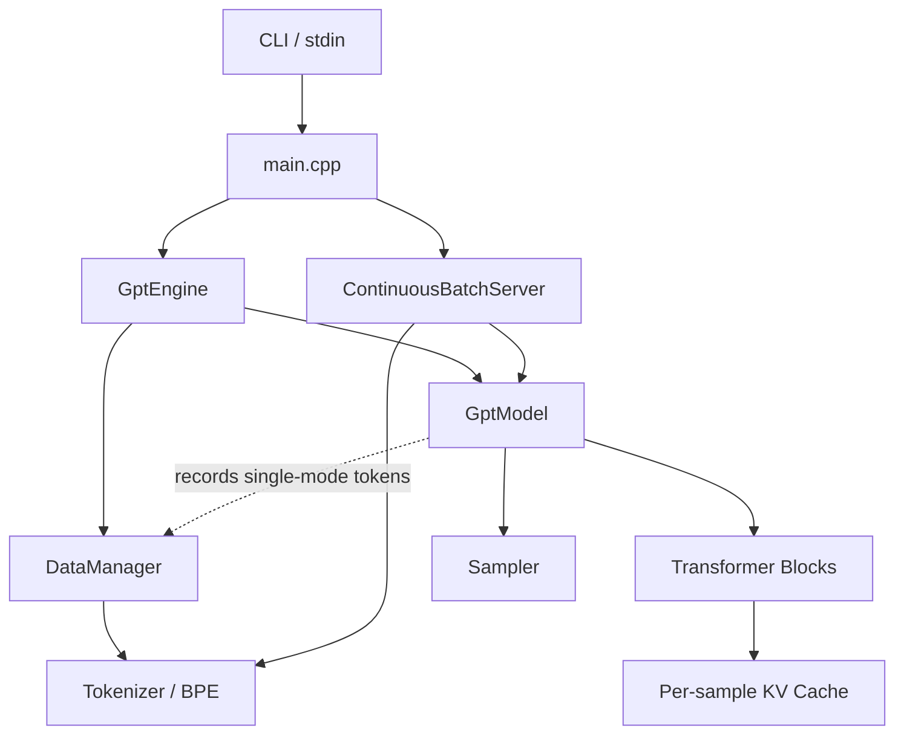
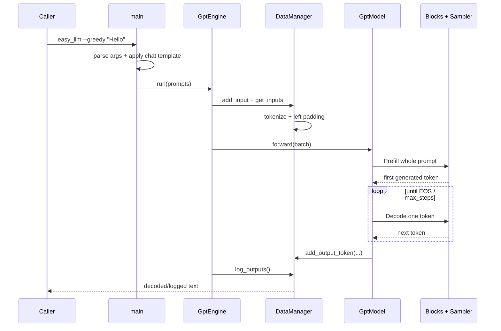
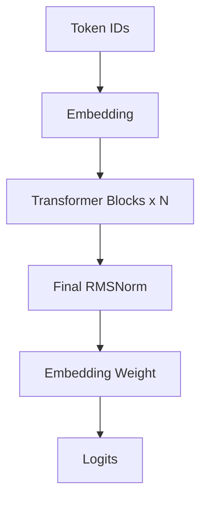
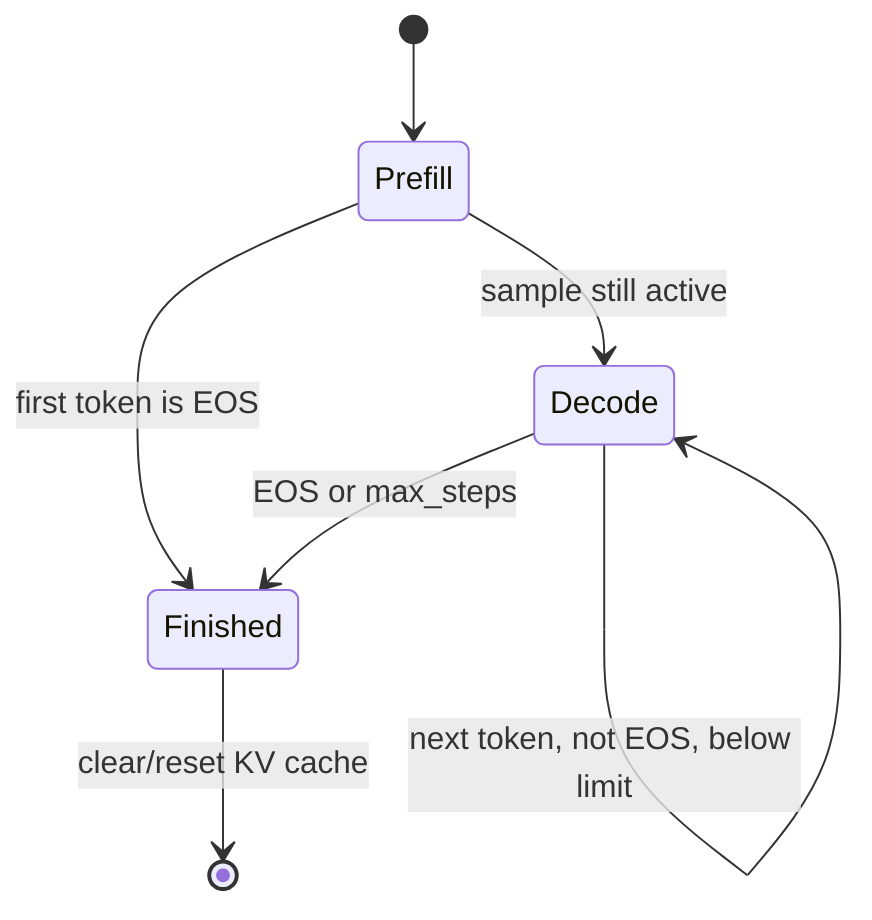
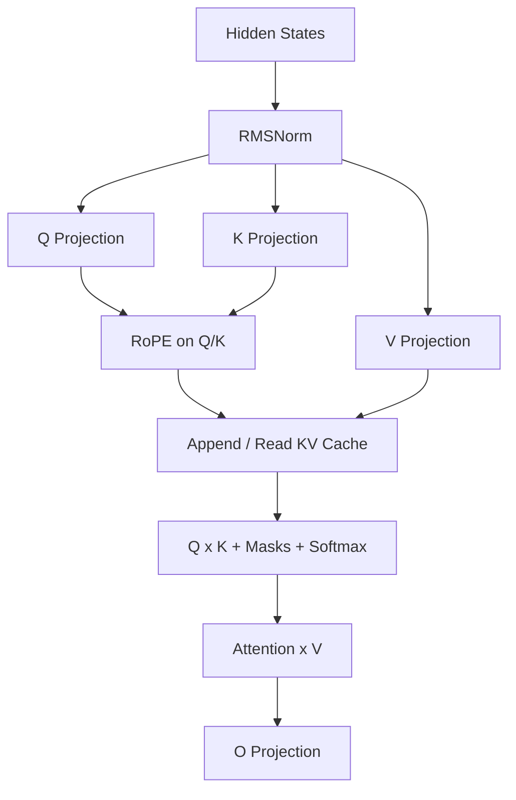
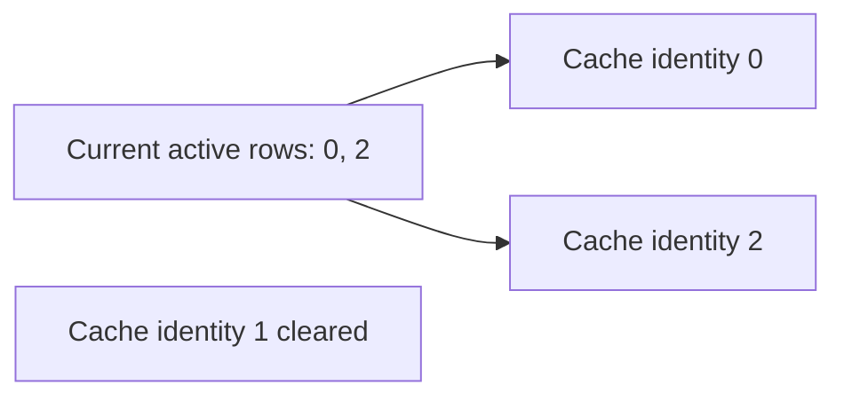
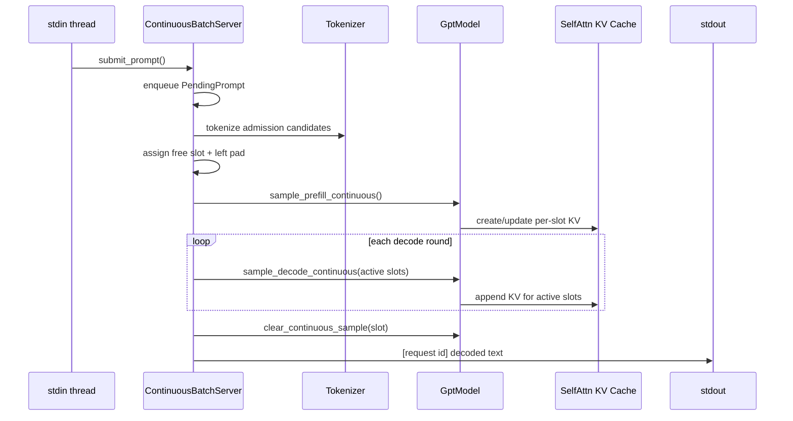
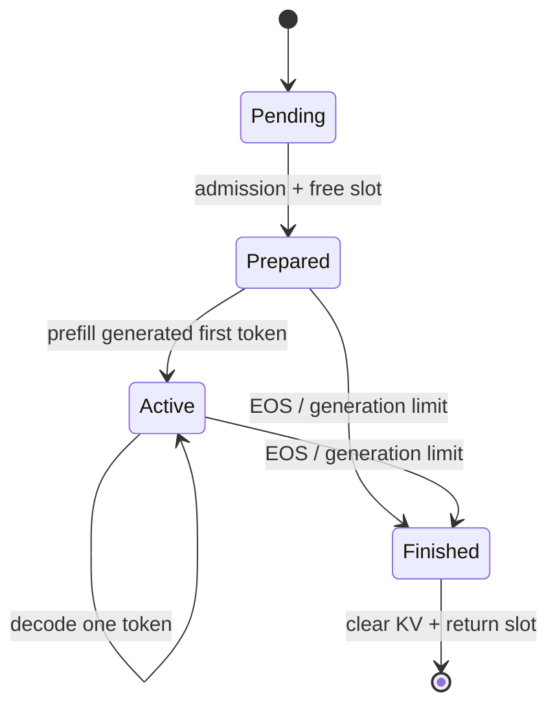
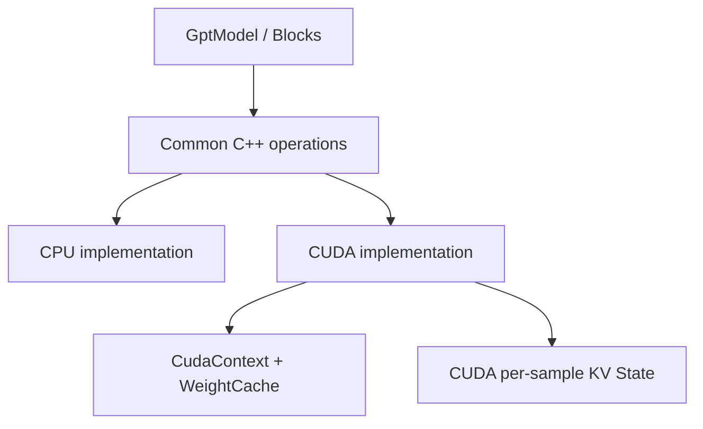

# easy_llm.cpp 教学式源码教程：从一条 Prompt 到 Continuous Batching

> **生成与核验要求（精简版）**
>
> 本文按“读者需要依次理解什么”而不是按 repo 目录组织：先建立项目心智模型和真实 Golden Path，再逐步深入关键源码、状态所有权、Prefill/Decode、Attention/KV Cache、Continuous Batching、CPU/CUDA 边界、错误处理和测试。事实优先级为 executable code → configuration → tests → repository documentation；发生冲突时明确指出 documentation drift。代码片段只保留理解当前问题所需的最小部分。Mermaid 图必须与代码一致，并在图后说明“这张图最需要记住什么”。
>
> **核验日期：2026-08-26**  
> **核验代码快照：`release@5e715177299440848ea7a63077e4da7315cba0aa`**

---

# 第一部分：先把整个系统看懂

## 0. 这个项目到底解决什么问题

`easy_llm.cpp` 是一个用于**学习和验证 LLM inference（大语言模型推理）完整链路**的微型 C++ 框架。

它当前面向 **Qwen2 family**，仓库默认示例是 **Qwen2.5-0.5B-Instruct**。它没有把关键步骤隐藏在 PyTorch、Transformers 或大型 serving framework 里，而是直接实现：

```text
Prompt
→ Chat Template
→ Tokenizer / BPE
→ Token IDs + Padding
→ Embedding
→ Transformer Blocks
→ Logits
→ Softmax + Sampling
→ Next Token
→ Decode loop
```

它还实现了第二条更接近 serving 的路径：**Continuous Batching（连续批处理）**。请求可以持续进入，调度器在每一轮把当前 active requests 重新组成 batch，并复用各自已有的 KV cache。

先把边界说清楚：

- 它不是 `llama.cpp`、vLLM、TensorRT-LLM 的替代品；
- 设计重点是**可读性、正确性和可验证性**，而不是极致吞吐；
- `--serve` 当前是 **stdin/stdout 长驻进程**，不是 HTTP server；
- 当前没有网络 API、authentication（认证）、authorization（授权）、持久化、retry、idempotency key 或 token streaming；
- CPU 是最清楚的 correctness baseline，CUDA 是可选 backend。

因此读这个项目最重要的问题是：

> **一条 Prompt 在一个足够小、能够顺着源码读完的 C++ 系统里，怎样一步步变成新 token；多个请求同时存在时，这些状态又归谁管理？**

---

## 1. 先只记住 7 个角色

第一次进入仓库，不要先按目录扫几十个文件。先记住下面这些角色：

| 模块 | 做什么 | 为什么单独存在 | 主要输入/输出 | 主要状态在哪里 | 最先看哪里 |
|---|---|---|---|---|---|
| `main` | 创建对象、加载配置、选择运行模式 | 避免 CLI/组装逻辑进入模型算法 | CLI/stdin → 已组装的运行流程 | `CliOptions`、`Config` | `src/main.cpp` |
| `GptEngine` | 串起一次性 batch 推理 | 让 orchestration 与模型计算分开 | prompts → 调用 DataManager/GptModel | 几乎不拥有业务状态 | `src/gpt_engine.cpp` |
| `DataManager` | Tokenize、left padding、记录单次模式输出 | 输入整理和输出生命周期不属于 Transformer | text ↔ batched IDs / generated IDs | `inputs_`、`outputs_`、`seq_len`、`pad_len` | `src/data_manager.cpp` |
| `Tokenizer` / `Bpe` | 文本 ↔ token/token ID | 文本协议与模型数学分离 | UTF-8 text ↔ IDs | vocab、merges、special tokens | `src/tokenizer.cpp`, `src/bpe.cpp` |
| `GptModel` | Prefill/Decode orchestration + model graph | 将生成状态机和具体层组合起来 | token batch → sampled tokens | `GenerationContext`、Sampler RNG | `src/models/gpt_model.cpp` |
| `Block` / `SelfAttn` / `MLP` | Transformer 数学计算 | Attention、MLP、cache 各自有独立职责 | hidden states → hidden states | 每层 `SelfAttn` 拥有 KV cache | `src/models/block.cpp`, `self_attn.cpp` |
| `ContinuousBatchServer` | 管 pending/active request、slot 和 decode rounds | 动态请求生命周期不适合塞进 `GptModel` | stdin requests → completed text | pending queue、active requests、free slots | `src/continuous_batch_server.cpp` |

后面所有深入内容，都可以回到这张表判断：“这件事到底应该由谁负责？”

---

## 2. 整体 Architecture Diagram



**这张图最需要记住什么：**

单次模式的直接 orchestration 是 `GptEngine → DataManager / GptModel`，不是 `DataManager → GptModel`。`GptModel` 只持有 `DataManager&`，在生成过程中把 token 记录回去。

另外，系统没有一个“万能状态中心”：

- 单次输入/输出状态主要在 `DataManager`；
- 服务请求生命周期状态主要在 `ContinuousBatchServer`；
- 历史 Attention 状态在每一层 `SelfAttn` 的 KV cache；
- Prefill/Decode 当前轮的状态在 `GenerationContext`。

---

## 3. 第一条 Golden Path：`./build/easy_llm --greedy "Hello"`

先只跟一条最普通的单次请求。



**这张图最需要记住什么：**

一条请求不是“Tokenizer → model → string”三步而已：

1. `main` 先把原始 Prompt 套成 Qwen chat template；
2. `DataManager` 把文本转换成规则 batch；
3. `GptModel` 先 Prefill，再反复 Decode；
4. `SelfAttn` 在每层不断积累 KV cache；
5. `Sampler` 每轮选出 next token；
6. 当前单次模式真正保存生成结果的是 `DataManager`，最终再 decode 成文本。

### 3.1 对应的真实源码

`src/main.cpp` 最后创建：

```cpp
easy_llm::GptEngine gpt_engine{
    move(gpt_model), move(config), move(data_manager)
};
gpt_engine.run(prompts, output_path);
```

`src/gpt_engine.cpp` 的主线几乎只有：

```cpp
for (const string& prompt : prompts) {
    data_manager_->add_input(InputSample{prompt});
}
auto batch = data_manager_->get_inputs();
model_->forward(batch);
data_manager_->log_outputs(output_path);
```

这正是 `GptEngine` 独立存在的原因：**它只负责 orchestration（编排），不负责 Tokenizer 算法，也不负责 Transformer 数学。**

---

## 4. 读到这里，应该已经能回答四个问题

1. 项目做什么：用相对直接的 C++ 展开 LLM inference 的完整关键链路；
2. 单次主链：`main → GptEngine → DataManager / GptModel → Blocks/Sampler`；
3. Prefill 处理完整 Prompt，Decode 后续通常每轮只喂一个新 token；
4. request state、generation state、KV state 分属不同 owner。

如果这四点清楚，再继续进入 Tokenizer、Attention 和 CUDA，就不会把不同层次的概念混在一起。

---

# 第二部分：从文本进入模型

## 5. `main.cpp`：为什么它只是 Composition Root

`src/main.cpp` 可以理解成 **composition root（对象组装入口）**：负责创建对象、连接依赖、选择单次模式或 `--serve`，而不承担模型算法。

启动过程大致是：

```text
parse CLI
→ Config::load_config()
→ CLI sampling 参数覆盖 Config
→ ModelParam::load(model.safetensors)
→ Tokenizer::create()
→ DataManager
→ GptModel::create()
→ apply_chat_template()
→ GptEngine 或 ContinuousBatchServer
```

这种边界让：

- CLI 改动不会进入 Attention；
- 模型权重加载不会进入调度器；
- Continuous Batching 可以复用同一个 `GptModel`；
- CPU/CUDA backend 可以隐藏在模型组件和 ops 下面。

### 5.1 CLI 默认值会覆盖 `Config` 默认值

`Config` 内部的 sampling 初始值并不是最终 CLI 默认行为。`main.cpp` 会执行：

```cpp
config->temperature = options.temperature;
config->top_p = options.top_p;
config->top_k = options.top_k;
config->seed = options.seed;
```

而 `CliOptions` 默认是：

```text
temperature = 0.8
top_p      = 0.95
top_k      = 20
seed       = 42
```

所以判断实际启动参数时，要看 `include/cli_options.hpp`，不能只看 `include/config.hpp`。

---

## 6. Chat Template：模型真正看到的不是 `Hello`

`src/cli_options.cpp` 的 `apply_chat_template()` 当前硬编码：

```text
<|im_start|>system
You are Qwen, created by Alibaba Cloud. You are a helpful assistant.<|im_end|>
<|im_start|>user
Hello<|im_end|>
<|im_start|>assistant
```

因此输入 `Hello` 后，Tokenizer 处理的是完整模板文本。

这会直接影响：

- Prompt token 数；
- `max_steps` 剩余的生成空间；
- special token；
- 换模型时的兼容性。

### 当前实现边界

虽然模型目录里有 `tokenizer_config.json`，当前 C++ **没有动态执行其中的 chat template**。Chat template 写死在 `apply_chat_template()`。

所以“换一份 safetensors”不等于“自动支持另一种 chat model”。

---

## 7. Tokenizer / BPE：文本怎样变成整数

最低限度先记：

```text
文本
→ token strings
→ token IDs
```

反方向：

```text
token IDs
→ token strings
→ 文本
```

`Tokenizer` 初始化读取：

| 文件 | 当前代码实际使用的内容 |
|---|---|
| `tokenizer.json` | `model.vocab`、`model.merges` |
| `tokenizer_config.json` | `added_tokens_decoder`、special tokens、pad token |

### 7.1 BPE 是什么

BPE（Byte Pair Encoding，字节对合并编码）在 `src/bpe.cpp` 中负责普通文本片段：

```text
UTF-8 text
→ byte-level mapping
→ 根据 merge rank 反复合并
→ token strings
```

`bpe_cache_` 会缓存已经处理过的片段，避免重复 merge。

### 7.2 为什么 special token 必须绕过普通 BPE

例如：

```text
<|im_start|>
```

这是模型定义的一个整体控制 token，不能先被普通 BPE 拆碎。

`EncodingSession` 会先识别 special tokens，普通区段交给 `Bpe`，special token 本身直接保留。

所以职责是：

```text
Tokenizer
├─ vocab / ID mapping
├─ BOS / PAD / special-token rules
└─ Bpe
   └─ ordinary text encoding
```

---

## 8. Tokenizer 兼容性：能读 HF 文件 ≠ 完整 HF runtime

这是项目里很值得提前知道的兼容性边界。

当前 `Bpe::encode_into()` 的普通文本切分比 Hugging Face Qwen2 tokenizer 的完整 pre-tokenization pipeline 简单，主要基于 whitespace 片段后再做 byte-level BPE。

因此它不应该被描述成：

> “完整逐 token 复刻任意 Hugging Face tokenizer”。

如果目标是学习 inference chain，这种实现更容易阅读；如果目标是和 Transformers 做严格 logits parity，应先建立 tokenizer parity corpus，覆盖：

```text
英文
中文
连续空格
换行
标点
emoji
数字
contractions
special-token 边界
```

并逐 case 比较 token IDs。

### 8.1 BOS 也是独立兼容性规则

`Tokenizer::tokens_to_ids()` 当前只要 `bos_token_id_ >= 0`，就会在 token IDs 前插 BOS。

这个 ID 来自模型 `config.json`，而不是完整复刻 tokenizer runtime 中所有 `add_bos_token` 配置语义。

所以做严格 parity 时，**第一枚 token 是否额外出现 BOS** 必须单独确认。

---

## 9. `DataManager`：为什么 left padding 不只是“补齐长度”

假设：

```text
A: [11, 12]
B: [21, 22, 23, 24]
```

为了形成规则 batch，当前代码使用 left padding：

```text
A: [PAD, PAD, 11, 12]
B: [ 21,  22, 23, 24]
```

同时每个 `InputSample` 保存：

```text
seq_len = 真实 token 数
pad_len = 左侧 PAD 数
```

`test/data_manager_invariants_test.cpp` 就在保护这些值。

为什么 `pad_len` 必须成为状态？因为后面：

- RoPE position 要抵消左侧 PAD；
- Attention 不能看 PAD；
- 不同 sample 的真实 sequence length 必须独立存在。

因此 `DataManager` 不只是“文件输入工具”，它是单次模式的**输入状态 owner**。

---

# 第三部分：模型怎样被构造出来

## 10. `Config`：结构参数从哪里来

默认路径在 `include/config.hpp`：

```text
data/model/config.json
data/model/model.safetensors
data/model/tokenizer.json
data/model/tokenizer_config.json
```

`Config::load_config()` 会读取：

```text
num_hidden_layers
num_attention_heads
num_key_value_heads
hidden_size
vocab_size
max_position_embeddings
bos_token_id / eos_token_id
rope_theta
architectures
model_type
```

这些值决定：

- 创建多少个 Block；
- Query/KV head 数；
- head dimension；
- 权重应该具有的 shape。

### 一个错误处理细节

如果 `config.json` 打不开，当前 `load_config()` 记录 error 后 return，不会立刻 throw。随后模型参数校验通常会因为关键字段仍为 0 而失败。

排障时不要只看最终 exception，要回看最前面的 config 日志。

---

## 11. Safetensors Loader：`mmap` 不等于 zero-copy inference

`src/models/loader.cpp` 直接解析 Safetensors：

```text
open
→ fstat
→ mmap file
→ 读 8-byte header length
→ parse JSON header
→ 校验 dtype / shape / data offsets
→ copy/convert 到 Tensor
→ munmap
```

源 dtype 支持：

```text
BF16 / F16 / F32
```

当前标准 CMake 构建固定定义 `USE_BF16`，因此运行时 target `data_type` 默认是 BF16。

### 为什么 `mmap` 不等于权重一直映射文件

`load_tensor()` 最终把数据装进 owning `Tensor`；`MMapGuard` 在加载函数结束时 unmap。

因此真实关系是：

> `mmap` 只是 loader 的文件访问方式；模型运行时权重属于自己的 `Tensor`。

---

## 12. `ModelParam`：启动期的权重暂存区

它的核心结构可以理解为：

```text
weight name → Tensor
```

组件加载使用：

```cpp
Tensor ModelParam::take_param(const string& key)
```

`take_param()` 会 move Tensor，并从 map 删除 key。

这样：

1. 大权重不会额外复制；
2. ownership 明确从暂存区转移到具体模型组件；
3. 初始化结束后可以检查还有哪些权重没人消费。

当前 `validate_no_remaining_model_params()` 对多余权重只 warning，不是 hard error。

---

## 13. `LayerKeyPrefix`：真实存在，但仍很小的扩展边界

Qwen 权重 key 类似：

```text
model.layers.0.self_attn.q_proj.weight
model.layers.0.mlp.up_proj.weight
model.norm.weight
```

`LayerKeyPrefix` 把逻辑组件映射成具体 checkpoint key。

当前 `create_layer_key_prefix()` 仅识别 Qwen2 family：

```text
architecture 包含 qwen2
或 model_type == qwen2
```

否则 throw。

所以它确实是 extensibility seam（扩展缝隙），但**不是通用 plugin/provider system**。支持新模型还要核对 Attention、MLP、Tokenizer、RoPE、chat template 等真正的结构差异。

---

## 14. 参数校验为什么必须早于真正运行

`validate_model_params_before_load()` 会检查：

- required keys；
- embedding `[vocab_size, hidden_size]`；
- Q/K/V/O projection shape；
- RMSNorm shape；
- MLP intermediate dimensions；
- head 配置的一致性。

例如 GQA（Grouped Query Attention，分组查询注意力）：

```text
Q output width   = hidden_size
K/V output width = num_key_value_heads × head_dim
```

如果 config 和 checkpoint 不匹配，应在模型初始化阶段给出清楚错误，而不是让问题拖到某个 matmul 才爆出来。

---

# 第四部分：GptModel——Prefill 与 Decode

## 15. `GptModel` 同时有两层职责

第一层是 model graph：

```text
Embedding
→ Transformer Blocks × N
→ Final RMSNorm
→ vocabulary projection
```

第二层是 generation orchestration：

```text
Prefill
→ sample
→ Decode loop
→ EOS filtering
→ cache cleanup
```

第一次读 `gpt_model.cpp` 时，最好先分开理解这两层。

---

## 16. 一次 `forward_logits()` 的数据流



**这张图最需要记住什么：**

当前输出 vocabulary projection 直接复用 embedding weight，也就是 **weight tying（输入 embedding 与输出投影共享权重）**。

`GptModel` 头文件虽然还保留 `out_linear_` 成员，但当前 executable call path 没有使用它。读架构必须跟调用链，而不是根据成员名猜。

---

## 17. Prefill 为什么处理完整 Prompt

假设 Prompt 有 100 token：

```text
[t0, t1, ..., t99]
```

第一次 forward 必须让所有历史位置经过所有 Transformer layers，目的有两个：

1. 得到最后位置的 next-token distribution；
2. 为每一层建立历史 K/V。

这一步叫 **Prefill**。

---

## 18. Decode 为什么只需要一个新 token

Prefill 产生 `t100` 后，下一轮只输入：

```text
[t100]
```

`t0...t99` 的 K/V 已在 cache 中。

因此 Decode 每轮：

```text
新 token
→ 只计算新 Q/K/V
→ 新 K/V append 到 cache
→ Q 与历史 K cache 计算 attention
→ sample next token
```

这就是 KV cache 能显著减少自回归重复计算的原因。

---

## 19. 生成状态机



**这张图最需要记住什么：**

EOS 不只是“while loop 停止”。一个 batch 中某个 sample 结束后，它会从 active set 移除，并清掉自己的 KV cache；其他 sample 可以继续 Decode。

---

## 20. `GenerationContext` 保存什么

单次 `GptModel::forward()` 内部维护：

```text
batch_size
input_seq_len
max_steps
step
sample_ids
next_generated_tokens
pad_lens
pos_lens_by_sample
```

最重要的是三类身份/状态：

### `sample_ids`

稳定的原始 sample 身份。

开始可能是：

```text
[0, 1, 2]
```

sample 1 EOS 后：

```text
[0, 2]
```

当前 batch row 1 已经代表 sample 2，因此 batch row 不能当永久身份。

### `next_generated_tokens`

每个 active sample 下一轮要喂回模型的 token。

### `pos_lens_by_sample`

每个 sample 自己当前走到的真实 position。

这三个状态共同支撑 variable-length generation。

---

## 21. `max_steps`：README/help 与 executable semantics 有偏差

CLI help 看起来像：

```text
Maximum generation steps per request
```

但当前代码更接近**总 step / position ceiling**，不是常见 API 的 `max_new_tokens`。

Prefill 已经采出第一个 token，然后：

```cpp
ctx.step = ctx.input_seq_len;
```

Decode 条件是：

```cpp
while (ctx.step < ctx.max_steps) {
    ...
    ctx.step += 1;
}
```

因此近似最大新 token 数为：

```text
max_steps - input_seq_len + 1
```

Continuous 模式甚至显式写成：

```cpp
max_generate_tokens = std::max(1, config_.max_steps - seq_len + 1);
```

### 两个进一步影响

1. chat template 会占用 `input_seq_len`，所以肉眼只有几个字的 Prompt 也可能已有几十个 token；
2. 普通多 Prompt batch 的 `input_seq_len` 是 padding 后的 batch 最大长度，因此短 Prompt 的总 step ceiling 也会受最长 Prompt 影响。

这属于明确的 documentation drift，使用 API 时不要把 `--max-steps` 机械映射成 `max_new_tokens`。

---

# 第五部分：进入一个 Transformer Block

## 22. Block 的真实顺序

`src/models/block.cpp` 很短：

```cpp
auto output_attn = self_attn_.forward(input, sample_ids, pos_offsets);
ops::add_inplace(output_attn, input);
auto output = mlp_.forward(output_attn);
ops::add_inplace(output, output_attn);
```

但 `RMSNorm` 分别封装在 `SelfAttn` 和 `MLP` 内，所以完整结构是：

```text
input
→ RMSNorm
→ Self-Attention
→ + residual(input)
→ RMSNorm
→ gated MLP
→ + residual
```

这就是当前 Qwen-style pre-norm decoder block。

---

## 23. Attention 先只看数据流



**这张图最需要记住什么：**

这个项目里 Self-Attention 最值得学的不是公式本身，而是：**不同 sample 的历史 K/V 怎么保存、这一轮 active batch 怎么重新拼、position 和 padding 又怎么保持正确。**

---

## 24. Shape 是读 Attention 最有效的语言

设：

```text
B    = batch size
S    = current sequence length
H    = num_heads
HKV  = num_key_value_heads
D    = head_dim
hidden = H × D
```

输入：

```text
[B, S, hidden]
```

Q/K/V projection 后：

```text
Q: [B, S, H × D]
K: [B, S, HKV × D]
V: [B, S, HKV × D]
```

split heads + transpose：

```text
Q: [B, H,   S, D]
K: [B, HKV, S, D]
V: [B, HKV, S, D]
```

当前 CPU baseline 随后执行：

```cpp
k.repeat(num_heads_ / num_heads_kv_, 1);
v.repeat(num_heads_ / num_heads_kv_, 1);
```

得到：

```text
K/V: [B, H, S, D]
```

这就是当前 GQA 的简单实现：逻辑上多个 Query heads 共享较少的 KV heads，但 CPU 路径为了计算直观，先物理 repeat K/V。

一个重要后果是：**当前 CPU KV cache 保存的是 repeat 后的 heads**，因此不要直接把理论 GQA 的 KV 内存节省量套到这个实现上。

---

## 25. RoPE：left padding 后位置为什么仍然正确

RoPE（Rotary Position Embedding，旋转位置编码）会按 position 旋转 Q/K。

假设：

```text
PAD PAD real0 real1 real2
```

数组 index 是：

```text
0   1   2     3     4
```

如果直接使用 index，`real0` 会错成 position 2。

Prefill 当前构造：

```text
offset = -pad_len
```

当 `pad_len=2`：

```text
array index: 0  1  2  3  4
offset:     -2 -2 -2 -2 -2
RoPE pos:   -2 -1 0  1  2
```

PAD 本身随后被 mask，真实 token 从 position 0 开始。

Decode 时使用每个 sample 的：

```text
pos_lens_by_sample[sample_id]
```

所以 batch 中不同长度 sample 可以拥有不同 position。

`generation_invariants_test.cpp` 明确保护这些规则。

---

## 26. Attention Mask 其实解决三种不同问题

### Causal Mask

Prefill 中，当前位置不能看未来 token。

### Valid-length Mask

不同 sample 的 KV cache 长度不同。临时拼成规则 batch 后，较短 cache 的尾部是补出来的，必须 `-inf` mask。

### Padding Mask

Prompt 左侧真实 PAD 不能进入 Attention。

这三种 mask 的原因不同，不要都叫“padding”。

---

## 27. RMSNorm 和 MLP 的当前实现

`RMSNorm::forward()`：

```text
mean(x²)
→ sqrt(mean + epsilon)
→ x / rms
→ × learned weight
```

当前 `epsilon` 直接写死为：

```text
1e-6
```

`Config` 没有读取模型的 `rms_norm_eps` 字段。默认 Qwen2.5-0.5B 与该值匹配，但支持其他模型时这是一个真实适配点。

`MLP::forward_cpu()`：

```text
x
→ RMSNorm
→ up_proj(x)
→ gate_proj(x)
→ SiLU(gate)
→ up * gate
→ down_proj
```

这不是简单的 `Linear → ReLU → Linear`，而是 gated MLP。

---

# 第六部分：KV Cache——理解动态 batch 的核心

## 28. KV Cache 到底保存在哪里

每一个 Transformer layer 的 `SelfAttn` 都有：

```text
cache_k_by_sample_
cache_v_by_sample_
cache_len_by_sample_
pad_lens_by_sample_
```

所以不是“整个模型只有一份 cache”。N 层模型会有 N 组 layer-specific K/V history。

---

## 29. 为什么 cache 必须按稳定 sample identity 保存

初始：

```text
sample_ids = [0, 1, 2]
```

sample 1 完成后：

```text
active sample_ids = [0, 2]
```

这一轮 batch row 1 已经是 sample 2。



**这张图最需要记住什么：**

`sample_id` / `slot_id` 是稳定的 cache identity；batch row 只是“这一轮排在第几行”。只有把这两者分开，active batch 才能自由缩小和重排。

---

## 30. `build_padded_active_cache()` 为什么存在

假设：

```text
sample 0 cache length = 20
sample 2 cache length = 37
```

长期状态仍按 sample 独立保存，但当前矩阵计算需要规则 Tensor，所以临时构造：

```text
[active_batch, heads, max_cache_len, head_dim]
```

短 cache 尾部补 0，同时返回：

```text
valid_lens = [20, 37]
```

`apply_valid_length_mask()` 再把 sample 0 的 20 以后 score 全设为 `-inf`。

这种设计非常适合教学和 correctness：**长期 cache 独立，计算时才把当前 active set 拼起来。**

成熟 serving framework 可能使用 paged/block KV cache，但那不是当前 repo 的实现，不应反推到这里。

---

## 31. EOS 为什么会触发资源清理

EOS filter 得到已经结束的 sample 后，会：

```cpp
clear_kv_cache(sample_id);
```

原因：

- 已完成 sample 不再 Decode；
- K/V 不应继续占状态；
- Continuous 模式中的 slot 还要复用。

这说明 EOS filtering 同时属于**生成状态管理**和**资源生命周期管理**。

另一个当前行为：生成 token 会先被记录，再做 EOS filter，因此 EOS special token 本身可能进入 generated IDs，展示层并没有统一做“隐藏 stop token”的 API 策略。

---

# 第七部分：Sampling 与单次输出

## 32. Logits 怎样变成 next token

模型输出：

```text
logits: [batch, seq, vocab]
```

`forward_logits()` 到这里结束；Prefill / Decode 的调用者随后执行 `ops::softmax()`，得到 float probabilities，再交给 Sampler。

`TopKTopPSampler` 的当前实现要分成两条权重理解：

```text
probabilities
├─ base_weight = p
│  └─ sort → Top-K → Top-P，决定候选集合
└─ sample_weight = p^(1 / temperature)
   └─ 只用于候选集合内的最终随机抽样
```

`--greedy` 则直接选最大概率 token。

### Temperature 的真实实现

当前代码在 softmax 后计算：

```text
sample_weight = p^(1 / temperature)
```

在重新归一化后，这和常见的 `logits / T → softmax` 有相同的 temperature 变换数学含义；但**当前 Top-P 截断边界仍按原始 `base_weight` 计算**，temperature 不会改变候选集合，只会改变保留下来的候选之间的随机权重。

因此不要把当前实现简写成“temperature → Top-P → sample”。做 Hugging Face 等框架的 sampling parity 时，这个执行语义差异必须单独核对。

---

## 33. 单次模式输出到底归谁

`GptModel::forward()` 的 `std::string` return 当前并不是最终结果渠道：

```cpp
auto output = model_->forward(batch);
(void)output;
```

生成过程中真正执行的是：

```cpp
data_manager_.add_output_token(...);
```

最后：

```text
DataManager::outputs_
→ Tokenizer::decode(generated IDs)
→ log_outputs()
```

因此单次模式：

> **`GptModel` 负责产生 token；`DataManager` 负责保存和最终 decode。**

这是 side-effect based 的 API 设计。如果未来把模型做成更通用 library，这里是很自然的重构边界。

---

# 第八部分：Continuous Batching

## 34. `--serve` 到底是什么

```bash
./build/easy_llm --serve
```

当前行为：

- input thread 从 stdin 每行读一个 Prompt；
- `submit_prompt()` 放进 pending queue；
- server 主循环持续 admission + decode；
- 完成时 stdout 输出整段文本；
- `/quit` / `:quit` 停止接收新输入，已有请求继续收尾。

它没有 socket、HTTP、REST、SSE、WebSocket 或 gRPC。

---

## 35. Continuous Batching Golden Path



**这张图最需要记住什么：**

Continuous Batching 不是“每个请求启动一个模型线程”。它是：

> **一个调度循环，每一轮重新组合 active requests；稳定 slot 让每个 request 的 KV history 不随 batch row 改变。**

---

## 36. 三种 request state

### `PendingPrompt`

```text
request_id
prompt_text
submit_time
```

还没有占 KV slot。

### `PreparedAdmission`

```text
request_id
slot_id
seq_len
pad_len
pos_len
max_generate_tokens
token_ids
```

本轮准备 Prefill，已经 tokenized 并拿到 slot。

### `ActiveRequest`

```text
request_id
slot_id
pos_len
max_generate_tokens
next_token
generated_token_ids
decode_steps
```

正在 Decode。



**这张图最需要记住什么：**

`request_id` 是 request identity；`slot_id` 是 cache resource identity。请求结束后 slot 会复用，所以两者不能混用。

---

## 37. Scheduler 每轮做什么

`ContinuousBatchServer::run()` 的骨架：

```cpp
while (true) {
    admit_prefill_round();
    decode_round();
    maybe_log_runtime_stats();
    if (is_done()) break;
    ...
}
```

即：

```text
先接纳一批新请求做 Prefill
→ 再让所有 active request Decode 一步
```

两个关键容量参数：

```text
--serve-max-active
--serve-prefill-batch
```

当前没有 priority、preemption、deadline-aware scheduling 等更复杂策略。

---

## 38. Free Slot 为什么是资源管理核心

服务启动时准备：

```text
slot 0 ... slot N-1
```

Admission：

```text
free slot → request.slot_id
```

Finish：

```text
clear_continuous_sample(slot_id)
→ pad_len reset
→ slot_id return to free_slots_
```

这样模型 cache 可以用稳定 slot 管理，而不是把请求身份绑在当前 batch row 上。

---

## 39. Continuous 模式下输出为什么不再归 `DataManager`

服务请求不断动态进入/退出，所以生成 IDs 保存在：

```text
ActiveRequest::generated_token_ids
```

请求结束时直接：

```cpp
std::string text = tokenizer_.decode(request.generated_token_ids);
```

两种模式的 state ownership：

| 状态 | 单次模式 | Continuous 模式 |
|---|---|---|
| Prompt/input batch | `DataManager` | pending/prepared request |
| Generated IDs | `DataManager::outputs_` | `ActiveRequest` |
| Lifecycle | 固定 batch | Pending → Active → Finished |
| KV cache | 每层 `SelfAttn` | 每层 `SelfAttn`，按 slot |

这就是为什么 `GptModel` 单独提供：

```text
sample_prefill_continuous()
sample_decode_continuous()
clear_continuous_sample()
```

而不是强迫 Continuous 模式使用固定 `DataManager` batch。

---

# 第九部分：State Ownership、Sync/Async、Protocol 边界

## 40. 当前谁是“权威状态 owner”

项目没有数据库，因此没有 durable system of record。运行时状态如下：

| 状态 | Owner | 生命周期 |
|---|---|---|
| model config | `Config` | process/model |
| 未消费权重 | `ModelParam` | startup only |
| model weights | Embedding/Linear/Norm 等 | model |
| 单次 input/output | `DataManager` | one CLI batch |
| 单次 active generation | `GenerationContext` | one `forward()` |
| service pending queue | `ContinuousBatchServer` | service process |
| service active requests | `ContinuousBatchServer` | request |
| CPU KV | each `SelfAttn` | sample/slot |
| CUDA KV | each `SelfAttnCudaState` | sample/slot |

进程崩溃后，这些请求/KV 状态都不会恢复。

---

## 41. Sync / Async 边界

### 普通 CLI

基本同步：

```text
main
→ GptEngine
→ GptModel
→ generation completes
→ return
```

### `--serve`

显式线程边界只有：

```text
input producer thread
        ↓
mutex-protected pending queue
        ↓
server/model thread
```

`pending_prompts_` 和 `input_closed_` 通过 `pending_mu_` 保护。

而：

```text
active_requests_
free_slots_
model execution
```

由 server 主循环单线程推进。

OpenMP 和 CUDA 是**算子内部并行**，不等于 request-level 多线程执行。

---

## 42. Protocol / Integration Boundary：当前几乎没有网络协议层

当前外部交互协议非常简单：

```text
stdin: one prompt per line
stdout: completed result line
```

因此当前不存在：

```text
HTTP route
request schema/version
SSE
callback
network auth
external persistence
```

如果以后加 HTTP/gRPC，最自然的是在 `ContinuousBatchServer` 类似的 scheduler API 外面加 adapter，而不是让 transport 直接碰 `SelfAttn` cache。

---

# 第十部分：CPU 与 CUDA Backend

## 43. 为什么先读 CPU baseline

`Tensor` 本身非常轻：

```cpp
std::vector<data_type> data_;
std::vector<int> shape_;
```

`reshape()` 改 shape metadata，但 `transpose()` / `repeat()` 会真正重排或复制数据，不是 stride view。

CPU ops 也直接写出：

```text
matmul
RoPE
mask
softmax
concat
MLP
```

这种实现不是为了极致性能，而是让 shape、状态和数学步骤能直接追踪。

---

## 44. 当前 precision 事实

代码结构有：

```text
USE_FP32
USE_FP16
USE_BF16
```

但当前 `CMakeLists.txt` 对核心 target 固定定义：

```cmake
USE_BF16
```

因此标准构建实际是 BF16-first。

很多 CPU kernel 会将 BF16 转成 float accumulation，再转回 `data_type`。

Loader 能读 F16/F32/BF16 源权重，不代表三种 target precision 都已经以同等方式配置和测试。

---

## 45. CUDA 是 operator backend，不是第二套模型



**这张图最需要记住什么：**

模型结构和 generation orchestration 仍是同一套 C++。CUDA 在下面替换/加速部分算子，并维护 device-side Attention state。

---

## 46. `CudaContext` 管什么

`src/cuda/runtime.cu`：

- 检测 device；
- 检查当前 precision 支持；
- 创建 non-blocking stream；
- 创建 cuBLAS handle；
- 管理 model weight upload cache。

Weight cache 让固定权重第一次用时上传 GPU，后续复用 device pointer，而不是每次 matmul 都重复传整个权重。

---

## 47. 为什么普通 CUDA fallback 和 Self-Attention fallback 不一样

普通 `matmul_3d` / MLP CUDA 失败时，host input 仍完整存在，所以可以 catch 后走 CPU。

Self-Attention 不一定安全。

如果历史 K/V 已经只存在 CUDA cache 中，当前 CUDA Attention 失败后直接切 CPU，会丢掉历史状态。

因此当前规则是：

```text
没有 active CUDA KV history
→ 可以 disable CUDA SelfAttn + CPU fallback

已有 active CUDA KV history
→ fallback 不安全 → throw
```

这是一个非常重要的可靠性原则：

> **“有 fallback 路径”不等于“任何时刻 fallback 都正确”。状态连续性优先。**

---

## 48. Continuous CUDA Self-Attention 可单独关闭

`GptModel::start_continuous()` 读取：

```text
EASY_LLM_DISABLE_CONTINUOUS_CUDA_SELF_ATTN
```

它控制 Continuous 模式的 Self-Attention CUDA path。

这不等于完全禁用所有 CUDA operator；其他 CUDA-capable ops 仍可能使用 GPU。

---

# 第十一部分：错误处理、可靠性，以及当前明确没有的能力

## 49. 启动阶段尽量早发现错误

当前代码大量校验：

- CLI ranges；
- Safetensors header/dtype/shape/offset；
- missing weight key；
- model shape；
- Tensor reshape/matmul；
- sample ID；
- cache shape；
- valid length。

目标是让错误在边界处明确失败，而不是继续执行后生成悄悄错误的 token。

---

## 50. 当前没有 retry / idempotency / recovery / persistence

### Retry

失败请求不会自动重跑。

### Idempotency

`request_id` 只是进程内递增 ID，不是客户端 idempotency key。相同 Prompt 提交两次就是两个请求。

### Recovery

pending queue、active requests、generated IDs、KV cache 都在内存里。进程重启后无法继续未完成请求。

### Persistence

没有数据库或 durable queue。

这些都是当前**未实现能力**，不是文档遗漏。

---

## 51. 当前没有 Authentication / Authorization

原因也很简单：`--serve` 没有网络入口和用户/tenant identity。

```text
authentication = not implemented
authorization  = not implemented
```

如果未来增加 HTTP/gRPC，这些更适合放在 transport/service boundary，而不是塞进 `GptModel` 或 `SelfAttn`。

---

## 52. 当前不是 token streaming API

内部确实每轮 Decode 一个 token，但 caller 看到的是 request 完成后：

```cpp
std::string text = tokenizer_.decode(request.generated_token_ids);
std::cout << "[request " << request.request_id << "] " << text << "\n";
```

所以：

```text
incremental internal decode
≠
external token streaming
```

当前没有 SSE/token callback channel。

---

# 第十二部分：Tests 是可执行设计文档

## 53. `DataManager` invariant tests 在保护什么

`test/data_manager_invariants_test.cpp` 保护：

- BOS/tokenization 后真实长度；
- left padding；
- `seq_len` / `pad_len`；
- PAD 不进入最终生成文本；
- generated token 的记录时机。

---

## 54. Generation invariants 在保护什么

`test/generation_invariants_test.cpp` 明确验证：

```text
Prefill offset = -pad_len
Decode offset  = each sample's own pos_len
只增加 active sample position
EOS filter 后 sample_id/token 对应关系不乱
```

这些 invariant 一旦错，程序往往不会立刻 crash，而是 silently wrong。

---

## 55. Cache batching tests 在保护什么

`cache_batching_test.cpp` / `cache_batching_invariants_test.cpp`：

- variable-length cache 正确拼 batch；
- `valid_lens` 正确；
- padded cache tail 被 mask；
- heads/head_dim/sample_id 不合法时正确失败。

---

## 56. Regression Gate

CMake 给关键测试标记：

```text
invariant_gate
```

运行：

```bash
cmake --build build --target easy_llm_regression_gates -j8
```

或者：

```bash
ctest --test-dir build --output-on-failure -L "^invariant_gate$"
```

脚本：

```bash
bash scripts/run_regression_gates.sh
```

CUDA：

```bash
bash scripts/run_regression_gates.sh --with-cuda
```

测试策略最值得记住的是：

> padding、position、stable sample identity、EOS shrink、cache valid length 这些状态 invariant，比“最终回答看起来差不多”更适合作为 inference engine 的回归门。

---

# 第十三部分：Build 与 Deployment Boundary

## 57. 推荐 CPU build

```bash
cmake -S . -B build \
  -DCMAKE_BUILD_TYPE=RelWithDebInfo \
  -DEASY_LLM_ENABLE_CUDA=OFF \
  -DCMAKE_CXX_COMPILER=g++

cmake --build build --target easy_llm -j8
```

OpenMP 默认尝试开启；找不到时 CMake warning 后继续。

模型文件：

```text
data/model/
├── config.json
├── model.safetensors
├── tokenizer.json
└── tokenizer_config.json
```

运行：

```bash
./build/easy_llm --greedy "Hello"
```

---

## 58. CUDA build

```bash
cmake -S . -B build \
  -DCMAKE_BUILD_TYPE=RelWithDebInfo \
  -DEASY_LLM_ENABLE_CUDA=ON \
  -DCMAKE_CUDA_ARCHITECTURES=<your_arch> \
  -DCMAKE_CXX_COMPILER=g++

cmake --build build --target easy_llm -j8
```

### `build.sh` 的陷阱

当前 `build.sh` 写死：

```text
EASY_LLM_ENABLE_CUDA=ON
CMAKE_CUDA_ARCHITECTURES=120
```

而 `CMakeLists.txt` 的 CUDA option 默认是 `OFF`。

所以通用环境优先使用显式 CMake 命令；`build.sh` 更像机器相关实验脚本。

CPU-only 的实操记录另见：`my/docs/build-test-run.zh-CN.md`。

---

## 59. Local executable 和 production serving 之间的缺口

当前可以作为长驻可执行程序运行，但完整 production serving 通常还需要它外层承担：

```text
network transport
→ request validation
→ authn/authz
→ backpressure/admission policy
→ timeout/cancellation
→ streaming protocol
→ metrics/tracing
→ persistence/retry semantics（如果业务需要）
→ model process
```

这不意味着都应该塞进本 repo。更正确的边界是：

> `easy_llm.cpp` 当前核心是 model loading + generation + in-process batching；transport/control-plane 是上层问题。

---

# 第十四部分：怎样继续扩展而不破坏边界

## 60. 支持新模型 family

先逐项判断：

1. config schema 是否兼容；
2. checkpoint key 命名是否不同；
3. Attention math 是否相同；
4. MLP/Norm 是否相同；
5. RoPE/position 规则是否相同；
6. tokenizer 是否兼容；
7. chat template 是否相同；
8. BOS/EOS/PAD 规则是否相同。

只有“权重 key 不同”时，扩展 `LayerKeyPrefix` 才足够。

如果数学结构不同，应增加真正的 model component，而不是在 `SelfAttn` 到处写模型名判断。

---

## 61. 增加 Sampling 策略

当前抽象：

```text
Sampler
├─ GreedySampler
└─ TopKTopPSampler
```

新的 sampling policy 最自然地进入 `Sampler`，而不是改 Attention 或 DataManager。

注意 RNG 当前属于 `GptModel`。如果未来要求 per-request seed，Continuous Batching 下需要重新设计 RNG state ownership。

---

## 62. 增加 HTTP API 应该接在哪里

更自然的方向：

```text
HTTP/gRPC Adapter
→ request lifecycle API
→ ContinuousBatch scheduler
→ GptModel
```

而不是：

```text
HTTP handler
→ 直接操作 SelfAttn cache
```

真正要先解决的接口问题包括：

- `submit_prompt()` 如何返回 future/stream handle，而不是只 stdout；
- cancellation 如何释放 slot/KV；
- token streaming 如何从 decode round 上送；
- request ID / idempotency key 谁定义；
- timeout/retry 谁负责。

这些都是现有边界自然暴露出的下一步。

---

# 第十五部分：Troubleshooting

## 63. 一启动就报模型结构错误

先看：

```text
data/model/config.json
```

再看：

```text
src/config.cpp
src/models/model_param_validation.cpp
```

如果前面已有 “Failed to open config” 日志，不要只追最后的 shape exception。

---

## 64. Missing weight / shape mismatch

优先查：

```text
src/models/layer_key_prefix.cpp
src/models/model_param_validation.cpp
```

常见原因：

- checkpoint 与 config 不是同一模型；
- model family 不受支持；
- key naming 不同；
- hidden/head/kv-head dimensions 不一致。

不要一开始就钻进 CUDA kernel。

---

## 65. 输出异常短

先确认 templated Prompt 的 token length，再看：

```text
--max-steps
```

它不是纯 `max_new_tokens`。

普通多 Prompt batch 还要注意最长 Prompt 决定 padded `input_seq_len`。

---

## 66. 短 Prompt 放进 batch 后结果不对

按这条链排查：

```text
DataManager::pad_len
→ build_prefill_pos_offsets
→ SelfAttn::pad_lens_by_sample_
→ per-sample KV valid_lens
→ causal / valid-length / padding masks
```

先跑对应 invariant tests，再比较最终自然语言。

---

## 67. 和 Hugging Face 输出不同

不要先怀疑矩阵乘。

建议顺序：

```text
1. 比 exact input token IDs
2. 比 BOS/special tokens
3. 用 greedy 去掉 sampling 随机性
4. 比 single-step logits
5. 再看 multi-step KV/position
```

当前 Tokenizer pre-tokenization、BOS policy、chat template 和 generation config 都不是完整 Hugging Face runtime clone，因此 token IDs 不同是必须先排除的变量。

---

## 68. CUDA 报错后为什么没有自动全切 CPU

看失败发生在哪一层：

- 普通 matmul/MLP 可以局部 fallback；
- Self-Attention 如果已有 CUDA-only KV history，CPU fallback 会丢状态，所以直接失败是正确保护；
- Continuous 模式可提前禁用 CUDA SelfAttn 做隔离测试。

---

## 69. 没有 CUDA 的机器不要直接运行当前 `build.sh`

CPU 环境直接：

```bash
cmake -S . -B build -DEASY_LLM_ENABLE_CUDA=OFF ...
```

---

# 第十六部分：推荐源码阅读顺序

## 70. 第一遍：只看 Golden Path

```text
src/main.cpp
→ src/gpt_engine.cpp
→ src/data_manager.cpp
→ src/tokenizer.cpp
→ src/models/gpt_model.cpp
```

目标：能复述一条 Prompt 如何进入模型并变成 output IDs。

## 71. 第二遍：看 Transformer 和状态

```text
src/models/block.cpp
→ src/models/self_attn.cpp
→ src/models/cache_batching.cpp
→ src/models/mlp.cpp
→ src/models/generation_invariants.cpp
```

目标：能解释 Prefill、Decode、RoPE offset、KV cache、EOS active-set shrink。

## 72. 第三遍：看模型加载和底层 Tensor

```text
src/models/loader.cpp
→ src/models/layer_key_prefix.cpp
→ src/models/model_param_validation.cpp
→ src/tensor.cpp
→ src/ops.cpp
```

目标：知道 checkpoint 怎样变成模型对象，shape/precision 又怎样贯穿计算。

## 73. 第四遍：最后看 serving/CUDA

```text
src/continuous_batch_server.cpp
→ src/cuda/runtime.cu
→ src/cuda/ops/mlp.cu
→ src/cuda/ops/self_attn.cu
→ src/cuda/ops/self_attn_detail.cuh
```

不要从 `self_attn_detail.cuh` 开始，否则会同时面对 Attention、CUDA、KV layout、batching 和 kernel optimization，学习曲线会叠在一起。

---

# Appendix A：关键调用链速查

## A.1 单次 CLI

```text
main
└─ GptEngine::run
   ├─ DataManager::add_input
   ├─ DataManager::get_inputs
   │  └─ Tokenizer / BPE
   ├─ GptModel::forward
   │  ├─ init_kv_cache
   │  ├─ prefill
   │  │  └─ forward_logits
   │  │     └─ Embedding → Blocks → Norm → tied projection
   │  ├─ decode loop
   │  ├─ EOS filter
   │  └─ reset_kv_cache
   └─ DataManager::log_outputs
```

## A.2 Continuous Batching

```text
input thread
└─ submit_prompt
   └─ pending_prompts_

server loop
├─ admit_prefill_round
│  ├─ pop pending
│  ├─ tokenize / padding
│  ├─ allocate slot
│  └─ GptModel::sample_prefill_continuous
├─ decode_round
│  └─ GptModel::sample_decode_continuous
└─ finish_request
   ├─ clear slot KV cache
   ├─ return free slot
   └─ decode generated IDs → stdout
```

## A.3 一个 Block

```text
Block::forward
├─ SelfAttn::forward
│  ├─ RMSNorm
│  ├─ Q/K/V projections
│  ├─ RoPE
│  ├─ GQA repeat
│  ├─ append/read KV cache
│  ├─ masks + attention
│  └─ O projection
├─ residual add
├─ MLP::forward
│  ├─ RMSNorm
│  ├─ up + gate
│  ├─ SiLU(gate)
│  ├─ multiply
│  └─ down
└─ residual add
```

---

# Appendix B：Documentation Drift / 实现边界

| 容易根据表面信息得到的结论 | 当前 executable code 的真实行为 |
|---|---|
| `--max-steps` = 生成 N 个新 token | 更接近总 step/position ceiling；Prefill 已生成第一枚 token |
| `--serve` = 网络 server | stdin/stdout long-lived Continuous Batching loop |
| `tokenizer_config.json` 决定 chat template | special token/PAD 会读取，但 chat template 当前硬编码 |
| 读取 HF tokenizer 文件 = HF tokenizer runtime parity | 当前普通 pre-tokenization/BOS policy 更简化，需要 parity test |
| Loader 用 `mmap` = zero-copy model weights | 权重最终 copy/convert 进 owning `Tensor` |
| `out_linear_` 成员 = runtime LM head | 当前 logits 走 embedding weight tying；该成员未进入 call path |
| GQA 一定带来理论 KV cache 内存节省 | CPU path 先 repeat K/V heads，再保存当前 cache |
| `rms_norm_eps` 自动来自 config | 当前 RMSNorm 直接使用 `1e-6` |
| Temperature 会先改变 Top-P 候选边界 | 当前 Top-P 按原始 probability 的 `base_weight` 截断；temperature-adjusted `sample_weight` 只用于最终随机抽样 |
| 支持 FP16/FP32/BF16 宏 = 三种 build 都是当前正式路径 | 标准 CMake 当前固定 `USE_BF16` |
| CUDA failure 总能 CPU fallback | SelfAttn 已有 device KV history 后不允许不安全 fallback |
| Continuous Batching = 多模型线程并发 | 一个 scheduler/model loop 动态重组 active batch |

---

# Appendix C：术语表

| 术语 | 本项目里的含义 |
|---|---|
| LLM inference | 使用训练好的模型权重，根据已有 token 自回归生成后续 token |
| Token | 模型处理文本的离散单位 |
| Token ID | token 在 vocabulary 中的整数编号 |
| BPE | Byte Pair Encoding，按 merge rank 合并文本/byte 片段的 tokenization 方法 |
| Embedding | token ID → hidden vector |
| Logits | vocabulary 上的未归一化预测分数 |
| Softmax | logits → probability distribution |
| Prefill | 第一次处理完整 Prompt，并建立历史 KV cache |
| Decode | 后续每轮处理新 token，并复用历史 KV |
| KV Cache | Attention 历史 Key/Value 状态 |
| RoPE | Rotary Position Embedding，把 position 编进 Q/K |
| GQA | Grouped Query Attention，多个 Query heads 共享较少 KV heads |
| RMSNorm | Root Mean Square Normalization |
| Residual | 子层输出与原输入相加 |
| Top-K | 仅在最高的 K 个候选中采样 |
| Top-P | 保留累计概率达到 P 的最小高概率集合 |
| Continuous Batching | 请求持续到达时，每轮动态组合 active requests 共同 forward |
| `request_id` | 服务层请求身份 |
| `sample_id` / `slot_id` | 稳定定位 per-request KV state 的身份 |
| Invariant | 执行/重构过程中始终必须成立的正确性约束 |
| Backend | 同一逻辑操作的 CPU/CUDA 具体实现 |

---

# Appendix D：外部原始资料

本文关于项目本身的事实以当前 repo executable code/config/tests 为准。需要继续学习背景时优先看原始资料：

- Qwen2.5-0.5B-Instruct：<https://huggingface.co/Qwen/Qwen2.5-0.5B-Instruct>
- Qwen2.5 model config：<https://huggingface.co/Qwen/Qwen2.5-0.5B-Instruct/blob/main/config.json>
- Qwen2.5 tokenizer config / chat template：<https://huggingface.co/Qwen/Qwen2.5-0.5B-Instruct/blob/main/tokenizer_config.json>
- Qwen2.5 generation config：<https://huggingface.co/Qwen/Qwen2.5-0.5B-Instruct/blob/main/generation_config.json>
- Hugging Face Qwen2 tokenizer upstream：<https://github.com/huggingface/transformers/blob/main/src/transformers/models/qwen2/tokenization_qwen2.py>
- Safetensors upstream：<https://github.com/huggingface/safetensors>
- Safetensors documentation：<https://huggingface.co/docs/safetensors/>
- CMake documentation：<https://cmake.org/documentation/>
- NVIDIA CUDA documentation：<https://docs.nvidia.com/cuda/>

---

## 最后重新用一句话描述项目

> **`easy_llm.cpp` 用一套尽量直接、可追踪的 C++ 实现，把 Qwen2-family 模型从配置/权重加载、Tokenizer、Prefill、Transformer、KV cache、Sampling、Decode，一直做到基于稳定 cache slot 的 Continuous Batching；CPU 路径作为易验证 baseline，CUDA 作为可选 operator backend。**

真正值得带走的三条关系是：

```text
request lifecycle state ≠ model execution state
current batch row ≠ stable cache identity
available fallback ≠ correct fallback
```

很多看似“多一层”的代码，正是在保护这三条边界。
