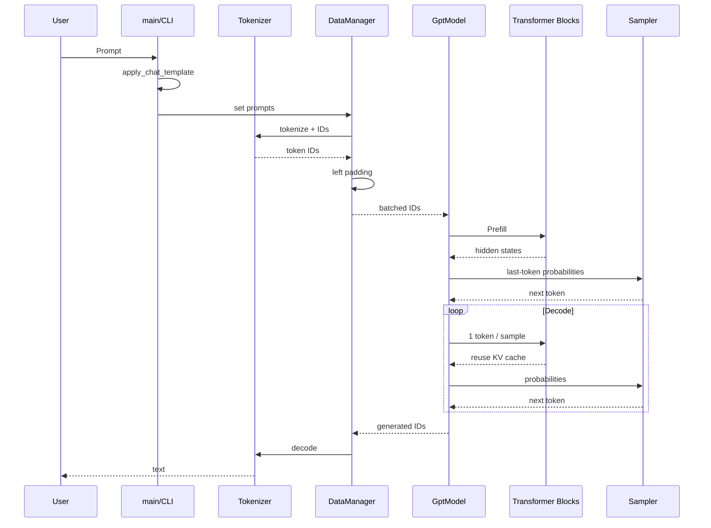
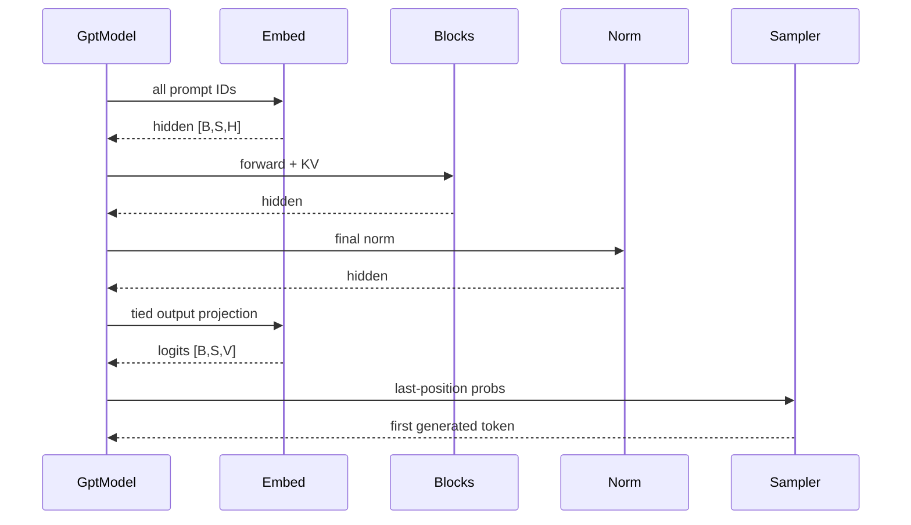
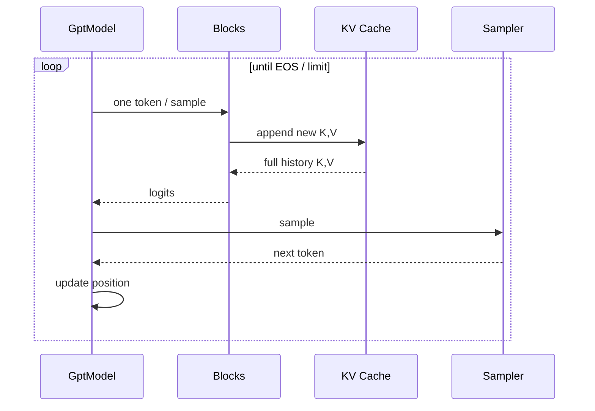
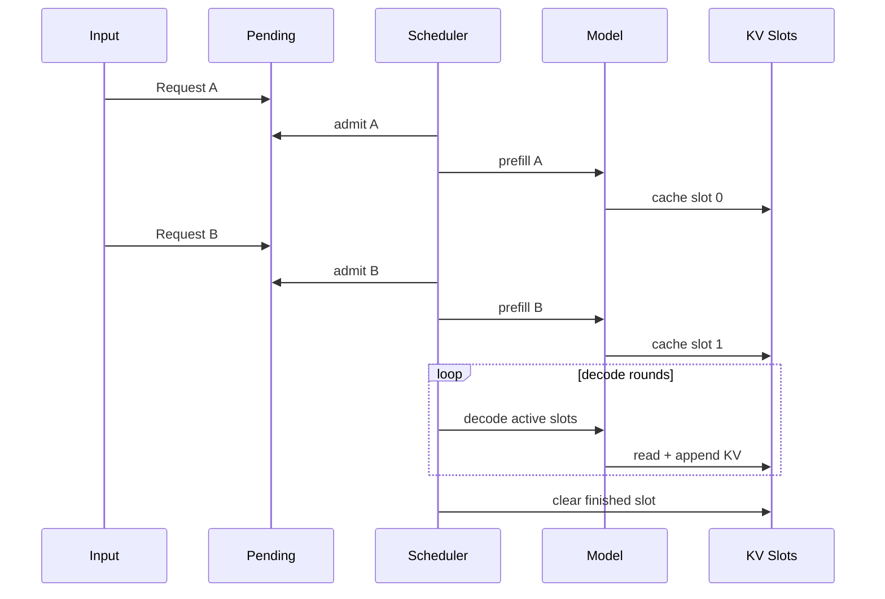
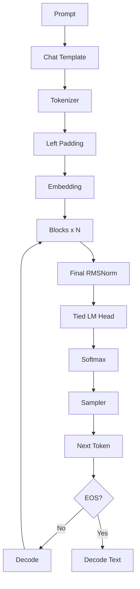
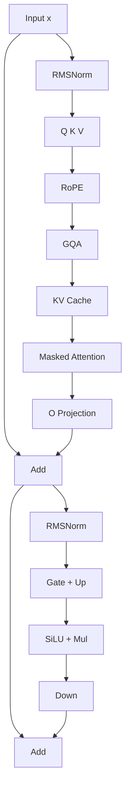
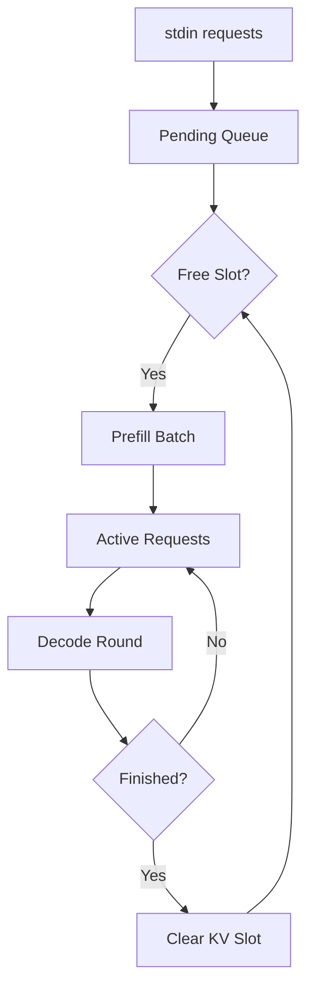

# easy_llm.cpp 源码导读：从一条 Prompt 到下一个 Token

> **本文生成要求（整理版）**
>
> 通读 `eagle-dai/easy_llm.cpp` 仓库的代码、README、构建脚本和测试，在 `my/docs/` 下编写一份简体中文教程。教程需要从读者视角组织知识，先建立最少必要背景，再沿真实代码路径逐层深入；解释每个主要模块“做什么、为什么需要、代码如何实现、容易误解什么”。术语保留英文，并在文末提供词汇表。对于无法从仓库确认的行为，优先核对官方文档或规范；仍不能确认时明确说明，不把推测写成事实。适合时使用 Mermaid，尤其是 sequence diagram，并控制图的宽度。内容必须与当前仓库代码一致。生成后应重新检查结构、事实、代码路径和图表。
>
> 参考写作链接由用户提供：`https://mp.weixin.qq.com/s/1hyhKlbni06xi2q1xIarZQ`。生成环境未能可靠读取该页面，因此本文没有虚构或转述其中的具体内容，只遵循上面的明确写作要求。

> **文档组织说明：** 本教程保留为一个完整 Markdown 文件，便于全文搜索、连续阅读和分享。仓库中的 [`build-test-run.zh-CN.md`](build-test-run.zh-CN.md) 单独保留，因为它定位为经过实测的 CPU-only 编译 / 测试 / 运行速查；本文侧重源码结构、设计原因与实现细节。

---

## 0. 先说结论：这个项目到底是什么

`easy_llm.cpp` 是一个**自己实现关键推理流程的微型 C++ 大模型推理框架（LLM inference framework）**。

它当前默认面向 **Qwen2.5-0.5B-Instruct**，核心目标不是追求 vLLM、TensorRT-LLM、llama.cpp 那样的成熟性能和模型覆盖，而是把一条大模型推理链路拆成能顺着源码读下去的模块：

```text
Prompt
  ↓
Chat Template
  ↓
Tokenizer / BPE
  ↓
Token IDs + Left Padding
  ↓
Embedding
  ↓
Transformer Blocks × N
  ├─ RMSNorm
  ├─ Self-Attention
  │  ├─ Q/K/V Projection
  │  ├─ RoPE
  │  ├─ GQA
  │  ├─ Causal / Padding Mask
  │  └─ KV Cache
  ├─ Residual
  ├─ RMSNorm
  ├─ Gated MLP
  └─ Residual
  ↓
Final RMSNorm
  ↓
Embedding Weight Tying → Logits
  ↓
Softmax
  ↓
Greedy / Top-K / Top-P Sampling
  ↓
Next Token
  ↓
继续 Decode，直到 EOS 或达到步数限制
```

第一次看到图里的缩写不需要停下来查完所有定义。先有一个最低限度的认识即可：

- **BPE（Byte Pair Encoding）**：把文本切成模型词表里的 token；
- **RMSNorm（Root Mean Square Layer Normalization）**：Transformer 中使用的归一化；
- **RoPE（Rotary Position Embedding）**：把位置信息作用到 Q/K；
- **GQA（Grouped Query Attention）**：Query heads 多于共享的 Key/Value heads；
- **KV Cache（Key-Value Cache）**：保存历史 token 已计算好的 K/V，供 Decode 复用；
- **EOS（End of Sequence）**：序列结束 token。

这些概念后面都会回到真实代码逐个展开。现在只需要知道它们位于整条链路的什么位置。

项目还有第二条运行路径：

```text
多个持续到来的请求
  ↓
Pending Queue
  ↓
Prefill Admission
  ↓
Active Requests
  ↓
每轮把仍活跃的请求一起 Decode
  ↓
请求结束 → 释放 KV Cache Slot
```

这就是 **Continuous Batching**。

如果只记一件事，可以记：

> `easy_llm.cpp` 的价值在于：它把“LLM 推理到底发生了什么”直接摊在 C++ 代码里，而不是把核心逻辑藏在大型框架里。

---

## 1. 推荐阅读顺序

不要从 `src/cuda/ops/self_attn.cu` 开始。

那是整个仓库最复杂的区域之一，而且在理解 CPU baseline 之前读 CUDA kernel，容易同时被 Transformer、Tensor shape、memory layout 和 CUDA execution model 四件事淹没。

建议按下面顺序：

1. **先运行 CPU 版本**
2. 看 `src/main.cpp`
3. 看 `src/gpt_engine.cpp`
4. 看 `src/data_manager.cpp`
5. 看 `src/tokenizer.cpp` + `src/bpe.cpp`
6. 看 `src/models/gpt_model.cpp`
7. 看 `src/models/block.cpp`
8. 看 `src/models/self_attn.cpp`
9. 看 `src/models/mlp.cpp`
10. 看 `src/tensor.cpp` + `src/ops.cpp`
11. 看 `src/models/loader.cpp`
12. 看 Continuous Batching
13. 最后看 CUDA

这样每次只增加一个新的概念。

### 1.1 不需要一次把 4000 行全部读完

这份文档既是教程，也是后续查源码时的参考手册。第一次阅读时，不建议从头到尾逐字读完。

可以分三遍：

| 阅读阶段 | 建议重点 | 读完应该能回答什么 | 可以暂时跳过 |
|---|---|---|---|
| 第一遍：建立主线 | 第 2～6 节、第 14～17 节、第 29～32 节、第 45～50 节 | 一条 Prompt 怎样经过 Tokenizer、模型、Sampling 变成新 Token？Prefill 和 Decode 为什么分开？ | Safetensors 细节、CUDA、严格 parity |
| 第二遍：看懂模型内部 | 第 8～13 节、第 18～28 节、第 33～56 节 | Tensor shape 怎样变化？Attention、RoPE、GQA、KV Cache、MLP 分别做了什么？ | Continuous Batching、CUDA kernel |
| 第三遍：理解工程化 | 第 57 节以后 | 多请求怎样调度？CPU/CUDA 怎样切换？测试在保护哪些 invariant？怎样扩展项目？ | 无需强求一次记住所有实现细节 |

第一遍只要抓住下面 6 个问题：

1. 文本在哪里变成 token IDs？
2. token IDs 在哪里变成 hidden states？
3. 一个 Transformer Block 对 hidden states 做了什么？
4. Prefill 为什么输入整段 Prompt，而 Decode 每次只输入 1 个 token？
5. 历史 token 为什么不需要每轮重新计算 K/V？
6. logits 最后怎样变成一个 next token？

如果这 6 个问题还没有答案，不要急着进入 CUDA。

---

## 2. 第一次运行：先只跑 CPU

### 2.1 环境要求

仓库当前的通用 CPU 构建要求：

- C++17 compiler
- CMake >= 3.10
- OpenMP 可选，默认尝试开启
- 模型文件放在 `data/model/`

推荐构建时把 CPU-only 意图写清楚，显式关闭 CUDA：

```bash
cmake -S . -B build \
  -DEASY_LLM_ENABLE_CUDA=OFF \
  -DCMAKE_BUILD_TYPE=RelWithDebInfo \
  -DCMAKE_CXX_COMPILER=g++

cmake --build build --target easy_llm -j8
```

这里有一个很容易踩的坑：

- `CMakeLists.txt` 里的 `EASY_LLM_ENABLE_CUDA` 默认值是 `OFF`；
- 但仓库当前的 `build.sh` **显式传入 `-DEASY_LLM_ENABLE_CUDA=ON`**，并固定 `CMAKE_CUDA_ARCHITECTURES=120`。

因此在没有 CUDA 工具链/GPU 的机器上，不要直接把 `build.sh` 当 CPU 构建脚本。仓库中已经有经过实测的 CPU-only 编译/测试/运行指南：[`build-test-run.zh-CN.md`](build-test-run.zh-CN.md)。

为什么建议先用 CPU？

因为代码以 CPU 路径作为 baseline：

- Tensor 行为容易追踪；
- `SelfAttn::forward_cpu()` 基本把 Attention 的步骤直接写出来；
- CUDA 是条件编译的可选后端；
- CUDA 失败时，部分算子还会回退 CPU。

### 2.2 模型文件

默认路径来自 `include/config.hpp`：

```text
data/model/
├── config.json
├── model.safetensors
├── tokenizer.json
└── tokenizer_config.json
```

默认适配的是：

```text
Qwen/Qwen2.5-0.5B-Instruct
```

这四个文件承担不同职责：

| 文件 | 作用 |
|---|---|
| `config.json` | 模型结构参数，如 layer 数、head 数、hidden size、RoPE 参数 |
| `model.safetensors` | 真正的模型权重 |
| `tokenizer.json` | vocab、BPE merges 等 tokenizer 数据 |
| `tokenizer_config.json` | tokenizer 的附加配置；**当前 C++ 主要读取 special token / pad token，chat template 并没有从这里动态加载** |

### 2.3 最小运行

```bash
./build/easy_llm --greedy "Hello"
```

也可以：

```bash
./build/easy_llm \
  --max-steps 128 \
  --temperature 0.7 \
  --top-p 0.9 \
  --top-k 40 \
  "Hello"
```

这里先提前说明一个容易误读的点：**当前 `--max-steps` 不是常见 API 里的纯 `max_new_tokens`**。它更接近把 prompt 位置也计入的总 step ceiling；Prefill 本身已经会生成第一个 token。第 50 节会结合 `gpt_model.cpp` 和 `continuous_batch_server.cpp` 的实际代码展开这个语义。

先看帮助：

```bash
./build/easy_llm --help
```

### 2.4 多条 Prompt

Prompt 文件一行一条：

```text
Hello
Explain KV cache.
What is grouped query attention?
```

运行：

```bash
./build/easy_llm -f test/data/test_batch.txt
```

如果输入文件是：

```text
test/data/test_batch.txt
```

程序会生成：

```text
test/data/test_batch_output.txt
```

这件事是在 `src/main.cpp` 中通过 `stem + "_output" + ext` 实现的。

---

## 3. 先建立最少必要背景

这一章只讲后面读代码必须知道的东西。

### 3.1 LLM inference 本质上在做什么

对一个 Causal Language Model 来说，一次生成可以抽象成：

```text
已有 token
    ↓
Model Forward
    ↓
得到 vocabulary 中每个 token 的 logits
    ↓
Softmax
    ↓
得到 probability distribution
    ↓
Sampling
    ↓
选出一个 next token
    ↓
把 next token 接回输入
    ↓
重复
```

例如：

```text
输入 token: [A, B, C]
模型预测:   D

下一步：
输入历史:   [A, B, C, D]
模型预测:   E
```

真正的优化点在于：

> 第二步生成 `E` 时，没有必要重新计算 A/B/C 对 Attention 的全部 Key 和 Value。

所以才有 **KV Cache**。

---

### 3.2 Prefill 和 Decode

这是理解仓库最重要的一组术语。

#### Prefill

第一次把整段 Prompt 喂给模型：

```text
[A, B, C, D, E]
```

模型会一次计算这整段序列，并建立 KV Cache。

这叫：

```text
Prefill
```

#### Decode

之后每一步只输入刚生成的 1 个 token：

```text
[F]
```

然后：

```text
[G]
```

然后：

```text
[H]
```

历史上下文通过 KV Cache 提供，不需要每次重新输入整个 Prompt。

这叫：

```text
Decode
```

因此代码中经常看到：

```text
Prefill: [batch, seq_len, ...]
Decode:  [batch, 1, ...]
```

---

### 3.3 Logits、Softmax、Sampling

模型最后不会直接说“下一个 token 是 123”。

它输出：

```text
logits = [
  token 0 的分数,
  token 1 的分数,
  ...
  token V-1 的分数
]
```

`V` 是 vocabulary size。

经过 Softmax 后得到概率：

```text
probs = softmax(logits)
```

然后由 Sampler 决定选哪个 token。

仓库支持：

- Greedy
- Temperature
- Top-K
- Top-P

后面会具体看代码。

---

### 3.4 Tensor shape 是读源码的第一语言

LLM 源码里，很多问题其实不是数学问题，而是 shape 问题。

本文统一用：

```text
B = batch size
S = sequence length
H = hidden size
Nh = number of query attention heads
Nkv = number of key/value heads
D = head dimension
V = vocabulary size
I = MLP intermediate size
L = KV cache length
```

Qwen2.5-0.5B-Instruct 官方 `config.json` 的核心参数是：

```text
H   = 896
Nh  = 14
Nkv = 2
D   = 896 / 14 = 64
I   = 4864
V   = 151936
Layers = 24
```

因此 Q/K/V projection 刚完成 split heads 时：

```text
Q: [B, 14, S, 64]
K: [B,  2, S, 64]
V: [B,  2, S, 64]
```

这里已经能看出 **GQA（Grouped Query Attention）**：Query 有 14 个 head，而 Key/Value 只有 2 个 head。

在**本项目 CPU Attention 实现**里，后面会用 `repeat()` 把 K/V 临时扩展到与 14 个 Query heads 对应的形态再做矩阵计算。这个 `repeat()` 是当前实现选择，不要把它误认为 GQA 定义本身要求“物理复制 K/V”。

第一次读 shape 时，可以先记住这一条主链：

```text
token ids          [B, S]
    ↓ Embedding
hidden states      [B, S, H]
    ↓ Q/K/V projection + split heads
Q                  [B, Nh,  S, D]
K,V                [B, Nkv, S, D]
    ↓ Attention（结合历史 KV Cache）
attention output   [B, S, H]
    ↓ Blocks + final RMSNorm
final hidden       [B, S, H]
    ↓ output projection / weight tying
logits             [B, S, V]
```

后面看到任何函数时，先问一句：**它把 shape 从什么变成什么？** 这通常比先钻进循环细节更容易找到主线。

---

## 4. 仓库地图：每个目录负责什么

```text
easy_llm.cpp/
├── CMakeLists.txt
├── README.md
├── README.zh-CN.md
├── build.sh
├── include/
│   ├── tensor.hpp
│   ├── ops.hpp
│   ├── tokenizer.hpp
│   ├── bpe.hpp
│   ├── data_manager.hpp
│   ├── sampler.hpp
│   ├── continuous_batch_server.hpp
│   ├── models/
│   └── cuda/
├── src/
│   ├── main.cpp
│   ├── cli_options.cpp
│   ├── config.cpp
│   ├── tokenizer.cpp
│   ├── bpe.cpp
│   ├── data_manager.cpp
│   ├── tensor.cpp
│   ├── ops.cpp
│   ├── sampler.cpp
│   ├── continuous_batch_server.cpp
│   ├── models/
│   └── cuda/
├── test/
└── scripts/
```

先把它压缩成 6 个层次：

```text
CLI / Service
    ↓
DataManager / Tokenizer
    ↓
GptModel
    ↓
Block
    ↓
SelfAttn + MLP
    ↓
Tensor / Ops / CUDA
```

这张图比目录树本身更重要。

---

## 5. 从 `main.cpp` 看程序主流程

先看最上层，不进数学。

可以压缩成：

```text
parse CLI
  ↓
load config
  ↓
load model weights
  ↓
create Tokenizer
  ↓
create DataManager
  ↓
create GptModel
  ↓
apply Qwen chat template
  ↓
normal inference
或
continuous serving
```

对应组件大致是：

```cpp
Config config;
config.load_config(...);

ModelParam model_param;
model_param.load(...);

Tokenizer tokenizer(...);
DataManager data_manager(...);
GptModel model(...);
```

从这里可以先得到一个重要结论：

> 这个项目不是“只有 Transformer 数学”。真正完整的 LLM inference 还包含模型文件、Tokenizer、输入整理、生成状态、Sampling 和服务调度。

---

## 6. 一条 Prompt 的总 Sequence



后面所有章节其实都是在解释这张图的某一条箭头。

---

## 7. Chat Template：模型看到的不是原始 Prompt

用户输入：

```text
Hello
```

当前项目不会直接 tokenize `Hello`。

`src/cli_options.cpp` 中有一个硬编码的 Qwen 模板，大致形成：

```text
<|im_start|>system
You are Qwen...<|im_end|>
<|im_start|>user
Hello<|im_end|>
<|im_start|>assistant
```

这件事为什么重要？

因为 Instruct / Chat 模型不是只靠权重决定行为。

模型训练时还约定了输入格式。

所以：

```text
同一模型
+
不同 chat template
```

可能得到完全不同的行为。

这里还有一个很重要的工程边界：

> 当前 C++ **没有动态读取 `tokenizer_config.json` 里的 `chat_template` 并执行**；它使用的是代码里写死的 Qwen template。

因此以后换模型，至少要同时考虑：

```text
模型权重兼容
+
参数 key 兼容
+
Tokenizer 兼容
+
Chat Template 兼容
```

只换一个 `model.safetensors` 并不意味着就自动支持另一个模型系列。

---

# 第二部分：文本如何变成 Token

## 8. `Tokenizer` 和 `Bpe` 的分工

这两个模块不要混在一起理解。

### `Tokenizer`

负责：

```text
完整 tokenizer 生命周期
```

包括：

- 加载 vocab；
- 加载 merges；
- 注册 special tokens；
- 找 pad token；
- text → tokens；
- tokens → ids；
- ids → tokens；
- ids → decoded text。

### `Bpe`

只负责：

```text
普通文本片段的 Byte-level BPE encode/decode
```

因此关系是：

```text
Tokenizer
  ├─ special-token handling
  ├─ vocab / id mapping
  └─ Bpe
       ├─ byte mapping
       ├─ merge ranks
       └─ BPE merge
```

---

## 9. 为什么需要 Byte-level BPE

模型不能直接接受 UTF-8 字符串。

它需要整数 ID：

```text
"hello"
   ↓
["hello"]
   ↓
[14990]
```

真实情况会更复杂：

```text
一个字符串
  ↓
UTF-8 bytes
  ↓
Byte-to-Unicode mapping
  ↓
BPE merge
  ↓
token strings
  ↓
vocab lookup
  ↓
token ids
```

Byte-level 的一个重要价值是：

> 输入最终可以退到 byte 表示，不要求词表提前包含所有可能 Unicode 文本的完整“词”。

---

## 10. `Bpe::apply_bpe()` 到底在做什么

`src/bpe.cpp` 的核心思路是：

1. 把输入拆成当前 token 单元；
2. 检查所有相邻 pair；
3. 找 merge rank 最优的 pair；
4. 合并；
5. 重复；
6. 直到没有可合并 pair。

伪代码：

```text
chars = split(word)

while true:
    找到 rank 最小的相邻 pair
    if 没找到:
        break
    merge(pair)
```

`merge_ranks_` 的意义就是：

```text
哪个 pair 应该优先合并
```

而：

```cpp
bpe_cache_
```

用于缓存已经 BPE 过的 word，避免重复工作。

---

## 11. Special Token 为什么不能直接扔给普通 BPE

例如：

```text
<|im_start|>
```

对 Qwen 来说这是一个有特殊语义的 token。

如果先按照普通文本拆碎：

```text
<
|
im
_
start
|
>
```

就已经错了。

因此 `Tokenizer` 中的 `EncodingSession` 会：

1. 先扫描 special token；
2. 普通片段交给 BPE；
3. special token 原样保留；
4. 再统一映射到 token ID。

---

## 12. 一个需要特别知道的 Tokenizer 兼容性边界

这里不能只看“结果大多数时候像是对的”。

官方 Transformers 当前的 `Qwen2Tokenizer` 使用专门的 pre-tokenization regex，再接 ByteLevel pre-tokenizer。

仓库里的 `Bpe::encode_into()` 当前采用更简化的方法：

```cpp
std::istringstream iss(text);
while (iss >> word) {
    ...
}
```

这意味着它主要按 whitespace 拆普通文本。

两者**不是严格等价实现**。

官方 Qwen2 pre-tokenization 会区分：

- 字母；
- 数字；
- 标点；
- 换行；
- contractions；
- whitespace pattern。

这里尤其要注意 `std::istringstream >> word` 的语义：普通文本片段中的连续 whitespace 会被当成分隔符，换行本身不会作为独立 tokenization pattern 被保留。Qwen chat template 又恰好大量使用换行，所以如果目标是严格复现官方 token IDs，这不是一个可以忽略的小差异。

因此：

> 如果目标是学习推理链路，这个实现更容易读；如果目标是和 Hugging Face tokenizer 做 token-by-token 严格一致，需要专门建立 tokenizer parity tests。

这是当前代码最值得关注的兼容性点之一。

官方实现可核对：

```text
https://github.com/huggingface/transformers/blob/main/src/transformers/models/qwen2/tokenization_qwen2.py
```

---

## 13. BOS 行为也要单独验证

`Tokenizer::tokens_to_ids()` 中当前逻辑是：

```cpp
if (bos_token_id_ >= 0) {
    token_ids.push_back(bos_token_id_);
}
```

而 `bos_token_id_` 来自模型 `config.json`。

Qwen2.5-0.5B-Instruct 的模型 config 中：

```text
bos_token_id = 151643
```

但官方 `tokenizer_config.json` 同时写着：

```text
add_bos_token = false
```

所以两边的行为并非天然等价。

这里最合适的理解是：

> `easy_llm.cpp` 当前实现选择了“只要 config 里有有效 BOS，就自动前插 BOS”的规则；它不是完整复制 Hugging Face tokenizer 的 `add_bos_token` 语义。

如果做数值 parity，对输入 token IDs 的第一项要重点检查。

---

# 第三部分：Batch 与 Left Padding

## 14. `DataManager` 为什么存在

`DataManager` 并不是神经网络的一层。

它解决的是：

```text
应用输入数据
     ↓
怎样整理成模型需要的 batch
```

职责包括：

- 保存输入；
- tokenize；
- 保存 `seq_len`；
- 计算 `pad_len`；
- left padding；
- 保存生成 token；
- 最后 decode 输出。

---

## 15. 为什么 batch 需要 padding

假设两个 Prompt token 长度不同：

```text
A: [11, 12, 13, 14]
B: [21, 22]
```

要放进同一个矩形 Tensor：

```text
[B, S]
```

就必须补齐。

仓库使用 **left padding**：

```text
A: [11, 12, 13, 14]
B: [ P,  P, 21, 22]
```

其中 `P` 是 pad token。

此时：

```text
A.seq_len = 4
A.pad_len = 0

B.seq_len = 2
B.pad_len = 2
```

---

## 16. Left Padding 最容易漏掉的问题：position

如果只是 left pad：

```text
[P, P, 21, 22]
```

然后直接把数组 index 当 position：

```text
P  -> 0
P  -> 1
21 -> 2
22 -> 3
```

那么 token `21` 的真实序列 position 被错误地当成了 2。

仓库的处理方法是：

```cpp
prefill_offset = -pad_len
```

所以对于 B：

```text
pad_len = 2
offset = -2
```

RoPE 使用：

```text
position = j + offset
```

于是：

```text
j=2 → position=0
j=3 → position=1
```

真实 token 的 position 被还原了。

这是：

```cpp
generation::build_prefill_pos_offsets()
```

存在的重要原因。

---

## 17. Padding 还需要 Mask

位置修正还不够。

Attention 也不能看到左边的 pad token。

因此 `SelfAttn` 同时应用：

- causal mask；
- valid length mask；
- padding mask。

Padding mask 会把 pad 对应的 attention score 设成：

```text
-inf
```

Softmax 后接近：

```text
0
```

所以 pad 不参与有效 Attention。

---

# 第四部分：模型权重是怎么加载的

## 18. `model.safetensors` 是什么

当前 loader 在：

```text
src/models/loader.cpp
```

加载：

```text
model.safetensors
```

Safetensors 文件的高层结构：

```text
8-byte header length
       ↓
JSON header
       ↓
raw tensor data
```

8 字节整数采用 little-endian。

JSON header 里，每个 Tensor 大致包含：

```json
{
  "dtype": "BF16",
  "shape": [896, 896],
  "data_offsets": [begin, end]
}
```

所以 loader 需要解决：

```text
文件在哪里
参数叫什么
shape 是什么
dtype 是什么
原始 bytes 在哪里
```

---

## 19. 为什么使用 mmap

代码使用 POSIX：

```text
open
fstat
mmap
munmap
close
```

它不是先：

```text
读整个 1GB 文件
↓
复制到大 buffer
```

而是：

```text
文件
 ↓ mmap
虚拟地址空间
```

然后按照 Safetensors 的 offset 直接访问需要的区域。

这种方式的优点：

- 减少手工大块 I/O 管理；
- OS 管理 page cache；
- 可以直接按 offset 访问 tensor bytes；
- Loader 逻辑很直观。

但这也带来一个现实限制：

> 当前 loader 是 POSIX-oriented。

所以 Linux / WSL 更自然。

如果原生 Windows + MSVC，要替换或封装 file mapping 层。

---

## 20. Dtype 怎么处理

Safetensors 可能是：

```text
BF16
F16
F32
```

项目内部 Tensor 类型由编译宏控制。

当前 CMake：

```text
USE_BF16
```

是默认定义。

所以主路径是：

```text
BF16 storage
```

如果源权重 dtype 和目标类型一致：

```text
memcpy
```

如果不一致：

```text
decode source element
      ↓
convert
      ↓
store target element
```

例如：

```text
F32 checkpoint
      ↓
float
      ↓
BF16 target
```

---

## 21. BF16 最容易误解的地方

BF16 并不是：

```text
所有计算都只用 16-bit 精度完成
```

CPU `matmul_3d()` 中当前的典型过程是：

```text
BF16 input
   ↓ convert
FP32
   ↓ multiply + accumulate
FP32 accumulator
   ↓ cast
BF16 output
```

所以：

```text
storage precision
```

和：

```text
accumulation precision
```

要区分。

这里是：

```text
BF16 storage
FP32 accumulation
```

---

## 22. 模型参数名为什么不能写死在 Loader 里

Hugging Face Qwen2 checkpoint 常见：

```text
model.layers.0.self_attn.q_proj.weight
model.layers.0.self_attn.k_proj.weight
...
```

项目使用：

```text
LayerKeyPrefix
```

抽象模型 family 对应的参数 key pattern。

当前代码主要 dispatch：

```text
Qwen2ForCausalLM
qwen2
```

如果 architecture / model_type 不属于支持的 Qwen2 family：

```text
throw unsupported architecture/model_type
```

这点很重要：

> 当前项目不是“任意 Hugging Face CausalLM 自动加载器”。

它有明确的 model-family contract。

---

## 23. 参数校验为什么要在 load 前做

项目有：

```text
model_param_validation.cpp
```

在真正把权重交给 Layer 之前检查：

- 必要参数是否存在；
- Tensor shape 是否符合 config；
- layer 数是否匹配；
- embedding / norm / projection 是否存在。

例如：

```text
q_proj
```

Qwen 期望：

```text
[hidden_size, hidden_size]
```

K/V 则：

```text
[num_kv_heads * head_dim, hidden_size]
```

为什么要提前校验？

因为否则错误可能拖到很后面才出现：

```text
加载成功
↓
跑了十层
↓
某个 matmul shape 不对
↓
才 crash
```

更好的错误是：

```text
模型初始化阶段
↓
明确告诉你哪个参数缺失 / shape 不对
```

---

## 24. `take_param()` 为什么是 move

Layer 初始化时会：

```cpp
auto tensor = model_param.take_param(key);
```

而不是保留两份权重。

概念上：

```text
ModelParam 临时仓库
      ↓ move
具体 Layer 成员
```

随后从 map 中 erase。

优点：

- 避免复制大 Tensor；
- 明确 ownership 已转移；
- 最后可以检查还有没有“没人认领”的参数。

不过最后：

```text
validate_no_remaining_model_params()
```

对额外权重当前是：

```text
WARN
```

不是：

```text
throw
```

为什么这样合理？

因为：

```text
缺必要权重
```

通常一定是错误；

但：

```text
checkpoint 多了当前实现不用的参数
```

不一定必须阻止运行。

---

# 第五部分：Tensor 与 Ops

## 25. Tensor 本身非常简单

项目没有引入 PyTorch Tensor。

自己的 Tensor 本质是：

```cpp
std::vector<data_type> data_;
std::vector<int> shape_;
```

也就是：

```text
一块连续数据
+
shape metadata
```

这使项目非常适合读底层推理，因为很多“大框架自动帮你做的事”在这里变得可见。

---

## 26. `reshape()` 不搬数据

`reshape()` 做的核心事情：

```text
验证 element count 不变
↓
修改 shape metadata
```

例如：

```text
[2, 3, 4]
```

可以 reshape：

```text
[6, 4]
```

因为：

```text
2 × 3 × 4 = 6 × 4
```

这类操作理论上便宜。

---

## 27. `transpose()` 会搬数据

这一点特别值得记。

很多成熟 Tensor framework 的 transpose 可以只是：

```text
修改 strides / view
```

当前项目的 `Tensor::transpose()` 则真正分配新的 buffer 并复制元素。

所以：

```text
transpose
```

在这里不是“零成本 metadata operation”。

这也是以后性能优化的一个明显点。

---

## 28. `matmul_3d()` 的 shape 约定

项目最关键的 Linear 运算之一：

```text
input  [B, S, in]
weight [out, in]
```

输出：

```text
[B, S, out]
```

这对应 Linear：

```text
y = x W^T
```

因为 checkpoint 里的 Linear weight 通常存成：

```text
[out_features, in_features]
```

代码不要求你先手工 transpose checkpoint 权重。

---

# 第六部分：GptModel 和 Block

## 29. `GptModel` 负责什么

`GptModel` 不是单纯的一层 Transformer。

它同时负责：

- Embedding；
- 多个 Block；
- final RMSNorm；
- LM head / weight tying；
- KV cache 初始化与清理；
- Prefill；
- Decode；
- EOS filtering；
- GenerationContext；
- Sampling。

可以理解成：

```text
模型结构
+
生成状态机
```

---

## 30. Embedding 为什么出现两次

第一次：

```cpp
output = embedding_->forward(input);
```

输入是 token IDs：

```text
[B,S]
```

输出：

```text
[B,S,H]
```

在所有 Transformer Blocks 结束后，又看到：

```cpp
output = embedding_->forward(output);
```

为什么已经做过 Embedding，又做一次 Embedding？

其实 `Embedding` 有不同 overload。

### 输入 token IDs 时

```cpp
Embedding::forward(vector<vector<int>>)
```

做的是：

```text
token id
  ↓
查 embedding table
  ↓
hidden vector
```

### 输入 hidden Tensor 时

```cpp
Embedding::forward(const Tensor&)
```

做的是：

```cpp
ops::matmul_3d(input, weights_)
```

即：

```text
hidden state × embedding weight
  ↓
vocabulary logits
```

这是 **weight tying**。

Qwen2.5-0.5B-Instruct 官方 config：

```text
tie_word_embeddings = true
```

所以这里复用 `model.embed_tokens.weight` 是符合该模型配置的。

---

## 31. `Block` 为什么看起来特别薄

`Block::forward()` 基本只有：

```cpp
auto output_attn = self_attn_.forward(input, ...);
ops::add_inplace(output_attn, input);

auto output = mlp_.forward(output_attn);
ops::add_inplace(output, output_attn);
```

也就是：

```text
x
 ↓
SelfAttn
 ↓
+ x
 ↓
MLP
 ↓
+ residual
```

有人会问：

> Norm 去哪里了？

答案是：

- Attention 前的 RMSNorm 在 `SelfAttn` 内；
- MLP 前的 RMSNorm 在 `MLP` 内。

因此真实逻辑是：

```text
x
 ├──────────────────────┐
 ↓                      │
RMSNorm                  │
 ↓                       │
Self-Attention           │
 ↓                       │
 + <─────────────────────┘
 ↓ x1
 ├──────────────────────┐
 ↓                      │
RMSNorm                  │
 ↓                       │
Gated MLP                │
 ↓                       │
 + <─────────────────────┘
 ↓
output
```

这和 Qwen2 的 Pre-Norm decoder layer 结构一致。

---

# 第七部分：Self-Attention，按代码一步一步看

## 32. Self-Attention 的 CPU path 是最重要的一段源码

核心文件：

```text
src/models/self_attn.cpp
```

`forward_cpu()` 基本按照 Attention 运算顺序展开：

```text
1. RMSNorm
2. Q projection
3. K projection
4. V projection
5. split heads
6. RoPE(Q, K)
7. expand K/V heads for GQA
8. append KV cache
9. build active cache batch
10. Q × K^T
11. masks
12. / sqrt(head_dim)
13. softmax
14. Attention × V
15. merge heads
16. O projection
```

这是整个仓库最值得精读的函数之一。

---

## 33. Step 1：RMSNorm

代码：

```cpp
auto input_norm = norm_.forward(input);
```

RMSNorm 计算大致是：

```text
rms(x) = sqrt(mean(x²) + eps)

y = weight * x / rms(x)
```

和 LayerNorm 相比，它不减 mean。

当前 `RMSNorm::forward()` 中：

```text
epsilon = 1e-6
```

Qwen2.5-0.5B-Instruct 官方 config 也是：

```text
rms_norm_eps = 1e-6
```

所以默认模型匹配。

不过当前 `Config::load_config()` **没有读取 `rms_norm_eps`**，而是 RMSNorm 里直接写死 `1e-6`。

因此如果将来支持另一个要求不同 epsilon 的模型，这里要改成配置驱动。

---

## 34. Step 2：Q、K、V Projection

输入：

```text
input_norm: [B, S, 896]
```

Qwen2.5-0.5B：

```text
q_proj weight: [896, 896]
k_proj weight: [128, 896]
v_proj weight: [128, 896]
```

因为：

```text
Nkv × D = 2 × 64 = 128
```

所以 projection 后：

```text
Q: [B, S, 896]
K: [B, S, 128]
V: [B, S, 128]
```

---

## 35. Step 3：Split Heads

代码：

```cpp
q.split_head(num_heads_).transpose(1, 2);
k.split_head(num_heads_kv_).transpose(1, 2);
v.split_head(num_heads_kv_).transpose(1, 2);
```

得到：

```text
Q: [B, 14, S, 64]
K: [B,  2, S, 64]
V: [B,  2, S, 64]
```

---

## 36. GQA 到底是什么

GQA = **Grouped Query Attention**。

在普通 MHA 中：

```text
query heads = key heads = value heads
```

例如：

```text
14 / 14 / 14
```

这里是：

```text
Q heads  = 14
KV heads = 2
```

于是每个 K/V head 被多个 Q head 共享。

Qwen2.5-0.5B：

```text
14 / 2 = 7
```

每个 KV head 对应 7 个 query heads。

仓库里：

```cpp
k.repeat(num_heads_ / num_heads_kv_, 1);
v.repeat(num_heads_ / num_heads_kv_, 1);
```

把 K/V 在 head 维扩展到：

```text
[B, 14, S, 64]
```

从数学结果看，这和“不同 Q heads 共享同一组 KV”对应。

---

## 37. 为什么 GQA 有价值

KV Cache 的主要体积和：

```text
K + V
```

有关。

如果 Q 有 14 heads，但 KV 只保留 2 heads，从模型原始表示上看，KV 数据规模明显小于 14-head MHA。

不过要注意本项目 CPU Attention 在进行实际矩阵计算前会：

```cpp
repeat
```

把 K/V 扩到 Q head 数再写入当前 CPU-side cache。

因此：

> “模型架构采用 GQA”是事实，但不能简单推断“当前 CPU cache 一定获得理论上的完整 GQA 内存节省”。

如果要评估实际内存，要按当前 cache tensor 的真实 shape 算。

---

## 38. RoPE 在哪里发生

代码：

```cpp
apply_rope_offsets(q, k, ctx);
```

只对：

```text
Q
K
```

做 RoPE。

V 不做。

RoPE = **Rotary Position Embedding**。

它不是给 hidden state 加一个 position vector，而是对 Q/K 的成对维度做旋转，使 Attention score 带上相对位置信息。

项目支持：

```text
同一个 batch 使用统一 offset
```

以及：

```text
每个 sample 使用自己的 offset
```

后者对 left padding 和 Continuous Batching 非常重要。

---

## 39. KV Cache 为什么按 sample 保存

CPU cache：

```cpp
std::vector<Tensor> cache_k_by_sample_;
std::vector<Tensor> cache_v_by_sample_;
```

每个 sample 的 cache shape 注释是：

```text
[1, num_heads, cache_len, head_dim]
```

为什么不直接只有一个固定 `[B,H,L,D]`？

因为在生成过程中：

- 有的 request 已结束；
- 有的还在继续；
- Continuous Batching 还会插入新请求；
- 不同 request 的 cache length 不一定相同。

所以使用：

```text
stable sample/slot id
+
per-sample cache
```

更适合动态 batch。

---

## 40. Cache 长度不同，怎么重新组成 batch

假设当前两个 active request：

```text
A cache len = 8
B cache len = 5
```

要做 batched attention，需要临时形成矩形：

```text
A: [........] len 8
B: [.....PPP] len 5 + pad
```

`build_padded_active_cache()` 会：

1. 找当前 active samples 的最大 cache length；
2. 建一个 padded cache Tensor；
3. 记录每个 request 的 `valid_lens`。

然后：

```cpp
apply_valid_length_mask(...)
```

把 B 后面补出来的无效 cache 位置 mask 掉。

---

## 41. Attention Score 真正怎么算

先把 K cache 转置成：

```text
K: [B, H, D, L]
```

Q：

```text
Q: [B, H, S, D]
```

矩阵乘：

```text
Q @ K
```

得到：

```text
scores: [B, H, S, L]
```

然后：

```text
mask
↓
scale by 1/sqrt(D)
↓
softmax
```

再乘：

```text
V: [B, H, L, D]
```

得到：

```text
attention output: [B, H, S, D]
```

最后 merge heads：

```text
[B, S, H*D]
```

再做 `o_proj`。

---

## 42. 三种 Mask 不要混

### Causal Mask

目的：

```text
当前位置不能看到未来 token
```

Prefill 时：

```text
token 0 只能看 0
token 1 能看 0..1
token 2 能看 0..2
```

### Padding Mask

目的：

```text
不能把 input left-padding 当成真实上下文
```

### Valid Length Mask

目的：

```text
Continuous / variable-length KV batch 中，
不能看到为了拼矩形而补出来的 cache 空位
```

三者解决的是不同问题。

---

# 第八部分：MLP 不是普通“两层全连接”

## 43. 当前 Qwen MLP 是 gated MLP

`MLP::forward_cpu()`：

```cpp
auto input_norm = norm_.forward(input);

auto hidden = up_proj_.forward(input_norm);
auto gate = gate_proj_.forward(input_norm);

gate.silu();
hidden = ops::multiply(hidden, gate);

auto result = down_proj_.forward(hidden);
```

数学上是：

```text
up   = up_proj(x)
gate = SiLU(gate_proj(x))

hidden = up * gate
output = down_proj(hidden)
```

这就是 Qwen2 使用的 gated MLP 结构。

通常会把这一类写成：

```text
SwiGLU-style / SiLU-gated MLP
```

不要把它理解成：

```text
Linear → ReLU → Linear
```

---

## 44. Qwen2.5-0.5B 的 MLP shape

```text
input:
[B,S,896]

up_proj:
896 → 4864

gate_proj:
896 → 4864

elementwise multiply:
[B,S,4864]

down_proj:
4864 → 896

output:
[B,S,896]
```

Residual connection 要求最后回到 896。

---

# 第九部分：Prefill → Decode 是如何真正运行的

## 45. `GptModel::forward()` 是生成主状态机

普通模式的核心步骤：

```text
init KV cache
  ↓
建立 sample_ids
  ↓
记录 pad_lens / real seq_lens
  ↓
Prefill
  ↓
过滤 EOS
  ↓
Decode loop
  ↓
reset KV cache
```

---

## 46. Prefill sequence



Prefill 一次处理整个 Prompt。

但生成只取：

```text
最后一个有效预测位置
```

对应的 next token。

---

## 47. Decode sequence



每轮输入的 sequence length 是：

```text
1
```

历史来自 KV Cache。

---

## 48. `sample_ids` 为什么不能直接等于 batch index

普通一次性 batch 开始时：

```text
sample_ids = [0,1,2,...]
```

但如果某个 sample 先生成 EOS：

```text
原：
sample_ids = [0,1,2]

1 结束后：
sample_ids = [0,2]
```

此时新的 batch index：

```text
0 → sample 0
1 → sample 2
```

如果把 batch index 当永久身份，sample 2 的 KV Cache 就会被错认成 sample 1。

因此代码始终保留：

```text
stable sample_id
```

这是动态 batch 中非常关键的 invariant。

---

## 49. EOS 后为什么立刻清 Cache

`filter_eos_samples()` 会得到：

```text
仍活跃的 sample_ids
+
已结束的 sample_ids
```

对结束者调用：

```cpp
clear_kv_cache(sample_id);
```

原因很直接：

- 后面不再需要它的历史；
- 避免继续参与 batch；
- Continuous Batching 时 slot 可以复用。

还有一个输出层面的细节：当前代码是**先把采样出的 token 记录到输出，再检查它是不是 EOS**。因此如果生成到 `<|im_end|>`，这个 EOS token 本身会进入 `generated_token_ids`，最终 `Tokenizer::decode()` 也会把它解码出来。仓库自带的 `test/data/test_batch_output.txt` 中可以直接看到多条输出末尾带 `<|im_end|>`。

如果将来对外提供更接近常见 chat API 的返回值，通常会考虑在展示层过滤 stop token；但那是接口策略，不能和“模型内部是否生成了 EOS”混为一谈。

---

## 50. `max_steps` 的真实语义要看代码，不要只看参数名

CLI 帮助把它描述为：

```text
Maximum generation steps per request
```

但普通模式代码实际是：

```text
Prefill 后：
ctx.step = padded_input_seq_len

Decode 条件：
while (ctx.step < ctx.max_steps)
```

而 Prefill 自己已经会生成第一个 next token。

所以当前实现对单条 prompt 的近似生成 token 数是：

```text
max(1, max_steps - input_seq_len + 1)
```

服务模式也显式使用：

```cpp
max_generate_tokens =
    std::max(1, config_.max_steps - seq_len + 1);
```

因此：

> 当前 `max_steps` 更接近“把 prompt 位置也计入的总 step ceiling”，而不是常见 API 里的纯 `max_new_tokens`。

这是使用时很容易误解的地方。

另外普通 batch 使用 padded max sequence length 作为全局 `ctx.step`，因此不同长度 prompt 放入同一个普通 batch 时，短样本也受该 batch 最大 prompt 长度影响。

---

# 第十部分：Sampling

## 51. Greedy

最简单：

```text
选择 probability 最大的 token
```

代码就是：

```cpp
std::max_element(...)
```

适合：

- deterministic 调试；
- 做数值 parity；
- 排除随机性干扰。

如果在调模型正确性，建议先：

```bash
--greedy
```

---

## 52. Temperature

Temperature 控制分布尖锐程度。

常见写法是对 logits：

```text
softmax(logits / T)
```

项目当前已经先拿到 probability，然后做：

```text
p^(1/T)
```

再重新按候选总和解释采样权重。

因为：

```text
p_i ∝ exp(logit_i)
```

所以：

```text
p_i^(1/T) ∝ exp(logit_i / T)
```

在归一化常数被重新消除的条件下，两者对应相同的 temperature reweighting 思路。

---

## 53. Top-K

例如：

```text
top_k = 20
```

只留下 probability/weight 最大的 20 个 token。

其他 token 不参与随机抽样。

---

## 54. Top-P

Top-P = nucleus sampling。

例如：

```text
top_p = 0.9
```

候选按概率从高到低排序，从前往后累加，直到累计达到 0.9。

留下这个最小候选集合。

---

## 55. Sampling 顺序

当前代码大致是：

```text
probabilities
  ↓
temperature reweight
  ↓
sort descending
  ↓
Top-K
  ↓
Top-P
  ↓
random draw
```

随机数来自：

```cpp
std::mt19937
```

seed 来自 CLI/config。

所以固定：

```text
相同输入
+
相同模型
+
相同 seed
+
相同计算结果
```

Sampling 才有机会复现。

---

## 56. 与官方 Qwen generation config 的区别

Qwen2.5-0.5B-Instruct 官方 `generation_config.json` 当前包含类似：

```text
temperature = 0.7
top_p = 0.8
top_k = 20
repetition_penalty = 1.1
eos_token_id = [151645, 151643]
```

而项目 CLI 自己有默认 sampling 参数，并且当前：

- 没有实现 repetition penalty；
- `Config` 从模型 `config.json` 读取的是单个 `eos_token_id`；
- 没有把官方 generation config 作为运行配置源。

因此：

> “同一份权重”不代表默认 generation behavior 自动与 Hugging Face `generate()` 完全相同。

做输出 parity 时要统一 generation settings。

---

# 第十一部分：Continuous Batching

## 57. 为什么普通 batch 不够

普通 batch 假设：

```text
一批请求一起开始
一批请求生成
结束
```

服务场景却是：

```text
t0: A 到达
t1: B 到达
t2: C 到达
...
```

如果必须等当前整个 batch 全结束才接下一批，GPU/CPU 资源利用会变差，而且新请求等待时间也会增加。

Continuous Batching 的核心思想：

> decode 每一轮都可以重新组成“当前活跃请求集合”。

---

## 58. 这个项目里的三种请求状态

### Pending

已经提交，但还没拿到 slot：

```cpp
pending_prompts_
```

### Active

已经 Prefill，并拥有 KV Cache slot：

```cpp
active_requests_
```

### Finished

EOS 或达到限制：

```text
输出结果
清 KV
释放 slot
```

---

## 59. Slot 是什么

服务启动时：

```text
max_active_requests = 16
```

就准备：

```text
slot 0
slot 1
...
slot 15
```

每个 active request 占一个 slot。

这个 slot ID 同时可以用作：

```text
稳定的 sample id
```

并索引：

- KV Cache；
- pad length；
- request state。

请求结束：

```text
clear cache
↓
slot 回到 free_slots_
```

---

## 60. 服务主循环

`ContinuousBatchServer::run()`：

```text
while:
    try admit prefill
    try decode active requests
    log stats

    if all done:
        break

    if nothing progressed:
        sleep
```

也就是说每轮优先：

```text
接纳一些新请求
```

然后：

```text
让所有 active request decode 一步
```

---

## 61. Continuous Batching sequence



这个图最关键的地方是：

```text
A 不需要等自己结束，B 才能进入系统。
```

---

## 62. Prefill admission 为什么也要 padding

每轮可能一次接纳多条：

```text
serve_prefill_batch = 4
```

假设这轮：

```text
A len = 20
B len = 12
C len = 17
```

本轮 Prefill 会 pad 到：

```text
20
```

而不是 pad 到整个服务历史上的最大值。

对应的 `pad_len` 会记到 slot：

```cpp
pad_lens_by_slot_
```

然后位置 offset：

```text
-pad_len
```

---

## 63. Decode round 怎么组 batch

对所有 active requests：

```cpp
sample_ids.push_back(req.slot_id);
pos_offsets.push_back(req.pos_len);
input_tokens.push_back({req.next_token});
```

所以每个 active request 只提供：

```text
1 个 token
```

然后一次模型调用把它们一起 decode。

这正是 Continuous Batching 的核心。

---

## 64. 新请求什么时候插进来

当前 `run()` 每轮先：

```cpp
admit_prefill_round()
```

再：

```cpp
decode_round()
```

因此正在生成的请求之间，可以不断有新请求被 Prefill 并进入 active set。

下一轮 decode batch 的成员可以和上一轮不同。

---

## 65. 当前 service 并不是 token streaming server

虽然模型每轮生成一个 token，但当前外部输出行为是：

```text
请求完成
  ↓
tokenizer.decode(all generated ids)
  ↓
stdout:
[request N] full text
```

它不会每生成一个 token 就立刻向 stdout stream。

所以：

> Continuous Batching 和 token streaming 是两个不同概念。

这个项目实现了前者，但当前 CLI service output 不是逐 token streaming API。

---

## 66. Service 线程模型

`main.cpp` 中：

- 一个 input thread 负责 `getline(std::cin, ...)`；
- `ContinuousBatchServer::run()` 在主执行路径做调度和模型计算；
- pending queue 用 mutex 保护。

这样 stdin 等待不会把 inference scheduler 卡死。

---

# 第十二部分：CUDA 路径

## 67. CUDA 不是默认要求

启用：

```bash
cmake -S . -B build \
  -DCMAKE_BUILD_TYPE=RelWithDebInfo \
  -DEASY_LLM_ENABLE_CUDA=ON \
  -DCMAKE_CUDA_ARCHITECTURES=<your_arch> \
  -DCMAKE_CXX_COMPILER=g++
```

然后：

```bash
cmake --build build --target easy_llm -j8
```

`build.sh` 中当前写有：

```text
CMAKE_CUDA_ARCHITECTURES=120
```

这是机器相关实验参数，不适合直接当通用命令。

README 已经明确建议通用场景使用显式 CMake 命令。

---

## 68. CUDA runtime 管什么

`src/cuda/runtime.cu` 负责：

- 检测 GPU；
- 检查当前 precision 是否被设备支持；
- 创建 CUDA stream；
- 创建 cuBLAS handle；
- 设置 handle 使用该 stream；
- 保存 weight upload cache；
- 统一 CUDA/cuBLAS error handling。

可以看成：

```text
CUDA backend 的共享基础设施
```

---

## 69. 为什么需要 Weight Cache

Linear 权重在每个 token decode 时都不变。

如果每次 matmul 都：

```text
Host weight
   ↓ PCIe copy
Device
   ↓ GEMM
```

会重复搬运大量数据。

`WeightCache` 使用 host weight 地址、字节数、shape 等作为 key，把权重第一次 upload 后保留在 device。

之后重复使用。

这是 GPU inference 中非常基本但很重要的优化。

---

## 70. CUDA matmul 不是自己手写矩阵乘 kernel

`src/cuda/ops/matmul.cu` 使用：

```text
cublasGemmEx
```

做主要 GEMM。

外围自己处理：

- input upload；
- weight cache；
- bias kernel；
- output copy back；
- buffer reuse。

这是一种合理分层：

```text
成熟 BLAS 库负责 GEMM
项目代码负责 Tensor/layout/runtime glue
```

---

## 71. MLP CUDA 做了什么

`src/cuda/ops/mlp.cu` 把 MLP 的关键步骤放到 GPU：

```text
RMSNorm
  ↓
up GEMM
  ↓
gate GEMM
  ↓
SiLU(gate) * up
  ↓
down GEMM
```

其中 GEMM 继续用 cuBLAS，RMSNorm 和 elementwise gate 使用 CUDA kernel。

---

## 72. Self-Attention CUDA 为什么最复杂

CPU Self-Attention 已经包含：

- Q/K/V；
- RoPE；
- GQA；
- KV cache；
- variable length；
- masks；
- softmax；
- attention matmul。

CUDA 版本还要再处理：

- device buffers；
- cache capacity；
- CUDA-side per-sample KV；
- kernel launch；
- stream；
- host/device synchronization；
- Continuous Batching variable lengths；
- decode fast path。

所以 `self_attn.cu` 和 `self_attn_detail.cuh` 明显比普通模块大。

建议先确认 CPU path 完全理解，再读这里。

---

## 73. CUDA fallback 有一个很重要的安全条件

`SelfAttn::forward()` 中：

- 如果 CUDA 尚未积累 active CUDA KV cache，CUDA 失败后可以禁用 CUDA，并回退 CPU；
- 如果已经有 active CUDA KV cache，直接 CPU fallback 是不安全的。

为什么？

因为此时历史状态存在 CUDA-side cache 中。

如果突然切到 CPU，而 CPU cache 没有同一份完整历史，就会产生错误 Attention。

所以代码会：

```text
active CUDA cache + CUDA failure
  ↓
throw
```

而不是假装继续运行。

这是一个值得保留的正确性保护。

---

## 74. Continuous CUDA Self-Attention 可以单独禁用

项目支持环境变量：

```text
EASY_LLM_DISABLE_CONTINUOUS_CUDA_SELF_ATTN
```

在 Continuous mode 中禁用 CUDA Self-Attention。

这个开关通常用于：

- 回归比较 CPU/CUDA；
- 隔离 CUDA Attention 问题；
- 保留其他 CUDA 算子。

---

# 第十三部分：测试在保护什么

## 75. 不要只把 `test/` 当“最后才看的东西”

这个仓库有些最重要的设计约束，是通过 invariant tests 表达出来的。

`CMakeLists.txt` 中的主要测试包括：

```text
matmul_3d_test
rope_test
cache_batching_test
cache_batching_invariants_test
data_manager_invariants_test
generation_invariants_test
cli_options_test
layer_key_prefix_test
model_param_validation_test
```

CUDA 构建还包括：

```text
self_attn_cuda_test
self_attn_cuda_varlen_test
mlp_cuda_test
```

---

## 76. 什么叫 invariant

Invariant = 在某个流程中始终必须成立的条件。

例如：

```text
sample_id 必须合法
K/V cache shape 必须匹配
batch size 必须与 sample_ids 数量一致
position offset 必须对应真实 sample
```

这些问题一旦错，程序未必立刻 crash。

更危险的是：

```text
程序继续跑
但 token 结果悄悄错
```

因此推理引擎特别需要 invariant tests。

---

## 77. 回归门

CPU-only 构建下，`CMakeLists.txt` 当前定义了 **9 个 CPU 测试**，其中 **4 个**带 `invariant_gate` 标签。仓库独立的 [`build-test-run.zh-CN.md`](build-test-run.zh-CN.md) 已记录过一次实际 CPU 环境验证：9/9 测试通过。

项目定义：

```text
easy_llm_regression_gates
```

运行：

```bash
cmake --build build --target easy_llm_regression_gates -j8
```

也可以：

```bash
ctest --test-dir build \
  --output-on-failure \
  -L "^invariant_gate$"
```

脚本：

```bash
bash scripts/run_regression_gates.sh
```

CUDA：

```bash
bash scripts/run_regression_gates.sh --with-cuda
```

---

# 第十四部分：最容易踩的坑

## 78. “模型能加载”不等于“模型兼容”

至少需要同时对齐：

```text
architecture
parameter names
tensor shapes
tokenizer
special tokens
chat template
position logic
generation settings
```

---

## 79. Tokenizer 是当前最需要 parity test 的模块之一

前面已经讨论过：

```text
项目 BPE pre-tokenization
≠
官方 Qwen2Tokenizer 完整 pre-tokenization
```

还存在 BOS 自动插入语义差异。

如果要把“教学实现”推向“严格兼容实现”，建议优先做：

```text
输入字符串 corpus
       ↓
easy_llm token ids
       vs
HF Qwen2Tokenizer token ids
       ↓
逐 case diff
```

测试 case 不要只用英文单词。

至少覆盖：

- 中文；
- 英文；
- 中英混合；
- 连续空格；
- 换行；
- 标点；
- emoji；
- special token 边界；
- 数字；
- contractions。

---

## 80. `max_steps` 不等于常见的 `max_new_tokens`

已经分析过。

做 API 封装时最好不要直接把：

```text
OpenAI/HF max_new_tokens
```

机械映射成当前 `--max-steps`。

---

## 81. `build.sh` 不是跨机器通用脚本

它当前带：

```text
CMAKE_CUDA_ARCHITECTURES=120
```

换 GPU 时应该根据目标设备/toolkit 调整。

通用入口以 README 中 CMake 命令为准。

---

## 82. Windows 原生编译要注意 loader

`src/models/loader.cpp` 当前使用 POSIX mmap API。

如果在 Windows 11 上：

- WSL：更接近当前代码预期；
- 原生 MSVC：loader 层需要 Windows file mapping 适配，不能只假设 CMake 改一下就够。

---

## 83. `rms_norm_eps` 目前没有配置化

默认 Qwen2.5-0.5B：

```text
1e-6
```

刚好与代码一致。

但它是：

```text
代码常量
```

不是：

```text
Config::rms_norm_eps
```

以后扩模型时要注意。

---

## 84. 精度 abstraction 目前不是完全对称化

`tensor.hpp` 看起来支持：

```text
FP32
FP16
BF16
```

但当前 CMake 默认固定定义：

```text
USE_BF16
```

并且部分代码，例如某些测试路径，对 BF16 有直接依赖。

因此准确的描述是：

> 当前工程主路径是 BF16；FP16/FP32 宏结构存在，但不要在没有完整构建测试的情况下假设三种实现路径的完备度完全相同。

---

## 85. CPU GQA cache 与理论 GQA memory saving 不要混为一谈

模型权重使用 `Nkv=2`。

但 CPU Self-Attention 当前在：

```cpp
expand_kv_heads()
```

之后把 K/V 扩展到 query head 数，再 append cache。

因此 CPU cache shape 使用的是 expanded heads。

如果要优化内存，一个自然的下一步是：

```text
cache 原生 Nkv heads
↓
attention 时按 group 读取
```

而不是物理 repeat。

---

# 第十五部分：怎样调试这个项目

## 86. 第一原则：先 Greedy

出现输出不一致时，先：

```bash
--greedy
```

不要一开始在 stochastic sampling 下 debug。

否则你不知道差异来自：

```text
模型计算
```

还是：

```text
随机采样
```

---

## 87. 第二原则：先单 sample

调：

```text
Prompt → token → logits
```

时先使用：

```text
batch size = 1
```

确认后再测试：

```text
不同长度 batch
```

最后才测试：

```text
Continuous Batching
```

---

## 88. 第三原则：记录 Shape

推荐把每一层简化为：

```text
Embedding
[B,S,H]

Q
[B,Nh,S,D]

K
[B,Nkv,S,D]

Attention scores
[B,Nh,S,L]

Attention output
[B,S,H]

MLP hidden
[B,S,I]

Logits
[B,S,V]
```

只要 shape 链条错误，先不要查数值。

---

## 89. 第四原则：Prefill 与 Decode 分开测

先测试：

```text
Prefill 一次
```

记录：

- first sampled token；
- cache length；
- position；
- logits。

再测试：

```text
Decode step 1
Decode step 2
```

否则 Prefill 错和 Decode 错混在一起，很难定位。

---

## 90. 第五原则：Tokenizer 单独测

如果模型输出和 Hugging Face 不同，不要直接怀疑矩阵乘。

先比较：

```text
exact input token IDs
```

因为只要 token IDs 不同：

```text
后续所有 hidden state
```

都不可能一致。

---

# 第十六部分：如果想继续扩展这个项目

## 91. 想支持另一个 Qwen2 checkpoint

先检查：

```text
config
```

至少：

- hidden size；
- layer count；
- query heads；
- KV heads；
- intermediate size；
- vocab size；
- rope theta；
- EOS/BOS；
- sliding window；
- tokenizer；
- generation config。

不要只检查参数 key 名称一样。

---

## 92. 想修 Tokenizer parity

建议路线：

```text
HF tokenizer
     ↓
准备 corpus
     ↓
记录官方 token IDs
     ↓
easy_llm tokenize
     ↓
逐 case diff
```

重点 case：

```text
"hello world"
"hello  world"
"hello\nworld"
"don't"
"你好，world!"
"<|im_start|>user\nhello<|im_end|>"
```

修完以后，Tokenizer 不应该只靠“最终回答看起来差不多”来验证。

---

## 93. 想支持新模型 family

现在参数命名分派在：

```text
LayerKeyPrefix
```

但新模型支持通常不只需要改这里。

还需要确认：

```text
Attention architecture
MLP architecture
Norm
RoPE
position handling
chat template
tokenizer
special tokens
output head
```

因此 `LayerKeyPrefix` 只解决了：

```text
参数命名
```

不是完整的 model plugin mechanism。

---

## 94. 想继续优化 CPU

可以关注：

- 避免 `transpose()` 全量数据复制；
- 更成熟的 GEMM backend；
- cache 不要物理 expand GQA；
- fused ops；
- 减少 BF16 ↔ FP32 重复转换；
- 减少临时 Tensor allocation；
- 改善 cache concat 的重复复制。

但每做一项性能优化，都应该先保留当前可读 baseline 作为 correctness oracle。

---

## 95. 想继续优化 GPU

可以关注：

- 减少 Host ↔ Device 往返；
- 尽可能让 hidden states 持续留在 GPU；
- fused RMSNorm / projection / activation；
- CUDA Graph；
- 更高效 KV cache layout；
- paged KV cache；
- GQA 原生 kernel；
- batched/continuous scheduling；
- kernel-level profiling。

当前代码已经出现：

```text
device buffer reuse
weight cache
CUDA-side self-attn state
```

说明演进方向已经开始从“算子能跑”走向“减少运行时 overhead”。

---

# 第十七部分：把整个系统再串一次

## 96. 普通推理总图



---

## 97. 单个 Block 总图



---

## 98. 服务模式总图



---

# 第十八部分：代码与官方实现的对照结论

## 99. 已确认一致或方向一致的部分

针对仓库默认的 Qwen2.5-0.5B-Instruct：

### 模型维度

代码读取：

```text
num_hidden_layers
num_attention_heads
num_key_value_heads
hidden_size
vocab_size
rope_theta
```

和官方 config 字段一致。

### GQA

官方 Qwen2：

```text
num_attention_heads != num_key_value_heads
```

时使用 GQA。

仓库也按：

```text
num_heads / num_heads_kv
```

扩展 K/V。

### Qwen MLP

官方 Qwen2 MLP：

```text
down_proj(act(gate_proj(x)) * up_proj(x))
```

仓库逻辑一致。

### RMSNorm

默认 Qwen2.5-0.5B 使用：

```text
eps = 1e-6
```

仓库当前也是 `1e-6`。

### Weight tying

默认模型：

```text
tie_word_embeddings = true
```

仓库用 embedding weight 做最终 vocabulary projection。

### RoPE

仓库对 Q/K 应用 rotary position，并按 head dimension 生成 frequency。

### Attention Softmax

仓库 attention score softmax 与 sampling probability softmax 都有明确实现。

### KV Cache

Prefill 建 cache，Decode 每步追加并复用历史。

---

## 100. 已确认的实现边界

这些不是“猜测”，而是从当前代码与官方配置对照得到：

### Tokenizer pre-tokenization 简化

项目不是官方 Qwen2Tokenizer regex pre-tokenizer 的逐行复刻。

### BOS policy 不同

项目看到有效 `bos_token_id` 就前插；官方 tokenizer config 设 `add_bos_token=false`。

### Chat template 硬编码

没有动态解释 tokenizer config 的 chat template。

### `rms_norm_eps` 硬编码

当前默认模型匹配，但不是 config-driven。

### Generation config 未整体读取

官方 repetition penalty、EOS list 等不会自动生效。

### 只 dispatch Qwen2 family parameter keys

其他 architecture 会直接 unsupported。

### POSIX loader

Windows native portability 需要额外工作。

### BF16-first

其他 precision 宏不能在没有测试的情况下视作完全同等支持。

---

# 第十九部分：建议建立的“正确性金字塔”

如果继续开发这个项目，建议验证从下到上做。

```text
Level 1
Tensor / Ops
matmul, softmax, RoPE

        ↓

Level 2
Layer
RMSNorm, Linear, MLP, Attention

        ↓

Level 3
State
KV cache, padding, position, EOS

        ↓

Level 4
Tokenizer
HF token-id parity

        ↓

Level 5
Model
single-step logits parity

        ↓

Level 6
Generation
greedy multi-step parity

        ↓

Level 7
Sampling
seeded statistical behavior

        ↓

Level 8
Continuous Batching
single vs continuous equivalence

        ↓

Level 9
CUDA
CPU vs CUDA parity
```

这个顺序比直接比较“最后生成文本像不像”可靠得多。

---

## 101. 为什么 logits parity 比文本 parity 更重要

如果两个实现生成：

```text
相同文本
```

不代表模型完全一致。

因为 sampled token 只取决于最终选择。

两个 probability distribution 可以明显不同，却碰巧选出同一个 token。

更严格的验证是：

```text
相同 token IDs
相同 model weights
相同 position
相同 cache state
      ↓
比较 logits
```

先从：

```text
greedy + 单 token
```

开始。

---

# 第二十部分：常用命令速查

## 102. CPU Build

```bash
cmake -S . -B build \
  -DEASY_LLM_ENABLE_CUDA=OFF \
  -DCMAKE_BUILD_TYPE=RelWithDebInfo \
  -DCMAKE_CXX_COMPILER=g++

cmake --build build --target easy_llm -j8
```

> `CMakeLists.txt` 的 CUDA option 默认是 `OFF`；但仓库自带 `build.sh` 当前显式传入 `-DEASY_LLM_ENABLE_CUDA=ON`。如果只想在 CPU 环境先跑通，使用上面的命令，或参考 [`build-test-run.zh-CN.md`](build-test-run.zh-CN.md)。

## 103. Run

```bash
./build/easy_llm --greedy "Hello"
```

## 104. Sampling

```bash
./build/easy_llm \
  --temperature 0.7 \
  --top-p 0.9 \
  --top-k 40 \
  --seed 42 \
  "Hello"
```

## 105. Prompt File

```bash
./build/easy_llm -f test/data/test_batch.txt
```

## 106. Service

```bash
./build/easy_llm --serve
```

然后：

```text
Hello
Explain RoPE
/quit
```

## 107. CPU Invariant Gates

```bash
bash scripts/run_regression_gates.sh
```

## 108. CUDA Build

```bash
cmake -S . -B build \
  -DCMAKE_BUILD_TYPE=RelWithDebInfo \
  -DEASY_LLM_ENABLE_CUDA=ON \
  -DCMAKE_CUDA_ARCHITECTURES=<your_arch> \
  -DCMAKE_CXX_COMPILER=g++

cmake --build build --target easy_llm -j8
```

## 109. CUDA Regression

```bash
bash scripts/run_regression_gates.sh --with-cuda
```

---

# 第二十一部分：术语表

| 术语 | 含义 |
|---|---|
| LLM | Large Language Model，大语言模型 |
| Inference | 使用已经训练好的参数进行前向计算和生成 |
| Causal LM | 只能根据当前位置之前的 token 预测后续 token 的语言模型 |
| Token | 模型处理的离散文本单元 |
| Token ID | Token 在 vocabulary 中的整数编号 |
| Vocabulary / Vocab | Token 集合及其 ID 映射 |
| Tokenizer | 文本与 token/token ID 之间的转换组件 |
| BPE | Byte Pair Encoding，一类 subword tokenization 方法 |
| Byte-level BPE | 先把文本映射到 byte 层，再做 BPE |
| Special Token | 带特殊控制语义的 token |
| Chat Template | 把 role/message 转成模型训练时约定的文本格式 |
| Tensor | 多维数组 |
| Shape | Tensor 每个维度的大小 |
| Embedding | Token ID 到 hidden vector 的映射 |
| Hidden Size | Transformer 隐状态维度 |
| Transformer Block | Attention + MLP + residual 等组成的重复层 |
| Self-Attention | 同一序列内部 token 之间计算相关性的机制 |
| Q / K / V | Query / Key / Value |
| Attention Head | Attention 的并行子空间 |
| MHA | Multi-Head Attention |
| MQA | Multi-Query Attention |
| GQA | Grouped Query Attention |
| Head Dimension | 每个 Attention head 的向量维度 |
| RoPE | Rotary Position Embedding |
| Causal Mask | 阻止当前位置看到未来 token |
| Padding | 为不同长度序列补齐形状 |
| Left Padding | 在序列左侧补 pad token |
| Padding Mask | 阻止模型关注 padding |
| RMSNorm | Root Mean Square Normalization |
| Residual | 残差连接 |
| MLP | Multi-Layer Perceptron；在 Transformer 中通常指 FFN 子层 |
| SiLU | Sigmoid Linear Unit 激活函数 |
| SwiGLU | 带门控的 FFN 结构族；Qwen2 使用 SiLU gate |
| Logits | Softmax 前的模型分数 |
| Softmax | 把一组分数变成归一化概率 |
| Sampling | 根据概率分布选择 next token |
| Greedy | 总选概率最大的 token |
| Temperature | 调整 sampling distribution 尖锐程度 |
| Top-K | 只保留最高的 K 个候选 |
| Top-P | 保留累计概率达到阈值的最小候选集合 |
| EOS | End Of Sequence |
| Prefill | 第一次处理完整 Prompt 并建立 KV Cache |
| Decode | 生成阶段每次处理新 token |
| KV Cache | 保存历史 Attention Key/Value，避免重复计算 |
| Continuous Batching | 每个 decode round 动态重组 active requests |
| Slot | 服务模式中绑定 request state/KV cache 的稳定编号 |
| Invariant | 运行过程中必须一直成立的约束 |
| Safetensors | 带 metadata 的安全 tensor 文件格式 |
| mmap | 将文件映射到虚拟内存 |
| BF16 | BFloat16 |
| FP16 | IEEE half precision |
| FP32 | 单精度浮点 |
| OpenMP | CPU 多线程并行 API |
| CUDA | NVIDIA GPU parallel computing platform |
| cuBLAS | NVIDIA GPU BLAS library |
| GEMM | General Matrix Multiply |

---

# 第二十二部分：外部核对资料

本文的核心解释以当前仓库代码为准；下面资料用于确认模型/格式的外部规范和默认模型行为。

## Qwen2 / Qwen2.5

Qwen2.5-0.5B-Instruct config：

```text
https://huggingface.co/Qwen/Qwen2.5-0.5B-Instruct/blob/main/config.json
```

Qwen2.5 tokenizer config：

```text
https://huggingface.co/Qwen/Qwen2.5-0.5B-Instruct/blob/main/tokenizer_config.json
```

Qwen2.5 generation config：

```text
https://huggingface.co/Qwen/Qwen2.5-0.5B-Instruct/blob/main/generation_config.json
```

Transformers Qwen2 model implementation：

```text
https://github.com/huggingface/transformers/blob/main/src/transformers/models/qwen2/modeling_qwen2.py
```

Transformers Qwen2 tokenizer implementation：

```text
https://github.com/huggingface/transformers/blob/main/src/transformers/models/qwen2/tokenization_qwen2.py
```

Transformers Qwen2 documentation：

```text
https://huggingface.co/docs/transformers/model_doc/qwen2
```

## Safetensors

官方 repository / format description：

```text
https://github.com/huggingface/safetensors
```

---

# 第二十三部分：最后再用 20 行理解整个项目

```text
1. main.cpp 读取参数和 Prompt
2. Prompt 套 Qwen chat template
3. Config 读取 Qwen model config
4. Loader mmap Safetensors
5. 参数 key/shape 先校验
6. Tokenizer 把文本转 token IDs
7. DataManager 对 batch 做 left padding
8. position offset 抵消 left padding
9. Embedding 把 IDs 变 hidden states
10. 每个 Block 先做 Self-Attention
11. Attention 中做 RMSNorm、Q/K/V、RoPE、GQA
12. K/V 被写入 per-sample KV Cache
13. Mask 保证 causal/padding/cache-length 正确
14. Block 再做 gated MLP 和 residual
15. 所有 Block 后做 final RMSNorm
16. 复用 embedding weight 得到 vocabulary logits
17. Softmax 得 probability
18. Sampler 选择 next token
19. Prefill 之后 Decode 每轮只输入 1 token
20. Continuous Batching 让不同请求动态共享 decode rounds
```

如果这 20 行已经能顺着源码找到对应函数，整个仓库的主干就已经建立起来了。

---

# 附录 A：关键文件 → 建议关注函数

| 文件 | 建议先看 |
|---|---|
| `src/main.cpp` | `main()` |
| `src/cli_options.cpp` | `parse_args()`、`apply_chat_template()` |
| `src/config.cpp` | `Config::load_config()` |
| `src/tokenizer.cpp` | `Tokenizer::tokenize()`、`tokens_to_ids()` |
| `src/bpe.cpp` | `Bpe::encode_into()`、`apply_bpe()` |
| `src/data_manager.cpp` | `get_inputs()`、`apply_padding()` |
| `src/models/loader.cpp` | `ModelParam::load_from_ckpt()`、`take_param()` |
| `src/models/model_param_validation.cpp` | `validate_model_params_before_load()` |
| `src/models/layer_key_prefix.cpp` | `create_layer_key_prefix()` |
| `src/tensor.cpp` | `reshape()`、`transpose()`、`repeat()` |
| `src/ops.cpp` | `matmul_3d()`、`matmul_4d()`、`apply_rope()`、`softmax()` |
| `src/models/embedding.cpp` | 三个 `forward()` overload |
| `src/models/block.cpp` | `Block::forward()` |
| `src/models/self_attn.cpp` | `SelfAttn::forward_cpu()` |
| `src/models/mlp.cpp` | `MLP::forward_cpu()` |
| `src/models/norm.cpp` | `RMSNorm::forward()` |
| `src/models/gpt_model.cpp` | `forward()`、`prefill()`、`decode()` |
| `src/sampler.cpp` | `TopKTopPSampler::sample_from_probs()` |
| `src/continuous_batch_server.cpp` | `run()`、`admit_prefill_round()`、`decode_round()` |
| `src/cuda/runtime.cu` | `CudaContext::init()` |
| `src/cuda/ops/matmul.cu` | `matmul_3d_cuda_impl()` |
| `src/cuda/ops/mlp.cu` | `mlp_forward_cuda()` |
| `src/cuda/ops/self_attn.cu` | CPU path 理解后再读 |

---

# 附录 B：建议的源码阅读练习

## 练习 1：跟踪 `"Hello"`

目标不是看生成答案，而是记录：

```text
原始 Prompt
templated Prompt
tokens
token IDs
seq_len
pad_len
first generated token ID
decoded text
```

## 练习 2：构造两个长度不同的 Prompt

观察：

```text
left padding
prefill pos_offsets
padding mask
```

确认短 Prompt 的真实 token position 仍从 0 开始。

## 练习 3：Greedy 模式跟 3 个 Decode step

记录每步：

```text
sample_ids
next_generated_tokens
pos_offsets
cache_len
```

## 练习 4：让 batch 中一个 sample 先 EOS

重点观察：

```text
sample_ids 如何缩小
cache 如何按原 stable ID 清理
```

## 练习 5：服务模式连续输入三条 Prompt

观察：

```text
pending
free_slots
active_requests
prefill_round
decode_round
slot reuse
```

## 练习 6：做 tokenizer parity

用 Python/Hugging Face 生成官方 token IDs，再和 C++ 输出比较。

这是把项目从“理解推理”继续推进到“严格模型兼容”的非常有效练习。

---

# 附录 C：本文没有假装确认的事情

为了避免把推测写成事实，这里明确列出边界。

1. 本文没有声称当前 Tokenizer 与 Hugging Face Qwen2Tokenizer token-by-token 完全一致；源码对照反而表明 pre-tokenization 存在实现差异。
2. 本文没有声称 FP16 / FP32 路径已经达到和 BF16 一样的测试覆盖；当前 CMake 主路径明确使用 BF16。
3. 本文没有声称所有 Qwen2 checkpoint 都自动兼容；不同 RoPE、sliding window、tokenizer 和 generation config 都需要重新核对。
4. 本文没有声称 CUDA Self-Attention 的每个内部 kernel 都做了逐行形式化验证；这里主要根据公开接口、CPU baseline、CUDA state 和已有测试解释其架构角色。
5. 本文没有把“额外未消费权重”描述成 hard error；当前实现是 warning。
6. 本文没有使用无法可靠读取的微信参考文章内容来补造观点。

---

**文档基线：** `eagle-dai/easy_llm.cpp` 的 `release` 分支代码结构与文档，结合生成时读取到的当前仓库实现进行核对。