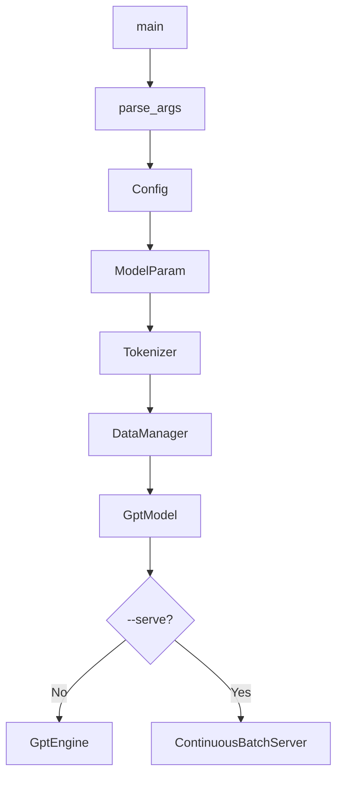
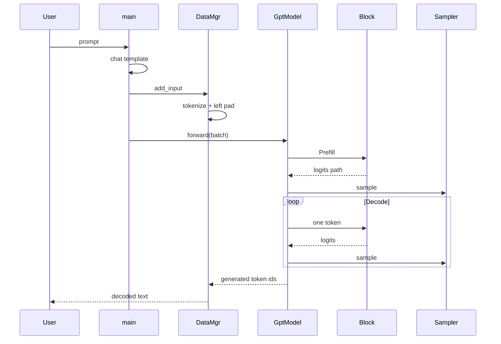

# 第一章：先跑起来，并跟完一条 Prompt

> 本章属于 [`easy_llm.cpp 源码导读`](../easy_llm_guide.zh-CN.md)。
> 建议先按主教程首页的“三遍阅读法”阅读，不需要第一次就掌握所有实现细节。

[← 上一页](../easy_llm_guide.zh-CN.md) · [返回学习地图](../easy_llm_guide.zh-CN.md) · [下一页 →](02-loading-tensor-model.md)

---

## 0. 先说结论：这个项目到底是什么

`easy_llm.cpp` 是一个**自己实现关键推理流程的微型 C++ 大模型推理框架（LLM inference framework）**。

它当前默认面向 **Qwen2.5-0.5B-Instruct**，核心目标不是追求 vLLM、TensorRT-LLM、llama.cpp 那样的成熟性能和模型覆盖，而是把一条大模型推理链路拆成能顺着源码读下去的模块：

```text
Prompt
  ↓
Chat Template
  ↓
Tokenizer / BPE
  ↓
Token IDs + Left Padding
  ↓
Embedding
  ↓
Transformer Blocks × N
  ├─ RMSNorm
  ├─ Self-Attention
  │  ├─ Q/K/V Projection
  │  ├─ RoPE
  │  ├─ GQA
  │  ├─ Causal / Padding Mask
  │  └─ KV Cache
  ├─ Residual
  ├─ RMSNorm
  ├─ Gated MLP
  └─ Residual
  ↓
Final RMSNorm
  ↓
Embedding Weight Tying → Logits
  ↓
Softmax
  ↓
Greedy / Top-K / Top-P Sampling
  ↓
Next Token
  ↓
继续 Decode，直到 EOS 或达到步数限制
```

第一次看到图里的缩写不需要停下来查完所有定义。先有一个最低限度的认识即可：

- **BPE（Byte Pair Encoding）**：把文本切成模型词表里的 token；
- **RMSNorm（Root Mean Square Layer Normalization）**：Transformer 中使用的归一化；
- **RoPE（Rotary Position Embedding）**：把位置信息作用到 Q/K；
- **GQA（Grouped Query Attention）**：Query heads 多于共享的 Key/Value heads；
- **KV Cache（Key-Value Cache）**：保存历史 token 已计算好的 K/V，供 Decode 复用；
- **EOS（End of Sequence）**：序列结束 token。

这些概念后面都会回到真实代码逐个展开。现在只需要知道它们位于整条链路的什么位置。

项目还有第二条运行路径：

```text
多个持续到来的请求
  ↓
Pending Queue
  ↓
Prefill Admission
  ↓
Active Requests
  ↓
每轮把仍活跃的请求一起 Decode
  ↓
请求结束 → 释放 KV Cache Slot
```

这就是 **Continuous Batching**。

如果只记一件事，可以记：

> `easy_llm.cpp` 的价值在于：它把“LLM 推理到底发生了什么”直接摊在 C++ 代码里，而不是把核心逻辑藏在大型框架里。

---

## 1. 推荐阅读顺序

不要从 `src/cuda/ops/self_attn.cu` 开始。

那是整个仓库最复杂的区域之一，而且在理解 CPU baseline 之前读 CUDA kernel，容易同时被 Transformer、Tensor shape、memory layout 和 CUDA execution model 四件事淹没。

建议按下面顺序：

1. **先运行 CPU 版本**
2. 看 `src/main.cpp`
3. 看 `src/gpt_engine.cpp`
4. 看 `src/data_manager.cpp`
5. 看 `src/tokenizer.cpp` + `src/bpe.cpp`
6. 看 `src/models/gpt_model.cpp`
7. 看 `src/models/block.cpp`
8. 看 `src/models/self_attn.cpp`
9. 看 `src/models/mlp.cpp`
10. 看 `src/tensor.cpp` + `src/ops.cpp`
11. 看 `src/models/loader.cpp`
12. 看 Continuous Batching
13. 最后看 CUDA

这样每次只增加一个新的概念。

### 1.1 不需要一次把 4000 行全部读完

这份文档既是教程，也是后续查源码时的参考手册。第一次阅读时，不建议从头到尾逐字读完。

可以分三遍：

| 阅读阶段 | 建议重点 | 读完应该能回答什么 | 可以暂时跳过 |
|---|---|---|---|
| 第一遍：建立主线 | 第 2～6 节、第 14～17 节、第 29～32 节、第 45～50 节 | 一条 Prompt 怎样经过 Tokenizer、模型、Sampling 变成新 Token？Prefill 和 Decode 为什么分开？ | Safetensors 细节、CUDA、严格 parity |
| 第二遍：看懂模型内部 | 第 8～13 节、第 18～28 节、第 33～56 节 | Tensor shape 怎样变化？Attention、RoPE、GQA、KV Cache、MLP 分别做了什么？ | Continuous Batching、CUDA kernel |
| 第三遍：理解工程化 | 第 57 节以后 | 多请求怎样调度？CPU/CUDA 怎样切换？测试在保护哪些 invariant？怎样扩展项目？ | 无需强求一次记住所有实现细节 |

第一遍只要抓住下面 6 个问题：

1. 文本在哪里变成 token IDs？
2. token IDs 在哪里变成 hidden states？
3. 一个 Transformer Block 对 hidden states 做了什么？
4. Prefill 为什么输入整段 Prompt，而 Decode 每次只输入 1 个 token？
5. 历史 token 为什么不需要每轮重新计算 K/V？
6. logits 最后怎样变成一个 next token？

如果这 6 个问题还没有答案，不要急着进入 CUDA。

---

## 2. 第一次运行：先只跑 CPU

### 2.1 环境要求

仓库当前的通用 CPU 构建要求：

- C++17 compiler
- CMake >= 3.10
- OpenMP 可选，默认尝试开启
- 模型文件放在 `data/model/`

推荐构建：

```bash
cmake -S . -B build \
  -DCMAKE_BUILD_TYPE=RelWithDebInfo \
  -DCMAKE_CXX_COMPILER=g++

cmake --build build --target easy_llm -j8
```

为什么建议先用 CPU？

因为代码以 CPU 路径作为 baseline：

- Tensor 行为容易追踪；
- `SelfAttn::forward_cpu()` 基本把 Attention 的步骤直接写出来；
- CUDA 是条件编译的可选后端；
- CUDA 失败时，部分算子还会回退 CPU。

### 2.2 模型文件

默认路径来自 `include/config.hpp`：

```text
data/model/
├── config.json
├── model.safetensors
├── tokenizer.json
└── tokenizer_config.json
```

默认适配的是：

```text
Qwen/Qwen2.5-0.5B-Instruct
```

这四个文件承担不同职责：

| 文件 | 作用 |
|---|---|
| `config.json` | 模型结构参数，如 layer 数、head 数、hidden size、RoPE 参数 |
| `model.safetensors` | 真正的模型权重 |
| `tokenizer.json` | vocab、BPE merges 等 tokenizer 数据 |
| `tokenizer_config.json` | tokenizer 的附加配置；**当前 C++ 主要读取 special token / pad token，chat template 并没有从这里动态加载** |

### 2.3 最小运行

```bash
./build/easy_llm --greedy "Hello"
```

也可以：

```bash
./build/easy_llm \
  --max-steps 128 \
  --temperature 0.7 \
  --top-p 0.9 \
  --top-k 40 \
  "Hello"
```

先看帮助：

```bash
./build/easy_llm --help
```

### 2.4 多条 Prompt

Prompt 文件一行一条：

```text
Hello
Explain KV cache.
What is grouped query attention?
```

运行：

```bash
./build/easy_llm -f test/data/test_batch.txt
```

如果输入文件是：

```text
test/data/test_batch.txt
```

程序会生成：

```text
test/data/test_batch_output.txt
```

这件事是在 `src/main.cpp` 中通过 `stem + "_output" + ext` 实现的。

---

## 3. 先建立最少必要背景

这一章只讲后面读代码必须知道的东西。

### 3.1 LLM inference 本质上在做什么

对一个 Causal Language Model 来说，一次生成可以抽象成：

```text
已有 token
    ↓
Model Forward
    ↓
得到 vocabulary 中每个 token 的 logits
    ↓
Softmax
    ↓
得到 probability distribution
    ↓
Sampling
    ↓
选出一个 next token
    ↓
把 next token 接回输入
    ↓
重复
```

例如：

```text
输入 token: [A, B, C]
模型预测:   D

下一步：
输入历史:   [A, B, C, D]
模型预测:   E
```

真正的优化点在于：

> 第二步生成 `E` 时，没有必要重新计算 A/B/C 对 Attention 的全部 Key 和 Value。

所以才有 **KV Cache**。

---

### 3.2 Prefill 和 Decode

这是理解仓库最重要的一组术语。

#### Prefill

第一次把整段 Prompt 喂给模型：

```text
[A, B, C, D, E]
```

模型会一次计算这整段序列，并建立 KV Cache。

这叫：

```text
Prefill
```

#### Decode

之后每一步只输入刚生成的 1 个 token：

```text
[F]
```

然后：

```text
[G]
```

然后：

```text
[H]
```

历史上下文通过 KV Cache 提供，不需要每次重新输入整个 Prompt。

这叫：

```text
Decode
```

因此代码中经常看到：

```text
Prefill: [batch, seq_len, ...]
Decode:  [batch, 1, ...]
```

---

### 3.3 Logits、Softmax、Sampling

模型最后不会直接说“下一个 token 是 123”。

它输出：

```text
logits = [
  token 0 的分数,
  token 1 的分数,
  ...
  token V-1 的分数
]
```

`V` 是 vocabulary size。

经过 Softmax 后得到概率：

```text
probs = softmax(logits)
```

然后由 Sampler 决定选哪个 token。

仓库支持：

- Greedy
- Temperature
- Top-K
- Top-P

后面会具体看代码。

---

### 3.4 Tensor shape 是读源码的第一语言

LLM 源码里，很多问题其实不是数学问题，而是 shape 问题。

本文统一用：

```text
B = batch size
S = sequence length
H = hidden size
Nh = number of query attention heads
Nkv = number of key/value heads
D = head dimension
V = vocabulary size
I = MLP intermediate size
L = KV cache length
```

Qwen2.5-0.5B-Instruct 官方 `config.json` 的核心参数是：

```text
H   = 896
Nh  = 14
Nkv = 2
D   = 896 / 14 = 64
I   = 4864
V   = 151936
Layers = 24
```

因此 Q/K/V projection 刚完成 split heads 时：

```text
Q: [B, 14, S, 64]
K: [B,  2, S, 64]
V: [B,  2, S, 64]
```

这里已经能看出 **GQA（Grouped Query Attention）**：Query 有 14 个 head，而 Key/Value 只有 2 个 head。

在**本项目 CPU Attention 实现**里，后面会用 `repeat()` 把 K/V 临时扩展到与 14 个 Query heads 对应的形态再做矩阵计算。这个 `repeat()` 是当前实现选择，不要把它误认为 GQA 定义本身要求“物理复制 K/V”。

第一次读 shape 时，可以先记住这一条主链：

```text
token ids          [B, S]
    ↓ Embedding
hidden states      [B, S, H]
    ↓ Q/K/V projection + split heads
Q                  [B, Nh,  S, D]
K,V                [B, Nkv, S, D]
    ↓ Attention（结合历史 KV Cache）
attention output   [B, S, H]
    ↓ Blocks + final RMSNorm
final hidden       [B, S, H]
    ↓ output projection / weight tying
logits             [B, S, V]
```

后面看到任何函数时，先问一句：**它把 shape 从什么变成什么？** 这通常比先钻进循环细节更容易找到主线。

---

## 4. 仓库地图：每个目录负责什么

```text
easy_llm.cpp/
├── CMakeLists.txt
├── README.md
├── README.zh-CN.md
├── build.sh
├── include/
│   ├── tensor.hpp
│   ├── ops.hpp
│   ├── tokenizer.hpp
│   ├── bpe.hpp
│   ├── data_manager.hpp
│   ├── sampler.hpp
│   ├── continuous_batch_server.hpp
│   ├── models/
│   └── cuda/
├── src/
│   ├── main.cpp
│   ├── tensor.cpp
│   ├── ops.cpp
│   ├── tokenizer.cpp
│   ├── bpe.cpp
│   ├── data_manager.cpp
│   ├── sampler.cpp
│   ├── gpt_engine.cpp
│   ├── continuous_batch_server.cpp
│   ├── models/
│   └── cuda/
├── test/
└── scripts/
```

职责可以先粗略记成：

| 模块 | 负责什么 |
|---|---|
| `main.cpp` | 整个程序的入口和模式选择 |
| `cli_options.*` | CLI 参数、Prompt 文件、Qwen chat template |
| `config.*` | 从 `config.json` 读模型结构 |
| `tokenizer.*` | 文本 ↔ token |
| `bpe.*` | Byte-level BPE |
| `data_manager.*` | batch、tokenization、left padding、输出整理 |
| `loader.*` | 读取 Safetensors 权重 |
| `tensor.*` | 最小 Tensor 容器 |
| `ops.*` | matmul、softmax、RoPE、concat 等 |
| `embedding.*` | token id → hidden vector；同时复用为 output projection |
| `linear.*` | Linear projection |
| `norm.*` | RMSNorm |
| `self_attn.*` | Self-Attention + RoPE + GQA + KV Cache |
| `mlp.*` | gated MLP |
| `block.*` | Attention + MLP + residual |
| `gpt_model.*` | Prefill / Decode 的核心编排 |
| `sampler.*` | 选择 next token |
| `continuous_batch_server.*` | 多请求 Continuous Batching |
| `src/cuda/` | 可选 CUDA backend |
| `test/` | 单元测试和 invariant tests |

---

# 第一部分：先沿着一次请求走完整条链路

## 5. `main.cpp`：程序真正从哪里开始

`src/main.cpp` 是最适合进入仓库的文件。

它做的事情按顺序是：

```text
1. Parse CLI
2. 读 Prompt
3. Load Config
4. Load Model Weights
5. Create Tokenizer
6. Create DataManager
7. Create GptModel
8. Apply Chat Template
9. 选择：
   ├─ 普通 CLI inference
   └─ Continuous Batching service
```

### 5.1 主流程图



图中最值得注意的是：

> `GptModel` 在进入普通模式或服务模式之前已经建立。

也就是说，两种模式共享同一套模型计算逻辑，只是调度方式不同。

---

## 6. 一次普通 CLI 请求的 sequence



这里故意没有把 Self-Attention 内部全部展开。

先建立外层心智模型：

```text
main
  → DataManager
  → GptModel
  → Block
  → Sampler
  → DataManager decode
```

后面再进入 Block。

---

## 7. Chat Template：用户输入不是直接送给模型

`src/cli_options.cpp` 中：

```cpp
std::string apply_chat_template(const std::string& user_query)
```

会把：

```text
你好
```

变成类似：

```text
<|im_start|>system
You are Qwen, created by Alibaba Cloud. You are a helpful assistant.<|im_end|>
<|im_start|>user
你好<|im_end|>
<|im_start|>assistant
```

这不是装饰。

Instruction-tuned model 在训练时就是按某种对话格式看到数据的。

如果运行时格式不一致，即使权重完全正确，输出质量也可能明显下降。

### 7.1 当前实现的边界

这里的 chat template 是**代码中硬编码的 Qwen template**，并没有动态读取 `tokenizer_config.json` 里的 `chat_template`。

因此当前模型适配实际上同时依赖：

```text
模型权重兼容
+
参数 key 兼容
+
Tokenizer 兼容
+
Chat Template 兼容
```

只换一个 `model.safetensors` 并不意味着就自动支持另一个模型系列。

---

# 第二部分：文本如何变成 Token

## 8. `Tokenizer` 和 `Bpe` 的分工

这两个模块不要混在一起理解。

### `Tokenizer`

负责：

```text
完整 tokenizer 生命周期
```

包括：

- 加载 vocab；
- 加载 merges；
- 注册 special tokens；
- 找 pad token；
- text → tokens；
- tokens → ids；
- ids → tokens；
- ids → decoded text。

### `Bpe`

只负责：

```text
普通文本片段的 Byte-level BPE encode/decode
```

因此关系是：

```text
Tokenizer
  ├─ special-token handling
  ├─ vocab / id mapping
  └─ Bpe
       ├─ byte mapping
       ├─ merge ranks
       └─ BPE merge
```

---

## 9. 为什么需要 Byte-level BPE

模型不能直接接受 UTF-8 字符串。

它需要整数 ID：

```text
"hello"
   ↓
["hello"]
   ↓
[14990]
```

真实情况会更复杂：

```text
一个字符串
  ↓
UTF-8 bytes
  ↓
Byte-to-Unicode mapping
  ↓
BPE merge
  ↓
token strings
  ↓
vocab lookup
  ↓
token ids
```

Byte-level 的一个重要价值是：

> 输入最终可以退到 byte 表示，不要求词表提前包含所有可能 Unicode 文本的完整“词”。

---

## 10. `Bpe::apply_bpe()` 到底在做什么

`src/bpe.cpp` 的核心思路是：

1. 把输入拆成当前 token 单元；
2. 检查所有相邻 pair；
3. 找 merge rank 最优的 pair；
4. 合并；
5. 重复；
6. 直到没有可合并 pair。

伪代码：

```text
chars = split(word)

while true:
    找到 rank 最小的相邻 pair
    if 没找到:
        break
    merge(pair)
```

`merge_ranks_` 的意义就是：

```text
哪个 pair 应该优先合并
```

而：

```cpp
bpe_cache_
```

用于缓存已经 BPE 过的 word，避免重复工作。

---

## 11. Special Token 为什么不能直接扔给普通 BPE

例如：

```text
<|im_start|>
```

对 Qwen 来说这是一个有特殊语义的 token。

如果先按照普通文本拆碎：

```text
<
|
im
_
start
|
>
```

就已经错了。

因此 `Tokenizer` 中的 `EncodingSession` 会：

1. 先扫描 special token；
2. 普通片段交给 BPE；
3. special token 原样保留；
4. 再统一映射到 token ID。

---

## 12. 一个需要特别知道的 Tokenizer 兼容性边界

这里不能只看“结果大多数时候像是对的”。

官方 Transformers 当前的 `Qwen2Tokenizer` 使用专门的 pre-tokenization regex，再接 ByteLevel pre-tokenizer。

仓库里的 `Bpe::encode_into()` 当前采用更简化的方法：

```cpp
std::istringstream iss(text);
while (iss >> word) {
    ...
}
```

这意味着它主要按 whitespace 拆普通文本。

两者**不是严格等价实现**。

官方 Qwen2 pre-tokenization 会区分：

- 字母；
- 数字；
- 标点；
- 换行；
- contractions；
- whitespace pattern。

这里尤其要注意 `std::istringstream >> word` 的语义：普通文本片段中的连续 whitespace 会被当成分隔符，换行本身不会作为独立 tokenization pattern 被保留。Qwen chat template 又恰好大量使用换行，所以如果目标是严格复现官方 token IDs，这不是一个可以忽略的小差异。

因此：

> 如果目标是学习推理链路，这个实现更容易读；如果目标是和 Hugging Face tokenizer 做 token-by-token 严格一致，需要专门建立 tokenizer parity tests。

这是当前代码最值得关注的兼容性点之一。

官方实现可核对：

```text
https://github.com/huggingface/transformers/blob/main/src/transformers/models/qwen2/tokenization_qwen2.py
```

---

## 13. BOS 行为也要单独验证

`Tokenizer::tokens_to_ids()` 中当前逻辑是：

```cpp
if (bos_token_id_ >= 0) {
    token_ids.push_back(bos_token_id_);
}
```

而 `bos_token_id_` 来自模型 `config.json`。

Qwen2.5-0.5B-Instruct 的模型 config 中：

```text
bos_token_id = 151643
```

但官方 `tokenizer_config.json` 同时写着：

```text
add_bos_token = false
```

所以两边的行为并非天然等价。

这里最合适的理解是：

> `easy_llm.cpp` 当前实现选择了“只要 config 里有有效 BOS，就自动前插 BOS”的规则；它不是完整复制 Hugging Face tokenizer 的 `add_bos_token` 语义。

如果做数值 parity，对输入 token IDs 的第一项要重点检查。

---

# 第三部分：Batch 与 Left Padding

## 14. `DataManager` 为什么存在

`DataManager` 并不是神经网络的一层。

它解决的是：

```text
应用输入数据
     ↓
怎样整理成模型需要的 batch
```

职责包括：

- 保存输入；
- tokenize；
- 保存 `seq_len`；
- 计算 `pad_len`；
- left padding；
- 保存生成 token；
- 最后 decode 输出。

---

## 15. 为什么 batch 需要 padding

假设两个 Prompt token 长度不同：

```text
A: [11, 12, 13, 14]
B: [21, 22]
```

要放进同一个矩形 Tensor：

```text
[B, S]
```

就必须补齐。

仓库使用 **left padding**：

```text
A: [11, 12, 13, 14]
B: [ P,  P, 21, 22]
```

其中 `P` 是 pad token。

此时：

```text
A.seq_len = 4
A.pad_len = 0

B.seq_len = 2
B.pad_len = 2
```

---

## 16. Left Padding 最容易漏掉的问题：position

如果只是 left pad：

```text
[P, P, 21, 22]
```

然后直接把数组 index 当 position：

```text
P  -> 0
P  -> 1
21 -> 2
22 -> 3
```

那么 token `21` 的真实序列 position 被错误地当成了 2。

仓库的处理方法是：

```cpp
prefill_offset = -pad_len
```

所以对于 B：

```text
pad_len = 2
offset = -2
```

RoPE 使用：

```text
position = j + offset
```

于是：

```text
j=2 → position=0
j=3 → position=1
```

真实 token 的 position 被还原了。

这是：

```cpp
generation::build_prefill_pos_offsets()
```

存在的重要原因。

---

## 17. Padding 还需要 Mask

位置修正还不够。

Attention 也不能看到左边的 pad token。

因此 `SelfAttn` 同时应用：

- causal mask；
- valid length mask；
- padding mask。

Padding mask 会把 pad 对应的 attention score 设成：

```text
-inf
```

Softmax 后接近：

```text
0
```

所以 pad 不参与有效 Attention。

---
