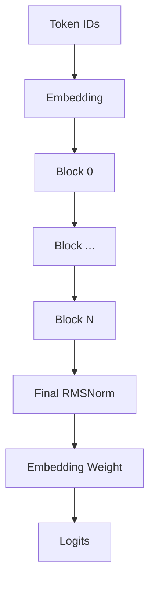

# 第二章：模型加载、Tensor 与 Transformer 外壳

> 本章属于 [`easy_llm.cpp 源码导读`](../easy_llm_guide.zh-CN.md)。
> 建议先按主教程首页的“三遍阅读法”阅读，不需要第一次就掌握所有实现细节。

[← 上一页](01-request-path.md) · [返回学习地图](../easy_llm_guide.zh-CN.md) · [下一页 →](03-attention-generation.md)

---

# 第四部分：模型权重怎么从 Safetensors 进入 C++

## 18. `ModelParam` 做什么

模型权重文件可能有数百 MB。

`src/models/loader.cpp` 负责：

```text
model.safetensors
       ↓
读取 header
       ↓
找到每个 tensor 的 dtype / shape / byte range
       ↓
加载为 Tensor
       ↓
放入 ModelParam
```

---

## 19. Safetensors 文件格式只需要先知道三件事

官方 Safetensors 格式的开头是：

```text
8 bytes
  ↓
header length N
  ↓
N bytes JSON header
  ↓
tensor data bytes
```

JSON 中每个 tensor 大致类似：

```json
{
  "model.layers.0.self_attn.q_proj.weight": {
    "dtype": "BF16",
    "shape": [896, 896],
    "data_offsets": [BEGIN, END]
  }
}
```

仓库的 parser 正是按这个结构读取。

官方格式说明：

```text
https://github.com/huggingface/safetensors
```

---

## 20. 为什么这里用 `mmap`

代码不是先：

```text
ifstream → 整个文件复制进一个巨大 buffer
```

而是 POSIX：

```cpp
open(...)
fstat(...)
mmap(...)
```

这样进程得到一个映射到文件内容的虚拟地址区域。

然后根据 Safetensors header 的 offsets 去读每个 tensor。

这里要注意：

> 当前 loader 使用 `sys/mman.h`、`unistd.h` 等 POSIX API，因此源码不是原生 Windows portability 设计。

在 Windows 上如果不是 WSL / Linux environment，就需要额外适配文件映射层。

---

## 21. 当前 loader 支持哪些 dtype

代码明确支持 source dtype：

```text
BF16
F16
F32
```

编译时默认：

```text
USE_BF16
```

来自 `CMakeLists.txt`：

```cmake
target_compile_definitions(easy_llm_core PUBLIC ... USE_BF16)
```

如果 source dtype 和 target dtype 一致，就可以直接复制 tensor bytes。

否则会逐元素 decode，再转换成项目的 `data_type`。

---

## 22. 为什么模型加载前还需要“参数契约”

只要 Safetensors 文件能解析，不代表模型能正确运行。

例如：

```text
Q projection 本来应该 [896, 896]
结果实际是 [512, 896]
```

文件依然完全合法。

所以项目在真正把参数塞入层之前执行：

```cpp
validate_model_params_before_load(...)
```

它会检查：

- 必需 key 是否存在；
- rank 是否正确；
- Q/K/V/O shape；
- Norm shape；
- MLP 上下投影的 shape 关系；
- hidden size 是否能整除 num heads。

这样“模型文件合法”与“模型架构匹配”被分开验证。

这是很重要的工程设计。

---

## 23. `LayerKeyPrefix` 为什么存在

不同模型的 checkpoint 参数命名可能不同。

Qwen2 使用：

```text
model.layers.0.self_attn.q_proj.weight
model.layers.0.self_attn.k_proj.weight
...
```

如果把这些字符串散落到每个 Layer 类里，以后换模型会很难维护。

于是项目抽出：

```cpp
LayerKeyPrefix
```

当前实现会根据：

```text
architecture
model_type
```

判断是否属于 Qwen2 family。

如果不是，直接抛出 unsupported error。

所以目前：

> 这不是一个“任何 Hugging Face model.safetensors 都能直接加载”的通用 loader。

Safetensors loader 本身比较通用，但**模型参数语义和结构 dispatch 当前只实现了 Qwen2 family**。

---

## 24. `take_param()` 为什么加载后把 key 删除

`ModelParam::take_param()` 做：

```text
找到 Tensor
  ↓
move 出来
  ↓
从 params_ erase
```

这个设计有两个作用：

### 作用 1：所有权更清晰

权重被模型层拿走后：

```text
ModelParam 不再保留第二份逻辑所有权
```

### 作用 2：可以知道有哪些参数没有被消费

所有 Layer 都加载完后：

```cpp
validate_no_remaining_model_params(model_param);
```

会检查剩余 key。

当前代码的行为需要说准确：

- **缺失 required key** → error / throw
- **shape 不匹配** → error / throw
- **加载后还有额外未消费权重** → `warn`，不会阻止运行

所以 leftover check 是诊断信息，不是 hard gate。

---

# 第五部分：Tensor 与 Ops

## 25. `Tensor` 是什么

`Tensor` 的内部结构非常直接：

```cpp
std::vector<data_type> data_;
std::vector<int> shape_;
```

也就是：

```text
一段连续元素
+
shape metadata
```

例如：

```text
shape = [2, 3]
data  = [a,b,c,d,e,f]
```

逻辑上代表：

```text
[a b c
 d e f]
```

项目没有实现大型框架那套复杂 Tensor runtime。

这使源码更容易追，但也意味着一些操作会真的复制数据。

---

## 26. `reshape()` 与 `transpose()` 的差别

### `reshape()`

只改 shape：

```cpp
shape_ = new_shape;
```

并检查元素总数是否一致。

### `transpose()`

当前实现会：

1. 保存旧 data；
2. 计算 old/new strides；
3. 逐元素计算新位置；
4. 重排 `data_`。

所以它不是 PyTorch 那种常见的“只生成一个 stride view”。

这很重要，因为阅读性能时不能假设：

```text
transpose ≈ free
```

在这个实现里它会产生真实的重排成本。

---

## 27. `ops::matmul_3d()` 的 shape 约定

假设：

```text
input  = [B, S, in_dim]
weight = [out_dim, in_dim]
```

结果：

```text
output = [B, S, out_dim]
```

这正好符合 Hugging Face checkpoint 常见 Linear weight layout：

```text
[out_features, in_features]
```

所以 `Linear::forward()` 不需要先永久转置模型权重。

---

## 28. BF16 存储，不等于所有计算都用 BF16 累加

CPU `matmul_3d` 的做法大致是：

```text
BF16 input
   ↓ convert
FP32

BF16 weight
   ↓ convert
FP32

FP32 multiply + accumulate
   ↓
cast back
BF16 output
```

这比直接用 BF16 做累加稳定。

`ops::softmax()` 也会输出：

```text
std::vector<float>
```

也就是说 sampling 看到的是 FP32 probabilities。

---

# 第六部分：真正进入 Transformer

## 29. `GptModel` 的总体结构

`GptModel` 主要拥有：

```text
Embedding
Blocks × num_layers
Final RMSNorm
Sampler
LayerKeyPrefix
KV Cache indirectly in each SelfAttn
```

可以画成：



最后一步值得特别注意。

---

## 30. 为什么输出又调用 `embedding_->forward(output)`

`GptModel::forward_logits()` 最后：

```cpp
output = embedding_->forward(output);
```

第一眼很容易误解：

> 为什么已经做过 Embedding，又做一次 Embedding？

其实 `Embedding` 有不同 overload。

### 输入 token IDs 时

```cpp
Embedding::forward(vector<vector<int>>)
```

做的是：

```text
token id
  ↓
查 embedding table
  ↓
hidden vector
```

### 输入 hidden Tensor 时

```cpp
Embedding::forward(const Tensor&)
```

做的是：

```cpp
ops::matmul_3d(input, weights_)
```

即：

```text
hidden state × embedding weight
  ↓
vocabulary logits
```

这是 **weight tying**。

Qwen2.5-0.5B-Instruct 官方 config：

```text
tie_word_embeddings = true
```

所以这里复用 `model.embed_tokens.weight` 是符合该模型配置的。

---

## 31. `Block` 为什么看起来特别薄

`Block::forward()` 基本只有：

```cpp
auto output_attn = self_attn_.forward(input, ...);
ops::add_inplace(output_attn, input);

auto output = mlp_.forward(output_attn);
ops::add_inplace(output, output_attn);
```

也就是：

```text
x
 ↓
SelfAttn
 ↓
+ x
 ↓
MLP
 ↓
+ residual
```

有人会问：

> Norm 去哪里了？

答案是：

- Attention 前的 RMSNorm 在 `SelfAttn` 内；
- MLP 前的 RMSNorm 在 `MLP` 内。

因此真实逻辑是：

```text
x
 ├──────────────────────┐
 ↓                      │
RMSNorm                  │
 ↓                       │
Self-Attention           │
 ↓                       │
 + <─────────────────────┘
 ↓ x1
 ├──────────────────────┐
 ↓                      │
RMSNorm                  │
 ↓                       │
Gated MLP                │
 ↓                       │
 + <─────────────────────┘
 ↓
output
```

这和 Qwen2 的 Pre-Norm decoder layer 结构一致。

---
