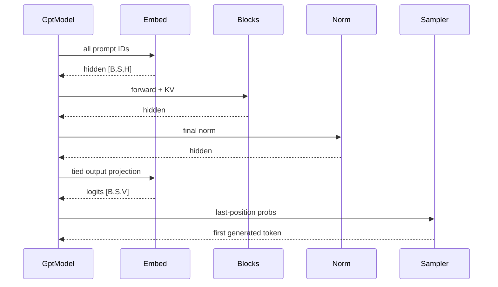
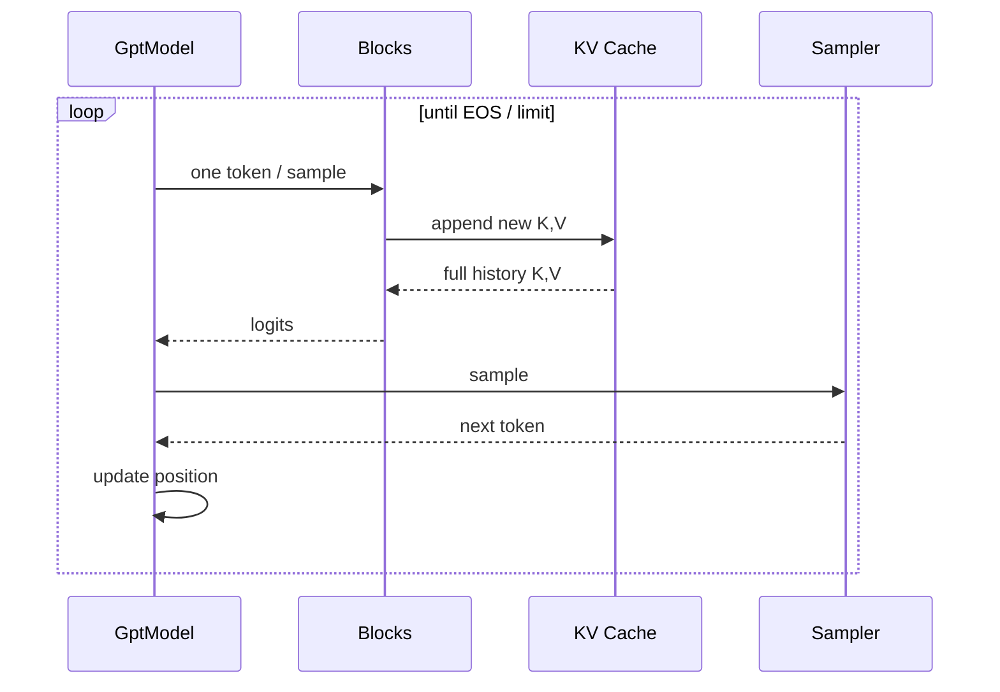

# 第三章：Self-Attention、KV Cache、Prefill / Decode 与 Sampling

> 本章属于 [`easy_llm.cpp 源码导读`](../easy_llm_guide.zh-CN.md)。
> 建议先按主教程首页的“三遍阅读法”阅读，不需要第一次就掌握所有实现细节。

[← 上一页](02-loading-tensor-model.md) · [返回学习地图](../easy_llm_guide.zh-CN.md) · [下一页 →](04-serving-cuda-tests.md)

---

# 第七部分：Self-Attention，按代码一步一步看

## 32. Self-Attention 的 CPU path 是最重要的一段源码

核心文件：

```text
src/models/self_attn.cpp
```

`forward_cpu()` 基本按照 Attention 运算顺序展开：

```text
1. RMSNorm
2. Q projection
3. K projection
4. V projection
5. split heads
6. RoPE(Q, K)
7. expand K/V heads for GQA
8. append KV cache
9. build active cache batch
10. Q × K^T
11. masks
12. / sqrt(head_dim)
13. softmax
14. Attention × V
15. merge heads
16. O projection
```

这是整个仓库最值得精读的函数之一。

---

## 33. Step 1：RMSNorm

代码：

```cpp
auto input_norm = norm_.forward(input);
```

RMSNorm 计算大致是：

```text
rms(x) = sqrt(mean(x²) + eps)

y = weight * x / rms(x)
```

和 LayerNorm 相比，它不减 mean。

当前 `RMSNorm::forward()` 中：

```text
epsilon = 1e-6
```

Qwen2.5-0.5B-Instruct 官方 config 也是：

```text
rms_norm_eps = 1e-6
```

所以默认模型匹配。

不过当前 `Config::load_config()` **没有读取 `rms_norm_eps`**，而是 RMSNorm 里直接写死 `1e-6`。

因此如果将来支持另一个要求不同 epsilon 的模型，这里要改成配置驱动。

---

## 34. Step 2：Q、K、V Projection

输入：

```text
input_norm: [B, S, 896]
```

Qwen2.5-0.5B：

```text
q_proj weight: [896, 896]
k_proj weight: [128, 896]
v_proj weight: [128, 896]
```

因为：

```text
Nkv × D = 2 × 64 = 128
```

所以 projection 后：

```text
Q: [B, S, 896]
K: [B, S, 128]
V: [B, S, 128]
```

---

## 35. Step 3：Split Heads

代码：

```cpp
q.split_head(num_heads_).transpose(1, 2);
k.split_head(num_heads_kv_).transpose(1, 2);
v.split_head(num_heads_kv_).transpose(1, 2);
```

得到：

```text
Q: [B, 14, S, 64]
K: [B,  2, S, 64]
V: [B,  2, S, 64]
```

---

## 36. GQA 到底是什么

GQA = **Grouped Query Attention**。

在普通 MHA 中：

```text
query heads = key heads = value heads
```

例如：

```text
14 / 14 / 14
```

这里是：

```text
Q heads  = 14
KV heads = 2
```

这本身就定义了模型结构上的 GQA：**14 个 Query heads 分组共享 2 个 Key/Value heads**。

Qwen2.5-0.5B：

```text
14 / 2 = 7
```

概念上，每个 KV head 被 7 个 query heads 共享。

接下来要把“GQA 的定义”和“本项目 CPU 怎么算”分开。

当前 CPU 路径为了让后面的矩阵计算直接使用相同的 head 数，会执行：

```cpp
k.repeat(num_heads_ / num_heads_kv_, 1);
v.repeat(num_heads_ / num_heads_kv_, 1);
```

把 K/V 在 head 维扩展到：

```text
[B, 14, S, 64]
```

但这里的 `repeat()` **不是 GQA 的定义，也不是所有 GQA 实现都必须物理复制 K/V**。它只是当前 CPU Attention 路径的实现选择。

可以把两层概念明确分开：

```text
模型定义：
Q heads = 14
KV heads = 2
→ GQA

当前 CPU 实现：
K/V [B,2,S,64]
→ repeat
→ [B,14,S,64]
→ 后续矩阵计算
```

这个区别会直接影响下一节对 KV Cache 内存的理解。

---

## 37. 为什么 GQA 有价值，以及本项目 CPU Cache 的特殊点

从模型结构出发，GQA 的一个重要价值是：K/V head 数可以少于 Query head 数。

如果 cache 保持原生 GQA 形态：

```text
Q heads  = 14
KV heads = 2
```

那么 KV Cache 的 head 维数据量会显著小于 14-head MHA。

但**不要直接把这个理论收益套到当前 CPU 实现**。

当前 `forward_cpu()` 的顺序是：

```text
K/V projection
  ↓
split 成 Nkv=2 heads
  ↓
repeat 到 14 heads
  ↓
append 到 CPU KV cache
```

因此当前 CPU cache 保存的是 expanded head 形态。

所以：

> 模型采用 GQA 是事实；但当前 CPU cache 并没有自动获得“始终只缓存 2 个 KV heads”的完整理论内存收益。

要评估实际内存，应该看当前 cache tensor 的真实 shape，而不是只看 `num_key_value_heads=2`。

如果未来优化 CPU 内存，一个自然方向是：

```text
cache 始终保持 Nkv heads
        ↓
Attention 计算时按 group 共享读取
```

而不是在 cache 前物理展开。

---

## 38. RoPE 在哪里发生

代码：

```cpp
apply_rope_offsets(q, k, ctx);
```

只对：

```text
Q
K
```

做 RoPE。

V 不做。

RoPE = **Rotary Position Embedding**。

它不是给 hidden state 加一个 position vector，而是对 Q/K 的成对维度做旋转，使 Attention score 带上相对位置信息。

项目支持：

```text
同一个 batch 使用统一 offset
```

以及：

```text
每个 sample 使用自己的 offset
```

后者对 left padding 和 Continuous Batching 非常重要。

---

## 39. KV Cache 为什么按 sample 保存

CPU cache：

```cpp
std::vector<Tensor> cache_k_by_sample_;
std::vector<Tensor> cache_v_by_sample_;
```

每个 sample 的 cache shape 注释是：

```text
[1, num_heads, cache_len, head_dim]
```

为什么不直接只有一个固定 `[B,H,L,D]`？

因为在生成过程中：

- 有的 request 已结束；
- 有的还在继续；
- Continuous Batching 还会插入新请求；
- 不同 request 的 cache length 不一定相同。

所以使用：

```text
stable sample/slot id
+
per-sample cache
```

更适合动态 batch。

---

## 40. Cache 长度不同，怎么重新组成 batch

假设当前两个 active request：

```text
A cache len = 8
B cache len = 5
```

要做 batched attention，需要临时形成矩形：

```text
A: [........] len 8
B: [.....PPP] len 5 + pad
```

`build_padded_active_cache()` 会：

1. 找当前 active samples 的最大 cache length；
2. 建一个 padded cache Tensor；
3. 记录每个 request 的 `valid_lens`。

然后：

```cpp
apply_valid_length_mask(...)
```

把 B 后面补出来的无效 cache 位置 mask 掉。

---

## 41. Attention Score 真正怎么算

先把 K cache 转置成：

```text
K: [B, H, D, L]
```

Q：

```text
Q: [B, H, S, D]
```

矩阵乘：

```text
Q @ K
```

得到：

```text
scores: [B, H, S, L]
```

然后：

```text
mask
↓
scale by 1/sqrt(D)
↓
softmax
```

再乘：

```text
V: [B, H, L, D]
```

得到：

```text
attention output: [B, H, S, D]
```

最后 merge heads：

```text
[B, S, H*D]
```

再做 `o_proj`。

---

## 42. 三种 Mask 不要混

### Causal Mask

目的：

```text
当前位置不能看到未来 token
```

Prefill 时：

```text
token 0 只能看 0
token 1 能看 0..1
token 2 能看 0..2
```

### Padding Mask

目的：

```text
不能把 input left-padding 当成真实上下文
```

### Valid Length Mask

目的：

```text
Continuous / variable-length KV batch 中，
不能看到为了拼矩形而补出来的 cache 空位
```

三者解决的是不同问题。

---

# 第八部分：MLP 不是普通“两层全连接”

## 43. 当前 Qwen MLP 是 gated MLP

`MLP::forward_cpu()`：

```cpp
auto input_norm = norm_.forward(input);

auto hidden = up_proj_.forward(input_norm);
auto gate = gate_proj_.forward(input_norm);

gate.silu();
hidden = ops::multiply(hidden, gate);

auto result = down_proj_.forward(hidden);
```

数学上是：

```text
up   = up_proj(x)
gate = SiLU(gate_proj(x))

hidden = up * gate
output = down_proj(hidden)
```

这就是 Qwen2 使用的 gated MLP 结构。

通常会把这一类写成：

```text
SwiGLU-style / SiLU-gated MLP
```

不要把它理解成：

```text
Linear → ReLU → Linear
```

---

## 44. Qwen2.5-0.5B 的 MLP shape

```text
input:
[B,S,896]

up_proj:
896 → 4864

gate_proj:
896 → 4864

elementwise multiply:
[B,S,4864]

down_proj:
4864 → 896

output:
[B,S,896]
```

Residual connection 要求最后回到 896。

---

# 第九部分：Prefill → Decode 是如何真正运行的

## 45. `GptModel::forward()` 是生成主状态机

普通模式的核心步骤：

```text
init KV cache
  ↓
建立 sample_ids
  ↓
记录 pad_lens / real seq_lens
  ↓
Prefill
  ↓
过滤 EOS
  ↓
Decode loop
  ↓
reset KV cache
```

---

## 46. Prefill sequence



Prefill 一次处理整个 Prompt。

但生成只取：

```text
最后一个有效预测位置
```

对应的 next token。

---

## 47. Decode sequence



每轮输入的 sequence length 是：

```text
1
```

历史来自 KV Cache。

---

## 48. `sample_ids` 为什么不能直接等于 batch index

普通一次性 batch 开始时：

```text
sample_ids = [0,1,2,...]
```

但如果某个 sample 先生成 EOS：

```text
原：
sample_ids = [0,1,2]

1 结束后：
sample_ids = [0,2]
```

此时新的 batch index：

```text
0 → sample 0
1 → sample 2
```

如果把 batch index 当永久身份，sample 2 的 KV Cache 就会被错认成 sample 1。

因此代码始终保留：

```text
stable sample_id
```

这是动态 batch 中非常关键的 invariant。

---

## 49. EOS 后为什么立刻清 Cache

`filter_eos_samples()` 会得到：

```text
仍活跃的 sample_ids
+
已结束的 sample_ids
```

对结束者调用：

```cpp
clear_kv_cache(sample_id);
```

原因很直接：

- 后面不再需要它的历史；
- 避免继续参与 batch；
- Continuous Batching 时 slot 可以复用。

还有一个输出层面的细节：当前代码是**先把采样出的 token 记录到输出，再检查它是不是 EOS**。因此如果生成到 `<|im_end|>`，这个 EOS token 本身会进入 `generated_token_ids`，最终 `Tokenizer::decode()` 也会把它解码出来。仓库自带的 `test/data/test_batch_output.txt` 中可以直接看到多条输出末尾带 `<|im_end|>`。

如果将来对外提供更接近常见 chat API 的返回值，通常会考虑在展示层过滤 stop token；但那是接口策略，不能和“模型内部是否生成了 EOS”混为一谈。

---

## 50. `max_steps` 的真实语义要看代码，不要只看参数名

CLI 帮助把它描述为：

```text
Maximum generation steps per request
```

但普通模式代码实际是：

```text
Prefill 后：
ctx.step = padded_input_seq_len

Decode 条件：
while (ctx.step < ctx.max_steps)
```

而 Prefill 自己已经会生成第一个 next token。

所以当前实现对单条 prompt 的近似生成 token 数是：

```text
max(1, max_steps - input_seq_len + 1)
```

服务模式也显式使用：

```cpp
max_generate_tokens =
    std::max(1, config_.max_steps - seq_len + 1);
```

因此：

> 当前 `max_steps` 更接近“把 prompt 位置也计入的总 step ceiling”，而不是常见 API 里的纯 `max_new_tokens`。

这是使用时很容易误解的地方。

另外普通 batch 使用 padded max sequence length 作为全局 `ctx.step`，因此不同长度 prompt 放入同一个普通 batch 时，短样本也受该 batch 最大 prompt 长度影响。

---

# 第十部分：Sampling

## 51. Greedy

最简单：

```text
选择 probability 最大的 token
```

代码就是：

```cpp
std::max_element(...)
```

适合：

- deterministic 调试；
- 做数值 parity；
- 排除随机性干扰。

如果在调模型正确性，建议先：

```bash
--greedy
```

---

## 52. Temperature

Temperature 控制分布尖锐程度。

常见写法是对 logits：

```text
softmax(logits / T)
```

项目当前已经先拿到 probability，然后做：

```text
p^(1/T)
```

再重新按候选总和解释采样权重。

因为：

```text
p_i ∝ exp(logit_i)
```

所以：

```text
p_i^(1/T) ∝ exp(logit_i / T)
```

在归一化常数被重新消除的条件下，两者对应相同的 temperature reweighting 思路。

---

## 53. Top-K

例如：

```text
top_k = 20
```

只留下 probability/weight 最大的 20 个 token。

其他 token 不参与随机抽样。

---

## 54. Top-P

Top-P = nucleus sampling。

例如：

```text
top_p = 0.9
```

候选按概率从高到低排序，从前往后累加，直到累计达到 0.9。

留下这个最小候选集合。

---

## 55. Sampling 顺序

当前代码大致是：

```text
probabilities
  ↓
temperature reweight
  ↓
sort descending
  ↓
Top-K
  ↓
Top-P
  ↓
random draw
```

随机数来自：

```cpp
std::mt19937
```

seed 来自 CLI/config。

所以固定：

```text
相同输入
+
相同模型
+
相同 seed
+
相同计算结果
```

Sampling 才有机会复现。

---

## 56. 与官方 Qwen generation config 的区别

Qwen2.5-0.5B-Instruct 官方 `generation_config.json` 当前包含类似：

```text
temperature = 0.7
top_p = 0.8
top_k = 20
repetition_penalty = 1.1
eos_token_id = [151645, 151643]
```

而项目 CLI 自己有默认 sampling 参数，并且当前：

- 没有实现 repetition penalty；
- `Config` 从模型 `config.json` 读取的是单个 `eos_token_id`；
- 没有把官方 generation config 作为运行配置源。

因此：

> “同一份权重”不代表默认 generation behavior 自动与 Hugging Face `generate()` 完全相同。

做输出 parity 时要统一 generation settings。

---
