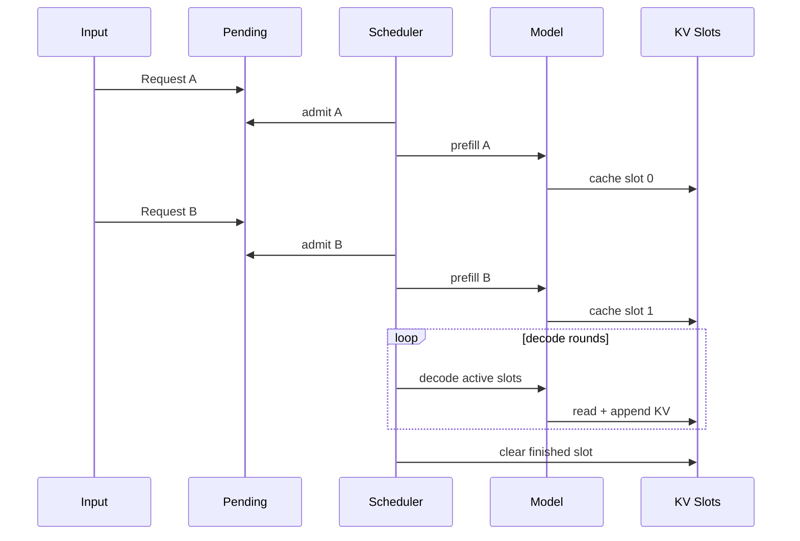

# 第四章：Continuous Batching、CUDA、测试与兼容性边界

> 本章属于 [`easy_llm.cpp 源码导读`](../easy_llm_guide.zh-CN.md)。
> 建议先按主教程首页的“三遍阅读法”阅读，不需要第一次就掌握所有实现细节。

[← 上一页](03-attention-generation.md) · [返回学习地图](../easy_llm_guide.zh-CN.md) · [下一页 →](05-debugging-extension-reference.md)

---

# 第十一部分：Continuous Batching

## 57. 为什么普通 batch 不够

普通 batch 假设：

```text
一批请求一起开始
一批请求生成
结束
```

服务场景却是：

```text
t0: A 到达
t1: B 到达
t2: C 到达
...
```

如果必须等当前整个 batch 全结束才接下一批，GPU/CPU 资源利用会变差，而且新请求等待时间也会增加。

Continuous Batching 的核心思想：

> decode 每一轮都可以重新组成“当前活跃请求集合”。

---

## 58. 这个项目里的三种请求状态

### Pending

已经提交，但还没拿到 slot：

```cpp
pending_prompts_
```

### Active

已经 Prefill，并拥有 KV Cache slot：

```cpp
active_requests_
```

### Finished

EOS 或达到限制：

```text
输出结果
清 KV
释放 slot
```

---

## 59. Slot 是什么

服务启动时：

```text
max_active_requests = 16
```

就准备：

```text
slot 0
slot 1
...
slot 15
```

每个 active request 占一个 slot。

这个 slot ID 同时可以用作：

```text
稳定的 sample id
```

并索引：

- KV Cache；
- pad length；
- request state。

请求结束：

```text
clear cache
↓
slot 回到 free_slots_
```

---

## 60. 服务主循环

`ContinuousBatchServer::run()`：

```text
while:
    try admit prefill
    try decode active requests
    log stats

    if all done:
        break

    if nothing progressed:
        sleep
```

也就是说每轮优先：

```text
接纳一些新请求
```

然后：

```text
让所有 active request decode 一步
```

---

## 61. Continuous Batching sequence



这个图最关键的地方是：

```text
A 不需要等自己结束，B 才能进入系统。
```

---

## 62. Prefill admission 为什么也要 padding

每轮可能一次接纳多条：

```text
serve_prefill_batch = 4
```

假设这轮：

```text
A len = 20
B len = 12
C len = 17
```

本轮 Prefill 会 pad 到：

```text
20
```

而不是 pad 到整个服务历史上的最大值。

对应的 `pad_len` 会记到 slot：

```cpp
pad_lens_by_slot_
```

然后位置 offset：

```text
-pad_len
```

---

## 63. Decode round 怎么组 batch

对所有 active requests：

```cpp
sample_ids.push_back(req.slot_id);
pos_offsets.push_back(req.pos_len);
input_tokens.push_back({req.next_token});
```

所以每个 active request 只提供：

```text
1 个 token
```

然后一次模型调用把它们一起 decode。

这正是 Continuous Batching 的核心。

---

## 64. 新请求什么时候插进来

当前 `run()` 每轮先：

```cpp
admit_prefill_round()
```

再：

```cpp
decode_round()
```

因此正在生成的请求之间，可以不断有新请求被 Prefill 并进入 active set。

下一轮 decode batch 的成员可以和上一轮不同。

---

## 65. 当前 service 并不是 token streaming server

虽然模型每轮生成一个 token，但当前外部输出行为是：

```text
请求完成
  ↓
tokenizer.decode(all generated ids)
  ↓
stdout:
[request N] full text
```

它不会每生成一个 token 就立刻向 stdout stream。

所以：

> Continuous Batching 和 token streaming 是两个不同概念。

这个项目实现了前者，但当前 CLI service output 不是逐 token streaming API。

---

## 66. Service 线程模型

`main.cpp` 中：

- 一个 input thread 负责 `getline(std::cin, ...)`；
- `ContinuousBatchServer::run()` 在主执行路径做调度和模型计算；
- pending queue 用 mutex 保护。

这样 stdin 等待不会把 inference scheduler 卡死。

---

# 第十二部分：CUDA 路径

## 67. CUDA 不是默认要求

启用：

```bash
cmake -S . -B build \
  -DCMAKE_BUILD_TYPE=RelWithDebInfo \
  -DEASY_LLM_ENABLE_CUDA=ON \
  -DCMAKE_CUDA_ARCHITECTURES=<your_arch> \
  -DCMAKE_CXX_COMPILER=g++
```

然后：

```bash
cmake --build build --target easy_llm -j8
```

`build.sh` 中当前写有：

```text
CMAKE_CUDA_ARCHITECTURES=120
```

这是机器相关实验参数，不适合直接当通用命令。

README 已经明确建议通用场景使用显式 CMake 命令。

---

## 68. CUDA runtime 管什么

`src/cuda/runtime.cu` 负责：

- 检测 GPU；
- 检查当前 precision 是否被设备支持；
- 创建 CUDA stream；
- 创建 cuBLAS handle；
- 设置 handle 使用该 stream；
- 保存 weight upload cache；
- 统一 CUDA/cuBLAS error handling。

可以看成：

```text
CUDA backend 的共享基础设施
```

---

## 69. 为什么需要 Weight Cache

Linear 权重在每个 token decode 时都不变。

如果每次 matmul 都：

```text
Host weight
   ↓ PCIe copy
Device
   ↓ GEMM
```

会重复搬运大量数据。

`WeightCache` 使用 host weight 地址、字节数、shape 等作为 key，把权重第一次 upload 后保留在 device。

之后重复使用。

这是 GPU inference 中非常基本但很重要的优化。

---

## 70. CUDA matmul 不是自己手写矩阵乘 kernel

`src/cuda/ops/matmul.cu` 使用：

```text
cublasGemmEx
```

做主要 GEMM。

外围自己处理：

- input upload；
- weight cache；
- bias kernel；
- output copy back；
- buffer reuse。

这是一种合理分层：

```text
成熟 BLAS 库负责 GEMM
项目代码负责 Tensor/layout/runtime glue
```

---

## 71. MLP CUDA 做了什么

`src/cuda/ops/mlp.cu` 把 MLP 的关键步骤放到 GPU：

```text
RMSNorm
  ↓
up GEMM
  ↓
gate GEMM
  ↓
SiLU(gate) * up
  ↓
down GEMM
```

其中 GEMM 继续用 cuBLAS，RMSNorm 和 elementwise gate 使用 CUDA kernel。

---

## 72. Self-Attention CUDA 为什么最复杂

CPU Self-Attention 已经包含：

- Q/K/V；
- RoPE；
- GQA；
- KV cache；
- variable length；
- masks；
- softmax；
- attention matmul。

CUDA 版本还要再处理：

- device buffers；
- cache capacity；
- CUDA-side per-sample KV；
- kernel launch；
- stream；
- host/device synchronization；
- Continuous Batching variable lengths；
- decode fast path。

所以 `self_attn.cu` 和 `self_attn_detail.cuh` 明显比普通模块大。

建议先确认 CPU path 完全理解，再读这里。

---

## 73. CUDA fallback 有一个很重要的安全条件

`SelfAttn::forward()` 中：

- 如果 CUDA 尚未积累 active CUDA KV cache，CUDA 失败后可以禁用 CUDA，并回退 CPU；
- 如果已经有 active CUDA KV cache，直接 CPU fallback 是不安全的。

为什么？

因为此时历史状态存在 CUDA-side cache 中。

如果突然切到 CPU，而 CPU cache 没有同一份完整历史，就会产生错误 Attention。

所以代码会：

```text
active CUDA cache + CUDA failure
  ↓
throw
```

而不是假装继续运行。

这是一个值得保留的正确性保护。

---

## 74. Continuous CUDA Self-Attention 可以单独禁用

项目支持环境变量：

```text
EASY_LLM_DISABLE_CONTINUOUS_CUDA_SELF_ATTN
```

在 Continuous mode 中禁用 CUDA Self-Attention。

这个开关通常用于：

- 回归比较 CPU/CUDA；
- 隔离 CUDA Attention 问题；
- 保留其他 CUDA 算子。

---

# 第十三部分：测试在保护什么

## 75. 不要只把 `test/` 当“最后才看的东西”

这个仓库有些最重要的设计约束，是通过 invariant tests 表达出来的。

`CMakeLists.txt` 中的主要测试包括：

```text
matmul_3d_test
rope_test
cache_batching_test
cache_batching_invariants_test
data_manager_invariants_test
generation_invariants_test
cli_options_test
layer_key_prefix_test
model_param_validation_test
```

CUDA 构建还包括：

```text
self_attn_cuda_test
self_attn_cuda_varlen_test
mlp_cuda_test
```

---

## 76. 什么叫 invariant

Invariant = 在某个流程中始终必须成立的条件。

例如：

```text
sample_id 必须合法
K/V cache shape 必须匹配
batch size 必须与 sample_ids 数量一致
position offset 必须对应真实 sample
```

这些问题一旦错，程序未必立刻 crash。

更危险的是：

```text
程序继续跑
但 token 结果悄悄错
```

因此推理引擎特别需要 invariant tests。

---

## 77. 回归门

项目定义：

```text
easy_llm_regression_gates
```

运行：

```bash
cmake --build build --target easy_llm_regression_gates -j8
```

也可以：

```bash
ctest --test-dir build \
  --output-on-failure \
  -L "^invariant_gate$"
```

脚本：

```bash
bash scripts/run_regression_gates.sh
```

CUDA：

```bash
bash scripts/run_regression_gates.sh --with-cuda
```

---

# 第十四部分：最容易踩的坑

## 78. “模型能加载”不等于“模型兼容”

至少需要同时对齐：

```text
architecture
parameter names
tensor shapes
tokenizer
special tokens
chat template
position logic
generation settings
```

---

## 79. Tokenizer 是当前最需要 parity test 的模块之一

前面已经讨论过：

```text
项目 BPE pre-tokenization
≠
官方 Qwen2Tokenizer 完整 pre-tokenization
```

还存在 BOS 自动插入语义差异。

如果要把“教学实现”推向“严格兼容实现”，建议优先做：

```text
输入字符串 corpus
       ↓
easy_llm token ids
       vs
HF Qwen2Tokenizer token ids
       ↓
逐 case diff
```

测试 case 不要只用英文单词。

至少覆盖：

- 中文；
- 英文；
- 中英混合；
- 连续空格；
- 换行；
- 标点；
- emoji；
- special token 边界；
- 数字；
- contractions。

---

## 80. `max_steps` 不等于常见的 `max_new_tokens`

已经分析过。

做 API 封装时最好不要直接把：

```text
OpenAI/HF max_new_tokens
```

机械映射成当前 `--max-steps`。

---

## 81. `build.sh` 不是跨机器通用脚本

它当前带：

```text
CMAKE_CUDA_ARCHITECTURES=120
```

换 GPU 时应该根据目标设备/toolkit 调整。

通用入口以 README 中 CMake 命令为准。

---

## 82. Windows 原生编译要注意 loader

`src/models/loader.cpp` 当前使用 POSIX mmap API。

如果在 Windows 11 上：

- WSL：更接近当前代码预期；
- 原生 MSVC：loader 层需要 Windows file mapping 适配，不能只假设 CMake 改一下就够。

---

## 83. `rms_norm_eps` 目前没有配置化

默认 Qwen2.5-0.5B：

```text
1e-6
```

刚好与代码一致。

但它是：

```text
代码常量
```

不是：

```text
Config::rms_norm_eps
```

以后扩模型时要注意。

---

## 84. 精度 abstraction 目前不是完全对称化

`tensor.hpp` 看起来支持：

```text
FP32
FP16
BF16
```

但当前 CMake 默认固定定义：

```text
USE_BF16
```

并且部分代码，例如某些测试路径，对 BF16 有直接依赖。

因此准确的描述是：

> 当前工程主路径是 BF16；FP16/FP32 宏结构存在，但不要在没有完整构建测试的情况下假设三种实现路径的完备度完全相同。

---

## 85. CPU GQA cache 与理论 GQA memory saving 不要混为一谈

模型权重使用 `Nkv=2`。

但 CPU Self-Attention 当前在：

```cpp
expand_kv_heads()
```

之后把 K/V 扩展到 query head 数，再 append cache。

因此 CPU cache shape 使用的是 expanded heads。

如果要优化内存，一个自然的下一步是：

```text
cache 原生 Nkv heads
↓
attention 时按 group 读取
```

而不是物理 repeat。

---
