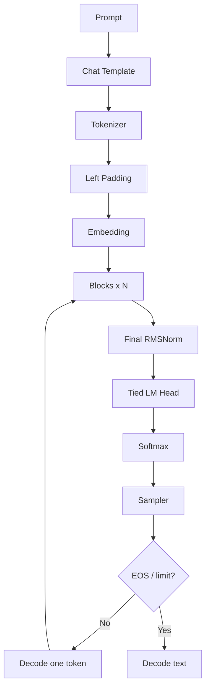
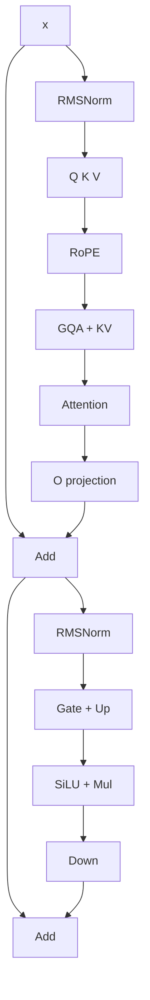
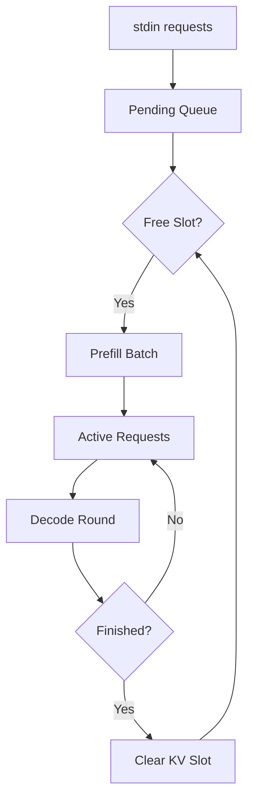

# 第五章：调试、扩展、总图与参考资料

> 本章属于 [`easy_llm.cpp 源码导读`](../easy_llm_guide.zh-CN.md)。
> 建议先按主教程首页的“三遍阅读法”阅读，不需要第一次就掌握所有实现细节。

[← 上一页](04-serving-cuda-tests.md) · [返回学习地图](../easy_llm_guide.zh-CN.md) · [下一页 →](../easy_llm_guide.zh-CN.md)

---

# 第十五部分：如何调试这个项目

## 86. 第一原则：先用 Greedy

```bash
./build/easy_llm --greedy "Hello"
```

原因：

```text
随机 Sampling
```

会让你很难判断：

```text
结果变化
```

究竟来自代码 bug，还是 RNG。

---

## 87. 第二原则：先比较中间 Tensor shape

遇到错误输出时，不要第一反应就逐元素看 10 万个数。

先确认：

```text
token IDs
↓
Embedding shape
↓
Q/K/V shape
↓
cache shape
↓
scores shape
↓
logits shape
```

shape 错误往往比数值错误更容易定位。

---

## 88. 推荐断点

### 输入

```text
src/main.cpp
```

看：

```text
prompt
templated prompt
```

### Tokenizer

```text
Tokenizer::tokenize()
Tokenizer::tokens_to_ids()
```

看：

```text
tokens
token_ids
```

### Padding

```text
DataManager::apply_padding()
```

看：

```text
seq_len
pad_len
padded ids
```

### Model

```text
GptModel::prefill()
GptModel::decode()
```

看：

```text
sample_ids
pos_offsets
next_generated_tokens
```

### Attention

```text
SelfAttn::forward_cpu()
```

看：

```text
q.shape
k.shape
v.shape
cache length
scores.shape
```

### Sampling

```text
TopKTopPSampler::sample_from_probs()
```

看最终候选。

---

## 89. 第三原则：CPU parity 后再看 CUDA

如果 CPU 本身输出都没有建立可信 baseline：

```text
CUDA 输出不对
```

时会很难判断是：

- 模型实现；
- tokenizer；
- shape；
- CUDA kernel；
- device cache；
- precision；
- layout

哪一层的问题。

---

# 第十六部分：如果你要修改项目，应该从哪里下手

## 90. 想增加一种 Sampling

最容易。

现有 abstraction：

```text
Sampler
├── GreedySampler
└── TopKTopPSampler
```

可以增加：

```text
RepetitionPenaltySampler
TypicalSampler
MinPSampler
```

但建议会先把 sampling pipeline 做成多个 processor/stage，而不是把所有逻辑继续堆进一个类。

---

## 91. 想严格对齐 Hugging Face Qwen tokenizer

优先工作：

1. 实现/复用官方 pre-tokenization semantics；
2. 对齐 `add_bos_token`；
3. 对齐 special-token handling；
4. 建 tokenizer parity corpus；
5. 对比 token IDs，而不是只对比最终文本。

这是当前最明确、收益很高的兼容性增强点之一。

---

## 92. 想支持另一个 Qwen2-family checkpoint

先不要直接改 Attention。

会先检查：

```text
config fields
weight keys
weight shapes
rms_norm_eps
rope settings
sliding window
tokenizer
chat template
generation config
```

当前模型 config 中：

```text
use_sliding_window = false
```

所以现有 full causal attention 适合默认模型。

如果换成真正启用 sliding-window attention 的 checkpoint，现有逻辑不能因为仍叫“Qwen2”就默认完全匹配。

---

## 93. 想支持完全不同模型架构

通常至少要拆这几层：

```text
LayerKeyPrefix / parameter mapping
Model architecture
Tokenizer
Chat template
Config parsing
Attention variant
MLP variant
Position encoding
```

因此 `LayerKeyPrefix` 只解决了：

```text
参数命名
```

不是完整的 model plugin mechanism。

---

## 94. 想继续优化 CPU

可以关注：

- 避免 `transpose()` 全量数据复制；
- 更成熟的 GEMM backend；
- cache 不要物理 expand GQA；
- fused ops；
- 减少 BF16 ↔ FP32 重复转换；
- 减少临时 Tensor allocation；
- 改善 cache concat 的重复复制。

但每做一项性能优化，都应该先保留当前可读 baseline 作为 correctness oracle。

---

## 95. 想继续优化 GPU

可以关注：

- 减少 Host ↔ Device 往返；
- 尽可能让 hidden states 持续留在 GPU；
- fused RMSNorm / projection / activation；
- CUDA Graph；
- 更高效 KV cache layout；
- paged KV cache；
- GQA 原生 kernel；
- batched/continuous scheduling；
- kernel-level profiling。

当前代码已经出现：

```text
device buffer reuse
weight cache
CUDA-side self-attn state
```

说明演进方向已经开始从“算子能跑”走向“减少运行时 overhead”。

---

# 第十七部分：把整个系统再串一遍

## 96. 普通推理总图



---

## 97. 一个 Block 总图



---

## 98. 服务模式总图



---

# 第十八部分：代码与官方实现的对照结论

## 99. 已确认一致或方向一致的部分

针对仓库默认的 Qwen2.5-0.5B-Instruct：

### 模型结构

代码读取：

```text
num_hidden_layers
num_attention_heads
num_key_value_heads
hidden_size
vocab_size
rope_theta
```

和官方 config 字段一致。

### GQA

官方 Qwen2：

```text
num_attention_heads != num_key_value_heads
```

时使用 GQA。

仓库也按：

```text
num_heads / num_heads_kv
```

扩展 K/V。

### Qwen MLP

官方 Qwen2 MLP：

```text
down_proj(act(gate_proj(x)) * up_proj(x))
```

仓库逻辑一致。

### RMSNorm

默认 Qwen2.5-0.5B 使用：

```text
eps = 1e-6
```

仓库当前也是 `1e-6`。

### Weight tying

默认模型：

```text
tie_word_embeddings = true
```

仓库用 embedding weight 做最终 vocabulary projection。

### RoPE

仓库对 Q/K 应用 rotary position，并按 head dimension 生成 frequency。

### Attention Softmax

仓库 attention score softmax 与 sampling probability softmax 都有明确实现。

### KV Cache

Prefill 建 cache，Decode 每步追加并复用历史。

---

## 100. 已确认的实现边界

这些不是“猜测”，而是从当前代码与官方配置对照得到：

### Tokenizer pre-tokenization 简化

项目不是官方 Qwen2Tokenizer regex pre-tokenizer 的逐行复刻。

### BOS policy 不同

项目看到有效 `bos_token_id` 就前插；官方 tokenizer config 设 `add_bos_token=false`。

### Chat template 硬编码

没有动态解释 tokenizer config 的 chat template。

### `rms_norm_eps` 硬编码

当前默认模型匹配，但不是 config-driven。

### Generation config 未整体读取

官方 repetition penalty、EOS list 等不会自动生效。

### 只 dispatch Qwen2 family parameter keys

其他 architecture 会直接 unsupported。

### POSIX loader

Windows native portability 需要额外工作。

### BF16-first

其他 precision 宏不能在没有测试的情况下视作完全同等支持。

---

# 第十九部分：建议建立的“正确性金字塔”

如果继续开发这个项目，建议验证从下到上做。

```text
Level 1
Tensor / Ops
matmul, softmax, RoPE

        ↓

Level 2
Layer
RMSNorm, Linear, MLP, Attention

        ↓

Level 3
State
KV cache, padding, position, EOS

        ↓

Level 4
Tokenizer
HF token-id parity

        ↓

Level 5
Model
single-step logits parity

        ↓

Level 6
Generation
greedy multi-step parity

        ↓

Level 7
Sampling
seeded statistical behavior

        ↓

Level 8
Continuous Batching
single vs continuous equivalence

        ↓

Level 9
CUDA
CPU vs CUDA parity
```

这个顺序比直接比较“最后生成文本像不像”可靠得多。

---

## 101. 为什么 logits parity 比文本 parity 更重要

如果两个实现生成：

```text
相同文本
```

不代表模型完全一致。

因为 sampled token 只取决于最终选择。

两个 probability distribution 可以明显不同，却碰巧选出同一个 token。

更严格的验证是：

```text
相同 token IDs
相同 model weights
相同 position
相同 cache state
      ↓
比较 logits
```

先从：

```text
greedy + 单 token
```

开始。

---

# 第二十部分：常用命令速查

## 102. CPU Build

```bash
cmake -S . -B build \
  -DEASY_LLM_ENABLE_CUDA=OFF \
  -DCMAKE_BUILD_TYPE=RelWithDebInfo \
  -DCMAKE_CXX_COMPILER=g++

cmake --build build --target easy_llm -j8
```

> `CMakeLists.txt` 的 CUDA option 默认是 `OFF`；但仓库自带 `build.sh` 当前显式传入 `-DEASY_LLM_ENABLE_CUDA=ON`，无 CUDA/GPU 环境不要直接把 `build.sh` 当 CPU 构建脚本。

## 103. Run

```bash
./build/easy_llm --greedy "Hello"
```

## 104. Sampling

```bash
./build/easy_llm \
  --temperature 0.7 \
  --top-p 0.9 \
  --top-k 40 \
  --seed 42 \
  "Hello"
```

## 105. Prompt File

```bash
./build/easy_llm -f test/data/test_batch.txt
```

## 106. Service

```bash
./build/easy_llm --serve
```

然后：

```text
Hello
Explain RoPE
/quit
```

## 107. CPU Invariant Gates

```bash
bash scripts/run_regression_gates.sh
```

## 108. CUDA Build

```bash
cmake -S . -B build \
  -DCMAKE_BUILD_TYPE=RelWithDebInfo \
  -DEASY_LLM_ENABLE_CUDA=ON \
  -DCMAKE_CUDA_ARCHITECTURES=<your_arch> \
  -DCMAKE_CXX_COMPILER=g++

cmake --build build --target easy_llm -j8
```

## 109. CUDA Regression

```bash
bash scripts/run_regression_gates.sh --with-cuda
```

---

# 第二十一部分：术语表

| 术语 | 含义 |
|---|---|
| LLM | Large Language Model，大语言模型 |
| Inference | 使用已经训练好的参数进行前向计算和生成 |
| Causal LM | 只能根据当前位置之前的 token 预测后续 token 的语言模型 |
| Token | 模型处理的离散文本单元 |
| Token ID | Token 在 vocabulary 中的整数编号 |
| Vocabulary / Vocab | Token 集合及其 ID 映射 |
| Tokenizer | 文本与 token/token ID 之间的转换组件 |
| BPE | Byte Pair Encoding，一类 subword tokenization 方法 |
| Byte-level BPE | 先把文本映射到 byte 层，再做 BPE |
| Special Token | 带特殊控制语义的 token |
| Chat Template | 把 role/message 转成模型训练时约定的文本格式 |
| Tensor | 多维数组 |
| Shape | Tensor 每个维度的大小 |
| Embedding | Token ID 到 hidden vector 的映射 |
| Hidden Size | Transformer 隐状态维度 |
| Transformer Block | Attention + MLP + residual 等组成的重复层 |
| Self-Attention | 同一序列内部 token 之间计算相关性的机制 |
| Q / K / V | Query / Key / Value |
| Attention Head | Attention 的并行子空间 |
| MHA | Multi-Head Attention |
| MQA | Multi-Query Attention |
| GQA | Grouped Query Attention |
| Head Dimension | 每个 Attention head 的向量维度 |
| RoPE | Rotary Position Embedding |
| Causal Mask | 阻止当前位置看到未来 token |
| Padding | 为不同长度序列补齐形状 |
| Left Padding | 在序列左侧补 pad token |
| Padding Mask | 阻止模型关注 padding |
| RMSNorm | Root Mean Square Normalization |
| Residual | 残差连接 |
| MLP | Multi-Layer Perceptron；在 Transformer 中通常指 FFN 子层 |
| SiLU | Sigmoid Linear Unit 激活函数 |
| SwiGLU | 带门控的 FFN 结构族；Qwen2 使用 SiLU gate |
| Logits | Softmax 前的模型分数 |
| Softmax | 把一组分数变成归一化概率 |
| Sampling | 根据概率分布选择 next token |
| Greedy | 总选概率最大的 token |
| Temperature | 调整 sampling distribution 尖锐程度 |
| Top-K | 只保留最高的 K 个候选 |
| Top-P | 保留累计概率达到阈值的最小候选集合 |
| EOS | End Of Sequence |
| Prefill | 第一次处理完整 Prompt 并建立 KV Cache |
| Decode | 生成阶段每次处理新 token |
| KV Cache | 保存历史 Attention Key/Value，避免重复计算 |
| Continuous Batching | 每个 decode round 动态重组 active requests |
| Slot | 服务模式中绑定 request state/KV cache 的稳定编号 |
| Invariant | 运行过程中必须一直成立的约束 |
| Safetensors | 带 metadata 的安全 tensor 文件格式 |
| mmap | 将文件映射到虚拟内存 |
| BF16 | BFloat16 |
| FP16 | IEEE half precision |
| FP32 | 单精度浮点 |
| OpenMP | CPU 多线程并行 API |
| CUDA | NVIDIA GPU parallel computing platform |
| cuBLAS | NVIDIA GPU BLAS library |
| GEMM | General Matrix Multiply |

---

# 第二十二部分：外部核对资料

本文的核心解释以当前仓库代码为准；下面资料用于确认模型/格式的外部规范和默认模型行为。

## Qwen2 / Qwen2.5

Qwen2.5-0.5B-Instruct config：

```text
https://huggingface.co/Qwen/Qwen2.5-0.5B-Instruct/blob/main/config.json
```

Qwen2.5 tokenizer config：

```text
https://huggingface.co/Qwen/Qwen2.5-0.5B-Instruct/blob/main/tokenizer_config.json
```

Qwen2.5 generation config：

```text
https://huggingface.co/Qwen/Qwen2.5-0.5B-Instruct/blob/main/generation_config.json
```

Transformers Qwen2 model implementation：

```text
https://github.com/huggingface/transformers/blob/main/src/transformers/models/qwen2/modeling_qwen2.py
```

Transformers Qwen2 tokenizer implementation：

```text
https://github.com/huggingface/transformers/blob/main/src/transformers/models/qwen2/tokenization_qwen2.py
```

Transformers Qwen2 documentation：

```text
https://huggingface.co/docs/transformers/model_doc/qwen2
```

## Safetensors

官方 repository / format description：

```text
https://github.com/huggingface/safetensors
```

---

# 第二十三部分：最后再用 20 行理解整个项目

```text
1. main.cpp 读取参数和 Prompt
2. Prompt 套 Qwen chat template
3. Config 读取 Qwen model config
4. Loader mmap Safetensors
5. 参数 key/shape 先校验
6. Tokenizer 把文本转 token IDs
7. DataManager 对 batch 做 left padding
8. position offset 抵消 left padding
9. Embedding 把 IDs 变 hidden states
10. 每个 Block 先做 Self-Attention
11. Attention 中做 RMSNorm、Q/K/V、RoPE、GQA
12. K/V 被写入 per-sample KV Cache
13. Mask 保证 causal/padding/cache-length 正确
14. Block 再做 gated MLP 和 residual
15. 所有 Block 后做 final RMSNorm
16. 复用 embedding weight 得到 vocabulary logits
17. Softmax 得 probability
18. Sampler 选择 next token
19. Prefill 之后 Decode 每轮只输入 1 token
20. Continuous Batching 让不同请求动态共享 decode rounds
```

如果这 20 行已经能顺着源码找到对应函数，整个仓库的主干就已经建立起来了。

---

# 附录 A：关键文件 → 建议关注函数

| 文件 | 建议先看 |
|---|---|
| `src/main.cpp` | `main()` |
| `src/cli_options.cpp` | `parse_args()`、`apply_chat_template()` |
| `src/config.cpp` | `Config::load_config()` |
| `src/tokenizer.cpp` | `Tokenizer::tokenize()`、`tokens_to_ids()` |
| `src/bpe.cpp` | `Bpe::encode_into()`、`apply_bpe()` |
| `src/data_manager.cpp` | `get_inputs()`、`apply_padding()` |
| `src/models/loader.cpp` | `ModelParam::load_from_ckpt()`、`take_param()` |
| `src/models/model_param_validation.cpp` | `validate_model_params_before_load()` |
| `src/models/layer_key_prefix.cpp` | `create_layer_key_prefix()` |
| `src/tensor.cpp` | `reshape()`、`transpose()`、`repeat()` |
| `src/ops.cpp` | `matmul_3d()`、`matmul_4d()`、`apply_rope()`、`softmax()` |
| `src/models/embedding.cpp` | 三个 `forward()` overload |
| `src/models/block.cpp` | `Block::forward()` |
| `src/models/self_attn.cpp` | `SelfAttn::forward_cpu()` |
| `src/models/mlp.cpp` | `MLP::forward_cpu()` |
| `src/models/norm.cpp` | `RMSNorm::forward()` |
| `src/models/gpt_model.cpp` | `forward()`、`prefill()`、`decode()` |
| `src/sampler.cpp` | `TopKTopPSampler::sample_from_probs()` |
| `src/continuous_batch_server.cpp` | `run()`、`admit_prefill_round()`、`decode_round()` |
| `src/cuda/runtime.cu` | `CudaContext::init()` |
| `src/cuda/ops/matmul.cu` | `matmul_3d_cuda_impl()` |
| `src/cuda/ops/mlp.cu` | `mlp_forward_cuda()` |
| `src/cuda/ops/self_attn.cu` | CPU path 理解后再读 |

---

# 附录 B：建议的源码阅读练习

## 练习 1：跟踪 `"Hello"`

目标不是看生成答案，而是记录：

```text
原始 Prompt
templated Prompt
tokens
token IDs
seq_len
pad_len
first generated token ID
decoded text
```

## 练习 2：构造两个长度不同的 Prompt

观察：

```text
left padding
prefill pos_offsets
padding mask
```

确认短 Prompt 的真实 token position 仍从 0 开始。

## 练习 3：Greedy 模式跑 3 个 Decode step

记录每步：

```text
sample_ids
next_generated_tokens
pos_offsets
cache_len
```

## 练习 4：让 batch 中一个 sample 先 EOS

重点观察：

```text
sample_ids 如何缩小
cache 如何按原 stable ID 清理
```

## 练习 5：服务模式连续输入三条 Prompt

观察：

```text
pending
free_slots
active_requests
prefill_round
decode_round
slot reuse
```

## 练习 6：做 tokenizer parity

用 Python/Hugging Face 生成官方 token IDs，再和 C++ 输出比较。

这是把项目从“理解推理”继续推进到“严格模型兼容”的非常有效练习。

---

# 附录 C：本文没有假装确认的事情

为了避免把推测写成事实，这里明确列出边界。

1. 本文没有声称当前 Tokenizer 与 Hugging Face Qwen2Tokenizer token-by-token 完全一致；源码对照反而表明 pre-tokenization 存在实现差异。
2. 本文没有声称 FP16 / FP32 路径已经达到和 BF16 一样的测试覆盖；当前 CMake 主路径明确使用 BF16。
3. 本文没有声称所有 Qwen2 checkpoint 都自动兼容；不同 RoPE、sliding window、tokenizer 和 generation config 都需要重新核对。
4. 本文没有声称 CUDA Self-Attention 的每个内部 kernel 都做了逐行形式化验证；这里主要根据公开接口、CPU baseline、CUDA state 和已有测试解释其架构角色。
5. 本文没有把“额外未消费权重”描述成 hard error；当前实现是 warning。
6. 本文没有使用无法可靠读取的微信参考文章内容来补造观点。

---

**文档基线：** `eagle-dai/easy_llm.cpp` 的 `release` 分支代码结构与文档，结合生成时读取到的当前仓库实现进行核对。
